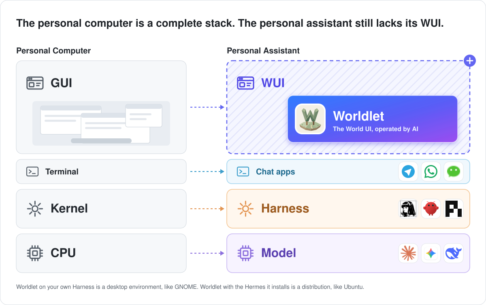

<h1 align="center">
  <a href="https://worldlet.ai"></a> Worldlet
</h1>

<p align="center">
  <a href="https://github.com/clockless-org/worldlet"></a>
  <a href="https://github.com/clockless-org/worldlet/releases"></a>
  <a href="LICENSE"></a>
  
</p>

<p align="center">
  <sub><a href="README.zh.md">中文</a></sub>
</p>

<p align="center">
  <strong>A World for the AI Agent you already use.</strong><br/>
  Worldlet gives OpenClaw, Hermes Agent, Claude Code, Codex or pi a place to work that you can see. The World is operated by AI; you watch and decide.
</p>

<h3 align="center"><a href="#install"><ins>Install in one command</ins></a> · <a href="https://worldlet.ai/download/"><ins>Download</ins></a></h3>

<p align="center">
  
</p>

## Install

**macOS**

```sh
curl -fsSL https://worldlet.ai/install.sh | sh
```

**Windows** (PowerShell)

```powershell
irm https://worldlet.ai/install.ps1 | iex
```

The installer downloads the newest release, checks its SHA-256 (and the app's signature on Mac), installs it and opens it. To connect a particular Agent without being asked, name it: `openclaw`, `hermes`, `pi`, `claude-code` or `codex`.

```sh
curl -fsSL https://worldlet.ai/install.sh | sh -s -- --agent openclaw
```

```powershell
& ([scriptblock]::Create((irm https://worldlet.ai/install.ps1))) -Agent hermes
```

Prefer a regular installer? [Download from worldlet.ai](https://worldlet.ai/download/) or take one from [GitHub Releases](https://github.com/clockless-org/worldlet/releases). An Agent can install Worldlet for you with the [`worldlet` skill](harness/skills/worldlet/SKILL.md). Details: [one-line installers](platform/install/README.md).

No account is needed. If you have no Agent yet, setup installs the standard [Hermes Agent](core/agent/PORTABILITY.md#stock-hermes-agent-for-people-with-no-agent) the official way, to its usual location; one you already have is used as it is.

## Features

<table>
<tr>
<td width="50%" valign="middle">

### Attention Center

What needs you, in one place: meetings coming up, things worth doing and news worth knowing, found in your mail, calendar and the services your Agent already reaches. Each item says why it is there.

[Docs →](docs/ATTENTION-CENTER.md)

</td>
<td width="50%">
  <a href="docs/ATTENTION-CENTER.md"></a>
</td>
</tr>
<tr>
<td width="50%" valign="middle">

### Fox prepares, you decide

Fox is the companion you talk to, by text or voice. It does the work through your Agent and lays the result out for you: here, a tennis booking with the court, the weather and the invitation ready. Nothing is sent, paid or deleted until you confirm.

[Docs →](docs/FOX-AGENT.md)

</td>
<td width="50%">
  <a href="docs/FOX-AGENT.md"></a>
</td>
</tr>
<tr>
<td width="50%" valign="middle">

### Applets

Mail, Calendar, Notes, GitHub, Notion, YouTube and over a hundred more, each a small place in the World. An Applet shows your own records in a calm, readable view, and the real website when you want it.

[Docs →](docs/APPLET-RUNTIME.md)

</td>
<td width="50%">
  <a href="docs/APPLET-RUNTIME.md"></a>
</td>
</tr>
</table>

**Also in the box:**

- **[Phone companions](ios/README.md)**: the Attention Center and Fox on iPhone and [Android](android/README.md), paired by QR code through an end-to-end encrypted relay.
- **[Journal](ui/artifacts/CARD-SYSTEM.md)**: the cards Fox makes are kept, day by day.
- **[Routines](core/agent/PORTABILITY.md#scheduled-jobs-on-the-persons-own-agent)**: ask once ("every morning at 8, tell me the weather and my first meeting") and Fox keeps doing it; your Agent's scheduled jobs come along.
- **[Your Agent on another computer](core/agent/PORTABILITY.md#an-agent-on-another-computer)**: pair with the always-on machine where your Agent runs, and talk to it from this World.
- **[Local first](docs/WORLD-STORAGE.md)**: your records stay in `world.sqlite` on your computer.

## Your Agent, your model: the stack in computer terms

<p align="center">
  <a href="contracts/HARNESS.md"></a>
</p>

Worldlet provides no model of its own. It talks through your Agent and borrows its sign-ins, connections, skills and memory, and gives the Agent World tools over the `worldlet` MCP server. Switch Agents and your World stays.

| Computer | AI era | Who owns it |
| --- | --- | --- |
| CPU | Model | Your model provider (your own sign-in or API key) |
| Kernel | Harness: Hermes Agent, OpenClaw, Claude Code, Codex, pi | Your choice, replaceable |
| Drivers and keychain | MCP servers, connectors and their tokens | Your Harness; Worldlet borrows them |
| Terminal | Chat apps and command lines | Where Agents live today |
| Graphical system | Worldlet: World, Applets, Fox, Attention Center | This project |
| System API | World tools, served to the Agent over the `worldlet` MCP server | This project |
| Disk | `world.sqlite` and World storage, on your computer | This project |

Worldlet on your own Harness is a desktop environment, like GNOME; with the Hermes Agent it installs, it is a distribution, like Ubuntu. World → Agent tools go over MCP; Agent → World goes through one adapter per Harness ([Harness contract](contracts/HARNESS.md), [interactive architecture diagram](docs/architecture.html)).

## Privacy

There is no Worldlet account, and your records stay on your computer. Official builds report basic usage analytics (setup, connection and core-operation outcomes, never message content, connected content or browsing history), and you can turn them off in Settings › Privacy; see [analytics](core/diagnostics/ANALYTICS.md). Builds you make yourself report nothing unless you configure a PostHog project.

## Build from source

Requirements: Node.js 22.19 or later.

```sh
npm ci
npm run dev            # development build with a watcher
npm run build          # build the interface and the Electron host once
npm run package        # package the desktop app for this OS (unsigned)
```

No account, secret or hosted service is needed to build. Checks: `npm run check:pr` (types, architecture and contract boundaries, docs, source layout, style) and `npm test`.

| Directory | Responsibility |
| --- | --- |
| `ui/` | Shared rendering and interaction: World, Applets, Fox, Attention Center |
| `core/` | Platform-independent product rules and data |
| `platform/` | The Electron host: OS integration, browser engine, controlled execution |
| `harness/` | Agent backends and the reference Harness adapter |
| `contracts/` | Shared Host/Agent interfaces and data shapes |
| `resources/` | Worlds, styles, artwork, fonts and media |
| `ios/`, `android/` | Phone companions |
| `scripts/`, `docs/` | Build, validation and contributor guidance |

Worldlet has one theme, the Village. A theme is static pictures, sounds and JSON ([Theme contract](resources/themes/CONTRACT.md)); Worldlet draws the animated World from it. There is no theme picker.

## Documentation

| Start here | |
| --- | --- |
| Using Worldlet, how it works, building Applets, releasing | [Documentation index](docs/README.md) (with the complete inventory) |
| Product principles | [Charter](docs/CHARTER.md) |
| Architecture | [Five layers](docs/UI-CORE-PLATFORM.md) · [Harness contract](contracts/HARNESS.md) |
| Contributing | [Contributing](CONTRIBUTING.md) · [development workflow](docs/DEVELOPMENT.md) |

## Community and support

- **Bugs and ideas:** [open an issue](https://github.com/clockless-org/worldlet/issues).
- **Security:** see [SECURITY.md](SECURITY.md); please do not file security problems as public issues.
- **Show support:** [star](https://github.com/clockless-org/worldlet) this repository to follow along.

## License

Worldlet is free and open source under the [Apache License 2.0](LICENSE). Third-party notices: [NOTICE](NOTICE).
