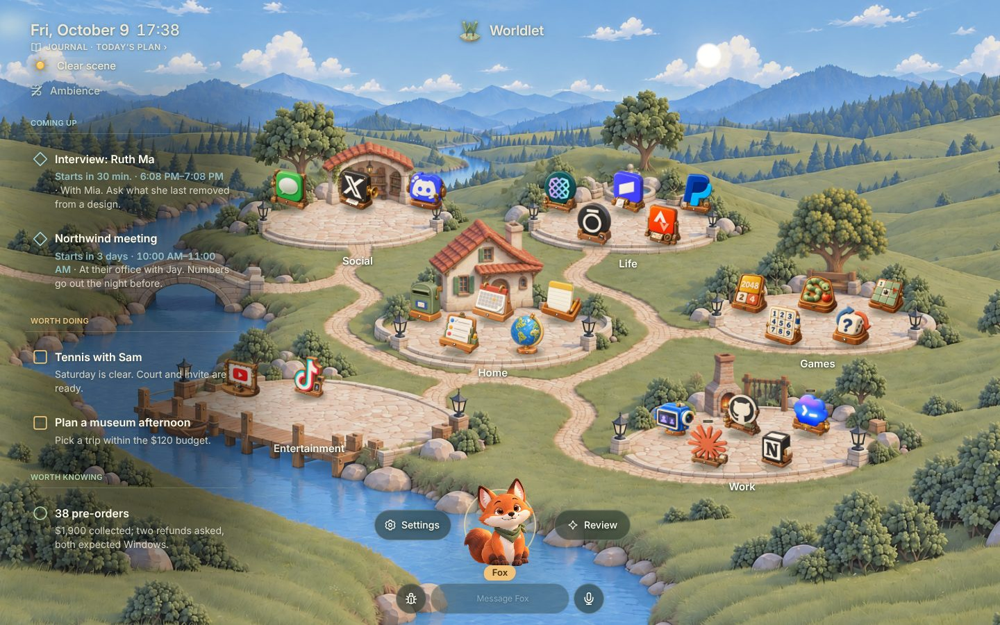
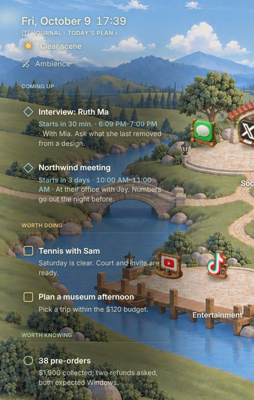
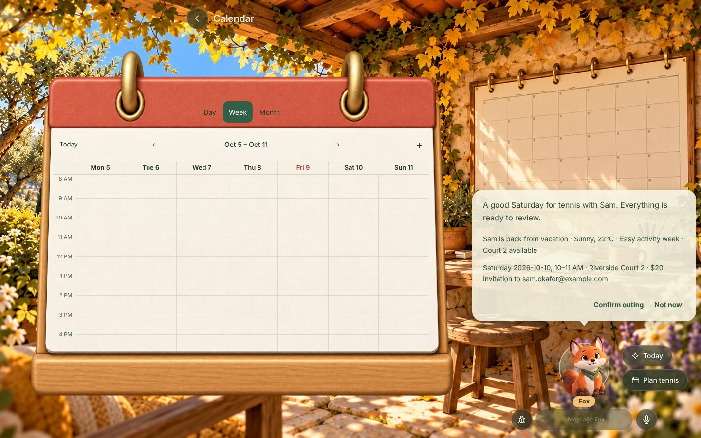
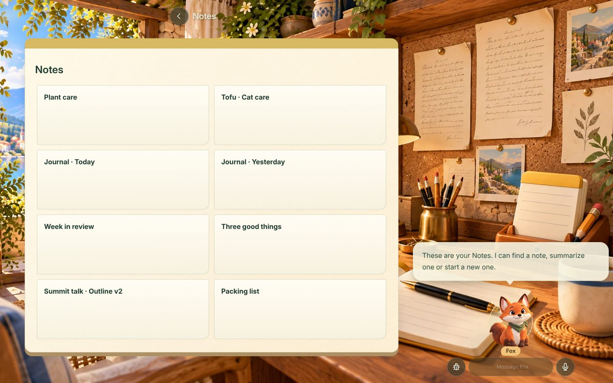
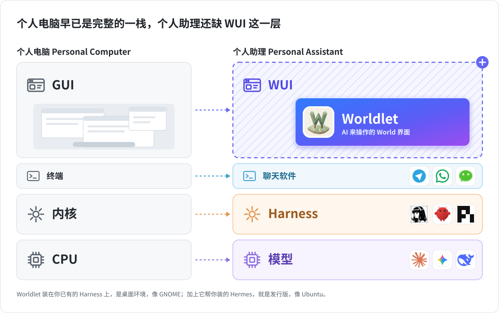

<h1 align="center">
  <a href="https://worldlet.ai"></a> Worldlet
</h1>

<p align="center">
  <a href="https://github.com/clockless-org/worldlet"></a>
  <a href="https://github.com/clockless-org/worldlet/releases"></a>
  <a href="LICENSE"></a>
  
</p>

<p align="center">
  <sub><a href="README.md">English</a></sub>
</p>

<p align="center">
  <strong>给你已经在用的 AI Agent 一个 World。</strong><br/>
  Worldlet 让 OpenClaw、Hermes Agent、Claude Code、Codex 或 pi 有一个你看得见的工作场所。World 由 AI 操作，你在一旁看着、做决定。
</p>

<h3 align="center"><a href="#安装"><ins>一条命令安装</ins></a> · <a href="https://worldlet.ai/download/"><ins>下载</ins></a></h3>

<p align="center">
  
</p>

## 安装

**macOS**

```sh
curl -fsSL https://worldlet.ai/install.sh | sh
```

**Windows**（PowerShell）

```powershell
irm https://worldlet.ai/install.ps1 | iex
```

安装脚本会下载最新版本，校验 SHA-256（Mac 上还会校验 App 签名），装好并打开。想直接连上某个 Agent、不被询问，就指定它：`openclaw`、`hermes`、`pi`、`claude-code` 或 `codex`。

```sh
curl -fsSL https://worldlet.ai/install.sh | sh -s -- --agent openclaw
```

```powershell
& ([scriptblock]::Create((irm https://worldlet.ai/install.ps1))) -Agent hermes
```

想用普通安装包？到 [worldlet.ai 下载](https://worldlet.ai/download/)，或者从 [GitHub Releases](https://github.com/clockless-org/worldlet/releases) 取。你的 Agent 也可以用 [`worldlet` 技能](harness/skills/worldlet/SKILL.md)替你安装。细节见[一行安装脚本](platform/install/README.md)。

不需要账号。还没有 Agent 的话，设置时会用官方方式把标准的 [Hermes Agent](core/agent/PORTABILITY.md#stock-hermes-agent-for-people-with-no-agent) 装到它默认的位置；已经有的就直接用。

## 功能

<table>
<tr>
<td width="50%" valign="middle">

### Attention Center

需要你的事都在一处：快到的会议、值得做的事、值得知道的消息，来自你的邮件、日历和你的 Agent 已经连上的服务。每一条都说明它为什么在这里。

[文档 →](docs/ATTENTION-CENTER.md)

</td>
<td width="50%">
  <a href="docs/ATTENTION-CENTER.md"></a>
</td>
</tr>
<tr>
<td width="50%" valign="middle">

### Fox 准备好，你来决定

Fox 是你用文字或语音对话的伙伴。它通过你的 Agent 干活，把结果摆在你面前：图里是一次网球预约，场地、天气和邀请都已备好。没有你确认，什么都不会发送、付款或删除。

[文档 →](docs/FOX-AGENT.md)

</td>
<td width="50%">
  <a href="docs/FOX-AGENT.md"></a>
</td>
</tr>
<tr>
<td width="50%" valign="middle">

### Applets

邮件、日历、备忘录、GitHub、Notion、YouTube 等一百多个，每个都是 World 里的一个小地方。Applet 用安静、好读的样子展示你自己的记录，想看原网站时也能打开。

[文档 →](docs/APPLET-RUNTIME.md)

</td>
<td width="50%">
  <a href="docs/APPLET-RUNTIME.md"></a>
</td>
</tr>
</table>

**还有：**

- **[手机伴侣](ios/README.md)**：iPhone 和 [Android](android/README.md) 上的 Attention Center 和 Fox，扫码配对，经端到端加密中继连到电脑。
- **[Journal](ui/attention/CARD-SYSTEM.md)**：Fox 做的卡片按天留存。
- **[例行任务](core/agent/PORTABILITY.md#scheduled-jobs-on-the-persons-own-agent)**：说一次（“每天早上 8 点告诉我天气和第一个会”），Fox 就一直做；你的 Agent 原有的定时任务也一起带过来。
- **[另一台电脑上的 Agent](core/agent/PORTABILITY.md#an-agent-on-another-computer)**：和一直开着、跑着你 Agent 的那台电脑配对，在这个 World 里和它对话。
- **[本地优先](docs/WORLD-STORAGE.md)**：你的记录留在你电脑上的 `world.sqlite` 里。

## 你的 Agent，你的模型：用电脑来类比

<p align="center">
  <a href="contracts/HARNESS.md"></a>
</p>

Worldlet 不提供自己的模型。它通过你的 Agent 对话，借用它的登录、连接、技能和记忆，并通过 `worldlet` MCP 服务器把 World 工具交给 Agent。换 Agent，你的 World 还在。

| 电脑 | AI 时代 | 归谁 |
| --- | --- | --- |
| CPU | 模型 | 你的模型提供方（你自己的登录或 API key） |
| 内核 | Harness：Hermes Agent、OpenClaw、Claude Code、Codex、pi | 你选，可以替换 |
| 驱动和钥匙串 | MCP 服务器、连接器和它们的令牌 | 你的 Harness；Worldlet 借用 |
| 终端 | 聊天 App 和命令行 | Agent 现在待的地方 |
| 图形界面 | Worldlet：World、Applet、Fox、Attention Center | 本项目 |
| 系统 API | World 工具，通过 `worldlet` MCP 服务器提供给 Agent | 本项目 |
| 磁盘 | 你电脑上的 `world.sqlite` 和 World 存储 | 本项目 |

Worldlet 跑在你自己的 Harness 上，就像桌面环境 GNOME；加上它安装的 Hermes Agent，就像发行版 Ubuntu。World → Agent 的工具走 MCP；Agent → World 每种 Harness 一个适配器（[Harness 契约](contracts/HARNESS.md)、[交互式架构图](docs/architecture.html)）。

## 隐私

没有 Worldlet 账号，你的记录都在你自己的电脑上。官方构建会上报基础使用统计（设置、连接和核心操作的结果，绝不包括消息内容、连接的内容或浏览记录），可以在 设置 › 隐私 里关掉，详见[统计说明](core/diagnostics/ANALYTICS.md)。你自己构建的版本不上报任何东西，除非你配置了自己的 PostHog 项目。

## 从源码构建

需要 Node.js 22.19 或更高版本。

```sh
npm ci
npm run setup:hermes   # 没选其他 Agent 时 Fox 用的固定版本 Hermes 运行时
npm run dev            # 带监视的开发构建
npm run build          # 构建一次界面和 Electron 宿主
npm run package        # 为当前系统打包桌面 App（不签名）
```

构建不需要任何账号、密钥或托管服务。检查：`npm run check:pr`（类型、架构和契约边界、文档、源码布局、样式）和 `npm test`。

| 目录 | 负责 |
| --- | --- |
| `ui/` | 共享渲染和交互：World、Applet、Fox、Attention Center |
| `core/` | 与平台无关的产品规则和数据 |
| `platform/` | Electron 宿主：系统集成、浏览器引擎、受控执行 |
| `harness/` | Agent 后端和参考 Harness 适配器 |
| `contracts/` | 宿主和 Agent 共用的接口与数据形状 |
| `resources/` | 世界、风格、美术、字体和媒体 |
| `ios/`、`android/` | 手机伴侣 |
| `scripts/`、`docs/` | 构建、校验和贡献指南 |

## 文档

| 从这里开始 | |
| --- | --- |
| 使用、原理、制作 Applet、发布 | [文档索引](docs/README.md)（英文，含完整文件清单） |
| 产品原则 | [Charter](docs/CHARTER.md) |
| 架构 | [五层结构](docs/UI-CORE-PLATFORM.md) · [Harness 契约](contracts/HARNESS.md) |
| 参与贡献 | [贡献指南](CONTRIBUTING.md) · [开发流程](docs/DEVELOPMENT.md) |

## 社区和支持

- **问题和想法：**[提一个 issue](https://github.com/clockless-org/worldlet/issues)。
- **安全：**见 [SECURITY.md](SECURITY.md)；安全问题请不要发成公开 issue。
- **支持我们：**给本仓库点个 [star](https://github.com/clockless-org/worldlet)，跟进最新进展。

## 许可证

Worldlet 以 [Apache License 2.0](LICENSE) 免费开源。第三方声明见 [NOTICE](NOTICE)。

所有主题都实现同一个 [Theme contract](resources/themes/CONTRACT.md)。默认主题 Village 是内置的动态 World。Worldlet 还打包 `ui/theme-packages/` 里的每个主题包（目前是 Village Map 和 Blueprint），在 设置 → 主题 里一步切换所有主题。用 `npm run theme:import -- /path/to/theme/package` 添加或更新一个包；主题负责 World 渲染、Applet 场景和 HTML 布局，主仓库提供数据和操作。
