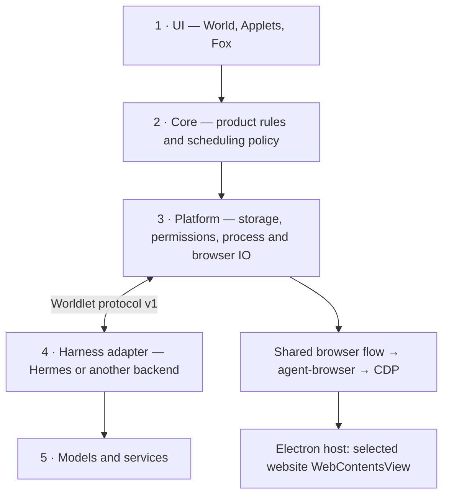

# Platform–Harness contract

Worldlet owns the first three runtime layers. `contracts/` defines interfaces,
not a sixth runtime layer. The stable Harness boundary sits between Platform (3)
and Harness (4); the Harness owns its internal planner, model routing and job loop.

## Public components

| Component | Public entry point | Responsibility |
| --- | --- | --- |
| Wire shapes | `contracts/harness.ts`, `contracts/agent.ts` | Version, handshake, request, event, tool result, terminal result/error, declared capabilities |
| Protocol acceptance | `core/agent/index.ts`: `harnessHandshake`, `harnessReceive` | Shared validation for every adapter; correlation, declared streaming/tools, duplicate tool IDs, terminal state |
| Sign-in handoffs | `core/agent/index.ts`: `harnessAuthHandoff` | Hermes `google_auth`/`model_auth` events: one per run, matching request only, fixed Google OAuth path/OpenAI device URL, bounded device code; hosts open or display only accepted values |
| Serialization facade | `core/index.ts`: `harnessHandshake`, `harnessReceive`, `harnessAuthHandoff` | JSON envelopes for the host's in-process Core (`platform/electron/src/core.ts`) |
| Executable adapter | `platform/electron/src/modules/agent-runtime/external.ts` | Spawn, bounded JSONL IO, deadline, cancellation, execute accepted tool callbacks |
| Reference Harness | `harness/example/agent.py` | Independent executable example; no Hermes dependency |
| Browser policy and flow | `core/browser/index.ts` | Observation projection, element policy, command sequencing and snapshot consumption |
| Browser transport | `platform/browser/agent_browser.py` | Private provider endpoint and pinned upstream driver process; no model or planner |
| Host browser endpoints | `platform/electron/src/modules/browser/agent.ts` (driver process), `page.ts` (CDP through `webContents.debugger`) | Selected page, navigation generation, cancellation, CDP IO |

Consumers enter through these interfaces. Harnesses cannot call host storage
internals, Core internals or the page CDP endpoint directly. Tools travel back
through Worldlet's consent, approval and result gateway. Website content is data,
not user authority.

## Harness services v2

Owner goal (2026-10-07 PDT): everything a person did with their own Agent (OpenClaw, Hermes Agent, Claude Code, Codex, pi) works in the World too, not necessarily the same way ("以前信息推到 telegram，现在推到我们的 mobile app"), through one contract every Harness adapts to rather than code per Harness ("worldlet 应该有一个统一的 contract，去适配不同 harness"). [`harness-services.ts`](harness-services.ts) is that contract. The World asks for a service, never for a Harness by name; each adapter declares which services it provides and how (`native`: the Harness's own interface, its Gateway, ACP or command line; `files`: its own folder, read-only; `worldlet`: Worldlet stands in), and a missing service is reported, not faked.

| Service | What it carries | World feature it serves |
| --- | --- | --- |
| `conversation` | A resident session per Fox thread (`HarnessSession.send`, cancel); the Harness keeps the context and compacts it. `open` is idempotent, so the World opens a thread's session when the person starts typing or opens Fox (warm-up); a turn resolves with the usage the Harness reported (`HarnessUsage`: tokens, a cost only when it gives one, the context); Hermes Agent serves it from its resident API server (`/v1/responses`, a session key per thread) once its profile has Worldlet's `worldlet` MCP server ([World tools on Hermes](../core/agent/PORTABILITY.md#world-tools-on-hermes): registered in the profile for every Hermes channel, a call outside any Fox turn reading only), else from `hermes acp` ([kept running](../core/agent/PORTABILITY.md#hermes-agent-kept-running)) ([model, usage and speed](../core/agent/PORTABILITY.md#model-usage-and-speed-in-a-fox-thread)); a turn may lead with a bounded note of what happened in the World since the session last replied (`HarnessTurnInput.world`, sent ahead of the line by every adapter, [since you last spoke](../core/agent/PORTABILITY.md#resident-sessions-and-approvals)) | Fox remembers the whole thread and what happened in the World beside it and answers without a cold start; the thread shows what it used; first-word time is measured |
| `history` | The Harness's own threads and turns (channels, DMs, sessions), read continuously by cursor and, where it can be watched (`watch`), as soon as the Harness writes; every local Harness serves it from its files and one Harness-neutral sync appends new turns to the World ([history, read continuously](../core/agent/PORTABILITY.md#history-read-continuously)) | Past and new channel conversations in World search, Ongoing themes and the phone; a new message in a shared channel that asks something reaches Attention |
| `schedule` | The Harness's jobs, each run's result, whether its scheduler runs | Jobs keep running on the Harness's scheduler; each result becomes an Attention item and a phone notification |
| `approvals` | The Harness's own permission prompts and their answers; declared `approvalFeatures` add the standing rules an Always left in the Harness (`HarnessStandingRules`: read where the Harness keeps them, revoked its own way, `live` or on its next `restart`) and what an approved action changed (`approval_result`: `diffs` or only `output`) ([standing rules and changes](../core/agent/PORTABILITY.md#standing-rules-and-what-an-approval-changed)) | Approval cards on the computer and the phone; the host action `harnessApprovalRules` lists every standing rule with Revoke; the approval card shows the diff of what it changed |
| `agents` | The Harness's agents or profiles with their instructions and model; OpenClaw and Hermes Agent serve it from their files ([the person's own agents in an Applet](../core/agent/PORTABILITY.md#the-persons-own-agents-in-an-applet)) | An Applet's thread answered by one of the person's agents, bound to a person, a group, the Applet or its area, with the person's instructions there ([which agent answers where](../core/agent/PORTABILITY.md#which-agent-answers-where)) |
| `models` | The models the same Agent can answer with (`HarnessModels.list`), and a turn's `HarnessTurnInput.model`; only a switch the Harness really has: Hermes Agent's ACP `session/set_model`, OpenClaw's `x-openclaw-model` header (both `native`); others declare none | An Applet's thread answered by a cheaper model of the person's own Agent, chosen next to Answered by |
| `events` | Webhooks, mail triggers and hooks that start the Harness | External events shown in the World |
| `calls` | Phone calls the Harness placed or answered: the other party, direction, start, answer and end, outcome, where one in progress stands (`live`), transcript and summary when kept, and the Harness session that asked for it (`HarnessCall`); handed over again as a call changes, read often while one runs. Optionally `placing`, `place` and `hangUp`: a call the person confirmed in the World, dialed through the Harness's own calling | Each call is Attention context (a missed call Worth Doing, a finished one Worth Knowing), a call Fox placed is reported back in its thread, an Applet's Call dials after the person confirms the brief, and a call in progress shows live in Fox's card ([calling from an Applet](../core/agent/PORTABILITY.md#calling-from-an-applet)) |
| `tools` | What the Harness can do beyond World tools (calls, media, shell) | Fox offers them; results land in the World |
| `send` | A message into the channel thread a `history` thread came from, sent by the Harness with its own channel sign-in (`route`, `send`); OpenClaw (`openclaw message send`) and Hermes Agent (`hermes send`) serve it through their command line ([replying in a channel](../core/agent/PORTABILITY.md#replying-in-a-channel)) | Fox offers a reply in that Discord or Telegram thread; the person's Send on the exact text sends it |
| `voice` | The Harness's own text-to-speech: one clip of a reply in the provider, voice and persona the person set up there (`HarnessVoice.speak`); OpenClaw serves it through its command line (`openclaw infer tts convert`, local, no Gateway needed). Hermes Agent's speech is an Agent tool (`text_to_speech`) and its dashboard's `/api/audio/speak`, with no command that speaks one line, so it declares none ([Live voice](../ui/companion/CONVERSATION.md#live-voice)) | Fox's spoken replies, in Talk and elsewhere, sound like the person's own Agent; without it, or when a clip fails, a system voice reads them |
| `connections` | The MCP servers and chat accounts the person set up in their Agent (`HarnessConnection`: name, address or command with any token masked, how it signs in, its profile, and what it was last used for: the newest call of one of its tools, or conversation on that channel, in the Agent's own history) and, optionally, `preview` and `change`: a server added (an address, or a command) or removed by the Agent's own command after the person confirmed it. Hermes Agent (`files`: each profile's `config.yaml` and `.env` names, `hermes mcp add/remove`) and OpenClaw (`native`: `openclaw mcp status --json`, `channels list --json`, `mcp add/unset`) serve it ([the Agent's connections in the World](../core/agent/PORTABILITY.md#the-agents-connections-in-the-world)) | Settings › Integrations lists them under Worldlet's own accounts, with Add and Remove that show the exact command first |
| `skills` | The Agent's own skills (`HarnessSkills.list`: name, one-line description, folder, when it last ran as the Agent recorded it) and, where the Agent has a way, `save` for a new one the person confirmed: Hermes Agent from its folder (`files`, a new `skills/<name>/SKILL.md` where its own skill tool creates one), OpenClaw through its command line (`native`, `openclaw skills install`); never changing or removing one already there ([the Agent's skills in the World](../core/agent/PORTABILITY.md#the-agents-skills-in-the-world)) | What Fox knows lists every skill with when it last ran (the Agent's record and the World's synced turns); when Fox repeats the same multi-step task it offers to save it, kept in the World and added to the Agent on the person's Save |
| `location` | Local, or another computer reached through a paired Worldlet there ([implemented as `remote`](../core/phone/README.md#another-computers-agent): the turn, its instructions and view go there sealed, its World tool calls come back to run in this World, its permission prompts open this World's approval card, and Stop cancels it there; `conversation`, `agents` and `approvals` are served by that Worldlet, mode `worldlet`), or reached directly at its own address (mode `native`, `direct` in the location: [`remote-openclaw`](../core/phone/README.md#an-agent-gateway-on-another-computer), an OpenClaw Gateway's `/v1/responses` with the token kept in the vault, TLS except loopback and Tailscale) | An Agent on an always-on computer |

Worldlet owns the rest, the same for every Harness: phone notifications ([phone pairing](../core/phone/README.md)), voice (on-device speech in, with the World's names as its hint, and a system voice out where the Harness declares no `voice`), the approval and dispatch UI, the Attention Center and the World's records. Each Harness's declaration is a row in [`core/agent/harness-services.ts`](../core/agent/harness-services.ts), and `scripts/harness-contract-check.ts` validates them. OpenClaw and Hermes Agent provide `events` and `tools` from their folders ([what each reads and what it does not record](../core/agent/PORTABILITY.md#harness-events-and-tools)); OpenClaw provides `calls` from its voice-call plugin's store and places them with the plugin's own command line, and Hermes Agent, which keeps no call record, does not (Fox says plainly how to get calls instead) ([phone calls](../core/agent/PORTABILITY.md#phone-calls-through-the-persons-agent)). `calls` is its own service rather than an `events` source: a call is a record with a party, a direction, a duration and an outcome that changes while it rings and ends, most calls are ones the Agent placed rather than something that started it from outside, and Fox needs the session that asked for it to report back.

## Executable protocol v1

1. Platform sends `hello` with `protocolVersion: 1`.
2. Adapter answers `hello`, version, configured adapter ID and boolean capabilities.
3. Platform checks requested capability and sends `request` with ID and body.
4. Adapter sends correlated events (`requestId`), tool requests and one result/error.
5. Platform validates each event before delivery. Each tool ID may be used once per
   turn; its result returns as `tool_result`. A terminal state accepts no more events.

Required capability flags: `streaming`, `tools`, `cancel`, `steer`, `memory`,
`sessions`. Optional flags default unsupported: `modelConfiguration`, `routines`.
The executable v1 transport does not implement steering; it rejects `steer: true`.
A non-streaming Harness is valid. Status results cannot override negotiated flags.
Unknown descriptor fields are projected away. Existing v1 hello frames do not
require a display name; UI descriptors separately require a valid name.

The request body remains action-specific. Chat/status are the baseline; model
configuration and `routine_tick` require their declared capabilities. Browser
model login and Hermes connector extensions are **not** implied by protocol v1.
Hermes' resident/private events still belong to its adapter, not the public wire
contract. Replacement means supplying a compatible adapter, not pointing at any CLI.

The official Hermes adapter sends no `hello`; the host starts its turns from fixed
Hermes capabilities and still passes every frame through the shared reducer. With
`hermes: true` the reducer hands `google_auth`, `model_auth` and `applet` back
raw as `host` deliveries. The resident Hermes session (`agent-runtime/hermes-worker.ts`) also advertises `steer` and
lists earlier turns of the same process in `retired`, so their late frames (for
example a trailing `steer_result`) are dropped as `stale`. Any other request ID is
still an error.

The host enforces output/frame bounds, process isolation and deadlines. The
shared reducer checks nonempty chat replies with a 128,000-byte UTF-8 limit, wrong
turns, malformed events, unsupported events and duplicate tools. Cancellation
terminates the owned work and prevents further callbacks; it never automatically
replays an uncertain external write.

## Model sources

The host, not the Harness, decides where models come from. [`model-sources.json`](model-sources.json) lists the sources a host may choose. Worldlet provides no model of its own (owner decision 2026-10-05), so the only one is this computer's Codex sign-in (`local-codex`), used in every build unless the person's own provider is configured; the Worldlet model service source (`worldlet`) is retired. Each source maps the task tiers S, M, background-M, L and XL to a model and optional reasoning effort. The host names one source (`WORLDLET_MODEL_SOURCE`) and supplies its credential; the Harness routes each task to that source's tier model. A source is an endpoint plus model names, so a Worldlet-run proxy or another provider is a catalog entry, not Harness code. A person's own provider, configured in the Harness, has no tiers: every task uses the model they chose. An attached external Harness keeps its own model.

## Scheduling ownership

| Worldlet Core / Platform | Replaceable Harness |
| --- | --- |
| User schedule settings, Applet eligibility, consent, quotas, due times | Execution of accepted work and its internal planner |
| Durable claims, generation/token checks, leases, receipts, publication | Correlated progress, tool requests and final outcome |
| Host clock and atomic persistence of shared decisions | Optional routine execution advertised by capability |

The Attention adapter requests `_attention_begin` from this authority before
executing work. It has no second durable claim/completion database; a host-approved
retry with the same plan revision must still run. Rejected admission cannot finish
another owner's work. See [Attention jobs](HARNESS.md#bundled-attention-extension).

`routines: true` does not grant direct database access or permission to start any
job. Shared runtime claims and stale-result rejection remain Worldlet's authority.
Device evidence stays in the owning Issue/PR; shared-rule gaps are in the
[parity ratchet](README.md#parity-vectors).

## Browser transport and acceptance

The Electron host uses the shared Core command flow and agent-browser 0.38.1
(SHA-256-pinned per platform in [`driver.json`](../platform/browser/driver.json)).
agent-browser attaches through `webContents.debugger` to the selected website page
only (`modules/browser/page.ts`); there is no remote-debugging port, and `Target.*`
and `Browser.*` commands are refused. Model-visible browser operations and shared
policy come from Core, not the host.

Closing/hiding or cancelling stops the page's owned driver. A snapshot is bound to
its page generation; click/submit/scroll consumes it. No implicit fallback launches
a system browser. Consequential attempts are persisted and exposed for receipt
inspection plus the shared user-confirmation route, which the person's Go ahead before the last
step takes once the result page is inspected. A dispatched click alone is
not evidence that the user's transaction completed.

Current parity gaps are listed in the [parity ratchet](README.md#parity-vectors).
Shared protocol and command-flow checks are `check:contracts`; `npm run test:browser`
covers the driver transport and policy with fixtures. They do not certify the shipped
Electron page on a device.

### Browser outcome policy boundary

`contracts/browser-receipt.ts` is the durable receipt shape. Shared Core's
`beginBrowserReceipt`, `observeBrowserReceipt` and `resolveBrowserReceipt` own
attempt deduplication and result-review policy. Hosts provide normalized HTTPS
origins, current records and an explicit clock; only the host user-confirmation
route may resolve an outcome, and the UI calls it only after the person's Go ahead on that step. An Agent's click result never proves completion.

The host's ledger (`platform/electron/src/store/ledger.ts`) persists the shared
decision, runtime operation and linked task transition in one SQLite transaction.
Existing receipt IDs and fields remain compatible. Future inspection timestamps are
rejected as well as missing/expired ones. The website panel (`modules/browser/device.ts`)
captures the receipt before dispatch and retains uncertainty on failure.
`browserOutcomeAction` is a trusted UI route and re-inspects the page before positive
confirmation; the model has no operation that reaches it.

## Bundled Attention extension

This is the official Hermes adapter's private job protocol, not an implicit
capability of every executable Harness. Source collection, Applet analysis and
Center publication have separate host-owned durable checkpoints. Worldlet supplies
an awake clock, grants, pure Core policy and ledger IO. The Harness executes admitted work.

Current limit: the Electron host does not send `attention_tick` or answer the
`_attention_*` callbacks below. Its Attention Center
(`platform/electron/src/modules/attention/center.ts`) applies the same Core plan,
start, execution-plan, follow-up and finish operations itself and asks the Harness
only for model-free `sourceTool` reads and `_background` synthesis turns. Earlier
native-host acceptance is history (Git, linked Issues) and does not carry over to Electron.

### Protocol

The trusted adapter accepts `attention_tick` with `_background: true`. Its callbacks
are private host operations, never page or model tools:

| Callback | Contract |
| --- | --- |
| `_attention_plan {kind}` | Request one `collection` or `synthesis` policy plan. Returns `job: null` or an ephemeral job `id`, stable `key`, opaque policy `revision`, `kind`, optional `provider`, and `modelFree`. This does not claim or start it. |
| `_attention_begin {job}` | After claiming, request authorization again and persist the shared start/budget state. An optional in-memory included-model credential is returned only to this trusted adapter. It is never saved in the job database. |
| `_attention_tool {job,name,args}` | Execute a permission-checked tool for that job. Source collection only gets read tickets/receipts. Synthesis only gets query, propose and review. |
| `_attention_followups {job}` | Once per started collection: Core selects follow-up reads from the host-validated receipt IDs. Caller-supplied records are not used. |
| `_attention_finish {job,success}` | Reconcile the execution result with verified receipts and persisted user schedule settings. Model prose alone cannot acknowledge a synthesis. Synthesis submissions must explicitly report `processedContextIds`; the host validates them against the supplied context through shared `attentionCoverage`. Empty progress and individual item saves do not acknowledge the whole plan. Query/save replies include `pendingContextIds`; all seed IDs must be covered before a successful finish. Context includes explicit `sourceReference` identities distinct from acknowledgement IDs. |

The ephemeral permit is bound to current connection generations. A reconnect,
revocation, pause or world switch invalidates further tools. A source result must
complete an issued read ticket. Model proposals must quote exact cached evidence
and pass current-revision, freshness and source-overlap checks.

Worldlet's ledger is the sole durable claim authority. `_attention_begin` atomically
claims the shared runtime task; tools and settlement are fenced by its run identity
and generation. The Harness must not suppress an admitted retry using its own
completion cache or lease. A rejected begin never triggers finish. Cancellation
or process loss is settled by the host's cleanup/recovery path. Persisted due times
and receipts prevent catch-up replay after sleep/restart.

Older builds created `worldlet-attention-jobs.sqlite` inside the Hermes profile.
It is no longer read or written. Existing files may remain, but cannot block jobs;
no user profile or credentials are removed during this migration.

### Execution plan

`contracts/attention-jobs.ts` defines the host execution plan. Shared Core's
`attentionExecution` supplies initial read requests, the child execution timeout,
and synthesis instructions. `attentionFollowupReads` owns Notion's five distinct
page limit and ignores blank/duplicate IDs. The host uses these rules;
Hermes forwards the supplied instructions and budget without a private product
prompt or fixed 180-second child timeout. A missing execution plan fails closed.
The host still enforces the task lease, scope, grants and total request deadline.
This is a bundled Attention extension, not an implicit capability of every v1
executable Harness.

### Execution and current limits

One wake runs at most one source collection and one due synthesis. Source reads
use the existing model-free `world_tool/read_world_source` service: at most 20
bounded records requested, and a Notion index plus at most five original pages.
Calendar collection saves facts only; its display content requires model synthesis too. Synthesis uses a separate monitor
profile/session, no foreground conversation, and the shared 30-second successful-pass cooldown / 240 daily
attempt budget and bounded failure backoff. Foreground operations cancel and
drain the background job; Codex, Claude and speech activity defer the tick.

Jobs run only while Worldlet is open, awake, privately authorized and using the
official source adapter. Closing Worldlet does not schedule an OS background service for them. The Hermes Agent Fox uses runs as its own login service that outlives Quit ([kept running](../core/agent/PORTABILITY.md#hermes-agent-kept-running)); it runs Hermes' own work (its channels, its cron, its API server), not these jobs.
External executable adapters do not yet advertise this protocol or gain access
to Hermes-owned connections. They need an explicit source/attention adapter;
the existing optional `routines` capability does not imply that support.

`attention-jobs-check.py` and `attention-harness-check.py` exercise the extension with
fictional readers and isolated storage; the Electron `modules/attention/check.ts`
(run by `npm run test:electron`) covers the host's World tools, read receipts and
background turns on a disposable ledger. They do not establish real-account usefulness or a release.

## Optional execution traces

An external adapter may advertise `tracing: true`. It may then emit correlated v1
`trace` frames with `kind` equal to `tool.requested`, `tool.result`, `model.requested`,
`model.result` or `model.interrupted`, and a JSON-object `payload`. Undeclared traces
are rejected. The host records and consumes them; they never invoke tools or become
Fox UI events. Existing adapters remain compatible without tracing. Their internal
steps are unknown rather than inferred. See [execution recording](README.md#execution-journal-task--run--event).
