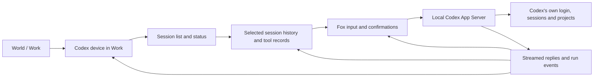
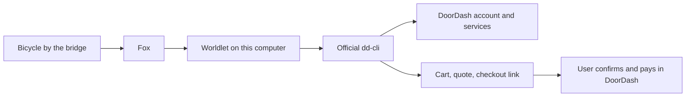
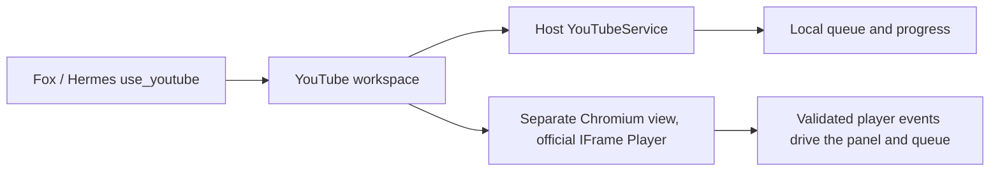

# Connector reference

Chapters:
- [Core Applet content and presentation](#core-applet-content)
- [Library Applets](#library-applets)
- [Work Applets: GitHub, Codex and Claude Code](#work-applets)
- [Health, Travel and Money Applets](#health-travel-money-applets)
- [DoorDash: the bridge-side Applet](#doordash)
- [YouTube Applet](#youtube-applet)


Reference appendix for how each Applet reaches its service: the official basis, what Worldlet implements, and what a public endpoint result does and does not prove. Product acceptance per Applet is in [Applet review](../../ui/components/INTERACTION.md#applet-presentation-acceptance-contract); the roster is in the [catalog](catalog.ts).

The 2026-09-28 native-integration audit
records a complete catalog snapshot, current code-path evidence, documentation
discrepancies and prioritized official backend candidates. Dependencies are
curated by Applet authors at packaging time, not installed by end users; see the
[packaging policy](../../ui/applets/IMPLEMENTATION-GUIDE.md#curated-dependencies-at-packaging-time).

## Evidence levels

- **Endpoint exists, tool list readable, DCR available** proves the protocol is reachable. It does not prove the user has authorized Worldlet or that a source syncs.
- **Real bounded read** (one account, one page of results) proves the adapter works for that call. It does not prove pagination, incremental updates, deletion handling or revocation recovery.
- **Website opens in the embedded browser** proves nothing about data access; website sign-in is not a connector token.
- Worldlet never signs in, accepts terms or requests scopes on the user's behalf during diagnostics, and no account content is written into reports or the repository.

## Implementation ownership

The [catalog](catalog.ts) owns the roster and each Applet's
`runtime.json` owns declared capabilities. Website availability is distinct from
structured source access. Do not maintain a second static support matrix here.
The provider chapters below retain unique adapter behavior, permissions and limits.

- Google uses direct OAuth and API reads; Notion uses its MCP authorization and
  explicit original-page access. Public Google distribution review remains in
  [Google OAuth review](../../docs/GOOGLE-OAUTH-REVIEW.md).
- Apple adapters use OS-authorized local access. Their platform limitations and
  actual account/device acceptance must remain explicit.
- GitHub structured reads and local Codex/Claude Code sessions use their own
  adapters; browser sign-in is not authorization for those adapters.
- Collection windows, initial pagination, incremental checkpoints, schedules and
  analysis budgets belong to [Applet runtime](RUNTIME.md). Connecting a
  source does not grant consent to model processing.
- Embedded sites use the [browser contract](../../platform/browser/INTEGRATION.md). A loaded site or
  public MCP tool list does not prove structured ingestion or background sync.

## Verification

- `npm run test:electron` runs the host contract, module checks and an app smoke run on a disposable library: the `attention` module covers source checks and World tools, the `agent-runtime` module covers Hermes source-connection mapping.
- `npm run test:hermes` (and `:routines`, `:steer`, `:desktop`) exercises Hermes tools with local MCP fixtures; no external OAuth.
- Not yet ported to Electron: the native `--review-world-source <provider>` one-shot check, the `--self-check` source-sync cases (notifications, cancellation, refusing Google without configuration), and the `--stripe-check`, `--youtube-check` and `--youtube-live-check` service checks.

## External service requirements

Provider-specific chapters link their official basis. Requirements can change;
verify them against the provider before expanding scopes or declaring public
availability. Google distribution review has its own [submission record](../../docs/GOOGLE-OAUTH-REVIEW.md).

<a id="core-applet-content"></a>
## Core Applet content and presentation

Mail, Calendar, Notes and Reminders use **Peek → Open → Focus**. The four share source identity and Fox ownership of task actions, not one generic visual inventory.

| Applet | Unique content surface |
| --- | --- |
| Mail | Subject/sender and complete original threads; see the [Mail reader](../../ui/applets/gmail/README.md) for current pinboard and Focus behavior. |
| Calendar | Seven local calendar days; original event preserves timezone and all-day semantics. |
| Notes | Notebook leaves select originals by stable native IDs. |
| Reminders | Task cards select actual reminders; completed records do not become fresh tasks. |

The native Focus view retains the village backdrop. The parent Peek device remains in the middle of the right column, below the selected item and above Fox; it does not load YouTube scenery. Previous/Next browse loaded items within the Applet. Exposed scenery and Fox Back dismiss one level. There is no content close X or task toolbar. Fox owns reply, editing, rescheduling and completion via existing authorized tools; presentation does not add new write capabilities.

### Fox's content contract

Use the existing `upsert_world_items` schema and stored findings. Rendering never starts a second model request.

- Copy, lengths, classification and marker policy follow the [Attention contract](../attention/README.md#presentation-and-item-lifecycle); do not duplicate its limits here.
- Preserve provider/source identity, exact evidence and URLs. Titles are never identity keys.
- Calendar retains original start/end/timezone/all-day fields; never invent dates.
- Findings match originals by provider/source ID, not equal titles. Focus labels interpretation
  separately from the original body and fetches the original explicitly.
- Missing findings are honest original-content views, never placeholder tasks or invented counts.

### Asset production

`resources/styles/builtin/assets/applets/{gmail,google-calendar,apple-notes,apple-reminders}/open.png` are ImageGen-generated transparent 1536×1024 painted installation plates, using the approved four-Applet comparison board as reference. Generated 2026-09-18. They contain no private data or baked-in text. Runtime DOM leaves supply current content, keyboard targets and selection.

The registered `open.png` assets supply installation artwork. Frames animate into Open; reduced motion suppresses this. Full rigged mailbox mechanics and page-turn sprite sequences are not yet authored. This implementation uses painted plates plus live content, not a claim that those animation sequences exist.

Peek device-state artwork (mailbox lid/flag, calendar face and equivalent physical cues) is the intended information channel. Current static Peek plates do not yet implement those dynamic parts; a subtitle must not be used as a substitute.

### Local Home adapters

| Applet | Current access | Limits |
| --- | --- | --- |
| Calendar | EventKit; explicit Connect requests Calendar full access | Next 30 days, 50 earliest non-cancelled events across calendars synced on the Mac; read only |
| Reminders | EventKit; explicit Connect requests Reminders full access | 50 most recently modified reminders; read only |
| Notes | Apple Events automation of Apple Notes; not EventKit | 50 notes, text only; locked notes skipped |
| Mail | Existing Google OAuth | Local Apple Mail adapter is proposed, not implemented |

The Electron host reaches EventKit and Apple Notes from `platform/electron/src/modules/sources/apple.ts` (macOS only), through bounded JavaScript-for-Automation helpers; the permission prompts on that path are not yet device-accepted.

Calendar retains the internal `google-calendar` Applet/provider ID for saved-item compatibility. Its connection transport distinguishes EventKit (`native`, `system`) from existing Google (`hermes`, `oauth`). Connecting Calendar replaces the Calendar connection with local access, preserving saved findings and Gmail authorization. Source reads use the native receipt before considering OAuth. EventKit occurrence IDs are prefixed and include start time so recurring events stay distinct. All-day dates use local calendar dates. Notes, reminders and event bodies stay in the session cache; model processing still needs private-context consent. Disconnect clears the session cache, keeps saved findings and does not revoke the OS permission; OS permissions can be revoked in System Settings.

The Calendar Open stage keeps seven date columns with sticky headings. Busy days scroll within the enlarged paper rather than expanding beyond the illustration. Meetings consumes the same records, including links in the event URL or notes.

#### Reviewed local Home changes

On Mac, `prepare_home_change` is exposed as `draft` on Calendar, Reminders and
Notes through the existing World gateway. Core validates operation/fields and
explicit timezone timestamps; OS adapters resolve the real destination and source
revision. Fox displays the complete change with Confirm/Cancel. Only the trusted
UI can commit a one-use review. Sample and non-Mac hosts do not execute these writes
(`platform/electron/src/modules/sources/apple.ts` is macOS-only).

- Calendar: create ordinary timed events in the default writable calendar or
  reschedule an existing non-recurring, non-all-day event with no attendees.
  Google-only connections need a separate Google write adapter and scopes.
- Reminders: create in the default writable list, complete or change the due time
  of a non-recurring reminder. No delete or repeating-series edits.
- Notes: create in the default account's default folder, or append escaped plain
  text to an unlocked, unshared note without attachments after checking its original body has not changed.

Prepared payloads are process-local; restart discards them. Durable runtime
operation receipts record attempts, and uncertain writes are never replayed.
Successful OS readback precedes success; an Applet refresh failure does not turn a
successful write into a retry. `home-actions-check.ts` exercises shared plans and gateway
routing; `home-review-check.ts` exercises the exact Notes script with a fake
application dictionary and the Fox confirmation UI. No fixture contacts accounts.

Mac fixture evidence on the retired native host (2026-09-30, #394, elons-mac-mini): both checks and
`mock-google-check.py` pass. The Notes script previews create/append without
writing, rejects locked, shared, attachment and changed notes, escapes text and
fails when plaintext readback misses the change. Fox shows every changed field,
writes nothing before Confirm, sends one discard on Cancel, commits once and
offers no retry after an unverified result.

Mock Google (Dev) cannot rehearse these writes: it connects Calendar through
Google (`hermes`), which is read-only here, and has no Reminders or Notes. No
EventKit mock exists. Still unverified: EventKit create/reschedule/complete/due
change, readback and the recurring/all-day/attendee/repeating-reminder guards;
live Notes/osascript and Automation consent; the TCC prompts; the host draft and
operation-receipt lifecycle (`platform/electron/src/modules/sources/apple.ts`). These need console permission approval with
dedicated test records.

#### Mail before Google verification

Apple Mail scripting can read mail already available to the Mail app. It requires the user to configure an account in Apple Mail and approve Worldlet automation. Mail may run in the background. This is not EventKit and is not a general MailKit inbox API. A first adapter should expose bounded inbox reads, sender, unread state and body, then map those to existing Mail Open/Focus. Sending and attachment handling need separate implementation and acceptance. Do not claim the local Mail route is working yet. Gmail API verification remains necessary for direct Gmail integration without Apple Mail.

#### Validation

TypeScript checks and the core Applet fixture verify compilation and presentation. The source-reader regression verifies native Calendar receipts never call Google, including an empty result. Real macOS permission approval and account contents still require interactive acceptance; fixtures do not prove that a user's accounts are synced.

<a id="core-applet-content-shared-stage-boundaries"></a>
### Shared stage boundaries

Stage rendering selects originals by stable IDs, including duplicate titles.
Restart with an empty session cache requests fresh content. Native permission is
required. Returned-set pagination is not a claim of complete account coverage.
Locked Notes are skipped; editing, attachments and full frame-animation mechanics
need separate implementation. Check `scripts/applet-stage-check.ts` for actual
selection, originals, Back and completed-reminder filtering. Layout counts and
current UI details belong to each Applet implementation, not a second dated roster.

<a id="library-applets"></a>
## Library Applets

Notion and Obsidian use native **Peek → Open → Focus**, with a deliberate web escape beside the context title. No account is implied by opening a website.

| | Notion | Obsidian |
| --- | --- | --- |
| Device | Ivory N book spine, page index and oak archive drawers | Purple crystal linking notebook leaves above a knowledge desk |
| Open | Four selectable page folios per page | Four selectable Markdown notes per page |
| Focus | Live original Notion Markdown; selected page and parent device at right | Read-only original Markdown; selected note and parent device at right |
| Integration | Existing authorized official Notion MCP through Hermes | Explicitly selected local vault; the chosen path is stored in the connection store (`platform/electron/src/modules/sources/local.ts`) |
| Native / Web toggle | Selected original URL, otherwise Notion home, inside the same Applet | Not offered: the local vault has no web equivalent |

The device toggle preserves the current native selection. Switching to Native restores it. Back returns from website to the native view, then from Focus to Open. Previous/Next stays outside the selected item. Task actions belong with Fox. No second editor or send toolbar is introduced.

### Content and limits

- Notion reads the recent-page index on first entry, then fetches the selected original on demand. Bodies are not mirrored into source storage. Existing MCP bounds apply: up to 20 recent pages, database first collection up to 20 rows, partial blocks explicitly indicated.
- Obsidian's Choose vault and Disconnect vault controls live with Fox. Selection uses the system folder picker. A vault chosen in the retired native Mac host was a security-scoped bookmark and must be chosen again. There is no automatic scan of other vaults. Reconnecting selects another folder.
- Obsidian lists up to 500 Markdown files within 10,000 filesystem entries, then sorts that bounded set by modification date. It excludes hidden files, packages and symlinks. Reads reject traversal and symlink escape; a note is limited to 1 MiB UTF-8. Attachments, Obsidian plugins, Dataview, embedded media and a full graph/editor are not implemented.
- No CLI installation or extra credential is needed for these first native readers. Notion continues to use Hermes MCP. Obsidian is a folder reader, not a claim to control the Obsidian application.
- Sample uses preset records and never calls the private reader. The existing native Focus item/device layout and attention rules are shared.
- The two generated devices are static painted sprites with existing camera/hover transitions. Rigged page flipping and graph motion are future work; they do not imply real processing.

### Verification

- `node scripts/library-applet-check.ts`: fixture Open pagination, original reading, right-side device, outside item navigation, web escape and return.
- `node scripts/obsidian-vault-check.ts`: the actual Electron reader against a temporary vault, hidden-file exclusion and traversal/symlink rejection.
- TypeScript check and shared Applet route regression checks.

A real Notion account and a user-selected vault still require manual acceptance. Fixture records are not proof of live account completeness.

<a id="work-applets"></a>
## Work Applets: GitHub, Codex and Claude Code

### Visual contract

A Peek device combines **recognizable app identity and recognizable work**. A freestanding logo statue is insufficient.

| Applet | Peek installation | Open | Focus |
| --- | --- | --- | --- |
| GitHub | Octocat tends a repository archive: project folders, branch rails and a review tray | Accessible repositories as selectable folios, description and visibility | Repository description, branch, language, stars, open PRs and issues on the left; selected repo folio at right |
| Codex | Blue terminal-cloud control head drives a short code assembly conveyor | Local sessions, project and observed execution state | Conversation and command/file results at left; selected session at right; Fox can continue the selected session |
| Claude Code | Terracotta asterisk anchors a code drafting/review desk | Recent local sessions, project and Saved status | Saved conversation text at left; selected session at right |

The original icons remain unchanged in `ui/applets/`. The generated devices are visual adaptations explicitly requested by the product owner, not replacement publisher logos. Peek labels have no extra icon or text subtitle. Existing attention markers and navigation conventions remain shared. Scenery clicks in Focus return to Open.

### Data and runtime boundaries

- **GitHub:** uses the installed `gh` CLI and its existing authorization. `gh api --hostname github.com` reads accessible owner/collaborator/organization repositories, 40 at a time. Selected repository reads include metadata and up to 20 open PRs and 20 recent issue entries. No writes, new tokens, scopes or authorization are performed by opening the Applet. Existing Hermes/MCP integration remains separate.
- **Codex:** uses the existing persistent local App Server. List, read, history pagination, continuing through Fox, approval handling and streaming reuse `CodexSessions` / `createCodexApplet`. Only observed Worldlet execution states become Running, Waiting for you, Completed, etc.; other clients' saved threads remain Saved. Listing/reading never starts a turn. Leaving Codex removes its Fox routing context.
- **Claude Code:** uses the installed local CLI's session storage through the official Agent SDK `list_sessions`, `get_session_info`, and `get_session_messages`. Inventory currently loads 40 recent sessions. Message pages contain up to 40 saved messages. Without the optional local signal adapter it does not monitor another process's live execution. Selecting a saved session routes subsequent Fox messages through the official SDK to that exact session and project, using the signed-in local CLI. Text streams into Fox; SDK permission requests display the tool and arguments with Allow once / Deny. Existing CLI project permission rules remain applicable. Tool payloads are not rendered as conversation text. Offline protocol and browser checks cover continuation; a live subscription turn remains to be verified.
- Session/repository bodies stay in the local reader; the selected identity/project supplies bounded Fox context. No inventory is automatically ingested into Hermes memory.
- Sample uses explicit fictional records through the same Open/Focus renderer and never calls the private CLI bridge.
- Missing tools, expired GitHub access and unavailable records surface recoverable errors. Fox exposes Refresh. Pagination controls are navigation, not external task actions.

References: [GitHub CLI API](https://cli.github.com/manual/gh_api), [Claude session browser](https://platform.claude.com/cookbook/claude-agent-sdk-05-building-a-session-browser).

### Assets and prompt provenance

Built-in ImageGen, 2026-09-18; transparent PNG assets at `resources/styles/builtin/assets/applets/{github,codex,claude-code}/peek.png`. Reference palette: `resources/styles/builtin/assets/world/palette-reference.png`. Codex identity reference: `ui/applets/codex/logo.png`. Initial pure-sculpture explorations were replaced before integration.

Final prompt set:

- **GitHub:** Preserve recognizable friendly charcoal Octocat, but not a statue/plinth. Make a compact open-air repository archive: Octocat as central archivist, tentacles arranging project folders in three cubbies, branching brass rails and a checked review folder. One believable device, no roof/walls, no text or UI, muted softly painted village materials, warm upper-left light, fixed elevated three-quarter camera, transparent alpha.
- **Codex:** Preserve the blue scalloped cloud and white `>_` as the compact control head of a functional code production line. Short wood-and-muted-steel conveyor, brass assembly arms, ivory code sheets and blue interlocking software components, clear input/work/output flow. Brand integrated into a roofless compact factory, no terrain/text/UI, matching palette, camera and transparent alpha.
- **Claude Code:** Preserve terracotta asterisk as the central mechanism of a code crafting/review bench, not a standalone statue. Slanted code manuscripts, articulated magnifier, pencil-like editing tool, revised-page stack and completed sage software block. Express iterative drafting, inspecting and correcting, distinct from Codex's conveyor. Same restrained village lighting, fixed camera and transparent alpha.

The plates remain painted images. Codex rollers rotate from registered texture parts and its tool arms articulate through a local sprite mesh; Claude’s magnifier/pencil use local mesh articulation. Foundations stay fixed. Quiet idle/hover motion differs from observed working motion. Octocat remains static. Motion pauses under reduced motion. Focus keeps the selected folio above its Peek device and offers Previous/Next within loaded records.

### Validation

- `python3 scripts/work-cli-check.py`: constrained repository IDs, shell-free CLI calls and bounded Claude text projection.
- `node scripts/work-applet-check.ts`: three native Open routes, paging, statuses, Focus content, selected item and scenery Back.
- Mac compile, TypeScript, source-layout boundaries and existing Applet regression checks.
- Local read-only smoke: 38 accessible GitHub repositories, 22 Claude sessions and a saved conversation, 4 Codex sessions. Only counts were printed; no model turn was started.

#### Large Codex conversations

Codex RPC framing and JSON decoding run on the pipe reader without blocking the host's event loop. Each incoming byte is scanned once; partial lines are bounded to 32 MB. `npm run test:codex:stream` checks a fragmented 4 MB conversation, complete text delivery, and UI responsiveness. History uses Codex’s display-summary view (user messages and assistant replies), paginated by ten turns; it does not load full tool logs. This prevents long saved conversations from freezing the World window.

### Weekly allowance and local signals

Codex reads `account/rateLimits/read` at most once per minute while visible in Work/Codex. Seven-day windows become remaining allowance, never token counts; multiple applicable weekly buckets use the most constrained value. Missing/expired/stale snapshots show an unknown battery. The visible battery is drawn inside the device container and shares all scene transforms. Running motion currently reflects sessions observed by Worldlet, not unobserved activity in another Codex client.

Claude supports an optional read-only sink for official [hooks](https://code.claude.com/docs/en/hooks) and [statusLine](https://code.claude.com/docs/en/statusline). `python3 scripts/claude-signals.py --install` explicitly enables it, backs up settings, preserves existing hooks/statusLine output, and stores only per-session state/time and weekly allowance under the Claude profile. No prompts, transcripts or credentials are stored. Existing terminal sessions may need a restart to pick up hooks. State expires after two minutes without events and quota after five minutes; unknown data is never shown as Running or 0%. Installation is opt-in, not performed by browsing an Applet. Long silent runs may temporarily appear unknown until another signal arrives.

### Region and session compatibility

Work is the default for code Applets; no separate Dev region is required.
Legacy `development` / `building-development` identities resolve to Work so stored
links survive. Current membership and slot counts come from the catalog/world
package, not an older coordinate table. Session records are transient Applet
content, not automatically imported World sources or Hermes memories. Sample
and read-only modes must not operate personal coding sessions. See
[Codex](INTEGRATIONS.md#work-applets-codex-sessions) for its specific App Server semantics.

<a id="work-applets-codex-sessions"></a>
### Codex sessions

World → Work → Codex → pick a session → talk to Fox to continue that Codex session.



#### Implemented

- The workbench has two screens, a tower, a keyboard and the Codex mark; the screens show the recent or selected session and the lights follow real running or waiting state. Reduced motion is respected.
- The local App Server lists sessions in pages of 40 (`thread/list`, sorted by update time); search by title or project, pin sessions, load more. Search covers loaded rows.
- The left panel reads the latest 10 turns (`thread/turns/list`) with earlier history on demand: user messages, Codex messages, commands and file changes.
- After selecting a session, Fox's typed or dictated text is sent to that thread as-is, with no Hermes prompt, other sessions or world data attached.
- The first send calls `thread/resume` (keeping the session's model, directory and approval settings) and then `turn/start`. Listing and reading history never start a model.
- Replies stream live. Command and file-change approvals and Codex's questions appear at Fox; the command or change is shown before **Allow once** / **Decline**. There is no permanent allow.
- Esc interrupts the turn Worldlet started (`turn/interrupt`). Browsing elsewhere does not interrupt; reopening the session shows the result. Closing or reloading Worldlet disconnects its own App Server.

#### Status and boundaries

| Status | Basis |
| --- | --- |
| Saved | Stored history only; whether another Codex client is running it is unknown |
| Running | Worldlet received real run events for the selected session |
| Waiting for you | Codex is waiting for an approval or an answer |
| Completed / Stopped / Failed | Completion, interruption or failure events received on this connection |
| Needs attention | Connection dropped or a request failed; refresh to reconnect |

Worldlet runs its own `codex app-server` stdio child through `platform/local-tools/codex_sessions.py`, started by the host (`platform/electron/src/modules/media/coding.ts`); it reuses the local Codex login and history; it copies no credentials and does not control the desktop Codex app. Do not continue the same session from two clients at once. After a restart every session is Saved until Worldlet runs it and receives new events.

Scope is **reading and continuing existing sessions**. Creating, archiving, deleting, live takeover from other clients and the full set of experimental server requests are not covered, so the Applet stays Building. Unsupported server requests return an explicit error and are never auto-approved. The installed CLI must support `thread/turns/list`; which Codex version provides it depends on the user's installation and is not pinned by Worldlet. Sample Mode and read-only storage refuse the local session interface.

#### Verification

```sh
npm run build:native-ui
```

UI tests use fictional sessions to cover selection, continuation, streamed replies, approvals, file preview, cancel and back. `python3 scripts/codex-sessions-portable-check.py` (in `npm run test:harness`) drives the helper against a local app-server fixture, and `npm run test:codex:stream` checks that large RPC lines reach the Electron host whole. The native protocol tests that also covered paged history, resume only on explicit send and unchanged session configuration retired with #996; coverage of those cases in the portable check is not re-audited here. No test sends to a real user session or writes real session content into the repository.

Interface: [OpenAI Codex App Server](https://developers.openai.com/codex/app-server/). Code: `platform/electron/src/modules/media/coding.ts`, `platform/local-tools/codex_sessions.py`, `ui/applets/codex/codex-applet.ts`.

<a id="health-travel-money-applets"></a>
## Health, Travel and Money Applets

### Implemented routes

| Region | Applet | Route | Integration and boundary |
| --- | --- | --- | --- |
| Money | Stripe | Peek → Open → Focus | Bundled official CLI. Open lists customers plus an account overview; Focus reads selected billing or scoped totals. Connect/cancel/disconnect through Fox. Read only. |
| Money | PayPal | Peek → Open → Focus | Official merchant MCP, fixed invoice list/detail calls. This is not a personal wallet transaction feed. Sign-in still required. |
| Money | Plaid | Peek → website Focus | Opens the Plaid portal. No balances, transactions or Plaid Link integration are claimed. |
| Health | Strava | Peek → website Focus | Activity website. Official MCP currently launches with Claude subscribers; Hermes authorization is not established. |
| Health | Oura Ring | Peek → website Focus | Opens the Oura website; native sleep/readiness needs a registered OAuth application. |
| Health | Fitbit | Peek → website Focus | Website entry only; no personal metric sync or guarantee that the website replaces the mobile dashboard. |
| Travel | Google Maps | Peek → website Focus | Places/routes website. Maps Platform MCP needs separate setup and does not provide personal saved places or Timeline. |
| Travel | Airbnb | Peek → website Focus | Stays website. No reservation sync or booking automation is implied. |
| Travel | TripIt | Peek → website Focus | Travel website. Native itinerary access needs the service's OAuth integration. |

A remote service merely having an API/MCP is not evidence that Worldlet can authorize it or that it exposes the desired account data. Keep the browser route until the actual supported authorization and data read exist. Third-party connector wrappers are not silently installed.

### Native Money behavior

Stripe reuses `StripeService` and the bundled official CLI. No second credential flow. Customer reads paginate with the service cursor; Open paginates the loaded folios. Account overview reads only when selected, preserves currencies, reports incomplete totals as unavailable and states that collection volume is not profit. Customer Focus shows bounded subscriptions, payments and invoices. Existing CLI authorization may affect the user's terminal Stripe session; Fox says this before sign-in.

PayPal uses Hermes' existing authenticated MCP session and the documented production `/http` endpoint for new connections. Previously configured official `/mcp` is accepted for compatibility, but connection errors require reauthorization. Only `list_invoices` and `get_invoice` are called by this reader, with a 20-record page, bounded IDs and bounded text. Unknown response shapes are errors, never zero invoices. Invoice amounts already use major currency units and are not divided by 100. No sending, refunding, capture or invoice editing is introduced.

Both retain the selected item above the parent device in Focus, outside Previous/Next controls, a readable left sheet, and a title globe for the real website. Back from the website restores the native view. Fox gets a bounded selected original as context. Sample routes use preset data and make no account reads.

### Art

Nine v2 transparent painted devices replace the earlier generic sprites, with original publisher icons retained in identity UI:

- Money: Stripe payment-routing/customer desk; PayPal invoice counter; Plaid account folio strongbox.
- Health: Strava activity bicycle; Oura ring/rest station; Fitbit wristwatch/activity dock.
- Travel: Google Maps route lectern; Airbnb balloon/basket; TripIt itinerary suitcase.

The shared camera, ground registration, hover behavior, lighting and reduced-motion rules remain. Decorative diagrams are not live metrics. These are painted sprites with shared transitions, not newly rigged simulations. Sources and prompt direction are in each asset folder. No Three.js.

### Evidence and follow-up

`money-applet-check.ts` checks native lists/readers, currency/partial totals, website escape/back and all seven browser destinations with fixtures. `paypal-read-check.py` checks MCP allowlisting, pagination, decimal amounts and invalid/error responses. Shared Applet route checks and TypeScript builds cover the integration. Real Stripe/PayPal account acceptance remains pending user authorization; website login behavior is service-dependent.

### Official sources checked 2026-09-18

- [Stripe CLI login](https://docs.stripe.com/cli/login)
- [PayPal MCP authorization and endpoints](https://developer.paypal.com/ai-tools/mcp-server)
- [PayPal tool reference](https://developer.paypal.com/ai-tools/agent-tools/)
- [Strava MCP availability](https://support.strava.com/en-us/articles/15401531-what-is-the-strava-mcp-connector)
- [Oura authorization](https://cloud.ouraring.com/docs/authentication)
- [Fitbit API](https://dev.fitbit.com/build/reference/web-api/explore/)
- [Maps Grounding MCP](https://developers.google.com/maps/architecture/grounding-with-maps-mcp)
- [TripIt API](https://tripit.github.io/api/doc/v1/)
- [Plaid Link](https://plaid.com/docs/quickstart/)

### Stripe account and metrics

#### Connection

Click Connect Stripe; the system browser opens Stripe's authorization page; after approval the dashboard loads. No API key, CLI install or terminal command is needed. The official Stripe CLI is bundled with the Mac package and handles credentials and refresh. Windows and Linux packages do not bundle it yet. A grant made in the retired native Mac host asks to reconnect. If Stripe's page asks for a pairing code, the Applet shows the code the CLI returned; there is no separate Worldlet pairing step. Cancel or leaving stops the wait.

Live data is the default; Test mode can be chosen on the first-connect view and in the connection controls, and every read passes the mode explicitly instead of following the terminal's default. Worldlet uses its own CLI config directory and a workspace-derived profile, but the CLI's OAuth credentials are shared through the macOS Keychain, so a profile is not an isolation boundary; connecting may update the terminal CLI's session, and the UI says so beforehand. After authorization a fixed `GET /v1/account` identifies the account; its ID is stored as connection metadata and later reads pin `--stripe-account` plus the explicit Live or Test mode, so a terminal switch either keeps reading the original account or fails with a permission error rather than silently switching. Credentials stay with the CLI (which may fall back to a restricted local file when the system store is unavailable) and never reach the web view or Fox.

Worldlet exposes reads only; the CLI authorization itself may include broader permissions and the final scope is what Stripe's page shows. Disconnect clears Worldlet's connection record and stops reads (it also removes any legacy manual key) but does not sign out other CLI profiles; revoke the CLI grant in Stripe if needed.

Allowed calls: `list` on customers, charges, subscriptions and invoices, `retrieve` on one customer, plus the `/v1/account` identity check at connect time; query keys are limited to `limit`, `starting_after`, `customer`, `status`, `created[gte]` and `created[lte]`. The CLI runs with a fixed argument array, no shell, no execution of commands from login responses and no arbitrary URLs; inherited Stripe environment overrides are cleared and authorization URLs must be HTTPS on `dashboard.stripe.com` or `access.stripe.com`. Output has size and timeout limits (30 s), temporary files are 0600 and removed after reading, and nothing is logged. The sample world never reads a personal account; browsing the local dashboard needs no model consent, but Fox reads require private-content consent. Insufficient permissions, network failures and rate limits show errors and are never presented as zero revenue.

#### Metric definitions

| Metric | First-version definition |
| --- | --- |
| Today collected | Charges created today (Mac time zone) that are paid, captured and succeeded; payment volume, not profit, net revenue or payout; captures delayed across days are not reconciled |
| Estimated MRR | Active fixed-price subscriptions, price times quantity normalized to a month; trials excluded; metered, tiered, transformed or incomplete prices make MRR unavailable and are stated |
| Currency | Each currency shown separately; no conversion |
| Customers | Paginated; search covers loaded customers only; detail shows bounded recent billing (25 subscriptions, charges and invoices) |
| Attention | Failed charges created today (up to 20); overdue invoices and past-due subscriptions are not included |

Totals over 1,000 records are reported as unavailable rather than truncated. Every summary shows its scope and time. The Stripe Dashboard can be opened from the panel. Data stays in the view's memory; no local copy of the account is created. No refunds, payments, subscription changes, customer edits or messages.

#### Verification and local runs

- The native `--stripe-check` (CLI argument allowlist and both authorization response shapes) is not yet ported to Electron; the host implementation is `platform/electron/src/modules/browser/stripe.ts`.
- Mac packaging (`scripts/package-electron.ts`) calls `scripts/bundle-stripe.ts`, which takes the official binary from the `@stripe/cli-darwin-<arch>` npm package (arm64 or x64), and ships it as `<resources>/stripe`. Development runs use the binary from `node_modules`. The version is pinned by `package.json` (`@stripe/cli` 1.50.11), not by the script. `bundle-stripe.ts` also stages the upstream license, but whether the Electron package ships `STRIPE-CLI-LICENSE.txt` still needs checking.
- Test data lives only in fixtures. Real browser authorization and account reads wait for the user to connect.

Official basis: [CLI login](https://docs.stripe.com/cli/login), [CLI source (Apache-2.0)](https://github.com/stripe/stripe-cli), [Charges](https://docs.stripe.com/api/charges/list), [Subscriptions](https://docs.stripe.com/api/subscriptions/list). The upstream LICENSE ships as `STRIPE-CLI-LICENSE.txt` (the npm package's MIT label does not replace the source license). The icon is the [Stripe favicon](https://stripe.com/favicon.ico) stored byte-for-byte; source and SHA-256 are in `ui/applets/brand-assets.json`.

<a id="doordash"></a>
## DoorDash: the bridge-side Applet

> The DoorDash Applet opens doordash.com in the embedded browser. Fox ordering through `dd-cli`, described below, remains available from chat, not as the Applet's Full View.

DoorDash belongs to no Region; it is a direct child of the World. Its current device comes from the built-in Style Pack and uses the stable world slot. The retired high-resolution bridge/motion experiment is not loaded and has been removed. Clicking opens doordash.com in the embedded browser; Fox actions retain their own permissions. Support remains Building; no real-account acceptance is implied.

### Chain



| Capability | Implementation and boundary |
| --- | --- |
| Install | `npm run setup:doordash` (`scripts/setup-doordash.ts`): official v0.2.4, darwin-arm64 only, fixed SHA-256, stored under `~/.local/share/worldlet/dd-cli/0.2.4/` |
| Connect | Fox: Sign in to DoorDash. The connection is saved only after the browser sign-in and a successful account verification through the CLI |
| Access | The official CLI still requires an early-access account; without approval nothing is marked successful |
| Search and menus | World tool `use_doordash`, for whichever Agent Fox uses: `addresses`, `search`, `menu`, `item`; the user picks a saved address first, no device location request; bounded results |
| Cart | `cart_list`, `cart_show`, `cart_add`, `cart_remove`, `preview` (quote). Existing carts are checked first; adding is additive; partial failures or timeouts are never retried blindly |
| Order | `checkout` returns the official HTTPS checkout URL; the user reviews address, fees and payment in DoorDash. CLI `order submit` is not exposed |
| Orders | `history` (default 10 orders, 30 days) and `order_status` only when the user asks; no polling or background order mirroring |
| Disconnect | Removes Worldlet's connection and enable switch; the CLI's own Keychain sign-in stays so other CLI users are unaffected |

CLI features outside this list are not available through Worldlet. The adapter allows only the listed operations and parameters, runs the CLI with an argument array and no shell, and refuses payment submission, account or address edits, credential export and arbitrary flags. `cart_add` and `cart_remove` are guarded writes: after untrusted content in the same turn, including DoorDash results, the shared turn-trust rule refuses them before the CLI runs (#672).

### Privacy and credentials

- Sign-in is handled by the CLI itself; Worldlet never reads passwords or exports Keychain tokens.
- Each request carries the CLI's fixed food-ordering purpose text. DoorDash may use it for research and product improvement; the user is told before connecting.
- The `--intent` text never includes the user's prompt, Fox history, memory or other source context. Menu queries and cart parameters are sent to DoorDash.
- Results return only to the current Fox conversation and may be processed by the model of the Agent Fox uses; that Agent manages its own session and memory. Worldlet creates no source copy.
- Opening the Applet reads only the local install and enable state; that is not an account health check. Real service errors surface through Fox.

### Verification

- `node scripts/applet-focus-check.ts` covers the DoorDash route and its single Back. The host side is `platform/electron/src/modules/sources/content.ts`; DoorDash operations run in the Platform with no Agent (`modules/sources/doordash.ts`, rules in `core/accounts/doordash.ts`).
- `node scripts/doordash-check.ts` (and `python3 scripts/doordash-outcome-check.py` for the earlier Hermes adapter) passes mocked timeout, nonzero exit, malformed/oversized response and partial-item failures: all potentially applied cart changes are uncertain, execute once and require cart inspection before another mutation. Private stderr stays out of results; payment submission remains unavailable and checkout hosts are constrained. It also covers a connection marked earlier in Fox's Hermes profile staying connected, and `use_doordash` being admitted by its turn before the CLI runs.
- Not yet accepted: real early-access account, browser sign-in, real menus, carts, quotes and checkout. No order has been created and nothing has been spent.

Official basis: [repository and install notes](https://github.com/doordash-oss/doordash-cli), [pinned release](https://github.com/doordash-oss/doordash-cli/releases/tag/v0.2.4), [early-access form](https://forms.gle/gvCQZvu9C1EKA6aM6). Worldlet uses the official consumer CLI, not a similarly named third-party npm package.

<a id="youtube-applet"></a>
## YouTube Applet

YouTube is a dedicated Applet rather than a plain website entry: a painted outdoor cinema sprite, the official player, a local queue and a Fox tool. Public-video playback, pause and close were verified by the retired native host's live check, which is not yet ported to Electron. Support status: Building.

**There is no YouTube account connection:** the shared OAuth client is submitted for Gmail and Calendar only; see [Google OAuth review](../../docs/GOOGLE-OAUTH-REVIEW.md). The Applet plays the links you bring, and Open on YouTube hands a video to youtube.com.

### User flow

Clicking the cinema in **Peek** opens youtube.com directly in **Focus**, including in Sample mode. The same cinema remains on the right, and the existing Fox HUD translates with its dialogue, draft and controls intact. There is no intermediate Open stage. Clicking the cinema opens youtube.com in the embedded browser (`fullView.kind: 'web'`). While a video plays there, Picture in picture right of the title in the top bar returns to the World and keeps the video playing in a window in its right third ([picture in picture](../../platform/browser/INTEGRATION.md#picture-in-picture)). The player and queue panel described here is Fox's tooling (`use_youtube`, `createYouTubeApplet` in `ui/applets/panels.ts`), reached through Fox rather than as the Applet's Full View.

- Paste a public YouTube link and watch it in the official player. Nothing to sign in to.
- Google may refuse a YouTube sign-in in the embedded browser with "This browser or app may not be secure". Fox then explains that videos still play signed out and offers **Open YouTube in your browser ↗**. Signing in there does not sign Worldlet in; see [Google sign-in refusal](../../platform/browser/INTEGRATION.md#google-sign-in-refusal).
- Queue is a local Worldlet queue: up to 200 videos, deduplicated, separate from YouTube's Watch later. The last video and position are remembered; reopening prepares the video without autoplay. When a video ends the next queued one plays; the last one stops.
- The official player provides volume, captions, full screen and seeking; the Applet adds play, pause, next, Add to queue and Open on YouTube. Embedding refusals and network errors show a real failure with a retry path.
- Closing the Applet destroys the player and stops media; scrolling out of view or hiding the window pauses.
- Playback state comes only from validated Player API events; nothing is simulated.
- A build that previously connected an account drops the stored grant, the client registration and the connection row the first time the Applet is used, so no refresh token outlives the feature.

### Integration and permissions



| Part | Implementation |
| --- | --- |
| Device | `resources/styles/builtin/assets/world/devices/youtube.png`: a television with wooden feet, antenna and knobs, drawn at its authored Explore slot in `ui/world/applet-sprites.ts`. The brand mark stays in `ui/applets/youtube/logo.ts` and is used for the HUD icon, not painted on the device |
| UI | `ui/applets/youtube/panel.ts` and `panel.css`: a link field, the player and queue cards with loading, empty and error states |
| Data | `YouTubeService` (`platform/electron/src/modules/browser/youtube.ts`): link parsing, the local queue and Open on YouTube. No Google API call and no network request of its own |
| Credentials | None. The service holds no token, and `forgetAccount()` deletes anything an earlier build stored |
| Player | `YouTubePlayer` (same file) loads `ui/applets/youtube/player.html` (copied to `youtube-player.html` by `scripts/build-native-ui.ts`) in a sandboxed `WebContentsView` with a synthetic HTTPS origin derived from the Mac bundle ID; official controls kept |
| Fox | `use_youtube` in `worker/companion-tools.ts` drives the same panel operations; the host bridge re-checks private-content consent |
| Local state | `youtube.json` and `youtube-sample.json` in the data directory, 0600 atomic writes; the sample queue is isolated from the personal one |

The restricted parent document is loaded as a data URL with the synthetic origin as
its base, so it never requires a network server. Its only host message channel
is `worldletPlayerReport`, a console report carrying a per-document secret; no World
bridge or browser-observer API is installed. Top-level navigation and popups are
rejected. The view uses the website session partition (`persist:website`, or
`persist:website-practice` in practice), separately from the trusted World. The remote iframe
has no trusted Worldlet bridge. Player events are accepted only from the separate web view's main frame, the app origin and the current video ID, with whitelisted values and states. Fox actions and context reads require private-content consent; titles are treated as untrusted content. Thumbnails are derived from the video id rather than taken from a response, so no remote URL reaches the page. A network failure never fakes playback.

### Boundaries

| Capability | Scope |
| --- | --- |
| Account data | None. No subscriptions, playlists, liked videos, watch history or personal recommendations. Fox says so rather than guessing |
| Search | Not available in the Applet. Bring a link, or search on youtube.com through Open on YouTube |
| Queue and progress | Local only; never written to watch history or Watch later |
| Playback entitlements | Existing Chromium website cookies may apply; no promise of Premium, membership, age-restricted or private playback |
| Captions and summaries | Only the player's own captions; no transcript extraction or video summaries |
| Platform | No OS restriction in the Electron host; only the retired native Mac host was accepted |

Official basis: [player minimum functionality](https://developers.google.com/youtube/terms/required-minimum-functionality), [IFrame Player API](https://developers.google.com/youtube/iframe_api_reference).

### Verification

- `python3 scripts/quick-check.py`, `npm run build:native-ui`, `npm run test:electron`.
- Not yet ported to Electron; these passed on the retired native Mac host. Native `--youtube-check`: temporary data directory; link allowlist, id-derived thumbnails, no YouTube scope on any provider, stale grant and connection removal, private consent, sample isolation, queue dedupe and resume, iframe impersonation rejected, player play/pause/seek, batch source reads not routed to the Apple adapter, pause on scroll-out and destroy. Chromium adapter checks passed on 2026-09-27 with disposable profiles and the explicit `--use-mock-keychain` test switch; linked-worktree and first-run preview builds enable it automatically, and it is never enabled for the main Dev or production app.
- Native `--youtube-live-check` (retired host, not yet ported): the public Player API demo video `M7lc1UVf-VE` in a real Chromium view: muted load, playing state, pause, seek to 12 s, hide and destroy. No private account or pre-existing cookies are supplied. The Chromium live check passed on 2026-09-27.
- `node scripts/applet-focus-check.ts` covers the panel entry and Back.

Third-party InnerTube, yt-dlp and browser cookie import are not integrated and are not fallbacks. If the account features are ever wanted back, they need their own Google Cloud project and their own verification round for `youtube.readonly`, which is a sensitive scope.

### Cinema asset and Focus layout (2026-09-18)

The cinema sprite was generated with imagegen from `art-direction/youtube-web/peek-focus-concept.png`: sage screen, timber posts, two stools, transparent surroundings, no baked logo. The official `ui/applets/youtube/logo.png` is composited by Pixi on the screen in both Peek and Focus. The existing alpha hit area, outline hover, grounded shadow and foreground transform are reused. This is one device, not a separate Focus illustration.

The desktop Fox HUD uses a stable 440px maximum width and unchanged component styles before and after opening a reader. Its rightward translation is clamped to the window margin on narrow desktops. Small windows retain the existing stacked layout. No additional browser toolbar or close button is added. Local fixture checks validate routing, browser unloading, stable Fox dimensions and draft retention. A live Worldlet Dev check also confirmed the actual YouTube homepage loads in the native left-hand browser with the cinema and Fox on the right. Video playback and account operations were not exercised in this change.

#### Peek and Focus refinement

The cinema body and its title both enter Focus. Pixi owns canvas dismissal; the DOM outside-click handler ignores canvas clicks so the click that opens a website cannot immediately close it. The regression check now clicks the cinema's opaque screen, not only its HTML label.

Explore has two staggered installation rows. All selected Region devices share the larger Peek framing, 16px labels and 19px icons; transparent asset margins no longer float the visible feet above their anchors. Search is now called Browser, with its persistent ID unchanged.

YouTube Focus uses `resources/styles/builtin/assets/applets/youtube/focus-day.png` as a continuous full-screen scene with detail concentrated on the right, with the official logo composited onto its blank cinema screen. The simple Peek sprite is hidden while that plate is visible, preventing a duplicate cinema. Fox and the native website remain live and unchanged. Dismissing the scenery returns to the Region and unloads the website.

Entering website Focus shows a brief local Fox invitation when no conversation, draft, voice turn or priority guide is active. YouTube asks what the user would like to watch. This does not call a model, read the website or enter chat history; leaving the context clears the invitation. Existing conversation and input take precedence.

## Todoist native reader

Todoist now uses its [official OAuth MCP](https://developer.todoist.com/api/v1/#tag/Todoist-MCP)
inside the packaged Hermes source adapter. Users authorize an account; they do not install a plugin.
The Electron host advertises `curatedSourceRead` on every OS (`platform/electron/src/capabilities.ts`); acceptance outside Mac is pending.

Open lists active tasks (20 per cursor page), Focus reads the complete task description and returned
metadata, and Web remains available for editing. Fox can prepare completion of a non-recurring task without active subtasks, using the shared one-use review and durable receipts. Core checks fresh source facts against the review; only UI confirmation reaches the isolated `complete-tasks` call. A returned success receipt and completed-task readback are both required. Uncertain writes are never automatically replayed. The provider does not offer an atomic compare-and-complete; concurrent external edits can race the final read.

This slice does not create/edit/delete tasks, read comments/attachments, or publish background Attention. It is not marked Ready.

Core owns the request plan (`curated-source.ts`). The host adapter checks connection identity and
source revision before/after IO. The Hermes read catalog allows only `find-tasks` / `fetch-object` at the official
endpoint; it keeps this connector out of the ordinary conversation MCP catalog. Reauthorization
invalidates local task cards and pending reads. Titles/descriptions remain source content.

Verification: `todoist-write-check.ts`, `todoist-read-check.py`, `curated-source-check.ts`, `curated-source-applet-check.ts`,
shared architecture/type checks, UI and Mac builds. OAuth, provider availability and real-account
acceptance still need user sign-in; fixture results do not certify them.

### Existing action regression checks

Mail's reviewed-send/reconciliation, Notion's reviewed create/append, and Claude/Codex continuation
were checked with `mail-actions-check.py`, `notion-write-check.py`, `claude-session-check.py`, and
`codex-sessions-portable-check.py` (Python 3.12). Those tests cover confirmation, duplicate/replay
protection, uncertain results, streaming and approval correlation. They do not send real mail,
modify real Notion pages or run a user's coding session. Remaining provider work is tracked in
Issue #220.

## Linear native reader

Linear was a website-only Applet. It now reads the person's issues through Linear's
[official MCP server](https://linear.app/docs/mcp) (`https://mcp.linear.app/mcp`) inside the packaged
Hermes source adapter (`harness/hermes/linear_mcp.py`), following the Todoist reader. Users authorize a
workspace with Fox; an API key brought over from another Agent also works.

Open lists the person's issues, newest first, 20 per request, with a cursor when the server returns one.
Focus reads the complete description and the returned metadata (status, priority, project, team,
assignee, labels, dates). Web stays available for creating and editing. The reader calls only
`list_issues` and `get_issue`, and fits its list request to the arguments the server advertises, so a
renamed or missing optional argument is left out instead of failing the read. Linear stays in the
ordinary conversation catalog with its read-shaped tools, as before.

This slice does not create, edit or comment on issues and publishes no background Attention.

Verification: `linear-read-check.py`, `curated-source-check.ts`, `curated-source-applet-check.ts`. OAuth
and real-account acceptance still need a user sign-in; fixture results do not certify them.

## Google Drive native reader

Drive now has an on-demand native recent-file list (20 per cursor page) and Google Docs plain-text
reader, behind `curatedSourceRead`. It reuses the existing optional `drive.readonly` grant;
Mail/Calendar onboarding does not add that grant automatically.

Google Docs export is permitted only when `capabilities.canDownload` is true. Text is preserved
up to 2 MiB; oversized or non-Docs files show file details and an explicit Web notice instead of
pretending metadata is the original. Images, comments and original formatting remain in Web.
No file writes, arbitrary download URLs or background Attention publication are added.

The shared curated UI now preserves connection IDs and content revisions through the World
projection, clearing records on reauthorization even when the displayed account name is unchanged.
Drive transport/error/export fixtures, rendered reader/Web/account-change checks and native/shared
builds verify implementation. Actual Google authorization, export access and production OAuth
verification remain separate acceptance requirements.

Source: [Google Drive download/export contract](https://developers.google.com/workspace/drive/api/guides/manage-downloads).

### Google productivity Applets

Docs, Sheets and Slides share the explicitly connected Drive account. Each lists
only its own MIME type, with 20 records per page, and invalidates cached originals
when that account changes or disconnects. Native Focus preserves provider exports:
Docs/Slides plain text and Sheets first-worksheet CSV rendered as text-only table
cells. Export permission is respected; original Web editing remains available.

The reader has a 2 MiB export bound; tables exceeding 2,000 rows or 100 columns
return an explicit Web-only notice instead of truncated cells. Images, formulas,
comments, original layout and additional worksheets are not represented as complete
native content. See [Google export formats](https://developers.google.com/workspace/drive/api/guides/ref-export-formats).

Validation: shared plan, mocked Drive API, rendered Open/Focus/Web and shared-account
revocation fixtures. Real accounts and public Google OAuth approval remain separate
acceptance requirements.

### Supabase native projects

The official OAuth MCP connection uses
`https://mcp.supabase.com/mcp?read_only=true&features=account`. Worldlet only
exposes `list_projects` and `get_project` to its isolated reader, not the general
chat tool catalog. Open lists project names/status/regions; Focus displays selected
project metadata with a fixed dashboard link. Only known metadata fields are
projected, excluding keys and database credentials. No SQL, logs, data tables,
project mutations or deployment are implemented.

The provider protocol/UI fixtures cover JSON and structured results, exact source
identity, server errors, original links, disconnect and reauthorization. OAuth with
a real organization remains unverified. [Official setup](https://supabase.com/docs/guides/ai-tools/mcp).

### Docker local containers

Docker uses the installed local CLI with fixed `context show/inspect` and
`container ls/inspect` commands. It pins the active context for each read and
accepts only a local Unix socket or Windows named-pipe endpoint. No remote engine
access, install, pull, exec, logs, start/stop or deletion. The list contains up to
100 recent containers; detail selects status, image, timestamps, exit code and
restart count without collecting environment, command arguments, mounts or labels.

The host's `curatedSourceRead` capability gates the UI; no Docker Hub login is implied.
Protocol and UI fixture checks are not real Docker Desktop or Windows acceptance.
See [Docker container listing](https://docs.docker.com/reference/cli/docker/container/ls/).
