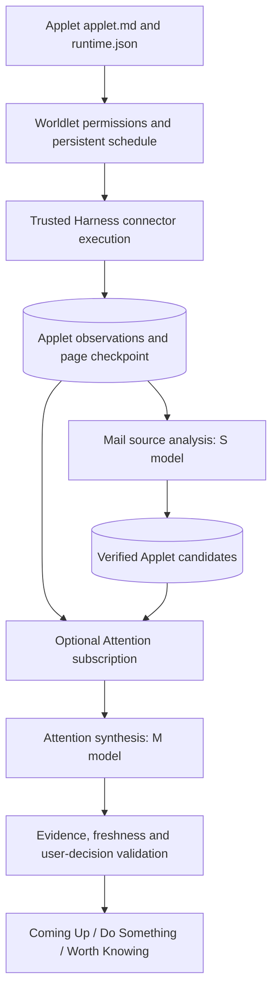
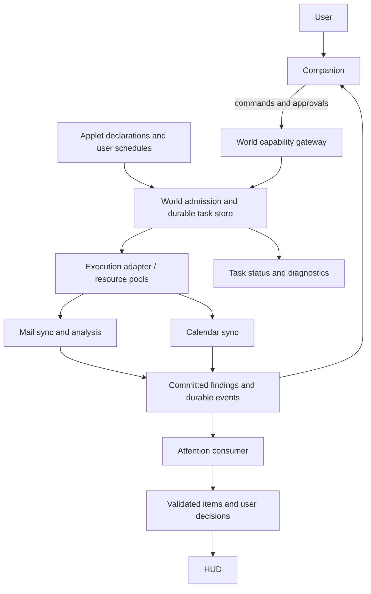
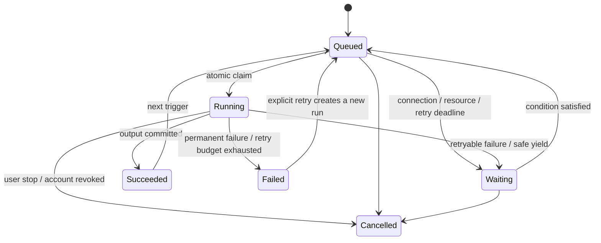

# Autonomous Applet runtime

An Applet is a device with a declared lifecycle, not a view that starts working only when opened. The **Attention Center** is an optional consumer of Applet output. It is not the scheduler. Fox is the conversational companion; background work does not replace Fox's current dialogue.

## Ownership

| Component | Owns |
| --- | --- |
| Applet package | Identity, declared reader, interval, source coverage, output policy, indicator behavior |
| Worldlet host | Consent, connection ownership, lifecycle clock, durable checkpoints, retry and pause policy |
| Harness (currently Hermes) | Connector execution and isolated model calls; no authority to invent grants or user decisions |
| Attention Center | Cross-source interpretation, relevance, suppression and final visibility |
| Fox | Explain a result and execute the user's next action through existing permissions |

## Package contract

Every registered Applet has `ui/applets/<key>/applet.md` and `runtime.json`. Build validation rejects missing descriptions, invalid schedules, duplicate scheduled providers and mismatched identities. The build emits `applet-runtime.json` plus packaged descriptions. Markdown is documentation, not a prompt granting arbitrary code execution.

`runtime.json` selects `scheduled`, `observation`, `on-demand` or `website`. Scheduled Applets require a trusted reader, provider, interval, bounded page size and analysis policy. `publishAttention` is independent of scheduling. Existing `AppletDefinition.attention` describes the Center subscription and freshness. Removing that subscription does not disable collection or private Applet findings.

Connector scripts live in the trusted Harness and host adapters. Packages reference these adapters; downloaded arbitrary scripts are not executed. Adding a manifest does not magically implement a new connector. Most website Applets remain on-demand browser devices with no background scraping.

## Current execution

The Electron host runs this pipeline on every OS (`platform/electron/src/modules/attention/`, with scheduling rules in shared Core). Measurements and device acceptance recorded in this document came from the retired native Mac host unless stated otherwise; Electron device acceptance is pending.

| Applet | Collection | Analysis/output |
| --- | --- | --- |
| Mail | Gmail REST API with existing OAuth grant. Initial scan lists up to 1,000 messages, starting with five messages for an earlier first result, then 20 per page, excluding spam/trash. Thread context is deduplicated per page, limited to eight latest messages and a 12,000-character normalized excerpt. Later scans overlap the previous successful start by one day. | S analyzes up to 20 changed threads per pass. Exact evidence is validated. Candidates are staged until the pass succeeds, then stored privately and submitted to the Center. M alone publishes automatic Attention items. |
| Calendar | Google Calendar REST API: primary calendar, next 30 days, stable window and page tokens, 20 events/page, initial cap 1,000. EventKit remains available for native Calendar. | Scripts exclude cancelled/ended records; S extracts candidates with exact start/end/timezone evidence before Center publication. M writes the user-facing brief; model-invented times are replaced by source times. |
| Notes / Reminders / Notion | Existing authorized native/source readers and their existing bounded scopes. | Structured observations submitted to the Center; Notion index titles are not treated as page contents. |
| Weather | Existing weather cache observation, not another polling timer. | Current observation, never an invented forecast. |
| Other devices | Website or on-demand adapter. | No simulated autonomous checks. Future jobs need an implemented trusted reader. |

The app-lifecycle clock targets the next source due time with a 5–60 second bounded delay. Due sources are selected oldest-first. A remaining page or analysis backlog schedules another run on the next tick; normal completed scans return to their declared interval (currently 30 minutes). Reserved source-I/O, analysis and Center lanes progress during foreground conversation; ordinary shared-lane work still yields to foreground commands. Onboarding merely requests the same jobs after connection; there is no separate first-Mail model scan. Mail collection commits its page and requests an independent analysis task rather than awaiting the model. Analysis resumes pending observations on startup or the recovery tick, and pauses new reads at 100 pending records to avoid an unbounded backlog. Committing registered observations wakes the Center consumer after a 200 ms coalescing delay. Persisted fact revisions versus the Center’s acknowledged revisions form the durable pending queue: duplicate submissions do not rerun analysis, failed passes leave revisions pending, and submissions during an active pass are consumed later. The consumer retries admission when the shared background lane is busy and schedules consumption at the existing cooldown/backoff deadline. Startup resumes pending work; the minute clock is a recovery fallback, not the normal publication trigger. The scheduler also attempts Center synthesis immediately after a source check, subject to its existing cooldown and budget. Onboarding requests Center processing after Calendar collection without awaiting that model pass before Mail collection. Each successful page can produce attention before the initial 1,000-message pass completes. Mail source analysis uses only the already-collected context and candidate submission tools; it does not reread remote sources. This reduces first-result latency without treating an empty or unverified finding as useful Attention.

The current implementation runs while Worldlet is running and the computer is awake, including when the world is not visible. Quit stops it; this is **not** an installed OS daemon or a guarantee of work during sleep. The host uses separate collection, analysis and Center checkpoints; remaining Core-usage gaps are in the [parity ratchet](../../contracts/README.md#parity-vectors). The [Attention job protocol](../../contracts/HARNESS.md#bundled-attention-extension) specifies the bundled Harness extension, not a second claim authority.

## Durability and failure

- `applet-observations`: up to 1,000 normalized records per provider.
- `applet-cursors`: paging/query/window, coverage and last successful collection checkpoint.
- `applet-findings`: verified source candidates and hashes of successfully analyzed records.
- Existing `checks` / `runs`: enabled state, schedule, outcome and retry timing.
- These live in the private Worldlet ledger, outside the package/repository. Replacement does not append full mail bodies to history.
- A collection checkpoint commits before model analysis. Model failure does not discard the fetched page; analysis hashes advance only after successful completion.
- Failed/partial reads do not mean an empty inbox. Transient failure retries with bounded backoff. Disconnect, reset and reauthorization clear Applet state; in-flight results recheck consent/connection epoch.
- User completion/dismissal stays in the Center's item store and survives new wording or repeated reads.

Coverage is bounded. The Center's working set and daily synthesis budget are separately bounded; scanning 1,000 messages does not promise 1,000 displayed items or exhaustive discovery. Time-overlap polling is not Gmail History API synchronization: old changes without a new message may require an explicit reread. Source-grounded model output can still be semantically wrong; exact quotes are necessary evidence, not a guarantee of usefulness.

## Status and presentation

All Applets inherit this indicator contract; individual descriptions contain only provider-specific differences. Device lamps show dark (disconnected or no known content), steady white (ready), deeply breathing white with a Running label (observed processing) and red (failure). Yellow and green are not used: saved findings, read or unread, leave the lamp white and appear only in the Attention Center, never as a notice above the device. Reduced motion uses steady white with a Running text label. Red always has a visible exclamation, a non-color explanation and a keyboard-accessible action to check the connection or inspect a failed run/status. If an embedding surface cannot offer the action, the lamp stays white while retaining its underlying state. Peek, Open, Focus and device artwork copies share this presentation; runtime failures never manufacture Attention findings. Paused jobs retain content without pretending to work. UI navigation is not a prerequisite for running a job.

Attention Center has exactly **Coming Up**, **Do Something** and **Worth Knowing**. Connection, loading, failure and retry messages are Applet runtime status, never synthetic Attention items. Empty groups remain quiet. Diagnostics record run/provider/status/count, not message bodies or credentials.

Website/on-demand modes have no automatic Attention producer. Scheduled output
persists source identity, exact evidence, revision and observation time before
notifying an optional subscriber. Never invent findings, treat a failed scan as
empty or infer completion from missing records. User decisions survive refresh.
Credentials and personal records stay outside Applet packages. Source content is
untrusted data; external writes retain normal approvals. Reset, disconnect and
account switching invalidate in-flight results. Quitting stops jobs; no OS daemon
is implied. Retry transient failures while retaining records; reconnect only for
authentication failures. Pausing retains checkpoints without simulated work.

## Verification

`node scripts/applet-runtime-check.ts` covers catalog manifests, bounded 1,000-message pagination, restart, optional subscription and stable Calendar windows. `python3 scripts/gmail-payload-check.py` covers message/thread pagination and Calendar decline/time normalization. `npm run test:electron` (module `attention`) runs page collection, the Applet analysis lane, Center synthesis and settlement with a scripted Agent and no accounts or live model calls. The native `--world-interaction-check` cases for staged candidate failure, durable analysis checkpoint and deletion are not yet ported to Electron. Existing Center tests cover evidence, user decisions, expiry and budget. These fixtures do not claim real-account model quality.

## Task-manager model

A stable `taskId` identifies the recurring responsibility (`applet:gmail`, `applet:google-calendar`, `attention:center`). Each execution gets a unique run ID with start/end timestamps and `running`, `complete`, `error` or `cancelled` state in `runs`. Applet `checks` carry enabled state and next due time; Attention's budget carries its own next due time, current run ID and outcome. Mac collection, source analysis and Center synthesis now have separate execution guards; source analysis uses its own resident Harness scope. Foreground work has priority. Mac source reads now use a bounded two-reader pool with per-provider exclusion and separate read workers; external-adapter execution concurrency still depends on its implementation. This is cooperative scheduling of jobs, not a new operating-system process per Applet.

On restart, abandoned running jobs are marked interrupted and enabled source checks retry within a minute instead of waiting a full normal interval. An interrupted Attention pass also retries after a minute without acknowledging unprocessed source revisions. Disabled checks stay disabled. Existing Harness request deadlines bound stalled calls. These safeguards are independently testable; successful offline recovery fixtures do not establish continuous real-account reliability.

`python scripts/applet-source-boundary-check.py` (with the Hermes Python dependencies) validates the actual shared runtime plans through the production World-service schema and source-receipt callbacks. This catches mismatches between scheduler arguments and the connector gateway before any account is contacted.

### Reliability boundaries

Background Harness attempts have a hard execution deadline as well as an idle timeout: ongoing output cannot hold the lane indefinitely (source World tools: 240 seconds; monitor analysis/synthesis: 600 seconds). Timeout terminates the worker and preserves source checkpoints for retry. Foreground conversations retain their idle timeout behavior. Source runs also check the world epoch before saving final scheduling state; a reset or reauthorization cannot be overwritten by an obsolete run.

Background model work stops while the person is away (#1650). The host reports seconds since the last input on the computer (system-wide, not only in Worldlet) or on an open paired phone (`userActivity` service); after `BACKGROUND_IDLE_SECONDS` (15 minutes) Core `userIdle` holds scheduled source checks and Applet analysis, and `admitBackgroundWork` refuses Center synthesis. The lifecycle clock then looks every minute, and the first input brings one catch-up pass over everything that became due. A check the person asks for still runs, and pending revisions stay durable. A host that cannot report idle time counts as active. User-created routines are not gated.

Use independent evidence for collection, analysis and publication: a page cursor proves collection, an Applet finding proves completed analysis, and a Center item proves publication. A successful read or green build alone does not prove useful Attention. Dev rebuilds deliberately restart the process and can interrupt analysis; continuous live acceptance must allow a complete run without another rebuild.

## Target design: World runtime and autonomous services

**Design status: specified, not fully implemented.** The sections above describe the current runtime. The design below is the implementation target for the host on every OS. It preserves the five-layer boundary: shared Core owns product scheduling rules; the host owns durable storage, permissions and its awake clock; the selected Harness claims and executes admitted jobs through a contract. There must be one claim authority, not competing World and Harness schedulers. An OS-like runtime does not mean a new operating system, an independent process per Applet, or another general-purpose Agent planning loop.

### Four responsibilities

| Component | Owns | Must not own |
| --- | --- | --- |
| Applet | Source-specific collection, interpretation, private checkpoints, findings, declared commands and visible device state | Global relevance ranking, another Applet's private state or undeclared timers |
| World runtime | Capability registry, task admission, priority, resource pools, durable delivery, cancellation, recovery and task inspection | Email semantics or model-generated product decisions |
| Attention Center | Subscriptions, cross-source interpretation, deduplication, ranking, freshness, user suppression and the three display sections | Triggering another Applet's collection or holding its cursor hostage |
| Companion | User intent, current context, explanations, authorized command submission and progress subscription | A second synchronization pipeline, direct database mutation or bypassing confirmations |

Attention is a built-in service using the same runtime as Applets. Disabling its subscription must not stop an Applet. Hiding a device, changing regions or closing its view must not stop an enabled task. Disconnecting its account must stop affected tasks. A website-only Applet has commands but no invented background worker.

### Applet package contract

Keep `applet.md` readable documentation; machine-executable declarations belong in a versioned runtime manifest. Introduce a version-2 manifest during implementation, with an explicit adapter for existing version-1 packages. A file cannot grant itself permissions or load arbitrary code.

| Declaration | Required meaning |
| --- | --- |
| Identity | Stable Applet ID and package version, independent of display name, region and artwork |
| Tasks | Stable task key, trusted handler ID, triggers, input/output schema versions, pool and batch limit |
| Triggers | Account connected, interval, source changed, explicit refresh or subscribed event; one owner for each trigger |
| Capabilities | Exact read/write scopes and connection requirements; request permission separately from installation |
| Commands | Named operations such as `mail.open`, `mail.replyDraft`, `browser.open`; typed input, risk, cancellation and result semantics |
| Output | Published event types, finding schema, evidence and expiry requirements |
| Runtime policy | Timeout, retry class, concurrency key, priority class and resource budget, bounded by World policy |
| Presentation | Ready/working/unread/paused/needs-connection/failure projection and available recovery actions |

Mail declares separate `sync` and `analyze` tasks; Calendar also declares separate `sync` and `analyze` tasks; Attention declares `consume` and `expire`. A task may be deterministic code, an authorized connector call or a model call. Every Applet need not use a model. Additional accounts become separate instances: `instanceId = appletId + connectionId`; filenames and UI labels are not instance identity. The current provider-only records support a single connection and require migration before multi-account support is claimed.

### Task and run contract

A **task** is a persistent responsibility. A **run** is one attempt to execute it. Scheduling the same responsibility repeatedly must not overwrite its previous attempts.

| Record | Minimum fields |
| --- | --- |
| Task | `taskId`, `ownerId`, `connectionId`, `handler`, `enabled`, `triggers`, `nextDueAt`, `priority`, `pool`, `concurrencyKey`, `policyVersion` |
| Run | `runId`, `taskId`, `inputRevision`, `status`, `waitReason`, `attempt`, `createdAt`, `startedAt`, `heartbeatAt`, `deadlineAt`, `finishedAt`, `errorCode`, `traceId` |
| Claim | `runId`, `executorId`, `leaseUntil`, monotonic `fencingToken` |
| Checkpoint | Owner, account generation, source cursor/revision, successfully processed revision and bounded coverage |

The diagram describes a task’s execution lifecycle; individual run attempts retain terminal history.

Each retry creates a new run attempt linked to the responsibility; it does not erase the failed attempt. On retryable failure or safe yield, finish the current run with its outcome/checkpoint and place the task in waiting; only a new admitted attempt returns it to running. A task may be paused while its last run remains succeeded or failed. `waiting` is not a red failure lamp. Separate `waitReason` values include `resource`, `network`, `rate_limit`, `model_budget`, `authorization`, `approval` and `retry_at`.

The claim and ready-to-running transition are atomic. Every output commit validates the claim token and account generation. A late worker cannot overwrite a newer run, resurrect a reset account or acknowledge another run's work. Heartbeat loss or lease expiry makes the run recoverable; it does not prove that an external write did not happen.

### Scheduling and resource isolation

World owns policy and durable tasks. A Harness adapter requests admissible work, receives a lease, executes a bounded handler and returns a structured result. Host clock/timer mechanics may differ; policy and state transitions belong in shared Core. Unsupported execution capabilities surface as unavailable, not silent fallback to general tools.

Initial resource defaults, to be tuned with measurements:

| Pool | Initial concurrency | Policy |
| --- | --- | --- |
| Source I/O | 2 overall, 1 per account/source | Calendar and Mail can fetch independently; model waits do not hold this pool |
| Source analysis | 1 per source | Small bounded batches, persisted input/output, S by default; each source has its own worker so Mail cannot queue Calendar |
| Attention synthesis | 1 | Independent execution context, M by default; must not share the source-analysis resident worker queue |
| Interactive Agent | 1 conversation | Reserved capacity for the user's command; foreground work is not queued behind an entire scan |
| Browser control | 1 per browser session | Read and write operations serialized against the same page/session |

Use separate execution scopes/workers where the existing transport is serial. Merely adding host tasks around the same Hermes worker does not provide isolation. A Harness unable to expose separate lanes must report that capability limitation; the UI must not claim parallel execution.

Give explicit user commands highest priority, then newly published Attention and initial connected-source work, then normal refresh, then history backfill. Use bounded batches and aging so continuous interaction cannot starve background work indefinitely. Coalesce overlapping refresh triggers per concurrency key; never run two syncs that advance the same cursor. A collection job releases its I/O claim before an analysis job waits for model capacity.

A timer should target the next due job; the minute sweep repairs missed wakeups. After sleep, coalesce missed polls into one catch-up read per source, with jitter and provider rate limits. Do not replay every missed interval. Included-model budgets, provider rate limits and concurrency limits are distinct controls; expose their distinct waiting reasons. Keep the current budget until measured changes are approved, but make its exhaustion visible rather than an unexplained empty panel.

### Durable event delivery

Registration declares an output and subscription. Publication delivers a real versioned change. Neither alone is sufficient.

An event carries `eventId`, `type`, `schemaVersion`, `ownerId`, `connectionId`, `accountGeneration`, `entityId`, `entityRevision`, `occurredAt`, `expiresAt`, `payloadRef` and `traceId`. Payload references point to immutable or retained source revisions; an in-flight consumer must not read an unrelated newer body under the same reference. Do not put full mail bodies or credentials in event logs.

Use a transactional outbox in the World-owned SQLite database:

1. Producer commits its findings/checkpoint and outgoing event in one transaction.
2. Dispatcher records a delivery for each matching authorized subscriber and wakes it.
3. Consumer claims a bounded delivery batch and validates current permissions, source revision and expiry.
4. Consumer commits its derived records and delivery acknowledgements in one transaction.
5. Failed or interrupted delivery remains pending; retries reuse the same event identity.

Delivery is **at least once**. Unique `(consumerId,eventId)` receipts and deterministic item identities prevent duplicated effects. Coalesce unconsumed superseded updates for the same entity, but retain cancellation/deletion semantics and required evidence. Acknowledging a successful model call without durable valid output is forbidden. A valid empty result can acknowledge the examined inputs.

Enforce bounded batches and queue depth. Under pressure, reduce backfill and collapse superseded updates; never silently discard current unresolved findings. Quarantine repeatedly failing deliveries with a typed reason and an explicit retry operation, so one malformed item cannot block the consumer indefinitely. Keep payload revisions until deliveries are acknowledged or expired; retention and account deletion then remove them. Disconnect/reset cancels old-generation deliveries and invalidates derived visibility.

### Attention service contract

Applet outputs describe **findings**, not final HUD cards. A finding contains a stable identity, source references and exact evidence, proposed category, relevant dates, expiry, uncertainty and candidate commands. Producers cannot force rank, invent an authorized action, or clear user decisions.

The Center performs:

1. Deterministic admission: permission, source revision, schema, freshness and duplicates.
2. Bounded interpretation: M weighs the finding with related context and durable user feedback. It need not rescan original services.
3. Validation: evidence, dates, action availability and continuity with existing items.
4. Atomic publication and receipt: save usable output as it becomes available; leave failed inputs pending.
5. Independent expiry: hide invalid/expired findings even when models are unavailable.

Only **Coming Up**, **Do Something** and **Worth Knowing** are display categories. Errors, connection requests and processing notices belong to runtime state. Each card should answer what happened, why it matters and what the user can do. Final display copy continues to follow the existing model-written Title/Reason/Summary contract; this design does not introduce raw Calendar titles as a second publication path.

A source update may revise an item, but must preserve dismissal, completion and snooze. New wording is not a new identity. An actual new obligation or event recurrence can be a new item when its evidence establishes that distinction. Evidence validation alone does not establish usefulness: evaluate stale obligations, newsletters, duplicates, resolved threads, recurrence and misleading refund suggestions separately.

### Companion and command execution

Companion discovers available commands from the same capability registry used by Applets. A command creates a trackable operation rather than an unrecorded side effect in a conversation. Return an operation ID promptly; stream progress separately from final dialogue. Navigation, inspection and draft creation can run under existing grants. Sending, purchasing, cancelling or other consequential actions follow their existing approval policy.

Every action has a business idempotency key where the provider supports it. If a write times out after submission, mark its result `unknown` and reconcile against the provider before retrying. Never automatically resend an email or purchase because the worker lease expired. Cross-Applet workflows persist step results and resume from the last verified step. There is no claim of a distributed transaction: compensation is explicit and requires appropriate authorization.

The Companion can answer “What is Mail doing?” from task state, not model guesses. Clicking an Attention item passes its item/source/operation references into context. Applet progress must not replace the last readable Fox dialogue. The name-badge subtitle remains context; the lower status surface shows execution progress.

### Storage, lifecycle and task inspection

World owns storage by business domain, following [World storage](../items/STORAGE.md); an Applet owns a logical namespace rather than a separate physical database. Proposed task, claim, outbox and delivery tables can be added to the existing SQLite database. Credentials stay in credential storage and are referenced by connection ID. Grants are checked at execution and again at commit.

Installation registers capabilities. Activation and connection enable declared jobs; opening a view is unnecessary. Pause stops new claims without deleting content. Uninstall disables tasks/subscriptions and offers the existing explicit content-retention choice. Revocation and reset cancel claims, invalidate pending deliveries and clear the appropriate private scope. OS process isolation for arbitrary third-party code is outside this first version; only trusted handlers run.

The first task inspector is an internal Settings/debug surface, not extra permanent HUD chrome. Show owner, task, current stage, waiting reason, last success, next attempt, counts/coverage and correlated run/event IDs. Provide pause, resume and safe retry; show redacted diagnostics. Record collection-to-finding and finding-to-visible latency separately so model cost is not confused with scheduler delay.

This design promises background work while Worldlet is running and the computer is awake. A separate signed background helper is a later deployment choice, with explicit user controls. No work during quit/sleep is promised without that implementation.

### End-to-end Mail and Calendar example

| Trigger | Mail | Calendar | Center / Companion |
| --- | --- | --- | --- |
| Google connected | Queue initial sync immediately | Queue initial sync independently | User can select Applets while work starts |
| First source page saved | Queue analysis; continue bounded collection when capacity allows | Queue independent S extraction | Center consumes completed batches from either Applet |
| First Mail analysis saved | Publish verified findings | Normal independent schedule | Center wakes and publishes validated results incrementally |
| User opens a result | Original source remains available | Unaffected | Fox explains and submits the selected command |
| Model failure | Keep collected mail and pending analysis | Continue source I/O | Preserve prior valid items, show runtime retry reason |
| App relaunch | Resume from checkpoint | Catch up changes | Recover unacknowledged delivery; preserve user decisions |

Onboarding uses these ordinary triggers. It must not own another Mail scan, wait for all history, or manufacture a finding to fill the Center.

### Closeout checkpoint — 2026-09-27

The Mac Applet → World scheduler → Attention registration pipeline is implemented and integrated into local main. Applets have runtime declarations; scheduled source collection and analysis run independently of the foreground, with durable claims, checkpoints, retries, bounded inputs, and recovery. Attention consumes registered revisions progressively and preserves source evidence and user decisions. Companion has shared commands and tracked write receipts.

Live development-profile inspection after the whole-record input budget change observed 11 consecutive completed Mail analysis runs, all `succeeded`, taking 16.3–50.9 seconds each. Versioned analyzed records reached 178 of 452 cached records. The 57 irrelevant removed-source deliveries were drained; the later snapshot had 80 acknowledged deliveries and 6 pending current deliveries. Earlier validation found 16 open Mail findings with current dependencies and complete title/reason/summary fields. These are aggregate local observations, not a mailbox-quality evaluation or a latency guarantee. No personal content is included here.

Focused shared checks, Mac builds, source/Attention pipeline fixtures, restart/revision fencing checks, and Hermes tool-registry tests passed for the delivered changes. Live restart recovery was observed. Avoid restarting repeatedly to measure throughput; development rebuilds interrupt otherwise healthy runs.

**Not accepted as complete:** the initial mailbox backfill was still running; fresh-account onboarding, representative finding quality, sleep/wake and long-running device reliability, Windows parity, per-account task identity, arbitrary subscriber execution, and generic durable multi-step workflows remain unverified or incomplete. This checkpoint closes the current delivery slice, not the full architecture objective. The next acceptance run should finish the backfill and observe a subsequent source refresh without unrelated rebuilds before claiming reliable continuous operation.

### Current acceptance snapshot

This snapshot distinguishes implementation from acceptance; historical progress notes below are not additive completion claims.

| Requirement | Current evidence | Remaining boundary |
| --- | --- | --- |
| Autonomous Applets and optional Center | Mac `autonomousPipelineChecks` starts only the scheduler; enabled/disabled Center cases pass | Real accounts, long-running lifecycle and Electron acceptance on each OS |
| Separate resource lanes | Shared admission checks and Mac blocked-reader/analyst fixtures | Packaged Hermes foreground concurrency under load |
| Durable publication and coverage | Transaction rollback, revision fencing, partial receipt/reopen fixtures | General typed events and arbitrary consumer executors |
| Pause and resume | Configure-command fixtures reject old writers before and after resume | Host cancellation timing and sleep/wake device acceptance |
| Applet package declarations | All catalog manifests validate; stages, batches, intervals and deadlines drive execution | Full capability/output/trigger declarations and per-account instances |
| Companion commands | Shared discovery and reviewed Mail/Notion/browser operation receipts | General asynchronous commands and durable multi-step workflow execution |
| Diagnostics | Backlog, task control, delivery age and per-stage execution duration | Measured first-use latency, rendering acceptance and representative mailbox quality |
| Migration and portability | Legacy-compatible normalization and retained checkpoints | Versioned rollback exercise and Electron lifecycle acceptance on each OS |

### Current implementation gap and rollout

Baseline inspected for this design: `f7686e54`. Source of truth was `core/applets/runtime.ts`, `core/tasks/`, `core/attention/attention-center.ts`, the native Mac host's runtime, Attention Center, World interaction and Hermes worker, and [Attention jobs](../../contracts/HARNESS.md#bundled-attention-extension) for the Harness path. Their Electron owners are `platform/electron/src/modules/attention/center.ts`, `modules/attention/tools.ts` and `modules/agent-runtime/hermes-worker.ts`.

| Phase | Existing foundation | Required implementation and exit evidence |
| --- | --- | --- |
| 1. Common task contract | Stable task/run IDs, check records, retry and deadlines | Shared task/run/claim state machine with account fencing; fake-clock fixtures prove pause, expiry, cancellation and late-result rejection |
| 2. Split jobs and pools | Separate source-read and model entry points, but one Mac background lane | Split sync/analysis jobs and separate Center execution scope; blocked Mail analysis must not delay Calendar collection, Center output or foreground admission |
| 3. Durable subscriptions | Registered providers, persistent facts/seen revisions, event-triggered wake | Transactional outbox and per-consumer receipts; crash injection at every producer/consumer commit boundary proves no lost or duplicate output |
| 4. Center and command integration | Evidence validation, suppression, existing tool gateway | Center consumes deliveries through common jobs; commands carry operation IDs and write-reconciliation semantics; stale/duplicate/dismissed inputs cannot reopen items |
| 5. Diagnostics and rollout | Logs, lamps, runs | Internal inspector, latency measurements, migration and actual device acceptance on each OS; retain explicit platform gaps until passed |

Do not build another scheduler alongside the existing one. Migrate one owner at a time behind the same contracts. Import existing checks/cursors/decisions without resetting accounts; turn off the old trigger when its replacement becomes authoritative. Enable a new read-only worker only after verifying no duplicate claims. A rollback may resume the old reader from committed checkpoints, but must not replay completed external writes. Version the migration and keep source/user decisions intact. Never run both publication paths as writers; shadow comparisons, if used, are read-only.

### Acceptance matrix

These are implementation gates, not claims that the design document itself passes them. Use fictional connectors/models and a deterministic clock for failure fixtures; use live accounts only for separately authorized acceptance.

| Scenario | Required observable result |
| --- | --- |
| Applet view never opened | Authorized enabled jobs run; source data and findings persist |
| Attention disabled | Mail continues collecting/analyzing; no Center model calls |
| Mail model stalls | Calendar sync and a Center job with available findings make progress independently; foreground commands are admitted |
| New finding submitted | With resources available, consumer dispatch starts within 1 second after bounded coalescing; no minute-tick dependency |
| Valid output committed | HUD projection updates within 1 second under normal local load; model completion latency measured separately |
| Duplicate event or repeated poll | One logical item/effect, no repeated user notification |
| Crash before/after publication or acknowledgement | Committed work resumes; uncommitted work retries; no premature acknowledgement |
| Lease expiry / late worker / account reset | Old token or generation cannot commit or recreate content |
| Offline / rate limit / allowance exhausted | Distinct waiting reason and retry condition; no silent empty-success result |
| Slow/poison item | Bounded attempts; other valid deliveries continue |
| Source cancellation / changed recurrence | Correct update/invalidation; user dismissal/completion preserved |
| External write response lost | Unknown outcome reconciled before retry; no blind duplicate send/purchase |
| Sleep and wake | One catch-up run per source; no burst of every missed interval |
| Migration and rollback | No lost user decisions or cursors, no duplicate active scheduler |
| Every desktop OS | Same shared transition fixtures plus host lifecycle tests on each; compile-only does not establish parity |

Performance thresholds above cover local dispatch and rendering, not provider/model response time. Measure time to first useful Attention across representative mailboxes and network conditions before setting a user-facing latency promise. A legitimately quiet account may produce no Attention; the inspector must still prove what was read and processed.

### Bounded model-readable monitor context

Live Center traces showed roughly 160,000-character query replies being replaced by Hermes persisted-output previews of roughly 2,000 characters. The isolated monitor intentionally lacks `read_file`, so repeated queries could not recover the evidence. The monitor adapter now exposes `contextPage` / `nextContextPage`, returns whole records under 24,000 characters per page, and retains a stable snapshot until page zero is requested again. Prior decisions, candidate hints and source records are retained across pages; unrelated runtime diagnostics are excluded. No general file tool or permission is added. Oversized indivisible records fail explicitly instead of silently truncating evidence. The offline check exercises the installed Hermes spillover boundary; live acceptance remains separate.

## Implementation history

Completed step-by-step changes and their focused checks remain in Git history. Use current source/tests for exact behavior; retained design targets do not certify multi-account or real-provider acceptance.

### Package admission checks

The shared loader rejects unknown fields, unsupported versions, malformed identities,
and unimplemented task handlers. Website/on-demand declarations cannot silently opt
into scheduling or Attention publication. Descriptions document behavior; they do not
grant execution permissions. `scripts/applet-package-check.ts` builds every catalog
package and checks its description, launch command, normalized host registry and
scheduled-reader admission. It runs in `npm run test:attention`. Passing package
admission does not establish connector availability or real-account acceptance.
