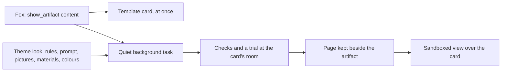

# Artifacts

An **artifact** is a card Fox puts in front of the person: an information card, in practice a small HTML page (owner decisions 2026-10-05 and 2026-10-06). An Attention card is one kind. A table, plan, comparison or chart that Fox lays out in conversation is another. They share one structure, a size, and a place where the person finds them all again.

An Applet is a place the person goes back to. An artifact is a thing Fox shows. Artifacts come from a source Applet (Attention), from the conversation, or, later, from asking Fox to make something; an interactive one the person keeps becomes an Applet. The design page is [Artifact 和 Applet](https://claude.ai/artifact/NefchueyCauWMSjRbjeBN5).

## Structure

Every artifact has the same parts:

- **Head**: where it came from (an Attention category such as "Coming Up", or "From this conversation"), the title, and for Attention its illustration.
- **Facts**: time, place, related items. The Attention card's time and venue line.
- **Body**: Markdown with tables, and an optional bar chart of up to eight nonnegative values Fox verified.
- **Sources**: the original mail, page or conversation.
- **Actions**: owned by the host, by kind. Attention has Done, Dismiss and Later; an answer has the next steps Fox offered (see [Actions](#actions)); every artifact has its size control and ×.
- **Fox's line** stays in Fox's bubble, never on the card.

## One card

An artifact is one card at most (owner Order 2026-10-07): what Fox shows fits its card, the size of a large card on the main stage, with no second page. Fox writes to fit rather than Worldlet cutting afterwards:

- Every request for an artifact (`show_artifact`, the day's plan and summary, a theme, a meeting's summary) carries the one-card rule (`ARTIFACT_ONE_CARD_RULE`): the takeaway in one or two lines, then at most three short parts under bold labels or one table of up to six rows and four short columns; about 900 characters for medium and 1,800 for large, a Chinese, Japanese or Korean character counting two.
- `show_artifact` refuses a body or detail past the large card (`artifactFitProblem`, weighed by `artifactWeight`: wide characters two, each line or table row twenty, link targets nothing, a chart forty a bar) and tells Fox how much to cut, so Fox shortens it and shows it again. Artifacts kept before this rule open as they were.

## Fits its card

An artifact never scrolls (owner Order 2026-10-09): how much it shows follows the size of its card, down to one sentence on the smallest. This replaces the 10-07 rule that a longer body scrolls inside the card. Fox writes the answer at three lengths, and the card shows as much as its size holds:

- **Brief**: `brief`, the whole answer in one sentence (up to 160 characters, no Markdown). Without one (an Attention card, an artifact kept earlier) the card uses the body's first sentence (`artifactBrief`).
- **Body**: `body`, as before.
- **Detail**: `detail`, optional, a fuller body in the same layout for a card with room to spare, within the same one-card budget.
- **Blocks** come most important first: a smaller card leaves out the last ones.

The card tries these steps, fullest first, and keeps the first that fits its room without overflowing (`artifactFitSteps`, drawn by `ui/artifacts/artifact-fit.ts`): the detail with everything, the body with every block, the body leaving out the last blocks one at a time, the body without its chart, then the brief alone. One rule for the World card, the corner card over an Applet and the Journal's cards. When the card's room changes (its size control, a window resize, Fox moving aside) it picks again at once; no model is asked. When something is left out, the World card shows **Show all**, which makes it large (kept as its size); in an Applet's corner, which has no size control, Show all lets the card reach down Fox's column and **Show less** gives the room back. A Journal card says **More** and opens in the World. What the person ticks or sets on a block stays with the artifact, including blocks a smaller card left out.
- They share one style, the Attention card's: its paper, title, accent labels; a heading of any level in the body reads as the accent label, and tables, lists and links use the same ink. The Attention card is the design system (owner Order 2026-10-08: "artifact一定一定一定要统一设计system，attention card就是我们标准的design system"): everything drawn on an artifact, its chart and [blocks](#blocks) included, uses its accent, ink, rules and outline or filled buttons, and nothing brings a look of its own.

## Sizes

| Size | Where | Used for |
| --- | --- | --- |
| Small | Desktop, a short narrow card above Fox, who stays in the middle; one cell of a Journal page (owner decision 2026-10-07) | A few lines: a short answer, an Attention card or a page Fox made in the Journal |
| Medium | Desktop, a wide card above Fox, who stays in the middle; it grows with its content up to its cap; two cells side by side in the Journal | Explanations, a small table or chart, a meeting's summary, a theme |
| Large | Desktop, the main stage right of the Attention Center, with Fox and the conversation in the right-hand column as beside an Applet; two by two in the Journal | The day's plan and summary, anything with several parts |
| Phone | One column the width of the screen | Every card on the iPhone and Android |
| In an Applet | Desktop, it opens as a small card in the top-right corner at the head of Fox's column, so the Applet stays in view (owner Order 2026-10-07), whatever size Fox named. The same size control as in the World has three sizes there (owner Order 2026-10-09): small in the corner, medium down Fox's column to just above Fox's reply, large over the Applet, left of Fox's column. Show all grows it one size; the control steps up and, from large, back to small. It stays pinned there until its × (owner Order 2026-10-09): a click elsewhere in the Applet leaves it, while in the World such a click puts the card away into the Journal | Whatever Fox shows while the person is in an Applet |

Fox names the size with `show_artifact` (`small`, `medium`, `large`, or null). Without one, `defaultArtifactSize` picks from the content: a few lines are small, a table, a chart or more than a few lines medium, a body heavier than a medium card large. A named size is kept even when it is smaller than the content (`artifactSizeFor`): the card shows what fits it ([Fits its card](#fits-its-card)). The arrows beside × are one control for every card, in the World and over an Applet: they grow a card a step at a time and shrink a large one back to small (owner Order 2026-10-09), and the choice is kept with the artifact. Windows narrower than 1340px, and the onboarding tour, which seats Fox under the card it lights, keep Fox under a large card too ([Conversation](../../ui/companion/CONVERSATION.md)).

## Actions

An artifact can go beyond reading at four levels (owner decision 2026-10-06; blocks, owner Order 2026-10-08):

1. **Read only**: the body and its sources. The card never pages or scrolls: it shows the fullest version that fits ([Fits its card](#fits-its-card)).
2. **Blocks**: see [Blocks](#blocks).
3. **Next steps**: `show_artifact` takes up to three `actions`, each a short label and the request it stands for ("Book TAC" → "Book the TAC Security assessment"). They are buttons on the card. A click drafts the request in Fox's message bar, and it reaches Fox only when the person sends it, so Fox does it with its usual tools and confirmations. The card itself changes nothing in the World, and a card Fox made after reading an email or web page can never speak for the person: they see the words before they send them. The actions are kept with the artifact and come back when it is opened again.
4. **Interactive**: a page Fox makes for a moment ([Moment Applets](../artifacts/README.md)): checklists, guides, timers, with what the person ticks kept and synced with the phone. It runs sandboxed and never sees World data. It is already an Applet while its moment lasts, and **Keep it** keeps it for good. This is how an artifact becomes an Applet. A card from the conversation has no Keep as Applet on it (owner request 2026-10-07: set aside for now; if it comes back, the button stands beside Fox, not on the card).

## Blocks

An answer is drawn in the [card system](../../ui/artifacts/CARD-SYSTEM.md) (owner Orders 2026-10-08): `show_artifact` names its `tone` (moss, teal, honey, sage, clay or plum, by what it is about) and its `art` (a painted scene, `none`, or null for the card to choose), and under a short body it takes up to three **blocks**. These are Worldlet's own components, drawn by the host. Fox only fills them in, never with HTML; a [page](#theme-driven-artifacts) is laid out from the same content by a separate task:

| Block | What Fox gives | On the card |
| --- | --- | --- |
| `callout` | A label, one line, and a tone | The line that matters most, on the tone's wash |
| `stats` | A label and 2 to 4 figures, each a value, label and optional note | Figure tiles |
| `facts` | A label and up to 5 rows, each an icon (time, place, cost, person, link, note) and text | Icon rows like the Attention card's time and venue |
| `steps` | A label and 2 to 6 steps, each a title, optional detail and optional time | A numbered thread with times |
| `compare` | A label and 2 or 3 options, each a name, optional note, up to 3 points, and whether it is the pick (at most one) | Columns, the pick outlined and marked Recommended |
| `tags` | A label and up to 8 short labels | Chips |
| `checklist` | A label and up to 8 items | Items the person ticks, with a count; the ticks are kept |
| `scale` | A label, a unit, the base count with its min, max and step, and up to 8 amounts for the base | − and + set the count and every amount follows (`scaledAmount`); the count is kept |
| `choice` | A label and 2 to 4 options, each a label and request | Buttons that draft the request in Fox's message bar, as a next step does (owner Order 2026-10-08, after ChatGPT's Intelligent UI: "我们自己做一下") |
| `parts` | A label and 2 to 6 parts, each a name and a detail | One part's detail at a time; ← → move between them |

Optional texts are empty strings. Nothing on a block changes the World, and a choice reaches Fox only when the person sends it. Blocks count toward the one-card budget (`artifactWeight`, measured by the room each takes) and make a card at least medium when Fox names no size; Fox lists them most important first, since a smaller card leaves out the last ones. A block the card cannot draw is refused (`artifactInputProblem`) or, when stored, dropped (`readArtifactBlocks`). The tone, picture and blocks are kept with the artifact; the Journal shows them still, as the person left them, and opened again in the World they work again. Attention cards have none. Pages that need more than this (timers, maps, games) are still [Moment Applets](../artifacts/README.md).

## Theme-driven Artifacts

Owner decision 2026-10-10: the theme says how an Artifact looks, the host makes it, and there is one way to make every card: "现在的 html attention 模板算个特例 生成文字然后填进去 也是一样的逻辑". Fox writes the content, as above. The theme's look (`artifact` in its presentation, [Theme contract](../../resources/themes/CONTRACT.md#artifacts); the Village's is [its style pack](../../ui/theme-packages/village/assets/artifact/README.md)) then drives one of two modes (`core/artifacts/artifact-render.ts`):

| Mode | What makes the card | Used for |
| --- | --- | --- |
| Template | The host fills its own card, the [card system](../../ui/artifacts/CARD-SYSTEM.md), with the words Fox wrote. It shows at once | Attention cards, small cards, the corner card over an Applet, the Journal, the phone, the practice world, a theme without a look, an Agent that cannot work in the background, and every card until its page is ready |
| Page | The Agent writes the whole card as one HTML page from the same content, following the theme's rules, prompt, reference pictures and materials | An answer shown at medium or large size in the World |

**Making the page.** Once an answer at medium or large size is kept (the day's plan and summary too), the World asks for its page (`artifactPages` `make`), except where work Fox starts by itself waits (`backgroundBlocked`: the practice world, onboarding, the tour, the first run, automated browsers). Worldlet starts a quiet Applet task of its own (`ARTIFACT_PAGE_MAKER`, no device): untrusted like a game review, so its guarded writes are refused, and quiet, so it says nothing and its result never joins the conversation. The task reads `artifact/brief` (`read_artifact_brief`): the content exactly as Fox wrote it, the room (720 × 420 for medium, 940 × 680 for large), the theme's rules, prompt, picture roles, material ids and colours, and the host's rules: use the words as they are and add no facts; never scroll; draw no origin, size control, close button, Fox or World; one self-contained page with no network; materials only as `worldlet-material:<id>`; state in `localStorage`; and actions only through `window.worldlet.act(n)`. It sends the page with `artifact/page` (`save_artifact_page`). One page is written at a time (the newest card waiting goes next), at most 30 a day on the person's own model. The model sees the reference pictures' roles but not the pictures themselves until a Harness can take pictures as input.

**Checks.** The page must pass the offline rules every made page does (under 120 KB, no network, frames, forms, workers or navigation) and may name only the theme's materials. It is then shown out of sight at its room for a few seconds: it must load, draw, survive a click without a script error and fit without scrolling. Problems go back to the model, which fixes them and saves again. The kept document has the materials in place as data addresses.

**Showing it.** When the card on screen has a page, at medium or large size and not over an Applet, the page shows in a sandboxed view of its own over the card, below the card's row of controls (origin, size, ×), which stay the host's. The view is the made games' offline session: no network, no storage of its own, no navigation or windows, no WebRTC and no bridge. Its only channel is its console lines: what the person sets is kept with the page and comes back when it opens again; an action they click drafts Fox's own request for that action in the message bar, exactly as a next step does (a page can neither invent a request nor act without a click); and the room it needs, so a page taller than its card is scaled down (to half at most) rather than scrolled. Making the card small, opening an Applet or closing the card puts the template back.

**Kept.** The page is kept beside its artifact in `world.sqlite` (`artifact_pages`) and forgotten with it, at most 200 per World. The Journal and the phone show the template card.

## Kept in the World

Every artifact is kept in this World:

- `show_artifact` saves an **answer** artifact (`art-…`) with its Markdown, chart, size and the place Fox spoke in.
- A page about a theme of the person's brought conversations is an answer artifact too ([Themes](../tasks/README.md#themes)).
- A meeting's summary is an answer artifact too: when a Meetings transcript ends, the World asks Fox for it and Fox shows it with `show_artifact` ([Meetings](../../ui/applets/meetings/README.md#live-transcript)).
- Opening an Attention card saves an **attention** artifact (`attention-<item>`) with its title, category and summary. Opening the same item again updates the same artifact and moves it up; the World item stays the truth, and Done, Dismiss and Later still settle the item.

The **Journal** (owner decisions 2026-10-06: not an Applet; 2026-10-07: all the artifacts together are one journal, a page a day, in three sizes laid out nicely; 2026-10-08: it lives in the World's top-left corner, today's date, weather and sound at the head of the Attention Center, with no button beside Fox, hidden inside an Applet, and a skeuomorphic book in the World's country style) holds them all, one page a day (`journalPages`). It is a book that opens over the World (`ui/artifacts/journal-book.ts`): a timber-leather cover with gold stitching and brass corners, two ivory leaves with a faint dot grid meeting at the spine, a moss ribbon, day tabs on the fore-edge and a pressed sage sprig, all drawn in CSS and SVG; the cards on it keep the artifact card's style. A day's cards stand in time order on the left leaf, then the right, two columns each: a large card takes two by two cells, a medium one two side by side, a small one a single cell, and later small cards fill the gaps; a narrow window shows one leaf. A card the person closes in the World (×, Escape or a click outside) flies into the Journal in the top-left corner on its way out. The day's plan opens its page and its summary closes it, even when the summary was caught up the next morning; a card stands on the day it was made. Attention cards and pages Fox made are small; an answer keeps its own size. Each card keeps the card as it was shown (owner request 2026-10-08: "journal 里保留卡片"): its origin, time, title, body, tone, picture and blocks on the card's own paper, smaller; a card never scrolls in its cell but shows the fullest version the cell holds, marked More when shortened ([Fits its card](#fits-its-card)); a day with more than the book holds scrolls inside its right leaf, never in pages. ‹ › at the page corners and the day tabs (Today, Yesterday, then dates) turn the pages. Opening one closes the book and shows it again in the World: an Attention card opens on its item, with its outcomes, while the item is in the World, and otherwise as it was, marked "earlier". × forgets it.

Pages Fox made are listed from their own records in their `page` rows of the person's own Applets ([one table](../applets/MY-APPLETS.md#one-table); `madeArtifacts`), which the phone also syncs, rather than copied into `artifacts`: one whose moment lasts, or that was kept, opens as its Applet; one whose moment is over shows **Keep and open**, which keeps it (the moment Applet's own Keep it) and opens it. Deleting one stays in its Applet.

Fox finds earlier artifacts with `list_artifacts` (target `artifact/list`: every word of the query matches the title or text, newest first) and shows one again with `open_artifact` (`artifact/open`).

At most 500 are kept per World; the oldest past that are forgotten. The practice world keeps none.

## The day's plan and summary

Each day Fox makes two artifacts without being asked (owner request 2026-10-06), the way it makes a meeting's summary: the World asks Fox once, and Fox reads the World with its own tools and model (local Codex sign-in, the person's API key, or a local Agent) and shows one large artifact, kept like any other.

- **Plan · Tue, Oct 6**, the morning brief (owner Order 2026-10-07: "早报我觉得不要等用户开始用才开始生成…早上六点一个定时的任务"): made at 6 AM local time by itself, before the person sits down, with the window hidden or an Applet open. A computer asleep at 6 makes it when it wakes, and Worldlet closed at 6 makes it when it opens, until noon; a day reached after noon gets no brief (a "Good morning" plan at 6:38 PM, owner Order 2026-10-07). It is made for someone who used Worldlet in the last three days, so an abandoned install spends nothing. Fox reads today's Calendar and due reminders, the open Attention items, yesterday's summary for what was left open, and, when the list asks what was done overnight, the World's history from 6 PM the evening before until now (`read_world_history`: what Agents, background work and routines finished, what arrived), and lays out on one card what kind of day it is and then each part the person asked for.
- **What the brief holds** is the person's own list, one part a line: *Morning brief* in the Journal's head shows and saves it, and Fox saves it when they ask ("早报加上 X 上的 AI 新闻", `set_worldlet_preference` `morning_brief`, only on the person's own words that turn). The default is what was done overnight, today's schedule (owner Order 2026-10-08: "早报里面就说今天的安排就行了，昨天夜里做了什么、今天的安排") and *Replies ready for my mail*: owner decision 2026-10-09, Fox keeps working without being asked and the person only approves, so the brief also brings what Fox prepared, waiting for approval. The person can drop that line or add others, such as the three things that matter most.
- **Reply drafts**: when the list asks for mail (the default does), Fox reads the last two days of the inbox, picks the messages a person wrote that wait for an answer (at most five), and prepares a reply to each with `prepare_email`. A draft made by background work does not take the screen (`worldlet:email-drafted` instead of the email review): it is a card of its own on today's page of the Journal, medium and two rows tall, showing who it goes to and the whole draft. **Send** sends exactly that stored draft (a read-only Google connection, or a send that was tried and not confirmed, continues in Fox's email review, which asks for send access or checks delivery and never sends a second copy); **Edit** changes the words in place, saved as a new reviewed draft with the same headers while the old one is cancelled (`emailAction` `revise`); **Skip** drops it. Nothing is ever sent without the person's click, and a draft still waiting stays on today's page.
- **Summary · Tue, Oct 6**: from 9 PM. Fox reads that day's World history (`read_world_history` from midnight to midnight, paged to the end), its meeting summaries, the conversations with Fox and the items settled, and writes the day on one card: how it went, Done (the most important things by project or Applet, meetings and work with Fox included), Where the time went (approximate, from focused dwell, best as a chart) and Still open for tomorrow; the World keeps the full history. When Worldlet was closed before 9 PM, the summary is made at the first use of the next day, before that day's plan.

Rules (`core/artifacts/daily.ts`, wired in `ui/shell/notion-world.ts`):

- The person's own use counts: a message to Fox or an Applet they opened (`user_engaged`). The summary is made only for a day they used, the brief only for someone who used Worldlet in the last three days; an abandoned install and the practice world make nothing, so no model quota is spent.
- Each is made quietly (owner Order 2026-10-07): Fox's card does not open and Fox says nothing; Fox only looks busy while it works, its name tag and the World's top-right saying what it is making, then, for a few seconds, what is ready ("Morning brief and 2 replies ready · Journal"). The plan or summary is kept and opens no card: the Journal opens on its page instead (owner request 2026-10-08, "早上起来的早报，也是打开 journal 这一页"), for the person, not for an empty room (owner Order 2026-10-08: "早上起来的时候…直接把那个 journal 打开就是今天今早的第一页"): at once when they touched the computer in the last two minutes and are in the World, otherwise at their first pointer, key or screen wake that day once they are back in the World. Which day waits is kept with the daily state, so a restart in between still opens it; a day that ended unseen is dropped, and opening the book themselves counts as seen. It runs in a background session of its own in the Agent's task lane, beside the conversation (owner Order 2026-10-07: one conversation, agent work in a background thread that reports back): the person can talk to Fox meanwhile, its long request and tool steps never enter the conversation (the 10-06 summary had pushed it into a three-minute compaction), and one line of its result joins the conversation so Fox knows it was made. Fox's name tag shows it working. While other background work runs, it is asked again at the next poll.
- Fox's conversation keeps the person's side of the turn as its label (*Morning brief*, *Day summary*), never the long request in their name; the same holds for every request Worldlet writes for a button (`shown` in `contracts/fox.ts`, owner Order 2026-10-07).
- Each is asked once a day and marked made before Fox answers, so a failed turn is not retried all day. With no model, Fox offers *Choose a model* as for any request.
- Fox is asked only while the person is in the World: never over an Applet, an open card or dialog, onboarding or a turn in progress; it waits for the next moment. Automated browsers (the RC's UI checks) are never asked.
- Sources are untrusted; Fox sends, changes, joins and clicks nothing, and offers at most three next steps as actions.
- What was made when is kept per World in the page's storage.

## Replies Fox prepares

Owner decision 2026-10-09: Fox keeps working without being asked, and the person only approves. When the Attention Center holds a new Worth Doing item whose evidence is a Gmail thread, Fox prepares a reply in the background the way the morning brief does: a background session reads that thread (`read_world_source` with its `thread:<id>`) and, when a person wrote it and it waits for the person's answer, prepares one reply with `prepare_email` in that thread; otherwise it prepares nothing. The draft is a reply card on today's page of the Journal (Send, Edit, Skip), and the item's Attention card says "Fox drafted a reply · Review". Nothing is sent without the person.

Rules (`core/artifacts/replies.ts`, executed in `ui/shell/notion-world.ts` at the daily ask's 30-second poll, when no brief or summary is due):

- **Which items**: an open task (Worth Doing) with a Gmail thread whose mail arrived in the last two days, not snoozed, with no draft already waiting for that thread (one the brief made counts). Oldest first, one at a time.
- **Each once**: an item and its thread are marked prepared before Fox is asked, whatever happens, and kept with the World's page storage across restarts. Only "Fox is busy with other background work" puts it back for the next poll.
- **A few a day**: at most five a day (`PREPARED_REPLIES_PER_DAY`, the brief's own budget), and none while five drafts wait for review, as `prepare_email` asks for earlier drafts to be reviewed first.
- **Who**: only for someone who used Worldlet in the last three days (`usedRecently`, the brief's rule), only in their own World, and only half an hour after the World is first seen past its first run, so the person's first look after the tour, and the reply they draft with Fox there, stay theirs.
- **When**: one gate for all work Fox starts by itself (`backgroundBlocked`): never in the practice world, onboarding, the first-run tour (its phone step included), an automated browser, or beside another background request; never over an open card, a dialog or a turn.
- **What shows**: no card and no line in the conversation (its label, *Prepared reply*, is what the archive keeps). Fox's name tag and the World's top-right say "Drafting a reply: …", then "1 reply ready · Journal" for a few seconds.

## Storage

Local first. The `artifacts` table in `world.sqlite` holds each artifact's record (JSON) and when it was last shown ([World storage](../items/STORAGE.md)), so a World restored on another computer has them all. The host module is `platform/electron/src/modules/artifacts`; the page reaches it through the `artifacts` request (`list`, `get`, `save`, `delete`) and hears `worldlet:artifacts` when one changes.

## Checks

- `node scripts/artifacts-check.ts` (in `test:core`) checks the rules here: IDs, what Fox may show, the one-card budget, the steps a card fits through and the brief, default sizes, stored records, showing again, the World limit, days, finding, next steps, pages Fox made, and when the day's plan and summary are asked for.
- `node scripts/prepared-replies-check.ts` (in `test:core`) checks the rules for replies Fox prepares, the shared background gate and the top-right's lines; `node scripts/prepared-reply-ui-check.ts` (in `test:ui`) the reply prepared in a background session, the top-right line, the Journal card and the Attention card's line.
- `node scripts/fox-artifact-size-check.ts` (in `test:ui`) checks the desktop sizes, the default, the size control, the small card in an Applet's top-right corner and its three sizes there, a narrow window and closing.
- `node scripts/artifact-fit-check.ts` (in `test:ui`) checks that a card never scrolls: the fullest version that fits, fewer blocks, then the brief, Show all, and fitting again when its room changes.
- `node scripts/artifact-pages-check.ts` (in `test:core`) checks [theme-driven Artifacts](#theme-driven-artifacts): which mode a card takes, the Village's look, the brief and task, the static rules and materials, the page's prelude and reports, fitting and scaling, the kept page and the day's budget.
- `node scripts/artifacts-ui-check.ts` (in `test:ui`) checks keeping, Journal cards fitting their cells, next steps, the Journal (a page a day, sizes, the plan first and the summary last) with pages Fox made, opening again, Fox finding and opening one, and forgetting.

## Moment Applets

A **moment Applet** is an Applet Fox makes for one moment of the person's day (owner requests 2026-10-04: "situational generative UI", then "no widget concept, it is just an Applet; Fox can find new Applets"). Kelvin took friends to the Getty Center and had an Agent write a tour guide as one HTML page: a map of the pavilions, timed stops with Done and Undo, and artworks to tick off. It took a minute to make and was useless once the day was over, but opening it meant leaving for a browser. In Worldlet the person asks Fox ("make me a guide for the Getty today"), and a new Applet named "Getty Center 导览" arrives on the Home ground beside their other Applets, leads the Attention Center's Now and stands in the paired phone's Applet world, where ticking a box on one shows on the other. When its moment is over it leaves.

A made Applet is one of the person's own Applets ([Applets and artifacts](../applets/MY-APPLETS.md)), with their mark on its device, and the most interactive kind of [artifact](../artifacts/README.md): it is listed with the others in the Journal page of Fox's panel, where one whose moment is over can be kept and opened again. There is no Widgets Applet and the person never meets the word widget. In code and storage a made Applet's record is still called a widget (`core/artifacts`, the `widgets` table, the phone's `widgets` slot).

### Flow

1. The person says what they need to Fox, anywhere ("帮我做个今天 Getty 的导览", "a packing list for Tahoe this weekend", "a timer board for tonight's dinner"). Fox's guidance (`conversationGuidance`) tells it to make an Applet for such a request rather than answer with a long text.
2. Fox calls `make_applet` (World target `moments/make`) with their words and when the moment ends. Only the person's own words this turn can start it. The host hands the work to an [Applet task](../../docs/FOX-AGENT.md#applet-tasks) of the maker (`MOMENT_MAKER`, which has no device of its own): it runs beside the conversation, which never waits.
3. In that task Fox's model writes **one self-contained HTML page** and sends it with `save_applet` (`moments/save`), with a title (the Applet's name), a one-line blurb, an accent color and `endsAt`, when it stops being useful. Its description is the contract: inline script and style only, nothing from the network, phone-first (360–430 px wide, also fine in a wider window), and everything the person checks, marks or types kept in `localStorage`.
4. The host checks the page (`checkWidgetSource`, the Game Factory's offline rules), then loads it out of sight at phone size (390 × 844) for a few seconds: it must load, draw something other than a blank screen and survive a tap without a script error (`widgetTrialProblems`). Problems go back to the model, which fixes them and saves again.
5. A page that passes is kept and the World changes: the new Applet's device arrives on the Home ground (`momentApplets` in the host's snapshot, built into Applets by `momentApplet` beside the catalog's), it leads Now, it goes to the paired phone, and Fox says the new Applet is ready. Asking Fox to change it calls `make_applet` with `replaces` (the model reads the page with `read_applet`); its state stays.

A page may keep what it shows as data apart from its markup, which Fox updates later with `update_applet_data` without rewriting the page ([data and page](../applets/MY-APPLETS.md#data-and-page)).

`list_made_applets` (`moments/list`) lets Fox name and change earlier ones, including those whose moment is over. Making one runs on whatever charges the world (Worldlet provides none of its own): it is one short page.

### Ready-made Applets

Some moment Applets are written and checked here instead of by Fox's model (`READY_APPLETS`, `core/artifacts/ready/`), so they arrive at once and work the same every time (owner request 2026-10-04: "make the Getty guide Applet; when I ask Fox, recommend it directly"). Fox's guidance names each one and the place it is for; whenever the person mentions that place, Fox recommends it first in one short line and adds it with `make_applet` and `ready` (at once if they asked for a guide). The host saves the page as a made Applet without an Applet task, lasting the rest of the local day unless an end is given; one already in the World for now is not added twice, but takes the current page if its own is older, keeping what was ticked. A ready-made page is drawn in Worldlet's style and carries its pictures inside it ([the Getty guide's](../../resources/styles/builtin/drafts/getty-guide/README.md)).

| Key | Applet | What it holds |
| --- | --- | --- |
| `getty-center` | Getty Center 导览 | The campus as a tilting miniature with a numbered pin for each stop, Fox saying what is now, ten timed stops from the tram to the descent with Done and Undo, thirteen artworks by pavilion that turn over when seen, tips and a note |

### Its moment

Each made Applet has an end (`endsAt`, at most two weeks away; twelve hours when the model gives none). Until then it is **for now**: its device stands on the Home ground (always there, never waiting to be unlocked), it leads Now (computer and phone) and its tile is in the phone's Applet world. Opening it shows its page with its end, **Keep it**, **Ask Fox to change it** and **Delete**. At its end it is put away: it leaves the World, Now and the phone, and is forgotten 30 days later; until then Fox can still list it and bring it back by changing it. **Keep it** (pin) keeps it with no end; **Delete** removes it at once (asking first), from the panel or from its device's menu.

### State and sync

The page keeps what the person does through ordinary `localStorage`. A prelude (`widgetDocument`) placed before the page's own code replaces local storage with Worldlet's: it starts from the stored values and reports all of them whenever they change. The host keeps each key with the time it was written (`WidgetState`, `{key: {v, at}}`, `v` null once removed), so the computer and the phone merge edits key by key and the newer write wins (`mergeWidgetState`). Session storage is in memory only. Scroll position is remembered while the app runs, so a page reloaded for a change from the other side opens where it was.

| Where | Seed (stored values) | Reports |
| --- | --- | --- |
| Computer | written into the page by `widgetDocument(html, seed)` | console lines starting with `WIDGET_REPORT` |
| iPhone | `window.__worldletWidgetSeed = {state, scroll}` from a `WKUserScript` at document start | `webkit.messageHandlers.worldletWidget.postMessage(json)` |
| Android | `WorldletAndroid.seed()` returns `{"state":{…},"scroll":n}` (a `@JavascriptInterface`) | `WorldletAndroid.post(json)` |

A report is a JSON string: `{"state":{key:value,…}}` (all values), `{"scroll":n}` or `{"error":"…"}`.

### Sandbox

A made Applet's page is untrusted code and never sees World data, accounts or credentials.

- **Computer**: its own `WebContentsView` laid over the rect its Applet panel reserves, sandboxed, without Node or a preload, in the Game Factory's in-memory session where every request that is not the page itself (`data:`) or something it made (`blob:`) is cancelled. Navigation and new windows are refused. The only channel back is the report lines above.
- **Phones**: a web view with a non-persistent data store and no network (iPhone: a content rule list blocks every load, and a page whose rule list cannot be compiled is not shown; Android: `blockNetworkLoads`, no file or content access), navigation refused, the page loaded from a string with no base URL. WebRTC, which connects past those blocks, is taken out of the page's window before its own code runs (`RTCPeerConnection`, `webkitRTCPeerConnection`, `RTCDataChannel`).
- **Everywhere**: the policy `WIDGET_POLICY` (inline code only, no connections, frames, workers or forms) and the static check refuse network code before a page is ever kept.

### Phone

The computer publishes the slot `widgets` ([phone payloads](../phone/README.md#payloads)): the made Applets for now, newest first, at most six, each with `id`, `title`, `blurb`, `color`, `endsAt`, `pinned`, `updatedAt`, `version`, `state` and `page` (the document with the prelude and no seed). Pages ride along while the sealed box stays under the relay's limit; the oldest page is left out first, and the phone keeps the page it already has for that version. The phone keeps the last slot on the device, so a made Applet works at the museum while the computer sleeps at home. Each is its own tile in the phone's Applet world.

When the person changes something on the phone, the phone stamps the changed keys with its clock, keeps them, and sends a `widget` message `{type:"widget", id, widget, state}` with only those entries; it applies the computer's later slot by the same newest-wins merge, so its own unsent or newer edits stay. The computer merges the message, saves it and publishes the slot again.

### Storage

Local first: made Applets stay in this World and never go to a server. Each one's record (JSON), page and state are a `page` row of the person's own Applets in `world.sqlite` ([one table](../applets/MY-APPLETS.md#one-table)); a replaced page is not kept. At most 40 per World. The practice world has none.

### Checks

`node scripts/widgets-check.ts` (in `test:core`) checks the rules here: records and ends, housekeeping, state merging, the prelude's storage and reports in a page, the static rules, the phone payload's budget and message, the World's Applet for each, and the tools' gates. `node scripts/widgets-ui-check.ts` (in `test:ui`) checks the World page: the device on the Home ground, the row leading Now, the page opening over the sandboxed view, Keep it and Delete, and each ready-made page at phone size: it draws, keeps what was ticked and reports a tick.
