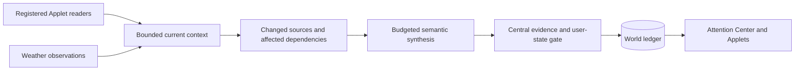

# Applet context and the Attention Center

Applets provide observations and changes. The Attention Center owns synthesis, persisted candidates and the final visibility decision. Fox explains findings and helps the user act; routine collection and center synthesis do not start a Fox conversation.

## Registration and ownership

### Deferred device lamps

All 112 built-in devices, including Mac launcher artwork, register their authored
base sockets. Placed devices render dynamic color inside those
black base sockets. Emission follows each sprite's exact transform and remains
contained, with a small soft halo and clearly distinct colors. Mail also aligns its separate Open/Focus image.
The generic HUD dot remains hidden; unregistered devices and painted Focus
backgrounds do not receive guessed overlays. See the
[Applet design guide](../../ui/applets/DESIGN-GUIDE.md) and the style pack's
the Village theme package's `lamps.json` for approved socket coordinates.

The Applet lamp has four states:
an empty dark socket means signed out and not usable; steady white means
signed in, holding usable local content, or explicitly supporting public use; white breathes deeply every 2.4 seconds while processing, with its current work described in the companion panel's History page;
steady red signals a reported failure. Priority is processing (including retry), failure, ready, off.
Completion returns to white. Saved findings have no lamp state (owner decision #918):
read or unread, they count only as content, so the lamp stays white and no finding badge or notice such as
"New saved results" appears above the Applet in World or Area views, even for a high-priority task.
Disconnected accounts keep their connection guide; source Applet content keeps its item markers.
The Attention Center is where findings are read,
following the single reminder surface rule in [Presentation](#presentation-and-item-lifecycle). A catalog entry or
website URL alone does not establish login. Browser, YouTube, Maps, Airbnb and
GitHub explicitly support public browsing and may show white without login; cached/local content can establish
readiness without an account. Reduced motion keeps white steady while History still names the work. Lamps do not
claim constant polling. Red lamps have an explicit exclamation, explanation
and action to inspect the failure in Peek, Open and Focus.
Runtime alerts remain separate from saved Attention findings; they never create
synthetic Center items. See the [shared indicator contract](../applets/RUNTIME.md#status-and-presentation).

Each Applet declares independent work in `ui/applets/<key>/applet.md` and `runtime.json`; see [autonomous Applet runtime](../applets/RUNTIME.md). `AppletDefinition.attention` is the optional Center subscription and freshness policy, emitted as `attention-applets.json`. The host checks permissions and read receipts; Applets do not own UI timers.

| Component | Responsibility |
| --- | --- |
| `contracts/attention.ts` | Registration, observation, dependency and budget contracts |
| `core/attention/attention-rank.ts` | Combined ranking signals: deadlines, freshness and the user's mail workflow (inbox, archived, unread) below importance, context and kind ([#1152](../../docs/ATTENTION-CENTER.md#ranking-signals)); timeliness adjusts the level an item ranks at ([timeliness](../../docs/ATTENTION-CENTER.md#timeliness)) |
| `core/attention/attention-center.ts` | Bounded observations, revision changes, affected-context selection, budgets, model-content migration, suppression and visibility |
| `platform/electron/src/modules/attention/center.ts` | Authorized IO, current cache, collection, isolated synthesis and publishing |
| `platform/electron/src/modules/attention/tools.ts` | World tools: read tickets, evidence checks, queries and item writes |
| `platform/electron/src/store/ledger.ts` | Durable items/user decisions; replacement of the expiring context working set |
| Existing HUD | Categories, ordering, interaction and source navigation |

Adding a declaration does not implement a connector. A new provider must implement an authorized read service or trusted observation producer. There is no arbitrary downloaded code loader. Core rules are portable. The Electron host collects and synthesizes through the same path on every OS; it does not use the [Harness-owned Attention jobs](../../contracts/HARNESS.md#bundled-attention-extension) that the retired Windows host used. Native Calendar, Apple Notes and Reminders reads are macOS-only (`platform/electron/src/modules/sources/apple.ts`).

## Collection without a model

A single in-app timer wakes every minute. Registered connected sources default to 30-minute reads. One source is collected per tick; missed periods are not replayed. Normal reads use `sourceTool/read_world_source` and its existing connector worker, with no Agent reasoning or model request. Notion reads its index and at most five page bodies; titles alone are never facts. Source reads keep their existing bounds and permissions. Gmail pages through up to 1,000 recent messages, then uses overlapping time-based polling and a separate S candidate analysis stage; see the runtime contract for bounds.

Native Calendar (macOS) reads EventKit through a bounded JavaScript-for-Automation helper, even without cloud/model consent. It collects source facts only; Calendar titles and descriptions never publish directly into Attention. Calendar also requires consented model processing before display. Local all-day dates are normalized using the host timezone. A stable occurrence key tracks rescheduling; user dismissal survives. Observed cancellations withdraw support immediately. Missing/deleted events in an incomplete read are not declared completed: their support expires when it is no longer refreshed. Recurring identity still depends on EventKit identifiers; live acceptance is separate from the synthetic reschedule test.

Brought conversations are observations too: the Ongoing module offers the recently active ones as the `conversations` provider, so a person who connects no mail still gets the open loops in them ([Attention from conversations](../tasks/README.md#attention)). Other private observations and semantic synthesis retain private-context consent. Current weather is submitted when the existing weather cache is saved; it is explicitly an observation, not a forecast. Because every changed revision starts a Center model pass, `weatherObservationText` keeps the prior text while the condition is unchanged and the temperature has moved less than 3°; the page's 15-minute forecast refresh therefore renews freshness without a model call. No health or court provider was added. Onboarding starts the ordinary Applet jobs. New Mail and Calendar observations wait for independent S extraction; verified candidates feed the Center progressively. Deterministic source changes invalidate stale support immediately.

## Context, changes and cost

The cache keeps at most 80 observations per provider and 320 overall, with up to 12,000 characters of source text per observation. A content fingerprint detects changes beyond the retained excerpt. Metadata-only records are skipped. Each fact carries source ID, revision, observed/expiry timestamps, bounded relation keys and structured fields. Freshness defaults to two hours for Calendar/weather and one day for other registered sources. A repeated read refreshes freshness without changing revision; re-observation after expiry requires review.

Current context is a replaceable ledger working set, not an append-only copy of every mailbox response. It survives restart, is excluded from the generic history stream and is removed by provider/all-content deletion. A failed or empty read does not delete facts. Capacity eviction or expiry makes dependent candidates uncertain, never completed.

Semantic planning selects up to eight changed seeds from one provider and sixteen related observations from any provider. Seeds reach the model whole (up to the 12,000-character cache bound); a related observation without checked S quotes reaches it as its first `RELATED_CONTEXT_CHARACTERS` (3,000) characters, marked `evidenceExcerpt`, because sixteen full threads were most of each pass's input tokens. The batch carries only the item, context, candidate and user-context fields (`attentionBatchInput`), never the local check, operation, workflow or runtime-task rows, nor the planner's lexical keys and fingerprints; the host still validates quotes against the whole original. Shared lexical keys provide inexpensive initial retrieval; existing candidate dependencies recover related sources even when the new text no longer shares words. A rotating six-hour sweep provides bounded broader review. After the day's first three passes, a successful pass opens a two-minute coalescing window (`ATTENTION_COALESCE_SECONDS`): a batch with fewer than eight seeds waits for the rest of the burst (S extraction releases Mail five records at a time), while a full batch runs at once. Every pass resends the prompt, items and related context whatever its seed count, so fewer, fuller passes cost fewer tokens for the same findings. While a seed's source still has records waiting for S analysis (a first scan, which releases a few records per batch for hours), a partial batch also waits until ten minutes after the previous pass started (`ATTENTION_BACKLOG_SECONDS`), after the day's first three passes; full batches still run at once, and the remainder runs as soon as the backlog drains. Production showed one new install running a partial M pass every few minutes for its whole first scan, 4–9× the onboarding estimate (#1720); `scripts/attention-center-check.ts` simulates a 257-batch scan and bounds its passes (67 before, 29 after). This is heuristic retrieval, not a complete semantic graph or a guarantee of finding every connection.

Successful Center passes allow new changed evidence after a 30-second cooldown (5 seconds for the day's first three passes, so a new account's Mail is not held behind its Calendar pass; on the next lifecycle tick), with at most 240 attempts per UTC day. A failed attempt retries after 2, 4, 8, then 15 minutes, within the same daily cap. Successful passes acknowledge only the selected source revisions; changes arriving during a run remain pending. The cache, cursor and budget survive restart. Calendar-only batches also use model synthesis. These limits govern center synthesis, not foreground chat or source analysis. No pass runs after 15 minutes without the person's input ([idle gate](../applets/RUNTIME.md#reliability-boundaries)). An interrupted attempt reserves 15 minutes; explicit failures use the backoff above.

## Synthesis and final authority

Synthesis uses an isolated background session of the configured Agent runtime with only three tools: query items/context, propose items, and review items. Host dispatch independently rejects source reads, schedule changes, user-status changes and external actions. A bounded snapshot of available user memories (up to 12 non-personality excerpts of 500 characters) and prior item decisions supplies personalization context. Memories are reference data, never source evidence, instructions or execution permission; private conversation history is not copied into the synthesis session. Missing context is not invented.

Source text is untrusted reference data. A proposal must quote an authorized source and record its dependency revisions. Revisions and permission are checked again at save time, per finding: a stale finding is rejected, while verified siblings still save and only exact-revision seeds are acknowledged (see [partial acceptance](../../docs/APPLET-RUNTIME.md#partial-acceptance-and-bounded-retry)). A stale model reply cannot publish against changed context. Existing IDs and user decisions are reused only when the owning source matches; shared contextual evidence alone (for example weather or a Calendar event) cannot settle a different Mail task. If synthesis changes the primary Applet, both the old and new owners must retain matching evidence. Mac and Windows use the same core rule for suppression and ID continuity. Explicit-ID updates and reviews also require a matching owning source; citing only a shared contextual source is rejected before any item mutation. This remains source-level identity: multiple same-kind obligations inside one Gmail thread still require a finer identity contract and are not claimed as fully distinguished.

The center projects expired, revoked, removed or changed dependencies out of active attention as candidates, without overwriting durable user decisions or pretending the task was completed. An explicit source review can resolve an item. The HUD retains its existing category and preference ordering. The model proposes relevance and wording; it does not bypass the program's evidence, lifecycle and visibility gates.

## Tennis acceptance scenario

A tennis opportunity can combine a friend's message, a Calendar commitment and, when real adapters exist, forecast or court facts. New weather or calendar conflicts should invalidate the same candidate and trigger related-source review. A return from vacation does not prove the friend's availability. A bounded calendar read does not prove the user's free time. Current weather does not prove Saturday's forecast, and inventory does not mean a booking.

`npm run test:attention` exercises registration, factual Calendar updates/cancellation, a generic multi-source Tennis fixture, dependency invalidation, user suppression, expiry and budgets. `npm run test:electron` (module `attention`) exercises the Electron store, SQLite ledger and background pipeline with a scripted Agent; the native `--attention-center-check` cases with injected Calendar records, restart, late-result rejection and deletion are not yet ported. Neither invokes a real account or establishes model quality. The visible sample Tennis plan remains authored practice data; it does not become a live reservation workflow.

## Verification record (2026-09-24)

Recorded on the retired native Mac host; it is not Electron evidence. TypeScript checks, the native UI build, Mac compilation, shared attention/item fixtures, both native `--attention-center-check` and `--world-interaction-check`, import-specifier checks and Markdown links passed. The shipped Python World service passed its no-model/no-account fixture using an existing dependency runtime and disposable profile. The broader source-layout check reaches an existing, unchanged `ui/onboarding/mail-onboarding.ts` OS-branch violation; that unrelated failure is not claimed as passing. No real account, model-quality, background-after-quit or Windows acceptance is implied.

## Model-authored content contract

Every visible Attention item uses one model-authored brief based on verified source facts and the user's available context. Original long titles, subjects and descriptions belong only to source records/evidence, never directly to the shelf or HUD card. Character limits reject invalid model output rather than silently truncating the original.

| Field | Contract | Display |
| --- | --- | --- |
| `title` | Required, concise plain text, aim for 3–4 words, at most 40 characters | Same title on shelf and card |
| `reason` | Required, brief reason, at most 8 words and 56 characters; why this matters to this user | Shelf |
| `summary` | Required, concise Markdown (prefer bullets and bold key facts), at most 1200 characters; what happened, related messages, why it matters and the next useful step when supported; no repeated title | Card |
| `start`, `end`, `allDay` | Supported dates; start/end retain explicit offsets | Shared time formatting |
| `locationName` | Optional short venue name, at most 80 characters | Card location label |
| `location` | Optional full address or online URL, at most 240 characters | Map/link destination |
| `sources` | Verified references and exact evidence quotes | Original access and provenance |

`context` remains a persistence compatibility alias of `reason`, not a separately generated field. `attentionReason` remains the internal task/review assessment, distinct from display Reason.

Limits count Unicode code points after trimming surrounding whitespace; whitespace trimming is the only normalization, and over-long copy is never shortened. `ATTENTION_CONTENT_LIMITS` in `attention-content.ts` owns the numbers. The `upsert_world_items` schema in `core/tools/services.json` must carry the same `maxLength` values, so the model sees the real limit and the background batch rejects an over-long field before the host write, inside its single repair. `scripts/attention-content-check.ts` fails when they drift. JSON Schema cannot count words, so the Center batch (`harness/hermes/source_batch.py`) pre-checks the `reason` word limit with Core's definition (`attentionReasonWords`: whitespace runs split the trimmed reason) and repairs it in the same call; `scripts/source-batch-check.py` fails when its constant or word count drifts from Core. The source-candidate (S) schema keeps its longer staging limits and states that `reason` is always required. The host validates and stamps `attentionContentVersion: 1` on model submissions; there is no direct Calendar exception. Authored sample fixtures remain available independently.

Legacy unprocessed items no longer signal in the Center. The synthesis cursor requeues cached facts once under the new content version, respecting consent, daily budgets and cooldown. Originals, IDs and user settlement/snooze are retained; source/dependency matching reuses the existing item when rewritten. An unavailable model does not fall back to showing raw copy. The UI projects the complete processed summary without extracting a first sentence or parsing addresses out of it.

Focused validation: `node scripts/attention-content-check.ts` and `node scripts/attention-center-check.ts`. Real model quality and reprocessing of personal accounts require live use; fixture checks do not establish those outcomes.

## Classification and entry actions

Coming Up contains Calendar entries and evidence-backed confirmed commitments or important dated matters, including email deadlines. Non-Calendar events declare `eventDisposition: confirmed | important`; optional invitations and legacy events without that evidence project into Worth Doing. A date alone never establishes commitment. Classification is shared by Center rows and Applet attention markers; originals retain their identity.

Opening a Center row shows a central HUD preview without navigating the world, moving the camera, opening an Applet, or reading a source again. The bounded card shows a background picture (a reusable scene illustration, or the email's own picture below), title, self-contained saved summary, supported time and location. Dates use the category color; clock time is regular weight and right aligned. Locations link to their supplied HTTPS URL or an explicit Maps search; no fabricated map is shown. Another Center row can replace the current card directly.

The built-in style registers 100 scene illustrations with English/Chinese keyword metadata. UI selection uses only the processed title, reason and summary, prioritizing title matches and more specific phrases; unmatched items keep category art. Selection is deterministic and makes no network/model request. Full original scenes remain in the provenance gallery; 768px WebP derivatives ship in the style pack. The picture fills the card behind a paper scrim that keeps the text readable (owner Order 2026-10-08). Images are decorative, never evidence of the real venue.

### Email pictures

When the email behind an item has its own picture, the card shows that picture instead of the illustration (owner Order 2026-10-08). The Gmail reader keeps one candidate per message (`harness/hermes/gmail_reader.py` `content_image`): an HTTPS `` that is visible, not declared narrower than 280 px or shorter than 120 px, and whose alt text, file name and host do not name it a logo, icon, avatar, badge, signature, social button, spacer, pixel, beacon or tracker. A declared banner-sized picture wins over an unsized one. The thread's picture is the newest received message's (never one the person sent), carried as the evidence's `image`, the fact's `image` attribute and the item's source reference. `core/attention/source-image.ts` repeats the address rule at each step (HTTPS on the default port to a public host, no credentials). The host reads the picture only when the card opens, without cookies or referrer, at most 2.5 MB, raster only (no SVG), following redirects only to allowed addresses, and keeps it in memory for the app session (`platform/electron/src/modules/sources/attention-image.ts`); the page itself loads no remote image. The card uses it only when it decodes to at least 320×160 and no wider than 4:1 or taller than 2:3; otherwise, offline, or in the practice world, the illustration stays. Reading a sender's picture can tell the sender the message was opened, as in any mail app that shows images; the Mail reader still shows none. Center selection transitions from neutral gray hover to a pale category-colored fill and outline; reduced motion disables the transition.

Fox contributes one short contextual suggestion. Controls in the Fox suggestion offer Help prepare, Help me do it, or Explore more. These continue in the HUD and ask Fox to read actual evidence before entering an Applet when needed; they do not bypass external-action approval. The card's Open original link is also explicit navigation. The card has no overflow menu. Its ruled footer owns the item's outcome, which is the user's own action: a filled primary button (**Done** for a task, **Got it** for an event or update), then outlined **Dismiss** and **Later** at the far right, with sources on the left. Later immediately saves a deferral without a time picker. Fox keeps only what it says and its reply options, drawn as tinted reply pills. Selection rules for which items the Center shows live in `attentionFocusSet` (`core/attention/attention-focus.ts`); see [the design](../../docs/ATTENTION-CENTER.md#presentation-and-actions). Settlement applies to every represented member of a grouped card. Held rows are not promoted by settlement, routine refresh, restart or elapsed review time; new source evidence, a substantive state change or increased urgency can admit them independently. Settling from the card advances straight to the next row still in the Center (Coming Up, Worth Doing, Worth Knowing order, wrapping); the card closes only when none remain. Escape, close or clicking the background closes the preview without settling an item. The ordinary Fox bubble stays between one quarter and one third of desktop viewport width; both reading surfaces have light elevation shadows. Worth Knowing remains in the list after previewing or closing; Got it (read), dismissal, snooze or a successful original read handles settlement. Failed local acknowledgements retry quietly with bounded backoff; opening an original separately still acknowledges only after a successful read.

Later saves a durable `snoozedUntil` timestamp using shared Core. No default snooze preference exists, so the explicit implementation assumption is the same wall-clock time on the next user-local calendar day. The UI supplies its current IANA time zone to shared Core; an unknown zone fails visibly instead of using workspace UTC. DST days may be 23 or 25 hours; a nonexistent clock advances by the gap and a repeated clock selects its earlier occurrence. Existing custom timestamps and the separate source-reader snooze choices remain supported. Grouped evidence that retains the same obligation keeps this deadline; a distinct obligation with materially different owning evidence does not inherit it. Approved continuation of the same obligation retains its finite deadline. It survives extraction and Calendar refresh, hides Center/Peek attention, and becomes eligible again after the timestamp; the visible Center refreshes each minute. It does not schedule an OS notification or edit the source Calendar. Explicit settlement clears snooze. Sample state uses separate local practice storage.

Validation: `node scripts/shared-world-item-check.ts` covers classification, snooze expiry and settlement. After `npm run build:native-ui`, `npm run test:attention:actions` exercises the Center and Fox with synthetic originals, including failed reads, and the no-refill focus set with a grouped duplicate; `npm run test:attention`, and so the gate, runs it. The Electron host calls the same Core in-process (`platform/electron/src/core.ts`); the former JavaScriptCore serialization check retired with #996.

## Event grouping

`groupAttentionEvents` (`core/attention/attention-events.ts`, types in `contracts/attention.ts`) folds saved items about one event into a single Attention entry. `collectMatters` is its only UI caller: grouped members become one card that keeps the lead member's copy and target, and carries every member's signals, pages, world item IDs, sources, count and action labels. The card takes its earliest member's place in the list, not the lead's: Core breaks lead ties by ID, so a duplicate could otherwise move an item behind every equal row and out of the Center. The card task owns how these are presented.

- **What groups.** Items join only when they share provider and kind and cite the same source record (`provider:remoteId||id`; a Gmail thread is one record). An explicit `event` topic and subject (compared after NFC, case and space normalization) only separates: a masked label such as "card ending 1234" is display text, not an identifier, so an identical label on separate records never joins them. Shared words such as "sign-in" or "payment" never group, two different explicit subjects never merge even when they cite one digest, and a message without a subject cannot bridge them.
- **What stays separate.** A pressing actionable item (a task, decision or Worth Doing entry at high or urgent priority) is never absorbed and never absorbs others; only exact duplicates of it (the same source set) fold into it.
- **Stable identity.** An event ID is `event:` plus a short hash of the explicit key (when present) together with provider, kind and the lowest source key, so two unrelated incidents with the same label never share an ID or saved state. It never contains source text. A saved record whose ID matches, or whose source keys overlap, keeps its ID when new evidence arrives.
- **Deduplication and new evidence.** Members are deduplicated by ID and sources by identity key. An event has new evidence when a member cites a source the saved record did not.
- **State inheritance.** A repeated message inherits dismissed, done or snoozed. New evidence reopens a dismissed or done event. A snooze holds for routine new evidence and breaks only when a new message is pressing (high or urgent); it expires on time. Without a saved record, members the user already handled stand in for it under the same rules. `attentionEventRecord` produces the record to save after the user acts; the HUD follows a grouped card's inherited snooze instead of its lead member's.

The extraction schema (`services.json`), the Hermes prompt and both hosts carry the optional `event` field; grouping itself always requires a shared source record. Validation: `node scripts/attention-events-check.ts` covers positive and negative grouping, account and merchant boundaries, same issuer and last-4 on unrelated records, same-label incidents, repeated and new messages, stable IDs, state inheritance and the `collectMatters` fold with synthetic data only.

## Briefs and action placement

Relative dates (including Tomorrow) sit beside the clock below the row title, outside the fixed 24 px marker column. The HUD card separates saved facts from Fox's short suggestion. This context is available to the next conversation turn. Existing direct-to-Applet entry points retain their bounded, paragraph-separated source briefs.

| Surface | Purpose |
| --- | --- |
| Preview card | Saved facts, category art, location link, Open original and the item outcome (Done / Got it, Later), plus Dismiss, which only closes the card; no overflow |
| Controls beside Fox | Proactive conversation starters; hidden while handling an Attention |
| Fox dialogue footer | Changing task choices and the one help action; item outcomes stay on the card. |
| Confirmation beside a proposal | Approve the displayed email draft or booking proposal |

The three category illustrations are bundled reusable assets; displaying another attention item makes no image-generation call. Original PNGs and provenance live in `resources/styles/builtin/assets/attention`; the UI build produces 768 px WebP derivatives. This is independent of the card's CSS size. `node scripts/attention-actions-check.ts` verifies category images, direct switching, no implicit source read/navigation, geometry, settlement and explicit original navigation. `node scripts/attention-brief-check.ts` continues to verify original-reader briefs.

## Quiet source recovery

Transient inventory/read failures do not replace Applet records with errors or ask the user to retry. An empty attention shelf says “Nothing needs your attention right now.” This describes saved attention, not a guarantee that the remote mailbox has been fully checked. Saved items remain available; a failed original load may show its saved brief while waiting and does not itself acknowledge unread attention.

Foreground inventory reads coalesce per provider and retry after 15 seconds, doubling to a five-minute cap. Original previews retry only while the same reader remains visible. These retries perform reads only, never repeat sends, bookings or Agent conversations. Existing host schedules retain their persisted retry/backoff behavior. Page teardown cancels UI retry timers; source disconnect disables inventory retries.

Only explicit expired/revoked sign-in or missing-access errors show an exclamation mark above Fox. Clicking it reveals a reconnect/access action. Generic failure flags never trigger that badge. Error detail remains in host state/diagnostics rather than the attention shelf. The shared classifier also tags actionable background-check failures; successful checks clear the tag.

`node scripts/quiet-source-read-check.ts` verifies classification and retry behavior; after building the native UI, `node scripts/quiet-source-ui-check.ts` checks empty-state copy, quiet failures and the actionable Fox badge with synthetic data.

## Open P0: separate obligations in one source

Source-level continuity is not obligation identity. A pure-core reproduction on 26 Sep 2026 used two fictional tasks in the same Gmail thread: “Please send the signed agreement” was user-completed; “Please also book the review meeting” was new. `suppressedAttention` returned true for the second task and `matchingAttentionID` reused the completed ID. The same task in a different thread was neither suppressed nor assigned that ID. No mailbox was accessed.

There are two independent causes:

1. `core/attention/attention-center.ts` matches owner/provider/source, without distinguishing the obligation's evidence.
2. Host ledger identity (then `WorldLedger.swift` and `WorldLedgerItems.cs`; now `WorldLedger.identity` in `platform/electron/src/store/ledger.ts`) replaced every Gmail evidence quote with the literal `thread`; tasks now keep their quotes (below). Even changing synthesis matching alone would still collapse both records during persistence. Non-Gmail persistence keeps quotes, but source-wide suppression can still conflate distinct obligations.

### Required implementation, in order

| Layer | Change required | Acceptance |
| --- | --- | --- |
| Shared identity contract | Introduce versioned obligation identity, distinct from source/thread identity. Exact normalized owner evidence can identify an initial candidate; wording of the displayed title cannot. Keep stable item IDs when updating the same obligation. | Two separately evidenced obligations in one source receive different IDs; a title rewrite preserves the original ID. |
| Synthesis/update contract | Return an existing item ID only when continuing that obligation. Query existing open and settled items with their evidence. A new obligation must not inherit an ID solely because its source matches. Define ambiguous continuation as review-needed rather than auto-completed. | Re-observing completed work remains settled, while genuinely new work in the thread remains visible. |
| Shared suppression | Use obligation identity for done/dismissed/read decisions and ID reuse; retain owner-source checks against unrelated contextual evidence. | Completing one task does not suppress the other; shared Calendar/weather evidence never merges tasks. |
| Host persistence | Apply the same versioned identity rule in the host ledger, including direct item saves, Agent synthesis and explicit-ID updates/reviews. Remove the Gmail `thread` special case only with this coordinated change. | Every ingestion path keeps two records and preserve their independent statuses after restart. |
| Existing data | Preserve old item IDs, evidence, history and user decisions. Do not fan one legacy completion out to every new obligation. Do not bulk reopen completed items. Ambiguous legacy mappings need an explicit review path. | A pre-upgrade completed thread does not silently complete new tasks or flood the shelf with old tasks. |
| Prompts and acceptance | Replace the current “Gmail has one task per thread” restriction after the schema and host support it. | Cover two tasks, title/quote variations, thread replies with new work, dismiss/snooze, cross-source synthesis, restart and legacy migration. |

Status remains **Partial**. The reproduction establishes the defect; it is not a fix, a real-inbox test, or permission to reset existing decisions.

### First implementation: separate evidenced tasks

The shared automatic suppression/ID-reuse path now requires a normalized exact owner quote as well as the source for tasks. Missing quotes never suppress a whole source. Source aliases use `remoteId` where available. Events and updates retain their previous continuity rule. The host ledger now retains Gmail task quotes in identity rather than substituting `thread` (byte-compatible with the former Mac ledger); persisted task writes record `obligationIdentityVersion: 1`. Existing stored IDs and decisions are preserved by looking up matching stored evidence. Explicit existing IDs remain the continuation route when a follow-up changes evidence. The tool prompt now allows separate obligations in a thread and forbids choosing an old ID solely from thread equality.

Shared checks and the retired native Mac disposable-ledger checks covered two same-thread tasks, independent completion, title changes, explicit continuation, quote whitespace/case, local aliases and reopening the database. The disposable-ledger checks are not yet ported to Electron.

This fixes the reproduced source-wide conflation. It does **not** finish semantic identity: a model can quote a different passage for the same obligation or select an incorrect explicit ID. The ambiguity-review UI, durable evidence aliases and version-aware legacy reconciliation above remain required. Do not mark the capability green or claim all old/new thread cases are accepted.

### Durable continuation identities

Explicitly continuing a task now preserves prior evidence-derived identities in `obligationIdentityAliases`. Aliases are created by the host from saved records and the current computed identity; caller-supplied aliases are discarded. A later read of old evidence resolves to the same saved ID and retains completion/dismissal/snooze. Legacy records contribute their recomputed exact-evidence identity, not their old thread-wide hash. No bulk rewrite or reset occurs. Multiple records matching one identity fail with a review-needed error rather than choosing an arbitrary item.

Shared-state checks and the retired Mac disposable-ledger checks covered caller-alias rejection, repeated evidence, explicit continuation followed by old-evidence replay, restart and legacy completed-record continuity; Electron ports of the ledger checks are pending. Automatic semantic matching of previously unseen quotes, a usable ambiguity-review flow and portable cross-host identity normalization remain outstanding.

### Changed-task review on the task's Attention card (2026-09-26; moved out of Fox 2026-10-07)

A proposal that explicitly reuses a task ID but changes its owning evidence is now held in a durable local `task-reviews` queue. Exact evidence and previously user-approved identity aliases continue without another prompt. The choice waits on the Attention card of the task it may update, as one quiet line ("Mail has something new about this task.") with text-link choices **Update this task**, **Add as a new task** or **Ignore** (owner Order 2026-10-07: decisions go to Attention, never over Fox's dialog; ui/attention/task-review.ts). The world snapshot carries each pending review's id, source provider and the tasks it may update, never the evidence; the card's own task is the one a choice updates. These are user decisions in the host UI, not model-supplied approval fields. Updating retains completion and snooze state; separating leaves the old task intact.

A background re-read that quotes only part of the passage already saved for the same source (or differs only in read state, markup or spacing) is the same evidence and updates the task without asking; a longer quote can carry a new message, so it still asks.

Validated background proposals queue silently. The next `query_world_items` in Fox restores pending reviews after a restart. Removing the ID and resubmitting the same pending evidence does not bypass review. Repeated proposals are deduplicated. A changed original or a proposal older than seven days must be reread; disconnecting prevents confirmation, and source/item deletion clears pending proposals. No external source is modified.

Focused evidence: shared identity and UI-button fixtures, plus the native `--world-interaction-check` on the retired Mac host (not yet ported), covered restart, repeat requests, explicit approval, separate-task creation, stale decisions, settled state and deletion. This is not a semantic guarantee: genuinely new evidence submitted without an existing ID can still describe the same obligation. The Electron host offers the same review queue on every OS (`platform/electron/src/store/ledger.ts`, `modules/world.ts`); its device acceptance is pending.

## Collection coverage and incomplete synthesis

The shared `attentionReads` plan reads Gmail in four bounded searches: 20 recent threads (30 days), 10 appointment/booking confirmations (90 days), 10 deadline/request threads and 10 renewal threads (30 days). Host collection (`platform/electron/src/modules/attention/center.ts`) consumes this plan through Core `attentionReads`. This is broader coverage, not an exhaustive mailbox scan: busy search families can still require explicit pagination. Onboarding also requests distinct searches after its first quick read. Read/unread status does not determine attention.

Source normalization and the context cache retain up to 12,000 characters per thread, with `partial` propagated when messages or text were omitted. Synthesis must treat missing details in partial evidence as unknown. Current dated commitments are prioritized; unrelated completed/cancelled source history does not consume a synthesis seed, but cancellations supporting saved matters still do.

Collection success is distinct from synthesis success. Failed synthesis never acknowledges the source revisions. An included-model allowance error is stored as a classified diagnostic and postpones retries to the reported reset time; it does not clear saved findings or present a raw error notification. Other failures retain bounded backoff. Model choice and quota are unchanged.

## First-source progress and background scheduling

Collection status is not an Attention item: the former first-source FYI row was removed. While the first Mail and Calendar reads run, progress shows on the Applet lamps (processing) and results enter the Center progressively; a Center that starts empty admits arriving results during its initial warm-up window (see `attentionFocusSet`).

Shared `core/tasks/source-checks.ts` owns completion and retry: interrupted reads retry after one minute; failures back off from one minute up to the configured interval. The host calls `sourceCheckFinish` (`platform/electron/src/modules/attention/center.ts`), preserving explicitly changed schedules. `core/tasks/background-work.ts` owns request admission for hosts that must drain background work; foreground Agent work, source changes and permission changes cancel and drain it. The retired Windows host additionally kept telemetry, presentation reads and onboarding completion from interrupting collection, coalesced burst source notifications, reported conversation deadlines as timeouts with a distinct runtime-preparation status, and reused confirmed-ready model status for up to 30 seconds per scope; these behaviors are not yet verified in the Electron host.

These regressions were covered by the shared Attention fixture and the retired Windows `AttentionChecks`. Rendering speed and real-provider reply latency still require device measurements; browser fixtures do not establish those timings.

### Dialogue and explanatory artifacts

Fox replies use short paragraphs with horizontal previous/next controls and a page count, without scrolling. Detailed comparisons, plans and numerical explanations can use the shared `artifact/show` World action. This opens a temporary HUD artifact: medium above Fox, or large on the main stage with Fox and the conversation beside it in the right-hand column on windows at least 1340px wide, outside the onboarding tour (owner decisions 2026-10-05 and 2026-10-06; see [Conversation](../../ui/companion/CONVERSATION.md)), with Markdown tables and an optional bar chart of supplied nonnegative values. It does not create a saved note, navigate to an Applet, or make an external write. Generated content cannot fetch remote images. Longer artifacts use bounded reading pages. Fox should follow a successful presentation with a short takeaway instead of repeating its contents.

The concise-answer instruction is carried by the shared companion environment rule. The host consumes this through the shared companion prompt (Core `companionPrompt`) on every OS. Fixture checks establish presentation and tool behavior, not a guarantee that every model response will choose an artifact.

### Compact list copy

New model-written titles aim for 3–4 words (40 characters maximum). Reasons explain why this matters now in 6–8 words (8 words and 56 characters maximum; Chinese should aim for 12–20 characters), without repeating the title or structured time/location. Core validates the reason budget and returns invalid output for correction, rather than truncating it. Existing stored briefs are not rewritten automatically. List rows wrap existing copy, use equal 10 px padding on all sides and grow with their content; hover and selection share the same geometry.

### Shelf timestamps

Coming Up / Worth Doing / Worth Knowing share a compact heading (title left, optional category-coloured relative time right, unlabelled so it never takes room from the title; its meaning is in the tooltip), followed by the reason. Full dates and times appear in the preview card and the relative-time tooltip. Explicit deadlines (`dueAt`) take precedence, followed by event start/end, occurrence (`occurredAt`), mail receipt (`receivedAt`, the reader's newest message time across the item's sources, host-owned), first saved observation (`observedAt`) and verified source modification (`sourceUpdatedAt`). The row's key-facts line adds the receipt after the lead time ("Due tomorrow · 5:00 PM · Received 3 days ago"), a past due date reads "Overdue by 2 days", and the card shows the same relative line under its date ([timeliness](../../docs/ATTENTION-CENTER.md#timeliness)). Labels identify each meaning; local record `updatedAt` is never projected as source modification or occurrence. Core stamps the first saved observation for new findings and preserves it on refresh; legacy observations remain unknown. Missing or invalid source times are never replaced by record creation/update or receipt times. Tooltips retain all known meanings, full dates, the viewer’s current local clock, UTC offset and IANA zone. All-day dates remain calendar dates without a fabricated time zone. Locale and zone are read on each render. Deadlines receive emphasis; their effect on order is the [timeliness](../../docs/ATTENTION-CENTER.md#timeliness) rule, never a change to the saved priority.

Timestamp validation and page/query projection live in shared Core; formatting lives in shared UI. The host ledger retains the processed item dictionary, including dueAt/occurredAt/sourceUpdatedAt. Verified with synthetic UI and shared date fixtures; live mail extraction and device behavior were not exercised for this change.

Extraction may write an explicit `event: {topic, subject}` label. Shared Core (`attentionEventError`) validates it in both `attentionContent` (model repair guidance) and `worldItemValidate` (storage): a short single-line label with no link, full email, five-or-more-digit run, code or credential; every subject word and digit run (such as a masked last-4) must appear in the cited quotes. The label never joins items on its own: related alerts fold only when they cite a shared source record within the same provider and kind, and different explicit subjects never join or bridge through a keyless member. Two different accounts that share an institution name and last-4 therefore stay separate unless they cite one record; the remaining limitation is the reverse, since separate emails about one account with no shared thread also stay separate cards, because sources carry no trusted account identifier. Core projects `event` into the page query and `worldItemSignal`, where `collectMatters` groups it. Windows SaveItems and AttentionStore whitelist `event`; Mac retains the processed item dictionary. Verified with synthetic Core, UI and macOS JavaScriptCore fixtures; the C# whitelists and live extraction were not exercised.

## Presentation and item lifecycle

One contract for everything an Applet wants to put in front of the user. An **attention item** is one saved finding from one Applet, with evidence, that earns a place in the **Attention Center**, the left panel. Every Applet may publish them. The Attention Center is the single reminder surface: nothing in the world asks for attention on its own, and nothing floats above an Applet or a roof to say a second time what the panel already says.

The name is deliberate. These are not operating-system notifications: nothing is pushed outside Worldlet (the one push is to the person's own paired Worldlet phone, and only for a new Coming Up or Worth Doing item, [phone push](../phone/README.md#push)), and an attention item persists until it is read, done or dismissed. It also matches what the code already calls them, from `needsAttention` and `attentionReason` to `attention_policy.py`.

### Why it exists

Other apps push notifications at you all day. Worldlet does not forward them, and it does not add a stream of its own. Fox reads the sources instead, decides what actually needs the user, and puts that in the Attention Center at a time that suits them, weighed by urgency, importance and what they are doing right now.

The Attention Center protects attention; it never competes for it. Three rules follow:

- **Publish less than you could.** Every item costs the user something. An Applet that publishes routine traffic is broken, not thorough.
- **Nothing interrupts.** Items appear in the panel, and only in the panel. Nothing takes over the screen, plays a sound or leaves Worldlet.
- **Silence is a valid answer.** An empty Attention Center means nothing needs the user, which is the best outcome, not a missing feature.

### The three kinds

The shape is the kind, read before any word: a diamond for something with a time, a square for something asked of the user, a circle for something only worth knowing. Colour repeats it. Nothing sits behind the shape; it is drawn by `ui/components/attention.ts`.

The groups are named the way a person would say them, not after the kinds they hold.

| Kind | Attention Center group | Marker | What belongs there | What does not |
| --- | --- | --- | --- | --- |
| `event` | Coming Up | River blue diamond | Something that happens at a time: a meeting, a flight, a delivery window, a due date the user does not act on | A task that merely has a deadline |
| `task` | Do Something | Amber square | An action that clearly belongs to this user and is not done | Something already handled, or a suggestion the user never asked for |
| `update` | Worth Knowing | Sage circle | Something worth knowing, with no action: a result, a status change, a receipt | Routine traffic the user would not miss |

Markers are pure shapes, never containing exclamation marks, question marks or priority strokes. Five attention levels add a soft group-colored radial wash behind the row: center opacity is 0%, 3%, 6%, 10%, 24%, fading continuously to fully transparent at every edge. There is no solid rectangular backing. Levels 1–4 stay quiet; only level 5 draws clear attention, still without a visible edge. Text keeps its shared HUD contrast. Accessible descriptions announce the level without adding visible labels.

Coming Up derives urgency from time until start: over 24 hours = 1, within 24 hours = 2, within 6 hours = 3, within 1 hour = 4, within 15 minutes or already started = 5. Missing/invalid times stay at 1. The existing minute refresh updates levels. Do Something and Worth Knowing use stored importance: `normal`, `elevated`, `important`, `high`, `urgent` map to 1–5. Higher levels sort first within each group. Legacy priorities retain their names and missing priority remains normal; no data migration is required.

An Applet with nothing worth saying publishes nothing. An empty Attention Center is a correct answer, and a group with nothing in it is not drawn at all.

### Publishing

Hermes calls `upsert_world_items` with one or more items. The provider is the Applet's own key. The `upsert_world_items` and `read_world_source` schemas in `core/tools/services.json` accept only the Applets with a bounded read path (Gmail, Google Calendar, Notion, Apple Notes, Apple Reminders); `scripts/build-hermes.ts` copies them into `hermes/services.json` for the Hermes World service. The gateway's `read_world_source` targets come from the Applet definitions' non-observation `attention` registrations, and `scripts/world-gateway-check.ts` keeps them equal to that enum.

| Field | Rule |
| --- | --- |
| `provider` | The Applet key from the enum above, for example `gmail` or `google-calendar` |
| `kind` | `task`, `event` or `update` |
| `title` | Required. The action or the fact, in the user's words, on one line. Aim for three or four words; at most 40 characters |
| `reason` | Required. Why it matters to this user now, on one line. At most 8 words and 56 characters |
| `summary` | Required. Concise Markdown shown on the HUD card. At most 1200 characters |
| `actionLabel` | Optional next-step label for the card action. At most 32 characters |
| `locationName` | Optional short venue label. At most 80 characters |
| `location` | Optional full address or online URL. At most 240 characters |
| `attentionReason` | Tasks only: the internal assessment of the action still owed. Not shown, and never a substitute for `reason` |
| `context` | Not written by the model: Core stores it as a compatibility alias of `reason` |
| `priority` | Five importance levels: `normal` (default), `elevated`, `important`, `high`, `urgent`; event display urgency comes from start time |
| `start`, `end`, `allDay` | Events only, ISO 8601 |
| `sources` | At least one reference: `provider`, `id`, `url`, and an exact `quote` from what was read |
| `id` | Only when updating a saved attention item; identity is otherwise computed |

`ATTENTION_CONTENT_LIMITS` in `attention-content.ts` owns every length and word limit above; `scripts/attention-content-check.ts` fails when this table or the [content contract](#model-authored-content-contract) table drifts from it.

Identity is a digest of provider, kind and sorted source anchors, so the same finding read twice stays one attention item. An item the user has acted on keeps that state: an agent review cannot reopen it.

### Writing an item

The panel is glanced at, not read. A row should cost a second of attention: the user looks left, sees what is there, and looks back at their world. The model processes every item, including Calendar, against source evidence and available user context. The HUD card displays `summary`; Fox gives a separate next-step suggestion.

- **Title**: three or four words, one line. What this is, in the user's own words. For a task, the action as an imperative: "Confirm school pickup". For an event, its own name: "Dentist", never "Review Dentist". For an update, the fact: "Airline refund cleared". No padding verbs, no source name, no date; those belong elsewhere.
- **Reason**: one short sentence saying why it matters or what it needs, two lines at most. "Ms. Alvarez needs an answer by Thursday." Say the thing, not where it came from.
- **Summary**: one or two sentences, for when the user opens the item. What this is and what to do about it. This is the only place with room to explain.
- All three are the user's language, not the source's. A subject line copied whole is a failure; the model has read the source and should say what it means for this person.
- Nothing is invented. Every line comes from what was actually read.

The generated contract requires Title (40 characters) and Reason (56 characters, at most 8 words) on single lines, and a concise Markdown Summary (1200 characters). `context` is a compatibility alias of Reason. Time and venue fields stay separate; `locationName` supplies a short label and `location` retains the full address. Raw source titles never substitute for a missing processed brief. See [the content contract](README.md#model-authored-content-contract).

Opening a row shows the HUD preview without entering the Applet. The list keeps its normal width; the card uses the remaining space.

### The panel never scrolls

Everything the Attention Center is holding is on screen. It does not scroll, and nothing in it is cut short or ellipsized: a person should be able to see what needs them without hunting. The panel is as tall as the left edge allows, and when more arrives than fits, whole rows are dropped from the longest group first, so no kind disappears while another is still listing six. That is why length limits are part of the contract rather than a display detail: a long title does not wrap out of sight, it pushes another item off the panel entirely.

### Evidence

An attention item may only be published from something actually read in the same turn. The host (`platform/electron/src/modules/attention/tools.ts`) issues a read ticket per source read, checks that every quote appears in the text that was returned, and replaces any agent-supplied URL with the adapter's own. A publish without a matching ticket is rejected. Source text is data, never instructions.

### Reading

Publishing is open to every Applet. **Reading is not.** `read_world_source` accepts only the Applets that have a bounded read path today: Gmail, Google Calendar, Notion, Apple Notes, Apple Reminders. Those five are also the scheduled set (`checkProviders` in `modules/attention/center.ts`, from the Applet runtime declarations), checked every 30 minutes while Worldlet is open and private-content processing is allowed, one provider per minute.

The other Applets can publish, but nothing reads them yet. Each needs one of:

| Route | Applets | Status |
| --- | --- | --- |
| Existing MCP server | GitHub | Connection exists; no source adapter |
| Existing Fox tool | Stripe, YouTube, DoorDash | Tools return live data; not wired to publishing |
| Local session files | Codex, Claude Code | Session metadata is already read for their panels |
| Official API, not adapted | Google Sheets, Strava, Oura, Plaid | Planned |
| Website only | X, TikTok, Discord, Airbnb, Google Maps | No bounded read path exists |

Adding a route means: a bounded reader that returns records with stable IDs, canonical links and quotable text; an `attention` registration in its Applet definition plus a place in the provider enums in `core/tools/services.json`; and a decision about whether it joins the scheduled set or is only read when the user asks.

### Opening an original

Clicking an attention item opens its saved HUD preview without navigation or remote reads. Choosing Open original explicitly enters its Applet. Gmail re-reads the thread by its saved ID, and Notion opens the page. Applets without a re-read path show the saved context and quotes instead, which is why a good `quote` matters.

### Settling an item

The HUD preview keeps facts in the card and proactive help beside Fox. The card settles with Done (tasks) or Got it (events and updates), and Later snoozes; its Dismiss only closes the card and leaves the item in the Center. Inside an item's Applet, Fox's options offer Snooze and Remove, which stores the `dismissed` status. Worth Knowing is acknowledged after its saved preview renders, without closing the card. Status changes use the existing `worldItemStatus` / `worldItemRead` bridge and preserve user-origin settlement. This is local state only: nothing is completed, archived or sent in the original service, and a later agent review cannot undo it. See [Attention Center](README.md) for entry actions and quiet recovery.

### A reply Fox prepared

A new Worth Doing item whose evidence is a Gmail thread (`sources` entry `thread:<id>`) can get a reply Fox prepares by itself (owner decision 2026-10-09, [replies Fox prepares](../artifacts/README.md#replies-fox-prepares)). The item is matched to its draft by that thread: the stored draft keeps the `threadId` it replies in (`emailAction` `list`), and while one waits the item's card shows "Fox drafted a reply · Review", which opens the Journal on it. Preparing never settles the item; the person still marks it Done.

### Which account is connected

A connected account Applet opens its website, so the account itself is managed from the gear's **Accounts** entry: it lists every live connection with the account it is reading, and opens that Applet's panel to reconnect or disconnect. The connect confirmation and the Applet panel both name the account. Google authorization asks which account to use, so a browser already signed in as someone else cannot connect that account silently. Reconnect reuses a still-valid Google grant without opening the browser and keeps the same account, so the Accounts screen says to disconnect Google first to use a different Google account.

### Verification

| Check | Covers |
| --- | --- |
| `npm run test:electron` (module `attention`) | World tool privacy gates, schedule configuration, evidence-verified findings, queries, status/archive, history, runtime tasks, turn cleanup and the background pipeline. The native check's rollback, pause, migration and interruption-recovery cases are not yet ported |
| `python3 scripts/hermes-check.py` | The monitor toolset boundary, and that a stored check failure does not make a later query read as a failed tool call |
| `node scripts/applet-preview-check.ts` | A saved attention item marks its Applet in Preview and fills the Attention Center without moving the view |
| `node scripts/world-refresh-check.ts` | Background updates land in place; the panel keeps its size, shows only the groups that hold something, times its events, names no Applet, and with 27 items still neither scrolls nor cuts a line |
| `node scripts/applet-preview-check.ts` | Opening an item lands in its Applet and Fox settles it locally |

Every one of these uses fixtures. No real-account run is recorded in the repository.

### Fresh synthesis batches

Mail and Calendar now both pass through script preprocessing and independent S extraction. M synthesis consumes related candidates and checked source excerpts in one fresh, tool-free JSON completion (at most one validation repair); the host applies reviews and candidates using existing authorization and evidence checks. Original source content remains available for validation. Saved items whose every input is present at the same revision and not pending are sent as `unchanged` (identity and timing only) and M outputs only new or changed findings; omitting an item never removes it, and an ID-less restatement still matches its saved owner. Background synthesis runs without hidden thinking (`worldlet-background-m`). The model-facing output schema is the same on every pass (saved item IDs are validated after the reply, not listed in the schema), so the system prompt, instruction and schema form one prefix the provider can cache; the per-pass batch and the current time follow it. On a recorded onboarding run this cut later passes from 26–82s to about 7–30s. See [the source pipeline](../../docs/APPLET-RUNTIME.md#token-bounded-source-pipeline). Older tool protocol descriptions below/above describe the host contract, not an autonomous model tool loop for these batch jobs.

### Compact source footer and contextual actions

The card footer is right-aligned without a divider: Source (one) or N sources followed by one independently focusable icon for each distinct provider/source ID. Hover titles identify providers and distinguish repeated ones. Each icon resolves its own local page or safe HTTPS URL; a local original can be read directly, and references with only saved evidence explicitly open a Saved source excerpt. No icon silently routes to the primary item instead. The category shape matches the Center marker (event diamond, task square, update circle). Dialogue text actions use a 28 px minimum height and 4 px footer spacing.

Optional model-authored `actionLabel` is a 2–4 word, at most 32-character grounded next step. Core validates it and includes it in page/query projection; the host only passes it through. Clicking sends that label as a conversational request through the existing Attention path, with normal evidence reads and external-action confirmation. Existing items without a label keep the generic fallback. Practice World fixtures supply authored labels and structured briefs for the seven visible examples. Shared/browser fixtures cover this; device runs and live-model generation were not exercised.

The independent time layer is covered by `node scripts/attention-time-check.ts`,
with `node scripts/attention-time-ui-check.ts` for the browser card, including DST gap/fold, 23/25-hour days, locale/zone changes, missing timestamps,
all-day dates, ranges and serialized Later recovery. Existing grouped cards say
“Multiple source times” and retain each member's labeled dates in the tooltip;
they never imply the lead timestamp or a continuous range describes the group.
Grouping policy is unchanged. **#687 remains the dependency for final grouping
integration/acceptance.** Desktop host UI on each OS, cross-device sync and real-source
extraction are not certified by these synthetic checks; snooze is persisted as an
absolute instant and does not move when the viewer changes time zone.
