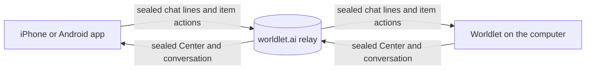
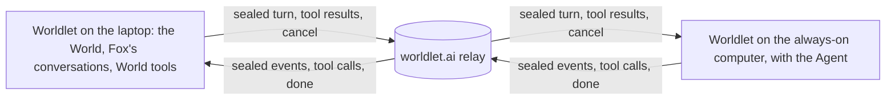

# Phone pairing

The Worldlet phone apps, [iPhone](../../ios/README.md) and [Android](../../android/README.md), hold only the **Attention Center** and **Fox's conversation** (owner goal 2026-10-03). The computer does all the work: it reads sources, ranks the Center and runs Fox's turns. The phone shows what the computer sends and passes back what the person does.



## Pairing

1. In the first-run tour's last step, the phone ([Onboarding](../../ui/onboarding/README.md#after-arrival-guided-tour-then-a-first-useful-task), **Show pairing code**, owner request 2026-10-06) or later in the companion panel's **Mobile** page (**Pair phone**), the computer makes a 32-byte secret, registers the pairing with the relay and shows the link `worldlet://pair?v=1&s=<secret>&n=<computer name>` as a QR code (and as a link to copy).
2. The phone scans it (in the app, or with the Camera app, which opens the `worldlet://` link in the app) and keeps the link in its Keychain; the computer keeps the secret in its vault.
3. The phone's first poll completes the pairing; the computer then sends what it has.

Either side can unpair; the other forgets the pairing at its next poll. A paired phone that opens another computer's link (any page or app can open a `worldlet://pair` link) asks first, and only when the person confirms does it unpair, clear what the old computer brought (the Center, the conversation, widgets and their unsent edits) and pair anew. A code nobody scans expires after a day, and a pairing idle for 60 days is removed.

## Keys and boxes

Everything comes from the secret with HKDF-SHA256 (salt `worldlet-pair-v1`): the pairing id (`id`, 16 bytes), one bearer token per side (`desktop`, `phone`, 32 bytes) and the AES-256-GCM key (`key`). A box is base64url(12-byte nonce, ciphertext, tag), with the additional data `<id>|<place>`, where the place is `slot:<name>`, `to:<role>` or `push` (a notification). The relay stores only the SHA-256 of each token and the boxes, so it cannot read or move a payload. `pairing.ts` (WebCrypto), `ios/Sources/WorldletKit/Pairing.swift` (CryptoKit) and `android/kit/.../Pairing.kt` (javax.crypto) implement it; scripts/phone-pairing-check.ts, the Swift tests and the Kotlin tests pin the same test vector.

## Relay

worker/pairing.ts on worldlet.ai, with tables it creates in the website's D1 database:

| Request | Who | Does |
| --- | --- | --- |
| `POST /api/pair {id, desktop, phone}` | computer | Registers a pairing with both token hashes (at most 40 a day per network: an IPv4 address or IPv6 /64) |
| `GET /api/pair/<id>?after=N[&wait=S]` | either | The other side's slots and the messages to the caller after version N, plus when the other side last polled; reading acknowledges messages up to N. With `wait` (seconds, at most 20) the relay holds the request until something new arrives, checking every quarter second |
| `PUT /api/pair/<id>/slots/<name> {box}` | owner of the slot | Replaces a slot: `attention`, `conversation`, `live`, `widgets`, `desktop` (computer), `phone` (phone) |
| `POST /api/pair/<id>/messages {box}` | either | Queues a message to the other side (at most 200 waiting and 4 MiB of sealed boxes in all, kept 7 days) |
| `PUT /api/pair/<id>/push {platform, token}` | phone | Registers the phone for notifications: `apns` (App Store and TestFlight builds), `apns-dev` (debug builds, Apple's sandbox) or `fcm` (Android), with its device token; replaces the earlier one |
| `DELETE /api/pair/<id>/push` | phone | Turns notifications off for this pairing |
| `POST /api/pair/<id>/notify {box, collapse?}` | computer | Wakes the phone with a sealed [push](#push) (at most 3,000 characters, 30 an hour per pairing). Answers `{sent:true}`, or `{sent:false, reason}` with `no-device`, `not-configured` (no credentials for the phone's platform) or `device-gone` (Apple or Google said the token is dead; the relay forgets it); another provider error is a 502 |
| `DELETE /api/pair/<id>` | either | Unpairs and deletes everything (the push token too), in one transaction |

One version counter per pairing orders slot writes and messages, so each poll asks for everything after the last version it saw. The computer's view also says `push`: `{platform}` while the phone takes notifications, else `null` (never the token), so the Mobile page shows **Notifications on** or off.

## Payloads

`payloads.ts` owns the shapes; the phones' `Models.swift` and `Models.kt` mirror them.

- **attention**: the Center's Now (in its group order: Coming Up, Worth Doing, Worth Knowing) and Later, as the World page ranks them (`ui/hud/native-hud.ts` hands each render to `ui/companion/phone-bridge.ts`, which sends a changed view at most every 1.5 seconds). It also lists `accounts`, the page's source issues (`worldlet:source-issues`): each account the computer can't read until the person reconnects it or allows access again. The phone shows each one as "Connect <account> on your computer". Each item may also carry `fact` (the row's time line as the Center writes it), `summary` (the card's saved Markdown brief), `source` (its provider), `art` (the card's illustration, chosen as the desktop card chooses it; the phone bundles the same pictures) and `fox`, Fox's dialogue on the item's card: the line Fox says as the card opens, the option it offers and the item's latest turns (`ui/companion/native-chat.ts` `threadOf`, sent again whenever a turn starts or ends). They are left out when empty, so an older phone ignores them. Each item also names `applet`, the Applet it came from (the Applet in the World that reads its provider), and the payload carries `applets`, the phone's **Applet world** (owner decision 2026-10-03: swipe down from Now): the Applets that work on the phone (owner request 2026-10-07: "手机端只放能打开用的 applet"), each with `url`, the website its tile opens in the app's own browser (owner request 2026-10-07: never another app; `ios/App/WebBrowser.swift`, `android/…/ui/Browser.kt`) (`phoneWebAddress` in [phone-web.ts](phone-web.ts): the person's own websites always, a built-in Applet's website unless the site refuses phones or only pushes its app; Applets that live only on the computer have none and are not sent, and an item whose Applet is not sent names none). The person's own come first (widgets for now, their websites, then kept conversations, which open their own page), then the others, working or holding Now items first, then by recent use. Each still carries its `section` (`live` when it is working or holds Now items, `accounts` for a connected source, `jobs` for an [ongoing thing](../ongoing/README.md) the person kept (key `job-…`, its conversation's latest lines as `recent`, its own thread as `fox`, since it is an Applet of its own on the computer too), `places` for the rest; widgets for now lead `live` as moment Applets with their `widget` id), its lamp `state` (busy, ready, failed, off), its `line` (what it is doing, from the world log's live lines, or its status), its `recent` world log lines and `fox`, its own thread of Fox's conversation (`threadOf('object:app-<key>')`). `phoneApplets` in `payloads.ts` builds it from what the World page knows (`ui/shell/notion-world.ts`), and the page sends it again when the world log or a widget changes.
- **conversation**: the last 40 turns of Fox's main session from the companion archive, and whether a turn is running.
- **live**: the turn Fox is on now, so the phone shows it word by word as the computer's dialogue does: `id`, `user` (the line asked), `steps` (Fox's thinking, the working lines, last 6), `text` (the reply so far), `done` (true once with the finished reply, or the error line) and `item` when the turn was asked from an Attention item's card (that item's conversation; absent for the main conversation), or `applet` when it was asked inside an Applet (its thread), and `approval` while Fox's Agent waits for the person's permission (`id`, `title`, `detail`, `choices` of `once`, `always`, `deny`; [approvals](../agent/PORTABILITY.md#resident-sessions-and-approvals)), which also sends a `fox` notification. The iPhone and Android apps show it on the turn's card in Fox's dialogue (the item's card, the Applet's page or the main conversation; a request from an item's thread is also its own card in the main conversation, where the notification opens) with the computer's three buttons in the style of Fox's option (Allow once, Always, Deny; a choice they do not know is left out, Deny always there) and its command, answer with the `approval` message (the notification's own Allow once and Deny send the same one, [Actions](#actions)), and then show the settled line ("Allowed once.", "Denied."). A turn waiting on an approval stays shown for ten minutes instead of 90 seconds, the computer's own limit. Kit rules: `HarnessApproval`, `LiveTurn.asking` and `LiveTurn.shown` (WorldletKit `Models.swift`, Android kit `Models.kt`). `ui/companion/native-chat.ts` raises `worldlet:fox-live` on each step and streamed word, and `ui/companion/phone-bridge.ts` sends it at most every quarter second (the finished reply at once); the host drops it unless the phone is open or the turn asks for an approval (or just settled one; [Push](#push)). The phone types the words out between updates and keeps the finished card until the next conversation or Center update has the reply.
- **widgets**: the [moment Applets](../widgets/README.md) for now, newest first (at most six), each with its page (while the sealed box fits) and state; the phone keeps the last one, so a made Applet works while the computer is away.
- **desktop** and **phone**: each side's name and version. The desktop slot also says `order: true` while the computer can send [Orders](../distribution/order.ts) (the host's `order` status is available and ready: an Alpha or Dev app with Claude Code or an Gatehouse enrolment); it is left out otherwise, so an older phone sees nothing new.
- **Phone messages**: `chat` (a line for Fox; with `item`, said with that item's card open, so the computer opens the same card and the line joins the item's conversation, as on the computer; with `applet`, said inside that Applet's page, so the computer opens the Applet and the line joins its thread), `applet` (`open`: open that Applet on the computer), `option` (the option Fox offers on an item's card), `approval` (`approval`, the live turn's request id, and `choice`: answered through the same `harnessApproval` as the computer's card), `attention` (`done`, `later` or `remove` on an item), `widget` (the entries the person changed in a widget, merged by the host newest-wins, never through the page), `connect` (open an account's sign-in on the computer, where the person finishes it) `web` (what happened on a website opened in the app's own browser, owner request 2026-10-07: `applet` and up to 300 `records`, each the computer's own page observer's report, `platform/bridge/web-record.js`, which the phones carry as a copy made by `scripts/phone-web-record.mjs`, with the phone's time `at` in seconds: page, text, text-more, input, click, submit or private; a page's text at most 90 KB; sent every ten seconds and when the page closes, in messages that fit one box. The host keeps them like its own browser's records, through the same `WebRecorder` rules, in visits whose applet is `phone:<Applet>` and at the phone's time within the past week, `platform/electron/src/modules/phone/web.ts`; no network data, no screenshots. On the iPhone the observer runs in a script world of its own, so the page can neither see nor imitate it; on Android it reports through the `WorldletAndroid` bridge. Sign-ins made in the phone's browser stay on the phone) and `order` (`said`, what the person said with the phone's Order button, owner request 2026-10-06: the computer sends it as its own Order, place `Phone`, with pictures of its window, never as a chat line to Fox, and Fox says there how it went; the host drops it when the computer cannot send Orders now). The phone shows that button, a round bug left of its message bar, only while the desktop slot says `order`; one tap listens with the phone's speech recognition and the next sends. The World page carries them out as the person's own actions: a chat line is submitted like a typed message (queued behind a running turn), and an item action writes the same status as the computer's card (Done or Got it, Later until the later time, Remove). Anything else is dropped.

Changes arrive as they happen through long polls. While the phone app is open it keeps one `wait=20` request at the relay, so a Center change or a streamed word reaches it within about a quarter second. The host module ([platform/electron/src/modules/phone](../../platform/electron/src/modules/phone/index.ts)) does the same with `wait=15` while the phone reached the relay in the last two minutes, so a chat line or a Done from the phone arrives just as quickly, and it re-reads Fox's conversation every 2 seconds while Fox works. Otherwise it checks every 15 seconds, and every 2 seconds while a code waits to be scanned. The phone never signs in to anything: accounts, credentials and tokens stay on the computer, and the relay only passes sealed boxes along. A message is acknowledged only after the World page took it, so a message sent while the computer sleeps waits on the relay. The additional data binds a box to its pairing and place but not to a time, so the relay could queue an old box again; the computer remembers the last 2,000 messages it accepted (in its vault, across restarts) and drops one it has already taken, and it refuses a message whose own sealed `at` (ISO time or epoch seconds or milliseconds; phone builds that send none are still accepted) is more than seven days old (`phoneMessageKey`, `stalePhoneMessage` in `pairing.ts`). A message is known by its `id`, except an Attention action, whose `id` is the item's: it is known by its sealed box, so Later and then Done on one item are two messages and only an exact replay is dropped.

## Another computer's Agent

Owner plan item 9 (2026-10-08): heavy OpenClaw and Hermes Agent users keep their Agent on an always-on computer (an old Mac mini) and reach it from a laptop and a phone. Worldlet does it the way it pairs a phone: the always-on computer (the **host**) runs Worldlet with the Agent, and the laptop's Worldlet (the **client**) pairs with it like a phone, through the same relay, keys and boxes. Only the Agent's work happens on the host: the client's World (its Applets, Attention Center, accounts, widgets, companion memory and conversations) stays on the client, and Fox's World tools act there.



1. On the host, the companion panel's **Mobile** page, **Another computer** › **Pair another computer**, makes a second pairing beside the phone's (`phonePair` with `kind: 'agent'`; vault `agent-pairing`) and shows its code, `worldlet://agent?v=1&s=<secret>&n=<computer name>`, as text to copy. It is the phone's link with `agent` in place of `pair` (`pairLink`/`readPairLink` `kind`), so a phone refuses a computer's code and the client refuses a phone's. The code is pasted, not scanned: a laptop rarely scans a screen, so the host shows no QR code for it.
2. On the client, setup's first page (**My Agent is on another computer**) or Settings › Model (**On another computer**) takes the pasted code (`agentHarness` `pair`). The client reads the relay as the `phone` role, which completes the pairing, writes its `phone` slot (its name and version), and waits up to 30 seconds for the host's `desktop` slot; without it, or when that slot does not name the turn protocol (an older host) and no newer one follows within 3 seconds (the host first sends the slot it kept from an earlier pairing), the pairing is deleted and the person is told to open or update Worldlet there. The secret stays in the client's vault (`remote-agent`).
3. From then on Fox's Harness on the client is `remote` ([Harness services](../../contracts/HARNESS.md#harness-services-v2): `location` remote, `{kind:'remote',computer}`; `agents` from the host; `core/agent/harness-services.ts`), and the World reads where Fox runs from that service, never from a Harness name.

### Turns

Every turn the person starts with Fox on the client goes to the host: the main conversation, an item card's and an Applet's thread alike. The messages are sealed boxes like a phone's (place `to:desktop` from the client, `to:phone` from the host), each with its own `id` and sealed `at`; [`remote-agent.ts`](remote-agent.ts) owns their shapes and bounds:

| Message | From | Carries |
| --- | --- | --- |
| `turn` | client | `text`; `thread`, the Fox thread it is said in (`main`, `item:<id>`, `applet:<key>`; core `harnessSessionThread`); `instructions`, the client companion's own (its personality, memory and guidance, the `style` a local turn gives its Agent); `view`, what the person is looking at (the turn's `context`: the place, its earlier turns, recent browsing; its largest parts are left out past 60,000 characters); `history`, the last six turns (for a Harness without sessions); `agent`, the person's agent chosen for that Applet; `session` |
| `events` | host | The turn's `response_start`, `delta` (words), `progress` (steps) and `status` (still working), gathered for a quarter second at a time |
| `tool` | host | A World tool call from the Agent there: `call`, `name`, `args` |
| `tool-result` | client | The answer to one `call` |
| `approval` | host | A permission prompt of the Agent there (`request`: `id`, `title`, `detail`, `choices`, `expiresAt`) |
| `approval-answer` | client | The person's `choice` (`once`, `always`, `deny`) for one `approval` |
| `cancel` | client | Stop that turn |
| `done` | host | The finished `message`, or `error`, or `cancelled` |
| `part` | either | One piece of a message longer than 96,000 bytes: `whole` (its id), `index`, `of` (at most 40) and `data` (base64url of its UTF-8 JSON); the other side puts it back together |

The client (`platform/electron/src/modules/phone/remote.ts`, run by `agent-runtime/remote-harness.ts`) catches up on the host's slots, refuses at once when the host has not reached the relay for 90 seconds (it says the computer is away instead of queueing the turn), then sends the `turn` and reads its messages with long polls until `done`. The host (`platform/electron/src/modules/phone/remote-host.ts`, wired in [`modules/phone`](../../platform/electron/src/modules/phone/index.ts)) runs it on its own Agent service's runtime, not through its World page: `remoteTurnBody` gives it the client's text, instructions, view and history, the thread's place (core `harnessThreadPlace`), and `harnessWorld: remote:<client name>`, so a Harness with resident sessions opens one per client thread (`HarnessSessionKey` `{world:'remote:<client>',thread,agent}`, [resident sessions](../agent/PORTABILITY.md#resident-sessions-and-approvals)), apart from the host's own threads; an Applet's chosen agent is used when it is one of the host's. The host's `desktop` slot for the client says `agent: {v:2, agents}`, the person's agents there (`remoteHostInfo`), so the client's Applet menus offer them as for a local Agent ([the person's own agents in an Applet](../agent/PORTABILITY.md#the-persons-own-agents-in-an-applet)).

World tools act on the client's World. The host answers `describe_world_tools` from the shared catalog (the same Core on both sides), and each `call_world_tool` the Agent makes resolves into one World tool, which the host sends as `tool` and waits for (up to ten minutes); the client runs it through the same turn as a local Agent's call, so its page's validation, the turn's trust and its own permissions decide, and sends back the `tool-result` (at most 1,000,000 characters). "Open my Notes" opens the laptop's Notes. The Agent's own tools and connectors (its shell, its MCP servers) stay the host's, under its own rules.

A permission prompt of the host's Agent during the client's turn (its `approvals`, [resident sessions and approvals](../agent/PORTABILITY.md#resident-sessions-and-approvals)) goes to the client as `approval` and opens the client's own approval card in Fox's dialogue, as a local Agent's would (the remote Harness declares `approvals: 'worldlet'`). The person's choice there goes back as `approval-answer`, and the host answers its Agent with it. No answer within ten minutes, or the turn ending first, is Deny; the client waits as long as a prompt is open, and an answer after that is refused.

**Stop** on the client sends `cancel`, and the host cancels its runtime (the resident session's turn or the process); a `cancel` or `tool-result` counts only for the turn running there. Replies arrive whole: words stream as they come in `events`, and a message longer than one box goes in parts. One turn runs on the host for its client at a time (another is answered with an error), and a turn the client stopped waiting for (two minutes without a start) is cancelled there; one sealed more than seven minutes before the host read it (it slept) does not run at all. The host reads only these messages from its client (`readRemoteToHost`); a phone's chat lines, item actions, Orders, widget edits and web records are not read, and the client never receives the host's Attention Center, conversation, widgets or Applets.

The conversation is the client's own (decided 2026-10-08): its turns are recorded in the client's World like any local turn, under its companion and in its backup, and the host's own turns and the phone's are not shown there. They are about the host's World, with the host's companion, and the client's are about the laptop's; one shared thread would mix two Worlds ("I opened your Notes" would not say which). The host's Agent keeps the client's threads in sessions of their own.

While the client runs it reads the relay once a minute (and when Fox warms up), and throughout a turn, so the host, which long-polls a pairing that reached it in the last two minutes or has a turn running, picks a message up within about a second. Setup turns, practice, compaction and every background job (Attention checks, Applet tasks, routines, the day's plan, Fox's quiet-moment asks) stay on the client's built-in Agent, which runs them only while it has a model of the person's. Choosing a local Agent, **Stop using** in Settings or Reset Fox ends the pairing; unpairing on the host ends it on the client at its next read, and Fox goes back to the built-in Agent there. scripts/remote-agent-check.ts runs host, client and the relay Worker in one process.

Limits:

- The host must be awake with Worldlet open; nothing wakes it. An OpenClaw Gateway there can be reached without Worldlet ([below](#an-agent-gateway-on-another-computer)).
- A permission prompt of the host's Agent during the client's turn is answered on the client (and the client's own paired phone, as for a local Agent), never on the host or the host's phone. Agent history, schedules and the other Harness services of the host's Agent are not offered on the client.
- The host's Agent must be set up there (not in setup or the sample world), and not itself an Agent on another computer.
- One client per host pairing (a new code replaces the old one).
- Notifications ([Push](#push)) go only to the phone; the client gets none.

## An Agent Gateway on another computer

An OpenClaw Gateway on an always-on computer can be Fox's Agent directly, with no Worldlet running there: Settings › Model, **On another computer** › **My OpenClaw Gateway is on another computer**, takes its address and its token (`gateway.auth.token` in that computer's `openclaw.json`). **Connect** (`agentHarness` `gateway`) first asks the Gateway's `GET /v1/models` with the token, as every turn does, and switches only when it answers; a wrong token, a Gateway that does not answer, or its `/v1/responses` endpoint off (`gateway.http.endpoints.responses.enabled`, off by default; Worldlet never changes the person's configuration) is said there instead. Fox's Harness is then `remote-openclaw` ([Harness services](../../contracts/HARNESS.md#harness-services-v2): `conversation`, `approvals` and `location` `native`, so its location is `{kind:'remote',computer:<host>,direct:true}` and Settings says Fox reaches it directly, not through Worldlet there).

- **Turns.** The same `GatewayConversation` a local OpenClaw uses ([resident sessions](../agent/PORTABILITY.md#resident-sessions-and-approvals)), at `<address>/v1/responses` instead of `http://127.0.0.1:<port>`: a session per Fox thread (`x-openclaw-session-key`), only the new line, the companion's instructions and the view, World tools as client function tools that run in this World under its own permissions. Only what the person says to Fox goes there; setup, practice and every background job stay on the built-in Agent here, as with a paired computer. A Gateway that does not answer is the turn's error: there is no process here to fall back to.
- **Approvals.** While a turn runs, its exec approvals come over the Gateway's WebSocket at the same address (`wss://` for `https://`), signed in with Worldlet's own device key; a Gateway on another computer does not approve a new device silently, so the person approves it there once (`openclaw devices`). Until then Fox says once that approval requests cannot reach it, and OpenClaw decides by its own settings.
- **Security.** HTTPS is required, except on this computer (`localhost`, `127.0.0.0/8`, `::1`) and over Tailscale (`100.64.0.0/10` and `*.ts.net` names), whose traffic WireGuard already encrypts; any other `http://` address is refused (core [`remote-gateway.ts`](../agent/remote-gateway.ts) `readRemoteGatewayUrl`), as is an address with credentials, a query or a fragment. Certificates are verified as usual, and a Gateway's requests follow no redirect, so the token goes only to the address typed. The token is kept in this computer's vault (`remote-gateway`, encrypted with the OS keychain's key, `safeStorage`), never in a settings file or a log, and never sent back to the page: Settings shows the address and whether it is in use.
- **Switching.** One choice is in use at a time: an Agent on this computer (**Use**), a paired computer (**Pair**) or the Gateway (**Connect**). Choosing another, or **Stop using**, sets the Gateway aside but keeps it, so **Use** connects again without typing the token; **Forget** deletes it, as Reset Fox does. Only one Gateway is kept.
- **Not here.** Its history, schedule, agents, models, standing rules and other services read OpenClaw's files, which are on the other computer, so a remote Gateway declares none of them. Hermes Agent over the network is not offered: its ACP runs over stdio only, and its API server (`hermes gateway` with `API_SERVER_KEY`, port 8642; Hermes 0.21.3 `gateway/platforms/api_server.py`) serves `/v1/responses`, but a request's `tools` are not passed to its agent (they only enter its idempotency fingerprint), so World tools could not run in this World; it runs its own tools there.

[scripts/remote-gateway-check.ts](../../scripts/remote-gateway-check.ts) checks the address rules, the vault, the check before switching and Fox's turns on a fixture Gateway.

## Push

Notifications reach the phone while the app is closed (owner goal 2026-10-07: what OpenClaw and Hermes Agent sent to Telegram now goes to the Worldlet app), and the relay still reads none of them. After pairing the phone asks once for permission and registers its token (`PUT /push`; unpairing removes it first). The computer seals a `PhonePush` ([payloads.ts](payloads.ts), `phonePush`, `PHONE_PUSH_LIMITS`) with the place `push` (additional data `<id>|push`) and posts it to `/notify`; worker/push.ts hands the box to Apple or Google unchanged:

```json
{"v":1,"id":"…","at":1791090000000,"kind":"attention","title":"Reply to Ada","body":"She asked for the plan by Friday","open":{"item":"item-1"}}
```

`kind` is `attention`, `fox`, `routine` or `task`; `title` is at most 80 characters and `body` 240, each one line; `open` says where a tap goes: `item` (that card), `applet` (that Applet's page), `conversation` (Fox's dialogue), or nothing (Now). `act` (optional, `PhonePushAct`) says which buttons the notification carries.

### Actions

Owner goal 2026-10-08: what the person did on Telegram's buttons is done on the notification itself, without opening the app. Each button sends the phone's ordinary sealed message (place `to:desktop`) through the relay, exactly what the app's own button sends, so the computer takes it through the same checks (`readPhoneMessage`, replay, a stale `at`) and the same page code. `act` is sealed with the rest of the push: Apple and Google see neither the buttons nor what they answer.

| `act` | Buttons | Sends |
| --- | --- | --- |
| `{attention: <item id>}` (new Coming Up and Worth Doing items, routine runs and outside events, each with its item) | Done, Later | `attention` with `done` or `later` on that item, written as the computer's card writes it (Done or Got it, Later until the later time) |
| `{reply: true}` (Fox's answer to a line said on the phone, a line Fox reports unasked) | Reply, with inline text | `chat`, said where `open` points: the item's card (`item`), the Applet's page (`applet`) or the main conversation |
| `{approval: <request id>, once?: true}` (the person's own Agent asks before it acts: an OpenClaw exec request, a Hermes Agent command; `phoneApprovalPush`) | Allow once (only when the request offers it), Deny | `approval` with `once` or `deny`, through the same `harnessApproval` as the computer's card |

Always is left to the approval card, where the whole command shows. Reply and Allow once ask to unlock the phone first (`.authenticationRequired` on iOS, `setAuthenticationRequired` on Android), so nobody answers the person's Agent or speaks for them from a locked screen; Done, Later and Deny do not. The notification goes once the message is out; when it could not go, it comes back with its buttons and says "Not sent". A button wakes the app in the background, which sends without polling the relay, so the computer still counts the app as closed and the answer to a reply arrives as a notification with its own Reply button. The computer picks the message up at its next relay check (within 15 seconds when the phone has not been open for two minutes, then quickly while it answers). A `push` without `act` and an older phone show the notification as before; a phone that does not know an `act` shows no buttons. The phones read it in `PhonePush.act`, `PhonePush.category` / `PushAction` (WorldletKit) and `PhonePush.actions` / `PhonePush.message` (Android kit).

- **APNs** (iPhone): an ES256 provider token (`kid` the key id, `iss` the team, signed with WebCrypto and reused for 40 minutes) and `POST https://api.push.apple.com/3/device/<token>` (`api.sandbox.push.apple.com` for `apns-dev`) with `apns-push-type: alert`, priority 10 and `apns-collapse-id` when given. The body is `{"aps":{"alert":{"title":"Worldlet","body":"New from your computer"},"mutable-content":1,"sound":"default","thread-id":"worldlet"},"p":"<pairing id>","b":"<box>"}`: the app's Notification Service Extension opens `b` with the pairing key and replaces the title and body; the fallback text shows only when it cannot. Apple's 410, or 400 `BadDeviceToken`, `Unregistered` or `DeviceTokenNotForTopic`, removes the token.
- **FCM HTTP v1** (Android): the service account signs an RS256 JWT for an OAuth access token (scope `firebase.messaging`, kept until five minutes before it expires), then `POST https://fcm.googleapis.com/v1/projects/<project>/messages:send` with a data-only message `{"token":…,"data":{"p":…,"b":…},"android":{"priority":"HIGH","collapse_key":…}}`; the app opens `b` and posts the notification on its `worldlet` channel. Google's 404, `UNREGISTERED`, or `INVALID_ARGUMENT` on `message.token` removes the token.
- **Credentials** are secrets of the worldlet.ai Worker (root `wrangler.jsonc`), set by the owner with `npx wrangler secret put <NAME>`, never in code: `APNS_KEY` (the `.p8` key's PKCS#8 PEM text), `APNS_KEY_ID`, `APNS_TEAM_ID` (`N9KJV72CSL`), `APNS_TOPIC` (optional, default `app.worldlet.ios`) and `FCM_SERVICE_ACCOUNT` (the service account's JSON: `project_id`, `client_email`, `private_key`). A platform without them answers `not-configured`. Provider requests go through `env.PUSH_FETCH` when it is set, so scripts/phone-pairing-check.ts checks the exact requests, signatures and token clean-up without the network.

What is worth a push is decided on the computer ([modules/phone](../../platform/electron/src/modules/phone/index.ts) `PhoneService.notify`), only while it is paired and the phone is not showing the app (it reached the relay in the last 45 seconds; an open app long-polls every 20), and never during setup or in the sample world:

- **Attention**: Coming Up and Worth Doing items new in Now since the previous snapshot (`phoneAttentionPushes`; not Worth Knowing; one back from its Later time counts as new), one push each with the item's title and reason, collapsed by item id, at most three at a time and the rest in one "And N more". The first snapshot after the app starts or the phone pairs sends none.
- **Fox**: the finished reply to a line said on the phone (`phoneFoxPush`), titled with Fox's name, opening where it was asked (the item's card, the Applet's page or the conversation) and answered there with its Reply button. A permission request of the person's own Agent (`approval` on the live turn) is one too (`phoneApprovalPush`), titled with the request and its command, collapsed per request, with Allow once and Deny on it; tapping it opens Fox's dialogue expanded with the approval card. The live turn that carries a request goes to the phone even while it is closed (otherwise only an open phone gets the live turn), and so does the update that settles it, so the app the notification opens finds the card with its buttons, and a request answered elsewhere loses them.
- **Routines and background task reports**: other host modules call `PhoneService.notify` with kind `routine` or `task`. Each run of a job on the person's own Agent's scheduler (OpenClaw, Hermes Agent) is one `routine` push that opens its Attention item, collapsed per job ([scheduled jobs](../agent/PORTABILITY.md#scheduled-jobs-on-the-persons-own-agent)).
- **External events**: a Worth Knowing item found in a webhook or mail run of the person's own Agent, once, with kind `task` opening the item ([external events](../ongoing/README.md#attention)).

## Limits

- The phone shows the main conversation, items' conversations and Applets' threads; Applet views, guides and cards stay on the computer, and an Applet's page on the phone shows what it is doing, its items and its latest lines.
- When the computer is off, the phone shows the last Center it received and says the computer is away.
