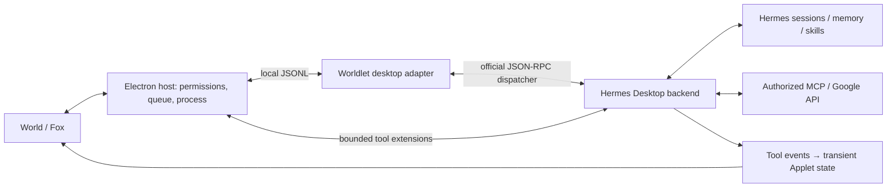

# Hermes desktop runtime

Fox's normal chat, and basic chat before private consent, run on the Desktop/TUI JSON-RPC backend of pinned Hermes 0.21.3. Upstream is not modified, no web service is started and no network port is opened.

## Path

`harness/hermes/desktop.py` embeds the official backend into Worldlet's resident Python process and speaks the protocol through its `Transport` and `dispatch`; there is no Electron window. Backend heartbeat and orphan-session cleanup are started through the two upstream lifecycle functions. Upgrading Hermes requires re-verifying these integration points.

## Current behaviour

| Item | Behaviour |
| --- | --- |
| Conversation | The official backend creates and holds the agent; Worldlet submits `prompt.submit` |
| Sessions and history | `session.resume` by stored ID, falling back to `session.create`; the mapping from UI session to Hermes session lives in `worldlet-desktop-sessions.json` in the profile. History and external data are not copied |
| Workspace | The session cwd is pinned to `worldlet-workspace/` inside the profile so parent-directory project rules never reach Fox |
| Stop | `session.interrupt` first and the process is kept; the worker is killed only after 12 s without completion |
| Applet feedback | Official `tool.start` / `tool.complete` events are projected to Applet activity; tools are never executed twice |
| Native tools | Separate input dispatch matched by request and call ID; cancel is delivered even while a tool is pending |
| Model and connections | Existing profile model configuration, MCP and OAuth are reused; on resume the current model is synced with `config.set` so an old session cannot bring back a previous model |
| Attached MCP writes | Shared untrusted-turn rule in `core/agent/turn-trust.*`, enforced at Hermes dispatch by `turn_trust.py`: once a tool in the turn returns untrusted content (web, email, documents, MCP or other tool results), MCP tools without `readOnlyHint` are denied for the rest of the turn with the reason returned to the model; no prompt, read-only tools and trusted turns run automatically. Owned profiles keep their read-only MCP surface ungated |
| Memory and skill writes | Same rule, every profile, installed once by `turn_trust.install`: after an untrusted read, `memory` (wrapped at `tools.memory_tool.memory_tool`, which Hermes calls outside the registry) and `skill_manage` are denied with the reason returned. Background review is skipped for any conversation snapshot containing an untrusted tool call. Each routine run is its own scope. This is a runtime rule, so no profile config is migrated and attached profiles' `write_approval` is untouched |
| Memory and skills | Stored by Hermes; the private profile may use its SOUL |
| Default persona | Worldlet's own Hermes never introduces itself as Hermes Agent: `persona.py` makes the companion's persona Hermes' seeded `SOUL.md` and its no-SOUL identity, and drops Hermes' pointer to its own docs. On every start a `SOUL.md` that is exactly a Hermes default (or begins with one, ahead of a brought Agent's persona) becomes the companion's; a persona the person wrote, brought or cleared is kept, and an attached profile is never patched. `scripts/companion-soul-check.py` and the loopback persona check hold this |
| Standard Hermes Agent | People with no Hermes Agent of their own get one (owner decision 2026-10-07: Worldlet is not an Agent of its own): Fox's private profile stays in the library and the standard location (`~/.hermes`, `%LOCALAPPDATA%\hermes` on Windows) points at it, and on macOS and Linux `~/.local/bin/hermes` runs the official command line on this runtime (`hermes_command.py`), borrowing the Codex sign-in read-only when that is the profile's model; its resident gateway, which Hermes runs as `python -m hermes_cli.main`, borrows it too through a hook Worldlet writes into this runtime's site-packages (`borrow_codex_for`; [kept running](../../core/agent/PORTABILITY.md#hermes-agent-kept-running)). `standardHermes` in `platform/electron/src/modules/agent-runtime/hermes-files.ts` never replaces a profile or command of the person's own; `scripts/hermes-command-check.py` and the agent-runtime module check hold this |
| After a crash | No automatic redo; Desktop auto-continue is disabled to avoid repeating external actions |
| Server requests | Approval, clarification and password prompts from the backend are always declined; nothing is auto-approved |

Setup, sample and private profiles stay isolated. The setup profile disables private memory and private tools and uses the official MCP server filter so it cannot discover private connections. The current view enters the outgoing model request as untrusted reference data through official middleware and is not written to history; legacy full-world snapshots were moved out of active history with the official archive/compact API, keeping the original transcript. See [Fox performance](../../ui/companion/CONVERSATION.md#fox-performance).

## Mid-run additions

Fox uses the official `session.redirect`. While a model request is in flight Hermes cancels the old generation, keeps valid context and reconsiders with the addition; while a tool is running the message is delivered as a steer and folded in after the tool completes, without redoing finished tools. Worldlet only delivers messages and receipts over the JSONL control channel.

Messages that arrive during preparation wait in the transport and are delivered after `message.start`; a message that lands exactly on the completion boundary continues the same session through `prompt.submit`. Stale request IDs are rejected; the UI submits normally right after a task ends and keeps the draft on transport failure. Stop cancels the whole active task. Typed additions and final voice transcripts share this path.

There is no visible FIFO of Fox messages. The official `queued` receipt means waiting for the current atomic tool, not a separate question. Reasoning settings come from Hermes configuration; navigation and music intents in text are Hermes tool choices; buttons execute immediately.

## Not enabled

- Official server-request UI (approval, clarification, password entry). Such requests are declined; Fox guidance and native permission paths continue to work.
- Event replay, multi-session selection and delegated-task UI.
- Any service that keeps running after the app quits.
- User-triggered legacy content analysis remains a separate one-shot path without memory or tools; Fox chat never falls back to it.

## Verification

The `test:hermes*` checks use real pinned Hermes, a loopback model fixture and a disposable profile; the host check uses a Hermes-free frame fixture. No user account is touched.

- `npm run test:hermes`: model request shape and headers, MCP lazy load / read / filter, Applet events, cross-process memory, skills, analysis isolation, and development tier routing to the local Codex sign-in.
- `npm run test:hermes:desktop`: resume by stored ID, full history after restart, tools run once, stop while streaming and while waiting on a native tool, same process afterwards, parent-directory rule isolation.
- `npm run test:hermes:steer`: additions during preparation, streaming and tools; restart persistence; cancel recovery; stale control messages.
- `npm run test:electron` (module `agent-runtime`): the Electron host's resident worker (`platform/electron/src/modules/agent-runtime/hermes-worker.ts`) against a frame-compatible fixture: tool round trip, steering, cooperative cancel that keeps the warm process, relaunch after an error frame, foreground preemption of background work, model-change notification and memory-file edits with rollback. Set `WORLDLET_CHECK_HERMES_PYTHON` to also ask the real `host.py` for status.
- Not yet ported to Electron: an end-to-end World → host → real Hermes → tool-receipt check (consent, transient Applet results, note writes, sample isolation, resume) and crash/quit-cleanup coverage. The native-host versions of these checks retired with #996.

## Search

No extra search API key. Hermes's DDGS provider is pinned to 9.13.0 (`harness/hermes/runtime.json`) and installed by `npm run setup:hermes`. Results include snippet and URL; Fox should cite sources. Hermes's `web_extract` needs a separately configured extraction provider, which DDGS does not offer; to read a whole page use the embedded browser. Rate limits and failures are reported, not disguised as results.

Search belongs to the full Fox tool set after private consent. The setup profile keeps only basic chat plus the controls, preference and music tools.

## Routines

Example: "Every morning at nine, check for Three.js news and give me a summary with links."

Fox calls `manage_routines` (`harness/hermes/routines.py`):

- `list`: jobs, state, next run and the computer's current time.
- `create` / `update`: goal and schedule. Schedules are a Hermes interval, an ISO time with timezone or a five-field cron expression.
- `pause` / `resume` / `remove`.
- `result`: the latest result saved by Hermes.

Scheduled jobs brought from another Agent at setup (OpenClaw, Hermes Agent) arrive through the host's `routineImport` (`import_jobs`): each becomes an ordinary Worldlet routine marked with its source key (`openclaw:…`, `hermes:…`), so bringing them again replaces the copy ([the rest of a local Agent](../../core/agent/PORTABILITY.md#bringing-the-rest-of-a-local-agent)).

Routine writes follow the shared turn-trust rule (#404, [World storage](../../core/items/STORAGE.md)): Hermes passes the operation to the host's `_world_authorize`, and `create`, `update` or `resume` in a turn that has already read email, web, document or other untrusted content is denied automatically, so injected text cannot schedule work. Direct requests run without confirmation; pause and remove always run.

The host's `HermesRoutines` (`platform/electron/src/modules/agent-runtime/hermes.ts`) ticks every 60 s while the app is open, `cloudConsent` is on and Sample Mode is off, and claims at most one due job per tick through a background lane, so chat never waits for a job. With Hermes Agent kept running as a login service ([kept running](../../core/agent/PORTABILITY.md#hermes-agent-kept-running)), its gateway's own cron runs them also while Worldlet is closed, through Hermes' same claim, so never twice. After the app reopens, Hermes's due and missed-run rules apply; runs during sleep are not guaranteed and missed runs are not all replayed. One-off jobs are protected from double execution by Hermes's claim and completion records.

Jobs may use web search, Hermes memory and skills, Worldlet read-only source tools and enabled MCP servers. They have no embedded browser, Apple permission bridge, shell, scripts, desktop control, payments, messaging or routine-creation tools. Only jobs created by Worldlet run; jobs edited externally into script, monitor or external delivery modes are paused and flagged for review.

Job output stays in Hermes `cron/output/`, not in the Worldlet item store. After a run Fox shows a hint and can be asked for the result. There is no daemon: quitting the app, switching to Sample Mode or revoking consent stops scheduling. External reads already made cannot be undone.

Browser automation is owned by the [embedded browser contract](../../platform/browser/INTEGRATION.md).
Hermes invokes that capability; it does not start a second browser planner or
receive arbitrary CDP authority. `test:hermes:routines` exercises routine lifecycle
and restricted tools with fictional IO; real-account outcomes require separate evidence.
