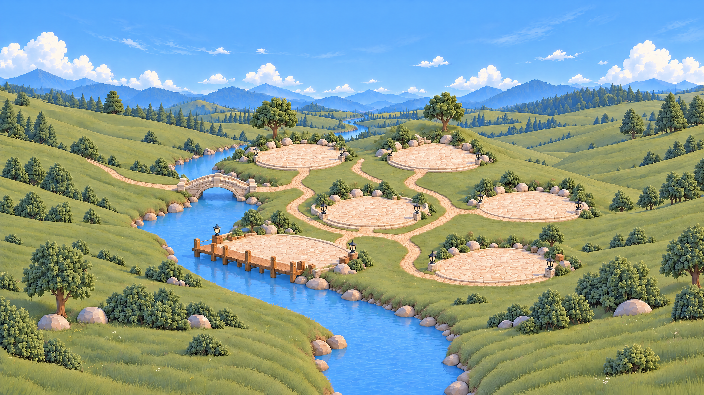
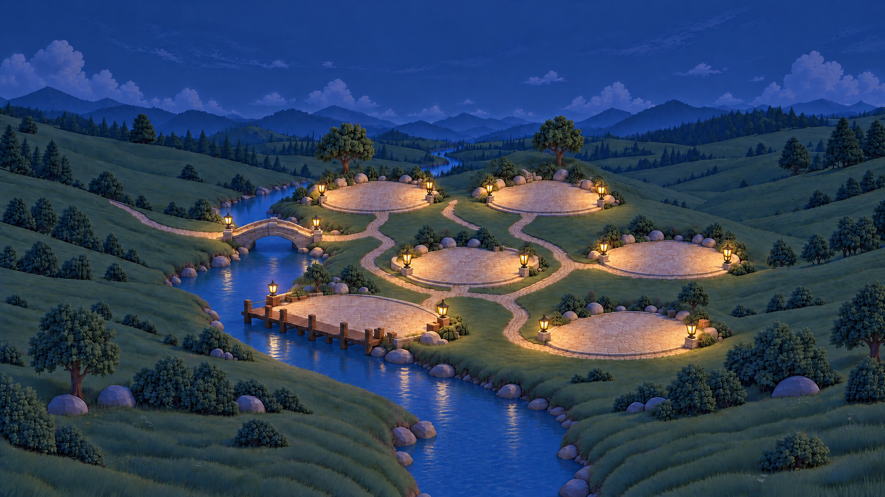

# Cozy miniature — the single visual authority

The currently used artwork defines **cozy-miniature@1.0.0**, as requested on 2026-09-23. The live native 4K day/night plates below are the World baseline; the manifest's existing Applet and Fox assets are the matching component baselines. They control shape, material, detail density, atmosphere and character—not just hue. References point directly to consumed assets rather than duplicate image copies.

## Day target

## Night target

These are the Village 1.7 native 3840 × 2160 modular terrain plates. Small landmarks are independent sprites in `resources/worlds/village/images/landmarks/`, anchored behind five device positions per region. Current defaults are Home, Work, Create, Life, Tools and Explore; names and landmark themes can be customized independently. Previous source plates remain provenance.

The manifest's `landmarks` registry pairs day and night artwork for the cottage, reading shelter, fountain, tree/bench, forge and boat. Native and website builds use the same registry. The night variants contain authored moonlight, warm light and material reflections; do not apply the old ambient tint/grade again. Their painted bounds align to the day landmark's placement and crossfade using the terrain's shared lamp amount. Theme changes select both variants. See [night artwork prompts and provenance](../../worlds/village/images/landmarks/NIGHT.md).

## Applet and Fox baselines

Use each Applet's existing `peek`, `open` and `focus` resources from `style.json` (the Village theme package) for new related artwork. Fox uses the registered expression atlas, animation sheets and rig; brand/HUD uses the existing mark master and `tokens.json` (the Village theme package). A world layout change does not authorize reinterpreting those components.

HUD controls also use the registered [warm paper material family](assets/hud/README.md):
ivory painted surfaces, moss ink, honey emphasis and shallow rounded forms. Fox's
dialogue retains an irregular soft silhouette and separate name tab; it must not
become a rigid fixed-height panel. UI text remains live and world lighting never
grades the material or reading text.

## What must look consistent

- An inviting miniature landscape: central cottage, reading nook, sheltered terraces, open installation courts, garden and river dock. Preserve the current combination of open grounds and small landmarks rather than forcing every area into a new building.
- Rounded, slightly chunky construction, readable silhouettes, soft matte plaster, broad timber grain, gently irregular stone, terracotta/slate roofs and foliage in soft masses. No photoreal grass blades, noisy masonry, shiny plastic, harsh dark outlines or flat paper cutouts.
- Soft sage/yellow-green meadow, muted blue water and hazy mountains, ivory plaster, subdued timber and terracotta; amber is local to small lights, Fox and meaningful state.
- Environment detail is quieter than Applet devices. Leave usable supported ground naturally in front of or beside buildings; do not convert every area into a giant empty plaza.
- World, Applet Peek/Open/Focus and Fox share camera direction, plausible ground scale, material finish, contact shadows and light. Maintain each provider's true brand identity without turning generic Mail/Calendar/Browser/Meetings into invented brands.
- Fox keeps the existing orange/cream identity, scarf and rounded friendly proportions. Character resources are registered in this pack; do not copy illustrative HUD controls from a reference.
- Runtime text, source records, statuses and controls are never painted into environment/device artwork. Branded device artwork may embody the original logo as its dominant sculptural shape; this is an explicit exception for identity, not live content. Original content is not restyled into fabricated data.

## Lighting and readability

### Weather icon family

`ui/components/weather-icons.ts` owns the scalable colored SVG family shared by the upper-right
weather control and forecast Applet: warm-gold sun, pale-gold moon, gray-white
clouds, blue rain, ice-blue snow, fog and amber lightning. Partly cloudy variants
combine a cloud with the sun or moon. Unknown data uses a neutral dash in the
forecast; the HUD retains its explicit setup/loading/unavailable text instead
of inventing weather. The HUD icon box is 28 × 28 CSS pixels with a 10px text gap,
within the existing 28px row; other environment rows retain their spacing.

### Scenery grading

`tokens.json.sceneryTone` (in the Village theme package) is the shared runtime scenery grade: Pixi saturation
-0.18 and contrast -0.16. Terrain and independent day/night landmarks use this
same restrained treatment. Applet artwork, Fox, HUD and Focus content do not.
Filters inherit renderer resolution: this is color grading, never overview blur
or texture downsampling. Existing day/night lighting remains independent.

Use one shared time state. Day is gently warm and diffuse. Night has cool readable ambient light plus local warm windows/lamps; preserve material identity and grounded silhouettes. Night is not merely daylight tinted blue, nor permission to rebuild geometry.

World devices receive the shared grade. Open/Focus foreground devices retain the existing neutral readability fill. HUD, reading text and embedded websites stay ungraded; HUD Fox receives only restrained ambient tint. Weather does not dim the whole scene. Reduced motion freezes decorative movement.

Painted cast shadows cannot physically rotate with the sun. Registered day/night artwork, dynamic celestial/weather layers, shared grading and independent occlusion are different responsibilities. Do not infer completed masks, moving shadows or walking Fox from a beautiful image.

## Production and acceptance

1. Use the current World/Applet/Fox baselines registered by this pack, explicitly labelling style versus geometry inputs. Historical concepts and recently generated drafts must not silently replace them.
2. State area semantics, camera, intended size, usable ground, anchor and clearances. Every Applet has a named supported slot; HUD has reserved space.
3. Generate native-resolution artwork and preserve the exact prompt, input identity, model, date and unmodified output. User-directed reference exceptions must be recorded.
4. Inspect the composed world with representative existing Applets and Fox at overview and close view. Check visual language, doorway/ground clearance, alpha edges, contrast, scale and occlusion.
5. For night, hold the accepted day geometry fixed and check landmark registration before any blend. Day approval does not approve night.
6. Run schema/resource checks and the palette guard. These find missing resources, unsafe paths, bad coordinates and coarse oversaturation—not aesthetic acceptance.
7. A generated world stays draft until visual acceptance. Do not replace live artwork automatically, copy over targets, or change user data during resource production.

## Ownership

[`style.json`](../../../ui/theme-packages/village/style.json) registers references and World/Applet/companion/brand resources. [`tokens.json`](../../../ui/theme-packages/village/tokens.json) holds world/HUD appearance values. `../../../ui/components/style.ts` is the shared immutable code entry point. Functional render/interaction code, capability adapters, permissions and user records remain outside the pack.

Only this built-in style is supported. No user style loader, executable pack or override mechanism is enabled.

### Ground Applet bases

Reserve an artwork-integrated status-lamp socket when generating new Applets,
using the existing Discord lamp as the visual reference. Keep its position and
emission mask with the asset for later runtime coloring. The four-state policy
is recorded in `core/attention/README.md`; its generic overlay is currently hidden
and visual implementation is deferred. Do not repaint existing devices yet.

Ground devices, including logo sculptures, mascots and direct Mac launchers, use compact low bases to sit naturally in the village. Use warm timber throughout the base, with rounded wooden edges and sparse brass fasteners matching the existing devices. No stone or ivory rim. The device should read as a solid tabletop figurine firmly resting on its wooden base. A functional cabinet or dock can already provide the base. Preserve logo prominence, visible support/contact shading, shared perspective and the saved foot anchor; do not add landscape islands or tall display pedestals. See the Applet design guide for proportions and acceptance criteria.

Base consistency means shared materials and grounding, not identical silhouettes. Vary the base by function (dock, lectern, calendar stand, writing tray) while keeping its visual weight subordinate to the identity.

All Applet figurines share a screen-left-facing front, visible right side and top, gentle 18–22° yaw and 25° elevation. Keep verticals upright, supports level and weight visibly supported. Re-render the viewpoint; never mirror lettering or asymmetric publisher logos. Functional bases may vary, but their timber finish and grounded contact remain consistent.
