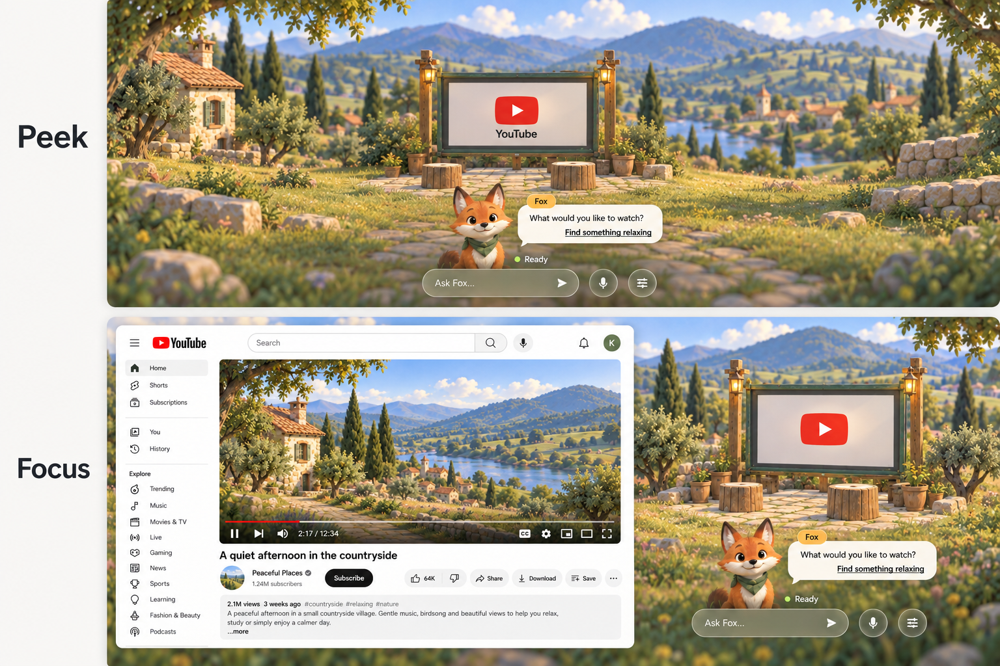

# YouTube web Applet — Focus concept

Design approved and initial runtime implementation completed, 2026-09-18. The images remain concept artwork, not captured live pages. See [YouTube implementation](../../../../../core/applets/INTEGRATIONS.md#youtube-applet) for tested behavior.

Latest revision: the same outdoor cinema is used in Peek and Focus. The original [Focus study](focus-concept.png) is retained for reference; its alternate Fox layout is superseded by the continuity rules below.

## Interaction contract

- **Peek → Focus:** selecting the YouTube device opens its actual website directly, skipping a native Open stage.
- The world continues to fill the window. The website occupies approximately the left two-thirds; the grounded cinema device and Fox occupy the right third.
- Keep YouTube's own navigation and playback controls. Do not add a Worldlet address bar, tab strip, or close button. Only the generic Browser has tabs (owner request 2026-10-07).
- Clicking the world outside the content returns to the previous level. Closing the browser must unload media so audio stops.
- Fox provides contextual assistance through the existing conversation and restrained bold, underlined suggested actions. Suggested actions must reflect implemented capabilities.
- **Fox moves as one unchanged HUD group.** Transitioning from center to right changes its anchor only. Preserve dialogue geometry, name badge, typography, input, status and action placement; do not introduce a browser-specific Fox layout. Preserve the conversation, draft input, focus and current actions during the move. A position change alone must not regenerate suggestions or restart a conversation.
- **One cinema identity in both states.** Peek uses the same sage screen, timber supports, contact shadow and small seating area as Focus. Focus may enlarge/reposition that device, but must not replace it with another device. Keep the YouTube label/logo closely attached to the device, using the same treatment in both states.
- Use only the contextual title, YouTube, at the top. Do not add World or Worldlet branding above it.

## Visual provenance and implementation notes

Generated with the built-in imagegen tool. Composition references the bottom-right web fallback panel of `../v7/applet-interaction-concept-v1.png`; palette/material reference is `../../../resources/styles/builtin/assets/world/palette-reference.png`.

Generation brief: one full-window desktop screenshot; clean white, readable YouTube webpage on the left; painted dimensional sage-green outdoor cinema and friendly orange Fox with a green scarf on the right; soft pastoral daylight and blue distant mountains; reduced ornamental chrome; amber Fox name tag; no additional browser navigation or close controls.

The Peek/Focus revision was generated from the original Focus study with a two-panel continuity brief: the same cinema and unchanged Fox group, centered in Peek and translated right in Focus. The image illustrates spatial continuity, not a replacement HUD specification. Its generated extra microphone/settings buttons and small bubble tails must not be adopted; reuse the existing shared Fox controls and pointer-free dialogue. Use identical logo placement in both runtime states despite the illustration's label variation. These are design assets only, not implemented views.

The website, video, metrics, branding and text in this image are illustrative, not a captured live YouTube page. Implementation must load the real website and use existing official branding assets. The artwork is a composition reference, not a sprite sheet. Generated flowers and lit daytime lanterns are not requirements: keep the actual scene restrained and follow the existing daytime lighting standard. Preserve the current Fox dialog navigation and dismissal behavior rather than copying the illustrative bubble tail.
