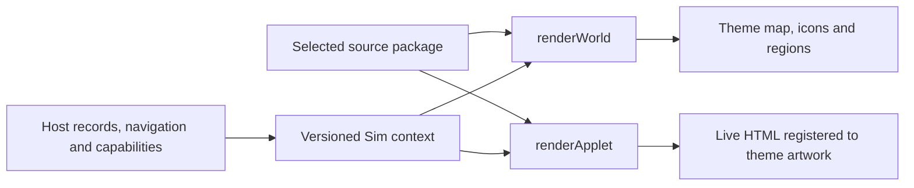

# Build-time Sim contract v2

A Sim is a trusted, self-contained **presentation source package**. Worldlet copies one package at development/build time and compiles it. The main repository owns the executable [TypeScript contract](../../ui/themes/build-theme-contract.ts), [import validator](../../scripts/build-theme-source.ts) and consumer adapters. Copies in an authoring repository are references, not another authority. There is no runtime download or theme switcher.



## Package and validation

```text
package/
  theme.json          # contractVersion: 2, id, title, applets, optional updatedAt
  presentation.json   # validated scenes, coordinate systems, slots, tokens, fonts
  entry.ts            # default export implements BuildTheme
  theme.css
  assets/             # every background, icon, font and license
  ...                 # package-local helpers / scene data / provenance
```

`theme.json` fixes `entry: "entry.ts"`, `stylesheet: "theme.css"`, `assets: "assets"`, and `presentation: "presentation.json"`. `applets` lists bespoke scenes; each ID must have a matching presentation. IDs not listed use `fallback`, including future Applets. There is no inherited Village requirement or host registry edit per package.

Themes do not have release version numbers. Optional `updatedAt` records the last source modification as a UTC timestamp (for example, `2026-10-09T23:14:20Z`); it is informational, not a compatibility gate. `contractVersion` alone controls interface compatibility; source hashes identify the copied contents.

The importer validates contract compatibility, paths, unique Applet IDs, mandatory render functions, browser compilation, scene rectangles, font declarations and referenced assets. It rejects symlinks, unresolved LFS pointers, missing assets, CSS imports, external CSS URLs, private host imports and Node dependencies. Only local source and **type-only** `@worldlet/theme` imports are supported. Source is compiled without executing it during validation. Validated staged bytes replace `ui/selected-theme` atomically; hashes are recorded, failed imports keep the previous selection, and builds remove stale output assets.

This is trusted reviewed application source, not a sandbox. Static validation cannot prove accessibility, resource references constructed by code, or renderer behavior. The UI acceptance checks below are also required.

## Callable interface

```ts
const sim: BuildTheme = {
  contractVersion: 2,
  id: 'your-theme',
  renderWorld(context) { /* return update / event / anchor / dispose */ },
  renderApplet(context) { /* return dispose */ }
};
export default sim;
```

| Interface | Inputs / responsibility |
| --- | --- |
| `renderWorld` | Owned host element, scene, world snapshot, navigation, menu and move capabilities. Theme draws the map, areas, Applet icons, hover and drop targets. |
| World `update` | Current view, stable Applet IDs and titles, availability, counts, regions, pinned slots, environment, motion and interaction hints. No credentials or host DOM internals. |
| World `event` | `mail.received` and `applet.arrived`; return whether the theme presented the cue. Respect reduced motion. |
| World `anchor` / `bounds` | Applet anchor and hit rectangle in CSS pixels relative to the host, or null. Background, button and anchor must use the same transform. |
| `renderApplet` | Applet identity, selected scene, display records, loading/connection/error state and capabilities. Every ID must render, using the generic scene when necessary. |
| `actions.openItem` | Open a supplied ID through the original host reader. Unknown IDs are ignored. |
| `actions.records` | Optional save/remove methods, supplied only for supported writes. Current host exposes local Calendar operations. A theme cannot create unavailable account capabilities. |
| `renderDefault` | Mount the host's richer reader inside a theme-owned content slot, e.g. the full Calendar grid. |
| `invalidate` | Request a fresh render from current host data. |
| `dispose` | Remove listeners, observers, timers, animations and mounted nodes. Applet disposal runs before replacement, hide and host destruction. World disposal runs on host destruction. |

Records cross the boundary as readonly display fields and `Record<string, unknown>`, not an untyped calendar-only API. Source-specific records require narrowing in the theme. Treat all records as immutable; presentation may keep transient selection, search, draft and camera state. Navigation, persistence, accounts, authorization and external websites stay in the host. Busy/error states reflect the actual supplied action result.

## Scene registration: background and HTML

Each world, bespoke Applet and fallback declares:

| Field | Meaning |
| --- | --- |
| `size: [width, height]` | Authored reference canvas in pixels; current Village uses 1500 × 844. |
| `background` | Package-relative asset path, e.g. `assets/mail-scene.png`. |
| `slots.content` | Required normalized `[x, y, width, height]` rectangle on that canvas. |
| Other `slots` | Theme-defined regions, e.g. `header`, `week`, `reader`, `toolbar`. |
| `hud` | Explicit top, companion and speech rectangles; Attention, Today and dialog rectangles or the deliberate choice `"shared"`. |

All coordinates start at the top-left. Rectangles must be finite, positive and inside `[0, 1]`. Fit the canvas with `scale = min(hostWidth / width, hostHeight / height)`, center it, and transform **both background and HTML once**. Do not stretch artwork independently from live HTML. Slot elements expose `data-sim-slot="content"` etc. for acceptance checks. Content overflow scrolls inside its slot; user text must not paint into decorative or companion areas. A package can implement perspective or a different world camera internally, provided the same transform and pointer geometry apply to artwork and controls.

HUD rectangles are viewport-normalized so shared controls remain usable independently of camera zoom. Their surfaces have stable classes: `.ui-theme-top`, `.ui-theme-companion`, `.ui-theme-speech`, `.ui-theme-attention`, `.ui-theme-today`, `.ui-theme-dialog`. The host maps them to existing functional components. Settings, History, Journal, weather, sound and notifications retain their shared actions and are styled through these owning surfaces and public component classes. Themes do not query private IDs. Full account/settings/companion behavior is intentionally shared, while scene composition, map and Applet presentation are package-owned.

## Typography, controls and assets

Required semantic tokens: `bodyFont`, `displayFont`, `bodySize`, `titleSize`, `ink`, `paper`, `accent`, `focus`, `radius`, `controlHeight`. The host publishes `--sim-body-font`, `--sim-body-size`, etc. Body size is at least 12 reference pixels and control height at least 32; choose larger sizes when the scene permits. Bundled fonts declare both `file` and `license`; include system/CJK fallbacks. Shared fonts use an empty font list.

Buttons must be real controls with default, hover, pressed, focus-visible, disabled and busy states. Keep keyboard navigation, accessible names and visible focus. `aria-busy` represents pending operations; errors preserve drafts and offer retry. Backgrounds never replace live text or controls with screenshot hotspots. User content uses text nodes or the host's sanitized reader.

Assets at `assets/...` are published to `theme-assets/...`; source packages must ship every required asset. Theme CSS is appended after shared styles and should scope presentation rules to its owned roots or the public shell classes. The generic shared component/companion artwork remains available as host UI; a package does not need to duplicate product behavior.

## Authoring and acceptance

```sh
npm run theme:source-check -- /path/to/themes/your-theme/package
npm run theme:import -- /path/to/themes/your-theme/package
npm run build:native-ui
npm run test:theme-source
npm run test:sim-ui
npm run theme:preview
```

`test:sim-ui` uses the production World adapter and Applet stage with fictional records in a hidden Electron window. It checks World → Applet → original action → World, an unknown Applet, loading/error, slot registration under resize and disposal. `test:theme-ui` adds the Village four-scene and Calendar save checks. `node scripts/build-sim-shell-check.ts` checks actual application boot, shared shell and public navigation with a stub host. These do not claim authenticated account coverage or acceptance of every Applet.

Before a theme is marked production-ready, inspect the full shared shell at 1500 × 844: HUD and companion overlap, text clipping, long content, empty/loading/error, keyboard focus, busy/failed edits and reduced motion. Capture both map and Applet evidence. Run the same consumer with a second package, without source edits, to verify replacement. Village is the artwork-rich implementation; Blueprint is a deliberately small independent reference implementation proving the contract, not a replacement for production visual acceptance. The legacy Hogwarts overlay is not a v2 package.

## Compatibility

V2 replaces the Applet-only v1 interface and requires migration; incompatible versions fail before copying. Changes that remove fields, change coordinate meanings or lifecycle semantics require a major contract version. Additive optional capabilities can remain on v2. Main-repository adapters absorb product data changes so packages can change independently. The old data-only `ThemePack` remains a compatibility owner for shared built-in UI assets; it is not the Sim source API or a runtime switching mechanism.
