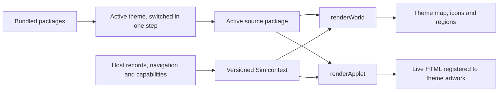

# Theme contract (Sim contract v2)

Every Worldlet theme implements this one interface. A theme is a trusted, self-contained **presentation source package**. Worldlet bundles every package in `ui/theme-packages/<id>/` and the person switches between them in one step (Settings → Theme). The main repository owns the executable [TypeScript contract](../../ui/themes/build-theme-contract.ts), [import validator](../../scripts/build-theme-source.ts), [registry and switch](../../ui/themes/build-theme.ts) and consumer adapters. Copies in an authoring repository are references, not another authority. Packages are compiled into the app; nothing is downloaded or evaluated at runtime.



## Package and validation

```text
package/
  theme.json          # contractVersion: 2, id, title, applets, optional updatedAt
  presentation.json   # validated scenes, coordinate systems, slots, tokens, fonts
  entry.ts            # default export implements BuildTheme
  theme.css
  assets/             # every background, icon, font and license
  ...                 # package-local helpers / scene data / provenance
```

`theme.json` fixes `entry: "entry.ts"`, `stylesheet: "theme.css"`, `assets: "assets"`, and `presentation: "presentation.json"`. `applets` lists bespoke scenes; each ID must have a matching presentation. IDs not listed use `fallback`, including future Applets. There is no inherited Village requirement or host registry edit per package.

Themes do not have release version numbers. Optional `updatedAt` records the last source modification as a UTC timestamp (for example, `2026-10-09T23:14:20Z`); it is informational, not a compatibility gate. `contractVersion` alone controls interface compatibility; source hashes identify the copied contents.

The importer validates contract compatibility, paths, unique Applet IDs, mandatory render functions, browser compilation, scene rectangles, font declarations and referenced assets. It rejects symlinks, unresolved LFS pointers, missing assets, CSS imports, external CSS URLs, private host imports and Node dependencies. Only local source and **type-only** `@worldlet/theme` imports are supported. Source is compiled without executing it during validation. Validated staged bytes replace `ui/theme-packages/<id>` atomically and regenerate the registry `ui/theme-packages/index.ts`; other packages are untouched, hashes are recorded in each `source-lock.json`, failed imports keep the previous copy, and builds remove stale output assets. Removing a theme is deleting its directory and re-running the import of any package (or `writeThemeRegistry`).

This is trusted reviewed application source, not a sandbox. Static validation cannot prove accessibility, resource references constructed by code, or renderer behavior. The UI acceptance checks below are also required.

## Callable interface

```ts
const sim: BuildTheme = {
  contractVersion: 2,
  id: 'your-theme',
  renderWorld(context) { /* return update / event / anchor / dispose */ },
  renderApplet(context) { /* return dispose */ }
};
export default sim;
```

| Interface | Inputs / responsibility |
| --- | --- |
| `renderWorld` | Owned host element, scene, world snapshot, navigation, menu and move capabilities. Theme draws the map, areas, Applet icons, hover and drop targets. |
| World `update` | Current view, stable Applet IDs and titles, the host's picture of each Applet (`icon`, to show wherever the theme has no art of its own), availability, counts, regions, pinned slots, environment, motion and interaction hints. No credentials or host DOM internals. |
| World `event` | `mail.received` and `applet.arrived` (fired when Applets are unlocked; optional `from: 'center'` with their `icons`, or `settled` when they are already in place); return whether the theme presented the cue, or a promise for an arrival that settles when the Applets have landed. Respect reduced motion. |
| World `anchor` / `bounds` | Applet anchor and hit rectangle in CSS pixels relative to the host, or null. Background, button and anchor must use the same transform. |
| World `marks` (optional) | Report where the host draws its shared overlays (`applet`, `area`, `area-add` and `slot` marks: position, visibility, name, lamp and attention offsets). A theme that calls it draws no buttons, names or lamp labels of its own; the host draws the same ones in every theme. |
| World state, optional fields | Per Applet: `lamp` (`off`, `ready`, `processing`, `error`, as the host shows it), `connected`, `mine`, `object`. Interaction: `locked` (first use), `covered` (tour, dialog or preview over the World), `detailOpen`, `website`. `paused` when nobody can see the World. |
| World `back` (optional) | Leave the open area or Applet, as the host's Back does. |
| Mount `behindApplet`, `picture`, `metrics` (optional) | Keep the World drawn behind an open Applet; a picture of the screen for the zoom between World and Applet; renderer facts for checks. |
| `renderApplet` | Applet identity, selected scene, display records, loading/connection/error state and capabilities. Every ID must render, using the generic scene when necessary. |
| `actions.openItem` | Open a supplied ID through the original host reader. Unknown IDs are ignored. |
| `actions.loadMore`, `data.scope` (optional) | Read more items, when the host can; what the items cover when it is not everything. |
| `actions.records` | Optional save/remove methods, supplied only for supported writes. Current host exposes local Calendar operations. A theme cannot create unavailable account capabilities. |
| `renderDefault` | Mount the host's richer reader inside a theme-owned content slot, e.g. the full Calendar grid. |
| `invalidate` | Request a fresh render from current host data. |
| `asset(path)` | Published URL of a package-relative `assets/...` path, on both World and Applet contexts. Packages never hard-code where the host serves their files. |
| `dispose` | Remove listeners, observers, timers, animations and mounted nodes. Applet disposal runs before replacement, hide and host destruction. World disposal runs on host destruction. |

Records cross the boundary as readonly display fields and `Record<string, unknown>`, not an untyped calendar-only API. Source-specific records require narrowing in the theme. Treat all records as immutable; presentation may keep transient selection, search, draft and camera state. Navigation, persistence, accounts, authorization and external websites stay in the host. Busy/error states reflect the actual supplied action result.

## Scene registration: background and HTML

Each world, bespoke Applet and fallback declares:

| Field | Meaning |
| --- | --- |
| `size: [width, height]` | Authored reference canvas in pixels; Village Map uses 1500 × 844. |
| `background` | Package-relative asset path, e.g. `assets/mail-scene.png`. |
| `slots.content` | Required normalized `[x, y, width, height]` rectangle on that canvas. |
| Other `slots` | Theme-defined regions, e.g. `header`, `week`, `reader`, `toolbar`. |
| `hud` | Explicit top, companion and speech rectangles; Attention, Today and dialog rectangles or the deliberate choice `"shared"`. |

All coordinates start at the top-left. Rectangles must be finite, positive and inside `[0, 1]`. Fit the canvas with `scale = min(hostWidth / width, hostHeight / height)`, center it, and transform **both background and HTML once**. Do not stretch artwork independently from live HTML. Slot elements expose `data-sim-slot="content"` etc. for acceptance checks. Content overflow scrolls inside its slot; user text must not paint into decorative or companion areas. A package can implement perspective or a different world camera internally, provided the same transform and pointer geometry apply to artwork and controls.

HUD rectangles are viewport-normalized so shared controls remain usable independently of camera zoom. Their surfaces have stable classes: `.ui-theme-top`, `.ui-theme-companion`, `.ui-theme-speech`, `.ui-theme-attention`, `.ui-theme-today`, `.ui-theme-dialog`. The host maps them to existing functional components. Fox's speech is the exception: it keeps the shared Fox layout (centred under a small artifact card, in the reader's companion lane beside an Applet), so `speech` reserves room the theme's content must stay clear of rather than moving Fox's reply. Settings, History, Journal, weather, sound and notifications retain their shared actions and are styled through these owning surfaces and public component classes. Themes do not query private IDs. Full account/settings/companion behavior is intentionally shared, while scene composition, map and Applet presentation are package-owned.

## Typography, controls and assets

Required semantic tokens: `bodyFont`, `displayFont`, `bodySize`, `titleSize`, `ink`, `paper`, `accent`, `focus`, `radius`, `controlHeight`. The host publishes `--sim-body-font`, `--sim-body-size`, etc. Body size is at least 12 reference pixels and control height at least 32; choose larger sizes when the scene permits. Bundled fonts declare both `file` and `license`; include system/CJK fallbacks. Shared fonts use an empty font list.

Buttons must be real controls with default, hover, pressed, focus-visible, disabled and busy states. Keep keyboard navigation, accessible names and visible focus. `aria-busy` represents pending operations; errors preserve drafts and offer retry. Backgrounds never replace live text or controls with screenshot hotspots. User content uses text nodes or the host's sanitized reader.

Assets at `assets/...` are published to `theme-assets/<id>/...`; resolve them with `context.asset(path)` in code and `url('theme-assets/…')` in CSS (the build rewrites it per theme). Source packages must ship every required asset. Each theme's CSS is published as its own `theme-<id>.css`, loaded after the shared styles; only the active theme's stylesheet is attached, so two themes never style each other. Scope presentation rules to the theme's owned roots or the public shell classes. The generic shared component/companion artwork remains available as host UI; a package does not need to duplicate product behavior.

## What a theme implements

A theme implements four parts. Everything else is the host's and looks the same in every theme.

| Part | Covers | Where in the package |
| --- | --- | --- |
| World | Map, zoomed areas, ambient motion, entering an area or room | `renderWorld`, `presentation.world` |
| Applets | Applet devices, rooms behind an open Applet (Mail's included), cards and frames | `renderApplet`, `presentation.applets` and `fallback` |
| HUD look | HUD material, colors, type, fonts, world log, Attention art | `tokens`, `fonts`, `theme.css`, optional `hud.skin` |
| Sound and event animations | Business-event sounds and the animations for them | optional `sound.events`, `ThemeWorldMount.event` |

Not part of a theme: the companion (Fox, its rig and portrait, where it stands, its reply bubble, panel and nameplate) and pages a theme cannot replace, such as the loading and first-use pages. `hud.companion` and `hud.speech` only reserve room the theme's content stays clear of.

`hud.skin` gives nine-slice pictures for the shared HUD pieces `attention`, `note`, `back`, `log`, `button`, `card` and `frame`: `image` (`png`, `webp` or `svg`), `slice` insets in image pixels and drawn `width` in CSS pixels (at most 64). `sound.events` gives an audio file per business event (`applet.arrived`, `mail.received`, `task.working`, `task.succeeded`, `task.failed`, `task.cancelled`). Anything left out keeps the shared look and sounds, and switching back to Village restores them.

## Switching themes

`ui/themes/build-theme.ts` validates every bundled package when the app loads and keeps one active theme. `switchBuildTheme(id)` is the single step behind Settings → Theme:

1. Prepare the target: attach its stylesheet without applying it, decode every scene painting and warm its fonts. If any of that fails, the current theme stays and nothing is saved.
2. Make it active: apply its stylesheet and tokens, remove the old stylesheet and save the choice on this computer (`worldlet-theme-v2`).
3. Dispatch `worldlet:theme` (`{from,to}`). The World disposes the old theme's World and Applet mounts and renders the same view with the new theme: what is open, records, web sessions and background tasks stay. Pinned places are kept per theme (`ui/themes/theme-placements.ts`).

The default theme, Village, is built in: it is the animated Pixi World (`ui/world/pixi-world.ts`) and carries no package, stylesheet or scene slots. Choosing it removes the last package's stylesheet and scene variables. An unknown or removed saved theme falls back to Village. A package cannot use the id `village`.

## Adding a theme

1. Write a package that satisfies this contract (`npm run theme:source-check -- <dir>`).
2. `npm run theme:import -- <dir>` copies it to `ui/theme-packages/<id>/` and adds it to the registry. No host file needs editing.
3. `npm run build:native-ui && npm run test:sim-ui` runs the shared acceptance check against every bundled theme, switching between them in place.

## Authoring and acceptance

```sh
npm run theme:source-check -- /path/to/themes/your-theme/package
npm run theme:import -- /path/to/themes/your-theme/package
npm run build:native-ui
npm run test:theme-source
npm run test:sim-ui
npm run theme:preview
```

`test:sim-ui` uses the production World adapter and Applet stage with fictional records in a hidden Electron window. For every bundled theme, switched in place, it checks that only that theme's stylesheet is attached, World → Applet → original action → World, an unknown Applet, loading/error, slot registration under resize and disposal. `test:theme-ui` adds the Village Map four-scene and Calendar save checks. `node scripts/build-sim-shell-check.ts` checks actual application boot, shared shell and public navigation with a stub host. These do not claim authenticated account coverage or acceptance of every Applet.

Before a theme is marked production-ready, inspect the full shared shell at 1500 × 844: HUD and companion overlap, text clipping, long content, empty/loading/error, keyboard focus, busy/failed edits and reduced motion. Capture both map and Applet evidence. Run the same consumer with a second package, without source edits, to verify replacement. Village Map (`ui/theme-packages/village-map/`) is the artwork-rich package; Blueprint (`ui/theme-packages/blueprint/`) is a deliberately small independent implementation, drawn entirely from vector art and the host's own readers, that proves replacement and switching. It is not a replacement for production visual acceptance. The legacy Hogwarts overlay is not a v2 package.

## Compatibility

Contract v2 is frozen. `ui/themes/frozen/contract-v2.d.ts` holds its declarations and `scripts/fixtures/theme-contract-v2/` is a package that uses every part of it. `node scripts/theme-contract-check.ts` runs in PR CI (`npm run check:contracts`) and fails when a change would break a package written against v2:

- What a package hands the host (theme, manifest, presentation, mounts) must still be accepted, and what the host hands a package (contexts, state, items, actions) must still carry every field a package may read. No frozen field may be removed.
- The frozen package must still compile and pass import validation.

An additive, optional change passes; refresh the snapshot in the same PR with `node scripts/theme-contract-check.ts --freeze` (it refuses while the change is incompatible). Anything else needs contract v3 with its own snapshot and frozen package. Incompatible versions fail at import before copying. Main-repository adapters absorb product data changes so packages can change independently.

The old data-only `ThemePack` (`ui/themes/theme-pack.ts`) only describes the built-in Village's assets; it is not a theme API and not how themes are switched.
