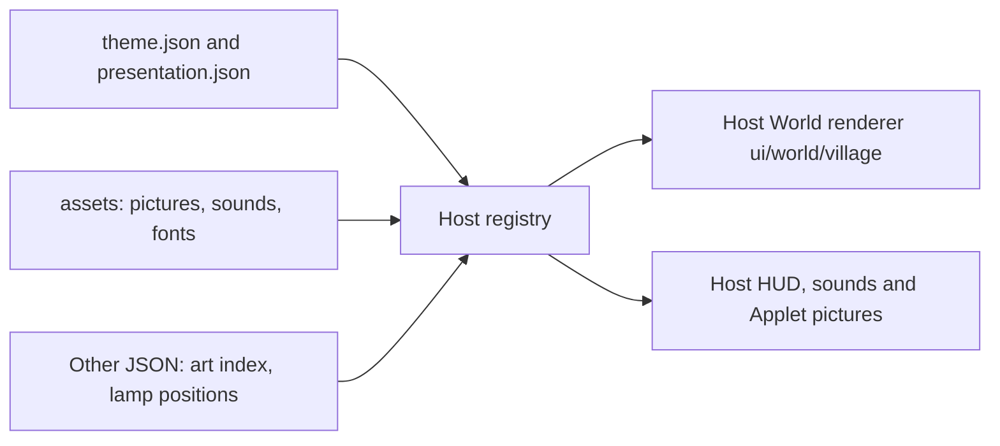

# Theme contract (v3)

A theme is **static**: pictures, sounds, fonts and JSON. It holds no code and no stylesheet, and nothing in it runs. The main repository draws the World and every Applet page itself and reads from the theme only what this contract declares (owner decision 2026-10-10: "Theme 都是静态资源，不要让它去靠什么 render 什么东西了").

Worldlet bundles one theme, the Village, in `ui/theme-packages/village/`; there is no theme picker. The main repository owns the executable [TypeScript contract](../../ui/themes/build-theme-contract.ts), the [import validator](../../scripts/build-theme-source.ts) and the [registry](../../ui/themes/build-theme.ts). Packages are bundled into the app; nothing is downloaded at runtime.



## Package and validation

```text
package/
  theme.json          # contractVersion: 3, id, title, assets, presentation, optional updatedAt
  presentation.json   # tokens, fonts, optional hud, sound and icons
  assets/             # every picture, sound, font and licence the JSON names
  *.json              # other data the host's World code reads (the Village's lamps.json, assets/art.json)
```

`theme.json` fixes `assets: "assets"` and `presentation: "presentation.json"`; any other field is refused. `presentation.json` holds only `tokens`, `fonts`, `hud`, `sound` and `icons`; a field that would place the World, an Applet page or the HUD is refused, because the host lays them out.

Themes do not have release version numbers. Optional `updatedAt` records the last source modification as a UTC timestamp (for example, `2026-10-10T07:10:00Z`); it is informational. `contractVersion` alone controls compatibility; source hashes identify the copied contents.

The importer accepts only static files (`json`, `png`, `webp`, `jpg`, `svg`, fonts, `mp3`, `m4a`, `wav`, `ogg`, `webm`, `txt`, `md`) and rejects code, stylesheets, symlinks, unresolved LFS pointers and any `assets/...` path a JSON file names that the package does not ship. Validated bytes replace `ui/theme-packages/<id>` atomically. The import writes the package's `index.ts`, which imports its JSON for the host (the manifest, the presentation and every other JSON file by package path, which the host reads through `themeData`), records hashes in `source-lock.json` and regenerates `ui/theme-packages/index.ts`. A failed import keeps the previous copy, and builds remove stale output assets.

## What the theme declares

| Field | What the host does with it |
| --- | --- |
| `tokens` | The theme's type and colours: `bodyFont`, `displayFont`, `bodySize` (at least 12), `titleSize`, `ink`, `paper`, `accent`, `focus`, `radius`, `controlHeight` (at least 32). |
| `fonts` | Bundled font files, each with its `license` file. Shared fonts use an empty list. |
| `hud.skin` (optional) | Nine-slice pictures for the shared HUD pieces `attention`, `note`, `back`, `log`, `button`, `card` and `frame`: `image` (`png`, `webp` or `svg`), `slice` insets in image pixels and drawn `width` in CSS pixels (at most 64). |
| `sound.events` (optional) | An audio file per business event: `applet.arrived`, `mail.received`, `task.working`, `task.succeeded`, `task.failed`, `task.cancelled`. |
| `icons` (optional) | The theme's picture of an Applet by Applet key (`png`, `webp` or `svg`). The host shows it everywhere it pictures that Applet: the World, lists, history, the world log and the first-use gathering. |

Anything left out keeps the shared look, sounds and pictures. Brand logos (the HUD title bar, picture-in-picture) stay the host's.

Assets at `assets/...` are published to `theme-assets/<id>/...`; the host resolves them with `themeAssetURL`.

Not part of a theme: how the World and Applet pages are drawn (the host's code), the companion (Fox, its rig and portrait, where it stands, its reply bubble, panel and nameplate), and the loading and first-use pages.

## The Village

The Village package is the one description of the Village: its art in `assets/` (`art.json` indexes it; `scripts/village-art.ts` encodes it from the painted sources), `lamps.json` (where each device's lamp sits), Applet `icons` for every catalog Applet, and the host's pack of it: `pack.json` (space, layout, motion, companion and surfaces; `ui/themes/theme-pack.ts`), `style.json` and `tokens.json` (its Style Pack; `ui/components/style.ts`) and `world.json` (areas, slots and plates; `ui/world/world-pack.ts`). The painted sources these name stay in `resources/styles/builtin` and `resources/worlds/village`. The animated Pixi World that draws it is the host's code in `ui/world/village/` (`village-world.ts` behind the host's World mount, `ui/world/world-renderer.ts`). Its Applets open in the host's own Applet pages, and the host draws the pins, lamp labels, lamps on device pictures and the zoom between World and Applet.

## Checking a package

```sh
npm run theme:source-check -- /path/to/your-theme
npm run theme:import -- /path/to/your-theme
npm run test:theme-source
```

`theme:import` replaces the bundled package with a checked copy.

## Compatibility

Contract v3 is frozen. `ui/themes/frozen/contract-v3.d.ts` holds its declarations and `scripts/fixtures/theme-contract-v3/` is a package that uses every part of it. `node scripts/theme-contract-check.ts` runs in PR CI (`npm run check:contracts`) and fails when a change would break a package written against v3: the frozen manifest and presentation must still be accepted, no frozen field may be removed, and the frozen package must still validate.

An additive, optional change passes; refresh the snapshot in the same PR with `node scripts/theme-contract-check.ts --freeze`. Anything else needs contract v4 with its own snapshot and frozen package. Incompatible versions fail at import before copying.

Contract v2 let a package ship code (`renderWorld`, `renderApplet`) and a stylesheet. It was retired on 2026-10-10 when themes became static; no package uses it.

The old data-only `ThemePack` (`ui/themes/theme-pack.ts`) only describes the Village's source art and companion; it is not a theme API.
