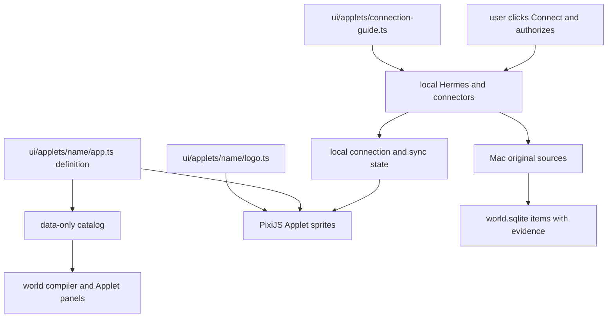

# Worldlet Applets

This directory owns Applet presentation and interaction. Data-only definitions, provider identity and capability declarations live in `core/applets/`. Shared artwork, approved references and visual tokens live in the [built-in Style Pack](../../resources/styles/builtin/README.md). Read the product [README](../../README.md) first; for art, read the [Sprite world contract](../world/COMPOSITION.md) and the [2.5D production contract](../../resources/styles/builtin/PRODUCTION.md).

**Design starts with the [Applet design guide](DESIGN-GUIDE.md).** It is the canonical handbook for device concepts, Peek / Open / Focus, Fox actions, sprite production and acceptance.

## Terms and direction

An Applet is an application's functions as a dimensional 2.5D installation or scene in the world. The standard states are **Peek → Open → Focus**: see the device in its Region, unfold its selectable contents, then read or work with selected content. Authored state support and routing are declared by the catalog and each Applet implementation. Scene, web, native and panel are implementation kinds; legacy `fullView` fields remain compatible. Authoring an Applet means identity, original logo, links, model or scene, state variants, Fox actions and a lifecycle contract; the full contract and current gaps are in [Applet presentation](../components/INTERACTION.md#applet-presentation).

Authoring currently follows the design guide above. Use ordinary guidelines in `ui/applets/`, not a Create Applet skill. The Applet Factory workflow is deferred. Existing draft tooling remains historical developer tooling, not the design authority. The directory is `ui/applets/`; definition values, `AppContent.swift` and stored IDs stay compatible.

## Directory layout

- `core/applets/catalog.ts` and `core/applets/definitions/<key>.ts`: data-only identity, connection and legacy `fullView` declarations.
- `visuals.ts`: original logos and generic Home function icons.
- `panels.ts`: service-specific working panels.
- `<key>/logo.ts` and optional panel/controller files: visual presentation only.
- `resources/styles/builtin/assets/world/devices/<key>.png`: independent device image, shared by real and Sample data.
- `ui/world/village/village-sites.ts`: reference-image anchors and region slots.
- `ui/world/applet-sprites.ts`: the fixed anchor, width and ground origin of every device.
- `ui/world/village/pixi-world.ts`, `pixi-stage.ts`: shared rendering and accessible content.

The old mesh models and 3D stages have been removed. Catalog `scene.template`, `scene.renderer` and legacy placement coordinates remain serialized metadata for compatibility; they do not select a 3D renderer. Add new image assets and an authored anchor explicitly. Do not reintroduce Three.js. The render engine must never branch on Sample mode.

See [production classification and order](DESIGN-GUIDE.md) before producing new Sprite artwork.

## Current Applets and connection state

The [catalog](../../core/applets/catalog.ts) is the single roster; [acceptance criteria](../components/INTERACTION.md#applet-presentation-acceptance-contract) and each Applet's owning document record verification and gaps. Catalog presence is not real-account acceptance. The [area taxonomy](../world/ENVIRONMENT.md#area-taxonomy) defines the approved future layout separately from current persisted IDs.

Home's function Applets are **Mail, Calendar, Notes, Reminders** and **Weather**, with generic function icons rather than a publisher's; **Browser** is the sixth. Weather has no connector at all: the forecast already runs, and the Applet gives it a body. They currently connect Gmail, Google Calendar, macOS Notes and Reminders; authorization copy names the real service and internal IDs and existing grants are unchanged.

Region defaults and membership are owned by [area taxonomy](../world/ENVIRONMENT.md#area-taxonomy) and the live catalog; do not maintain a second roster here.

`connection-guide.ts` holds the scope and user steps; Fox shows them. Apple's `native` connections are implemented in `AppleSources.swift`; Airbnb, Maps and the Explore websites use the embedded browser and are never treated as synced accounts. A device sprite or catalog entry does not mean the service has a usable API or that the user authorized anything; never expose a Connect button by changing `capability` alone.

There is no hidden-definition concept: `WORLD_APPS` is `APP_DEFINITIONS`, and a service that is not wanted is deleted rather than kept behind a flag. Deleting a definition never deletes the user's originals, sessions or Matters. Planned Applets say so and never pose as connectable.

The popular-app expansion adds 30 launch-only entries. These are opt-in for existing worlds; regions page through finite slots rather than overlapping devices.

## How data reaches the scene

Interaction follows [Applet presentation](../components/INTERACTION.md#applet-presentation): **Peek → Open → Focus**. Web fallback uses **Peek → Focus** directly. `appletContract(key)` summarizes resources and activity variants, which are separate from these presentation states. No extra Open button or implicit authorization; Fox guides connections.

### Mac device rules

Every Applet reuses the same device state and reading flow: Applets connect to the outside, Matters organize the user's things, scenes present space.

| State or action | Presentation and behavior |
| --- | --- |
| Not connected or not supported | Full device sprite; provider branding only when the Applet has a brand; clicking explains the connection state |
| Connected | Same sprite; Fox and the opened Applet reflect the connection |
| Reading or error | Fox/opened content explains the real state; existing records and the sprite stay. No Peek status subtitle |
| Counts | Loaded index or local record counts, never a remote total |
| Click the model | Enter Open for unfolded sprite content or Focus for a web/native panel; unconnected capabilities go through Fox |
| Click a record | The original opens on the left (about 2/3); closing it returns to the model |

Shared interfaces: `AppContent.swift` and `ui/shell/app-device.ts`; each source provides record identity, title, original read and bounded sync. Unimplemented sync is stated, never animated. Notion's index is recent pages; Google's records are what was read locally; Notion reading uses its own native web panel while other sources read through their connector.

- `harness/hermes/host.py` calls upstream MCP and Google clients. `HermesSources.swift` handles connection state; `SourceRecord.swift` converts originals and versions.
- `ui/applets/` holds credential-free declarations; real connections live in native panels and the local Hermes profile. **Never put tokens, secrets or user originals here.**
- Hermes keeps five source adapters (Drive hidden); Apple's two are native. Drive is metadata only; Notion is a bounded index with on-demand bodies. A successful read is not full incremental sync. Official conditions: [connector reference](../../core/applets/INTEGRATIONS.md).
- An Applet's default Region is only its entry position; the same Gmail message can take part in Travel, Money or Home context.
- All Applets are fully visible with no packaging or preview toggle. Authorization success, sync success and finished organization are different facts. Peek names have no extra logo or emoji; Open/Focus may use an existing identity icon; Fox and the opened Applet distinguish connecting, syncing, reading and needs attention (`core/applets/status.ts`).
- Notion reads up to 20 recent pages with `notion-list-recent-pages`, bodies with `notion-fetch`, and database rows (up to 20) with read-only `notion-query-data-sources`; browsing uses the Notion website. Originals go to sources, reading cache to `app-content/notion`. No model call and no implicit private-content consent.

## Adding or finishing a connection

1. Establish the authorizable data scope, account limits and API capability; prefer an existing Hermes skill or MCP, a system framework or the embedded browser.
2. Complete the Applet's connection declaration; register explicit read tools or scopes without widening existing permissions.
3. Add Mac record conversion with source IDs, revisions and cursors; handle increments, deletions, revocation and retries.
4. Attach structured extraction with source evidence. An empty account produces no invented items.
5. Expose a Building Connect entry only when adapter, permission prompts and failure paths are complete; record account readability only after a real authorized read; mark Ready only after full acceptance.
6. Add understandable states: connecting, connected with no records, sync error. Success always comes from a real receipt.

## Reuse and verification

- `npm run dev:worktree` (or `npm run dev` on main) and `npm run dev:website` watch `ui/applets/` and prepare rebuilds; no installer is needed day to day.
- `python3 scripts/quick-check.py` and `npm run build:native-ui` after definition changes; `node scripts/applet-focus-check.ts` for all declared routes and `node scripts/applet-stage-check.ts` for Home's four stages.
- `npm run test:hermes`: Hermes memory, skills and local MCP fixtures; not external OAuth acceptance.
- Sprite or placement changes still need Region screenshots and art review; compiling is not seeing.

## Original brand assets

Branded Applets share the original-asset loader and keep ratio and color; nothing is redrawn. Generic function Applets do not invent provider brands. Files, embedded bytes and SHA-256 must match; sources are in [brand assets](BRAND-ASSETS.md). Connection state is shown by Fox and the opened Applet, never by a generic dot, altered logo or stacked "Building" text under the name.

## Entries independent of a Region

DoorDash declares `region: null` and `placement.kind: 'world'`; the compiler leaves its `buildingId` null and `pixi-world.ts` puts it on its authored bridge anchor from `scripts/build-world-assets.ts`; Back returns to World. Like every Applet the delivery bicycle sprite is always visible and implies nothing about connection. The official CLI is called through the restricted `harness/hermes/doordash_cli.py`; see [DoorDash](../../core/applets/INTEGRATIONS.md#doordash).

### Implementation routing (`fullView`)

Every visible Applet declares `fullView.kind`. Five kinds are supported (`web` / `native` / `panel` / `scene` / `launcher`); the catalog is authoritative for each current route. A `scene` Applet may keep its account's website as `fullView.original`; it is reached by the **Native / Web** toggle right of the title in the Applet's [top bar](../components/INTERACTION.md#top-bar), inside the same Applet. Switching back restores the native selection; no separate original-link action is shown. Local-only Applets must not present a marketing website as a Web equivalent. `panel` factories come from `ui/applets/panels.ts` keyed by Applet; a `scene` Applet needs no per-Applet file. Website Applets may also keep panel factories for bounded Fox actions. The world mounts by kind and never branches on a name. Applets that authorize inside their view declare `connection.flow: 'in-applet'` so onboarding opens them directly; device-panel copy lives in `content`. Web Applets declare the home `url` and browser `platform` (`web` for ordinary sites; Notion, X, YouTube, Airbnb, Maps and TikTok keep their platform behavior). `appletContract` exposes the configuration. The connector `capability` covers authorization and tools only and never blocks a website. Plain clicks enter; only explicit Connect starts authorization. Back goes from the web page straight to the Region, exit unloads the page, and world updates keep the current page.

Discord is a Social entry on the generic `web` platform; see [Discord Applet](../../platform/browser/INTEGRATION.md#discord).

### Applet-owned Focus templates

Native Focus content uses a stable template stored with its Applet, such as [Mail's reader](gmail/README.md). Keep content layout and scoped styles in the Applet directory; reuse the shared Focus shell, navigation and Fox task actions. Source metadata and originals remain distinct from Fox summaries. Missing source fields must not be invented. Sample and connected sources use the same template.

The catalog completion adds the remaining requested everyday apps, including Linear. Native launchers open a catalog-approved installed application, with a website fallback; they do not read private local data.

The presentation switch uses the shared Worldlet W mark for Native and a globe for Web, with accessible labels and selected-state feedback: the chosen view is lit on the darker frosted control. It stays outside the panel clipping boundary.

## Catalog scope

The executable Core catalog owns current membership; previous 30/90/100-entry
expansion lists are implementation history. A visible device or discovered installed
app does not imply connected accounts, source ingestion or background execution.
Publisher identity and generated device provenance remain separately registered.
Region pins and finite ground slots do not limit access through the searchable shelf.
Website/bookmark discovery is described in [setup discovery](../onboarding/DISCOVERY.md).
