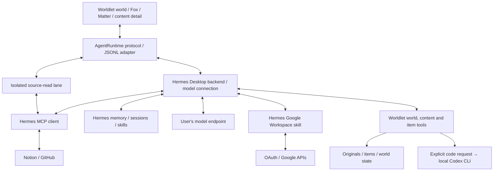

# Fox agent: local Hermes and the Worldlet UX

Chapters:
- [Model connection](#model-onboarding)
- [Fox performance and end-to-end timing](#fox-performance)
- [Local speech recognition](#local-speech)
- [Talk with Fox](#talk-with-fox)


Fox is the user-facing assistant. Hermes (pinned 0.21.3, upstream commit `416a8177c25d87aa9929dfcf31f7964137d7fcdd`, no fork) is the agent kernel: model calls, tool loop, sessions, memory, skills and MCP. Worldlet owns the world, the host bridge, permissions, the persistent items in `world.sqlite` and the check schedule. Hermes runs as an app-owned resident Python process; it cannot run in a browser, so the marketing site's `/demo/` has no chat.

Related docs: [Agent architecture](../../core/agent/PORTABILITY.md) (layer contract), [Hermes desktop runtime](../../harness/hermes/README.md) (JSON-RPC bridge, mid-run steering), [Search, browser and routines](../../harness/hermes/README.md), [Fox performance](CONVERSATION.md#fox-performance), [Model onboarding](CONVERSATION.md#model-onboarding), [World interaction contract](../../core/items/STORAGE.md#world-interaction).



## One session, one visible thread per context

Fox has one session for the whole world: Hermes keeps a single foreground session that knows every turn, so a question asked in one place can be about any other. What the person sees is one thread per context (`ui/companion/fox-thread.ts`): the World is one context, and each Applet, reader item or source view is another (the view's context key plus its visible surface). The chat in a context shows only that context's thread. Going back to the World shows the World thread; re-entering an Applet shows that Applet's thread again, restored from the same archive. This is a presentation rule over the one session, never a second session.

**Spatial context switching** (owner decision 2026-10-04). Because the one session also carries the latest turns from wherever the person just was, each turn sends the model its place too (`core/companion/conversation-place.ts`, `here` in the compact World context): `here.place` names the place, `here.earlierHere` carries up to 8 earlier turns said there (1,200 characters each), and `here.cameFrom` with a note says the person just moved from another place, so Fox answers about where they are instead of continuing the last place's topic. Each website in the built-in browser is its own place (`web:<site>`, host without `www.`); a page Fox opened while helping with an Attention item stays in that item's place for 15 minutes, so a survey Fox opens for an email continues the email's conversation. A page **Do it for me** opens is the item's place from the click, while it loads, so Fox's turn never sees a place change mid-task (the view guard would stop its page steps). `browsing` lists the 8 newest recorded browser visits (site, title, minutes) when the person allowed private context; Fox searches and reads them with `browser/records` and `browser/record` ([Local activity](../../contracts/README.md#website-recording-for-fox)). The visit open on screen is saved first and marked `onScreen` (in `browsing` and in `browser/records`) instead of “minutes ago”, and Fox's guidance keeps three things apart (owner report 2026-10-04: Fox mixed them up): what is on screen now (`here.place`, `showing`, the `onScreen` visit, read live with `browser/snapshot`), what was browsed before (`browsing`, `browser/records`, `browser/record`) and what happened in the World itself (`history`: Applets opened, settings, Fox's own actions; neither web pages nor the conversation).

**Since you last spoke** (owner parity row "Conversation continuity", 2026-10-08). When Fox talks through an Agent that keeps a session per Fox thread, the World tells that session what happened since it last replied, so Fox remembers the World and not only the chat: one short note ahead of the person's line, made from the History page's own lines after that reply (a Mail check, the emails read, findings saved, an item finished or dismissed, an Applet's task or schedule changed, a routine run), each once with how often and how long ago, at most 12 lines. It says nothing new to a new session or when nothing happened, and it never includes the Applets the person opened or the sites they visited. Rules, bounds and checks: [since you last spoke](../../core/agent/PORTABILITY.md#resident-sessions-and-approvals).

In a website, Fox's input is also the address bar (owner request 2026-10-04): a single word that is an address or a bare domain (`play.pokemonshowdown.com`) opens there over https instead of becoming a message (`core/browser/typed-address.ts`); sentences, numbers and other schemes stay messages. Its hint says so there: "Message Fox or type a web address" at rest, "Ask about … or type a web address" while typing (owner request 2026-10-07).

- Every turn is an entry tagged with the place it was asked in (the view's context key and visible surface). Entries persist as one bounded `fox-thread` row (120 turns, answers ≤4,000 characters, 12 steps), validated by Core; the host keeps each entry as its own row in the World database (`companion_cards`, tagged with its thread), and each turn Fox records carries the same thread in `companion_turns`.
- An action (an Applet's Summarize, Fox's dock actions) shows on the person's line as its icon and title, never the prompt behind it; a choice in Fox's card (bold underlined words) shows as a reply mark and the choice's name (owner decision, `userIcon` on the thread entry). Typed words carry no mark.
- Button requests carry a separate `displayText` into shared chat: input animation, working/completed cards and the saved thread show the action label, while the Agent receives the full execution text. Queued turns retain both; an unchanged recovered draft preserves its execution payload. Editing that draft makes it manual input. New thread rows carry `userTextVersion: 1`; only unversioned archives use exact known-template compatibility from Core, never length/prefix truncation or model-history rewriting. Run `node scripts/generated-action-history-check.ts --core-only` for synthetic template/persistence checks; omit the flag for the isolated browser send/stream/reload and queue/draft fixture.
- One turn is one card, and a card never pages. Cards are plain rounded rectangles of frosted paper, slightly see-through over the World with its blur behind them (owner Order 2026-10-08; opaque on the desktop Companion), about 40% of the window wide, at most 560px; the current card has a small triangle pointing at Fox and shows the question above the answer. While Fox works, the card holds one lighter, italic line, the step Fox is on now, typed in as it arrives, so it never reads as the answer; when Fox finishes, the same card becomes the answer. A long answer scrolls inside its card, with no Show more (owner feedback 2026-10-04): its foot fades and a small down arrow says more waits below, until the end is in view. The same holds on the phones. Guides are system notices, not turns: they keep their own pages, and background Applet work (mail analysis, refreshes) never becomes a card. A guide belongs to the context it appeared in: it takes that context's front card, the earlier cards stay above it, and it waits there while the person is elsewhere instead of following them (model setup, first-use journeys, the memory editor and help narration for a running turn follow the person). A question with options asked about Fox's last reply (the browser result check) is that reply's card: the reply, the question and its buttons together, never a copy above it.
- **Natural order, no priority (owner decision, 2026-09-30).** The conversation shows in the order it happened: the newest line is in front, whatever it is. A guide (a question with options, a review, a notice such as "Okay, it stays open.") takes the front card when it appears, even while a turn runs. The person's next message or Fox's next reply supersedes it: it gives way for good and never returns in front afterwards. Its text still reaches Fox with that message as `setup` context. No guide pins itself above the conversation, and none follows the person to other places unless it is one of the place-independent guides below.
- The front card is Fox's line in this place: its latest finished turn (or a newer remembered line). If that line is more than two hours old, it still shows as itself, faded down the card under a gradient so it reads as from earlier; it is never replayed as a "Welcome back" (owner Order 2026-10-07). A place with no conversation yet gets a local line saying what Fox can do there (`fox-greeting.ts`, never a model call). These lines are not turns. When the person answers one, it moves up into the history as a card with no question; it is display only and never enters the model's history. Hovering Fox, clicking Fox and arriving in a place all show this same card. Inside an Applet the card is always shown. Returning to the world does not pop it up again: Fox stays quiet until the person hovers or clicks Fox, or types (owner Order 2026-10-07). A guide the person dismissed does not come back on hover.
- Cards carry no name tag: the card points at Fox, so who is speaking is plain (owner Order 2026-10-08). Cards keep one steady width. Beside an Applet, earlier cards stop at an upper bound (about 42% of the window, and always under the top-right date, weather, sounds and Tutorial controls); older ones are clipped cleanly at it, never faded into the World art, and scroll into view while the current card stays put. Read at its end, the bound never cuts through a line of text: it drops to just under the partly hidden line, so the first line shown is whole (#2121). Earlier cards are opaque paper that pales with age while their text keeps normal reading contrast (#1652).
- A turn's progress lives on its working card; there is no separate thinking window or status bubble above Fox (owner report 2026-10-05). A notice, such as a page that did not load or a job that needs the person, is a guide in Fox's card for the place it happened in (a job's notice follows the person); a question waiting for the person's choice keeps the card. A website's failure is said only while the person is looking at that page, never over the place they moved to. Voice states show in the message bar. Cards are opaque paper. Beside an Applet, the card may use more of the tall right-hand column.
- When Fox's Agent asks before it acts (a Hermes Agent command it considers dangerous), its prompt is a guide in Fox's card with the request, its command and Allow once, Always and Deny (`fox-harness-approval.ts`); the turn waits, and the answer goes back to the Agent ([approvals](../../core/agent/PORTABILITY.md#resident-sessions-and-approvals)). When the allowed action finishes, the same card shows what it changed, and Settings › Approvals lists and revokes each Always ([standing rules](../../core/agent/PORTABILITY.md#standing-rules-and-what-an-approval-changed)).
- When Fox offers a reply in the Discord or Telegram thread a brought conversation came from (`reply_in_channel`), it is a guide in Fox's card with where it goes, the exact text and Send, Edit and Skip (`fox-channel-reply.ts`); only Send sends it, through the person's own Agent ([replying in a channel](../../core/agent/PORTABILITY.md#replying-in-a-channel)).
- An Applet's **Call** (Messages today) is a guide in Fox's card with whom it calls, Why and What to find out to edit, the exact opening and Call and Cancel (`fox-call.ts`); only Call dials, through the person's own Agent. A call in progress then shows there live: its status with a ticking clock, the transcript as it grows and Hang up, then how it went. Without an Agent that can dial, the card says plainly how to get one ([calling from an Applet](../../core/agent/PORTABILITY.md#calling-from-an-applet)).
- Earlier turns in this place are cards (the question and the answer, nothing else), stacked above the front card with the newest nearest: a thread reads bottom-up, the newest card next to Fox. Turns about one thing are one stack (owner Order 2026-10-08, [`core/companion/conversation-topics.ts`](../../core/companion/conversation-topics.ts)): the stack shows its newest turn under the topic's name (its first question) and its count, with card edges under it, and the name opens it into its turns' cards and folds it again. A question about something else starts the next stack even in the same place; a pause of more than 30 minutes does too. The grouping is local and spends no model call: a question long enough to say what it is about (about three words, or eight Chinese characters) and sharing less than 15% of its words with the topic so far starts a new one; shorter follow-ups (“why?”, “继续”, “好”) stay with the topic they answer. They are the same frosted paper, paler with age, so the current card stands out. When a new turn starts, the card that leaves the front slides up into the stack, the others are pushed up, and the new card grows in from the bottom; reduced motion skips the movement. When there are more than fit, the oldest fade out at the top and scroll into view; scrolling over the front card moves through them. Beside an Applet or reader, the tall right-hand column shows them by default; a quiet **Fold** tab on the card's top edge folds the column to the front card and then reads **Expand** (see [Interaction](../components/INTERACTION.md#bubble-and-status)). In the world they wait behind the front card as one card edge with a darker paper rule, so the stack is two cards however many turns wait (owner Orders 2026-10-07: the stack behind was unreadable, then too busy); the same quiet **Expand** tab sits on its top edge (owner request 2026-10-05: no History label, and not a loud button). Clicking it or the card, or scrolling up over it, opens the whole conversation taller, at the card's one width (owner Order 2026-10-07: the World card never changes width from message to message): the cards reach up to the top bar, in front of the World and of any Attention card or artifact, the earlier ones stacked and scrolling above the latest, with no box around them (owner request 2026-10-05). The tab then reads **Fold**; folding sinks the cards back, and Esc, a new turn or a change of place folds them. Cards Fox shows are artifacts with a size (owner decision 2026-10-06). A medium artifact, such as an Attention card or a short explanation, sits above Fox, who stays in the middle; it grows with its content up to its cap. A large artifact, for a table, a chart, a plan or anything with several parts, takes the stage beside the Attention Center, and Fox with the whole conversation moves to the right-hand column exactly as beside an Applet (layout option A, 2026-10-05, now for large artifacts only); closing it brings Fox back to the middle. Fox names the size with `show_artifact`, or Worldlet picks large for tables, charts and long bodies; the card's own control (the arrows beside ×) switches between them. Windows narrower than 1340px, and the onboarding tour, which seats Fox under the card it lights, keep Fox under the card. On the iPhone and Android, Expand opens the conversation as a chat filling the screen above the message bar, the whole thread as stacked cards, newest at the bottom; Fold (or Back on Android) returns to the bubble.
- A message sent while Fox works on the person's turn joins that turn (Hermes steering, below): it heads the working card, the question before it moves up into the stack as its own card with no answer, and the reply answers both under the newest message (owner Order 2026-10-07: sending a second message brought the previous one back to the front). A quiet turn (the day's plan and summary) and Fox's own invitation take no additions; a message sent during one waits as its own turn.
- Switching places shows that place's own conversation. A turn still running elsewhere is named at the top (`Still working · place: step`); returning shows its live card again. A turn interrupted by a restart is kept as interrupted, never shown as still running.
- What a place's thread used, as the person's own Agent reported it, is one quiet line under its earlier cards (`This thread · 12k tokens`, with a cost only when the Agent gives one; `threadUsage` in `fox-thread.ts`), and each card says its own turn's on hover; nothing shows when the Agent reports nothing ([model, usage and speed](../../core/agent/PORTABILITY.md#model-usage-and-speed-in-a-fox-thread)). Focusing the bar or typing in it opens the place's session in that Agent before Send (`warm`, at most once a minute per place).


| Capability | Implementation and boundary |
| --- | --- |
| Conversation, long-term memory, history search, skills | Hermes Desktop `session.create` / `session.resume`, `prompt.submit`, memory / skills / session_search tools; official events are converted and streamed back to Fox |
| Mid-run additions | Hermes `session.redirect` while the model streams; steer while a tool runs. Worldlet delivers the message over the JSONL control channel and does not run its own reasoning loop |
| World and content tools | Tool definitions in `ui/shell/live-world-tools.ts` (`inspect_world`, `find_content`, `read_content`, `visit_place`, content writes); per-turn policy in `platform/bridge/tool-policy.ts` (idempotent receipts, read-before-share, one coding delegation per turn). Late calls after cancel are rejected |
| Persistent items | Schemas in `core/tools/services.json`, executed by `harness/hermes/world_service.py` (`world_items.py` only names the background tool sets): `read_world_source`, `upsert_world_items`, `query_world_items`, `update_world_item`, `archive_world_items`. Hermes writes through these tools only; no source mirroring |
| Current view context | `ui/companion/fox-context.ts` trims location, state, setup, view id / title and the last four actions to fixed string sizes, and the app appends the last eight world events as identifiers (`WorldStore.recentHistory`); `world_context.py` validates the same shape and injects it into the outgoing request through Hermes request middleware, not into history |
| Coding tasks | `delegate_codex` runs `codex exec --sandbox read-only` (`platform/electron/src/modules/media/coding.ts`); the request must contain a coding keyword, only excerpts read this turn are shared, one delegation per turn, output is never installed or deployed. There is no Claude Code delegation |
| Model | Included DeepSeek V4 Flash via Worldlet's Worker and AI Gateway; anonymous installation access uses an owner-only token file (DPAPI-encrypted on Windows). Optional BYO providers stay in Hermes. See [Model onboarding](CONVERSATION.md#model-onboarding) |
| Routines | `manage_routines` (`routines.py`) over Hermes cron; the host's `HermesRoutines` (`modules/agent-runtime/hermes.ts`) ticks every 60 s while the app is open, consent is on and Sample Mode is off; with Hermes Agent kept running as a service ([kept running](../../core/agent/PORTABILITY.md#hermes-agent-kept-running)), its gateway runs them also while Worldlet is closed, through Hermes' same claim, so never twice. See [Search, browser and routines](../../harness/hermes/README.md) |
| Voice | See "Live voice" below |

Hermes decides whether a request is a coding request, a navigation or a music command; Worldlet has no keyword intent router. Buttons still execute locally and immediately.

## How Fox talks and when it speaks first

Owner request 2026-10-06 ("更主动更 helpful", "全面模仿 poke"): Fox behaves like a friend who texts, modelled on the Poke assistant's published behaviour but written for Worldlet.

- **Voice.** `core/companion/fox-voice.ts` rides with every Fox turn through `companionPrompt`, whatever personality the person set: no help-desk filler ("How can I help", "Let me know if you need anything else"), length matched to the person's message, emoji only after theirs, humor only when it comes on its own, memory used naturally, mistakes told in the person's terms. The built-in personality (`core/companion/default-persona.json`) is warm, witty and on the person's side.
- **Speaking first.** `ui/companion/fox-proactive.ts` notices quiet moments: the person settled into a place and paused (World after a minute; in an Applet or page this is the browse moment below), stayed in one place about 45 minutes, or is up late (23:00 to 05:00, once a day). It never asks while the person talks with Fox, types, records, has another line or the panel open, watches full screen, is in a meeting, is away (no input for ten minutes), in onboarding or its first-run tour (including first value), while the World is busy analysing or organizing, or with the desktop companion. The host (`foxProactive`) asks only within Core's limits (`core/companion/fox-proactive.ts`): at most 8 lines a day and 2 per place, at least 15 minutes apart, the gap doubling for each line the person let pass without answering within ten minutes (up to eight times), and none for 12 hours after a short "be quiet" (别说话, 安静点, shut up…).
- **Browse with me.** Owner request 2026-10-08 (「做 Applet 的时候小狐狸在旁边时不时地说话，给一些 context，提供一些帮助」): in an Applet or on a page the settled moment is a browse moment instead. After about 30 seconds of looking (scrolling and reading count; typing or talking does not) Fox may say one line about what is on screen: context the person may not see at a glance, how it ties to their day, a catch, or the one thing worth doing there. At most one line per visit to an Applet or page, at least 4 minutes apart (doubling like the others for each line let pass) and 20 a day, counted apart from the other moments so browsing never uses up their lines. An ask the host refuses because Fox is busy is tried again later in the same visit.
- **The switch.** Fox's card carries **Browse with me | Don't bother** (`ui/companion/native-chat.ts` `browseSwitch`): under each browse line, and on every card in an Applet while Don't bother holds, so it is turned back on where it was turned off; never in the World, onboarding, the tour or the desktop companion. The host keeps the choice (`foxBrowse`, preference `worldlet.foxBrowse`, on by default); Don't bother refuses every speak-first ask, for all moments, and drops one still running. It is a button in Fox's own card, not a Settings toggle.
- **The ask.** It runs in the Agent's task lane like the proactive game review: untrusted (reads, never guarded writes) and without UI actions, with the place, recent browsing, World history and, on a website, what the page on screen says (`page`: its newest recorded text and what appeared after it, up to 3,000 characters, start and newest part kept). It runs no page tools, so before this text rode along it had only the page's title and passed on every website (owner Order 2026-10-07). Fox rates up to three candidate lines and answers PASS unless the best is useful, insightful or warm enough (7 of 10) and not a repeat; most asks show nothing. The person's next message cancels an ask still running.
- **The line.** One or two sentences in the one Fox bar, as a guide line with no buttons; the person's next message or Fox's next reply supersedes it. It shows only if the person is still in that place and not busy; otherwise it is dropped, never queued. A shown line joins the conversation in its place, so a reply continues from it. There is no Settings toggle (owner rule: no toggles); the controls are Don't bother in Fox's card and asking Fox to be quiet. Each ask costs one call of the person's own model; with no model nothing is asked. Analytics record the moment and whether Fox spoke or passed, and each switch of Browse with me, never the line.

## Prompt-injection gates

Page, mail and note text is untrusted data. The desktop host routes Hermes tool calls through the shared runtime (`platform/bridge/world-tool-runtime.ts`, `tool-policy.ts`) on every OS, so these gates behave identically everywhere. Only the user's own words this turn (the request plus later steering) count as authority.

| Risk | Gate |
| --- | --- |
| Exfiltration through a URL | `browse_web` / `automate_browser` `open` goes straight through only for an address the user wrote, an exact URL returned this turn by local browsing history or saved posts, or a plain (no query/fragment) link on the snapshotted page or in a note read this turn. Anything else, including a user-given address with query or fragment data added, is refused automatically with the reason (`platform/bridge/world-tool-runtime.ts`); nothing asks and nothing opens. Fox then uses a link from the page or tells the person which page to open. Buttons and links the user clicks are unaffected |
| Browser actions | Webpage content never authorizes an external effect (#671), and the person is asked once, only before the last step (owner decision 2026-10-03). Opening, reading, filling and ordinary clicks run directly. `browserFinalStep` (`core/browser/agent-browser.ts`) picks the step that pays, orders, sends, submits, publishes, books, confirms, cancels a plan or order, grants access or deletes, and Enter in a field that is not a search box; Fox shows **Go ahead** / **Not now** before it runs (`ui/shell/notion-world.ts`) and Not now clicks nothing. The site's own "Are you sure?" button for that step (the next last step on the same site and task within two minutes that confirms or repeats it, such as *Cancel free trial* then *Confirm cancellation*) runs on the same Go ahead, so a two-page cancellation asks once (`browserFollowThrough`); a different action, or one `browserEffectDecision` holds back that the approved step was not, asks again. Once untrusted content has entered the turn (such as an `automate_browser` snapshot), `turnBrowserAdmission` (`core/agent/turn-trust.ts`) also marks every click and submit so `browserEffectDecision` holds back money, paid plans, access grants and deletion for the same question; where no one can be asked, they are refused. Request wording and page text never skip the question. The Go ahead is also the person's confirmation of the result: once the result page is inspected, a linked task is marked done and nothing asks afterwards. Every other click runs (unsubscribing, ticking a box, moving to the next page), and `agent-browser.ts` records an unverified receipt for commitments, cross-site links, unknown controls and submits that Fox inspects afterwards. Passwords, payment details and verification codes stay refused. Residual risk: an injected page can still make Fox click a consequential control the final-step rule does not recognize; the receipt records it but nothing stops it first. A Go ahead marks a linked task done even if the result page then shows a failure; Fox says so in its reply |
| Summarize with a crafted title | The HUD Summarize action sends `summarizeRequest(title)` (`core/agent/system-requests.ts`) with origin `system`: the title is quoted JSON data, the turn is never steered into a running task or handled as a local command, and tools see an empty user request, so content writes, coding delegation, `companion_style` and trusted navigation are all refused until the user types or steers |
| Attention Help/Explore with a crafted title | The button press is the user's request, but `attentionRequest` (`core/agent/system-requests.ts`) fences the item title as `⟦untrusted …⟧`; the tool runtime removes fenced data before every intent check, so a title cannot rename Fox, set a speaking style, satisfy the edit-intent gate or make a URL count as user-given. |
| Durable writes after untrusted content | Note edits (`create_content`, `patch_content`, `delete_content`, `restore_content`, `undo_content`), `set_worldlet_preference companion_style` and DoorDash `cart_add` / `cart_remove` are guarded writes. Once page, mail, note or other untrusted content has entered the turn, `turnWriteAdmission` (`core/agent/turn-trust.ts`) refuses them before any keyword check, whatever the request or later steering says; nothing is changed and the user can ask again in a new turn. This is the same rule the hosts use for item and routine writes. In a trusted turn they run as before |
| Persistent injected tone | After Core admits it, `set_worldlet_preference companion_style` is still refused unless the user's own request this turn asks about how Fox speaks (speak, tone, call me, brief, 语气, 叫我 …), and `companion_name` unless the user asks to rename Fox (name, rename, call you, 名字, 叫你 …). Other preferences keep their existing behavior; the Settings guide can still show and forget the style |
| Unsolicited meeting links | A due Meet / Zoom / Teams meeting from Calendar is offered in the Fox bubble with **Join** and **Not now**; nothing opens on its own. The Meetings Applet still lists meetings with their open actions |

Checks: `node scripts/world-tool-runtime-check.ts` (navigation refusal without a prompt, `companion_style`/`companion_name` intent, `companion_style` and `patch_content` refused after an untrusted read, system-origin Summarize against the real edit-intent gate), `node scripts/browser-bridge-snapshot-check.ts` (bridge snapshot and sensitive-field filtering), `node scripts/turn-trust-check.ts` (automatic browser effect decisions after an untrusted snapshot), `python3 scripts/routine-permissions-check.py` (Hermes names the DoorDash operation when authorizing), `node scripts/browser-automation-check.ts` (no approval prompt anywhere: refused composed navigation, direct click/submit, refused payment after a snapshot whatever the request says, direct cancellation), `node scripts/meetings-check.ts` (no auto-open). The retired native hosts' real-page checks for cross-origin and same-site links are not yet ported to Electron.

## Runtime, isolation and cancel

- `harness/hermes/host.py --serve` is the resident stdio adapter. `desktop.py` embeds the official Desktop JSON-RPC dispatcher; Hermes holds the agent, the model client and the history. Single-request mode remains for scripts and tests.
- Development uses `scripts/setup-hermes.ts` for a pinned Python 3.12 fixture. Releases sign and ship only a small `uv` bootstrap and a SHA-256 manifest for the pinned upstream source. After the world opens, Worldlet prepares its own runtime (`platform/electron/src/modules/agent-runtime/installation.ts`; the library's `runtime/` folder on every OS): it prefers an existing compatible Python 3.11–3.13 and otherwise downloads a managed Python 3.12. The frozen Hermes dependencies and agent live there, separate from the user's Hermes profile. The session SDK and web search additions install from `harness/hermes/mac-requirements.txt` with `--require-hashes` (every transitive dependency pinned, matching Hermes' `uv.lock`; regenerate with the commands in its header when `runtime.json` changes). A failed or interrupted installation can be retried without changing accounts, memory or the app bundle.
- Each library has `agent/private/hermes` and `agent/sample/hermes`; memory, skills, connections and sessions are separate. Basic chat without private consent uses a third `agent/setup/hermes` profile whose only tools are `open_worldlet_controls`, `set_worldlet_preference` and `control_background_music`. Sample and setup reuse the private model configuration and key but never private memory, sources or sessions. The user's own `~/.hermes` is untouched.
- Private processing requires `cloudConsent`; connecting an account does not grant it. Without consent, source reads and item extraction are unavailable.
- The child process inherits only the environment it needs; model keys and connector credentials never enter the trusted World renderer. Changing the endpoint clears the previous key.
- Hermes runs with `max_turns` 20. The desktop adapter's stream budget is 210 s; the host request timeout (Core `agentRequestDeadline`) is 240 s (360 s while authorizing, 600 s for background monitor runs, 960 s for model login). Locks: `worldlet.lock` (short configuration), `worldlet.chat.lock` (conversation), `worldlet.sources.lock` (connections and source reads), `worldlet.doordash.lock`.
- Cancel is per caller. A queued job is dropped without affecting others; an active conversation receives `session.interrupt` first and the process is reused; after 12 s without completion the worker is killed (`modules/agent-runtime/hermes-worker.ts`). Every request carries its own ID; late events and tool receipts cannot enter the next turn. Requests that may have written are never replayed automatically.

## Resident runtime and chat priority

`HermesRuntime` is the caller; `HermesPool` / `HermesWorker` (`platform/electron/src/modules/agent-runtime/`) own processes, the priority queue and shutdown.

| Lane | What it keeps | How it runs beside other work |
| --- | --- | --- |
| Fox conversation | One process per profile: the current Hermes session, model client, memory and MCP connections | Reuses the session; Hermes cancels its own background review before the next turn |
| Source reads | Separate process in the same profile; reuses authorization and MCP connections | In-flight reads do not block chat; queued reads rank below chat |
| Background checks | `_background` jobs (routines, world item checks) | Only start when no interactive job is queued or active |
| Applet tasks | Separate process in the same profile (`#tasks`), one task at a time ([Applet tasks](../../docs/FOX-AGENT.md#applet-tasks)) | Never block chat and are not counted as interactive work |

- Priorities: chat (2) → other user actions (1) → background (0) → warmup (-1). In-flight authorization, credential refresh or reads are never killed to preempt.
- Opening the UI preloads the profile's Python modules without calling the model or reading sources. The first conversation creates the Hermes session; later turns resume it. On the built-in Hermes, Fox's warm-up when the person focuses or types in the message field (`agentWarm`) primes the conversation (at most once a minute): a warmup carrying the next turn's session and instructions, without a message, resumes the session and its connections while the person types, so a short first message after an idle stretch no longer waits about 1.7 s for that resume (owner report 2026-10-08). It never calls the model.
- Model, key or configuration changes rebuild the process. Exit, timeout or protocol failure retires it and the next request relaunches. The conversation's worker stays up while the app is open (owner 2026-10-08); a helper lane (source reads, analysis, Applet tasks) retires after 30 idle minutes; all workers stop when the app quits. The Hermes Agent Fox uses is itself kept running as a login service that outlives Quit (owner decision 2026-10-08, replacing "no background service after quitting"): its own `hermes gateway`, installed and started by Worldlet, never stopped by it, with its API server on this computer for Fox's conversation ([Hermes Agent kept running](../../core/agent/PORTABILITY.md#hermes-agent-kept-running)) and World tools registered in its profile for every Hermes channel (owner decision 2026-10-08 19:15Z; outside a Fox turn they only read and prepare drafts for review, [World tools on Hermes](../../core/agent/PORTABILITY.md#world-tools-on-hermes)). These workers are not that service and still stop with the app.
- Only millisecond timings are logged, never prompts, replies or keys. See [Fox performance](CONVERSATION.md#fox-performance).

## Connections and on-demand reading

Source collection, analysis and Attention publication follow the shared [Applet runtime](../../core/applets/RUNTIME.md); connection, launch and revision triggers belong there rather than a second fixed polling policy. Official tool lifecycle events produce Applet activity without content; after a successful read Hermes may call `update_applet_state` with a short summary. Transient state stays in memory; extracted items, source references and check records go to `world.sqlite`.

| Source | Authorization and reading | Bound |
| --- | --- | --- |
| Gmail / Calendar | Hermes Google Workspace skill, direct Google OAuth (PKCE, local loopback) with read-only scopes; token in the private profile's `google_token.json`. Drive is not part of the default grant | Gmail: 20 threads from the last 30 days, 8 newest messages each. Calendar: 50 events over 30 days |
| Notion | Hermes MCP OAuth against the official remote MCP; explicitly allowed read tools | On demand; the user can ask Fox to save a note. No full import |
| GitHub | Hermes MCP configuration with a user-supplied restricted token; read tools only | On demand; untested end to end with a real token |
| Apple Notes / Reminders | Mac read-only adapters (`modules/sources/apple.ts`, a bounded JavaScript-for-Automation helper) called through `read_world_source`; system permission is requested by an explicit connect | On demand; real TCC prompts not yet exercised |

MCP servers are enabled only after authorization and tool discovery succeed. External write tools are not in the allowed list. Disconnecting Google revokes the grant and removes the Gmail and Calendar connections; local data stays. Remote revocation and local credential removal are separate facts.

Google client registration: the release build bundles `GoogleOAuthClient.json`; development can point `WORLDLET_GOOGLE_CLIENT_FILE` at a Desktop OAuth client file. The Google OAuth project is unverified for restricted scopes; external users see the unverified-app screen.

## Live voice

Desktop dictation records in the host's media surface and transcribes locally with Whisper after release (`platform/electron/src/modules/media/speech.ts`; see [Local speech recognition](#local-speech)); only the final transcript is sent, through the same Hermes text path. There is no cloud fallback; if local speech is not ready Fox reports the error and typing still works. The unreachable GPT-Live client and its `/api/fox-live/*` worker endpoints were removed; the worker's `worker/speech-stream.ts` endpoint is dormant and not part of the desktop product path.

Spoken replies, in Talk and elsewhere, use the Agent's own voice when Fox's Agent has one: a Harness that declares the `voice` service ([Harness services](../../contracts/HARNESS.md#harness-services-v2)) synthesizes the reply with the text-to-speech provider, voice and persona the person set up there, and the media surface plays the clip (`speakClip`). Today that is OpenClaw (`openclaw infer tts convert`, `core/agent/harness-voice.ts`); Hermes Agent has no command that speaks one line, so it declares none. Otherwise, when the clip cannot be made or played within 20 s, or for a reply longer than 4,096 characters, the system voices Chromium exposes in the same media surface read it (`speechSynthesis`, `SpeechOutput` in `speech.ts`): no network and no extra model. Settings › Voice turns ordinary spoken replies on or off (`worldlet.spokenReplies`, off by default) and picks the voice: its first choice is **Your Agent’s own voice** where there is one, else **Automatic language** (which follows the reply's script); a system voice the person picks is used instead of the Agent's.

<a id="talk-with-fox"></a>
### Talk with Fox

A spoken conversation with Fox (owner parity plan item 7), the same for every Harness because voice is Worldlet's ([Harness services v2](../../contracts/HARNESS.md)). Rules are in `core/companion/fox-talk.ts`, the computer's rhythm in `ui/companion/fox-talk.ts`, wired into `native-chat.ts`.

- **Turning it on.** Right-click the microphone (or the context-menu key) and choose **Talk with Fox**, the first item of the microphone menu, or say the wake word (below); choosing it again, Escape, or leaving the app ends it. Holding and clicking the microphone keep their dictation meaning, so there is no separate mode switch on screen; while Talk is on the microphone wears a lantern ring and the bar says what Talk is doing.
- **Listening.** Each turn of Talk is one ordinary local-Whisper capture. The capture's levels decide when the person stopped: at least 250 ms of speech, then 1.1 s of silence, ends the utterance (`talkEndpoint`); 30 s with no speech starts the capture over, well inside its 45 s limit. Silence or a cough sends nothing and listens again.
- **Fox's reply.** The transcript goes to Fox as a normal turn; when the turn ends its reply is read in the Agent's own voice where it has one, else the system voice ([Live voice](#live-voice); `speakReply` with `talk: true`), and when the voice reports the end (`worldletSpeech` phase `spoken`, or a length-based limit if it never does) Talk listens again.
- **Barge-in.** While Fox speaks the microphone stays open: `speechStart` with `barge: true` opens a capture (Chromium's `echoCancellation`, noise suppression and gain control, as every capture) that does not stop the voice and keeps only its latest 1.2 s. The system voice plays outside Chromium's echo canceller, so the rule is a level one (`talkBargeIn`): the reply's first 0.5 s only learn Fox's echo at the microphone, a decaying peak; after that, 300 ms of the person's voice above both 0.12 and 1.6 times that echo stops the voice and the capture becomes the next utterance, keeping its last 0.8 s so the first words reach Whisper (`speechKeep` with `preroll`). When Fox finishes on its own, the same capture goes on without its echo (`speechKeep`), so there is no gap before the person can answer. With headphones any voice interrupts; over loud speakers the person has to be clearly louder than Fox, and clicking the microphone, or holding Fox or Space, still stops the voice and listens at once. It costs only the open microphone and its level meter.
- **Wake word.** Settings › Voice › **Listen for “Hey Fox”** (`worldlet.wakeWord`, off by default, kept on this computer, not in the World; Mac and Windows, where local Whisper runs). While it is on, the media surface keeps a rolling 4-second capture of the chosen microphone (`modules/media/wake.ts`) and its levels single out short phrases said on their own (`wakeGate`: 0.3 to 2.5 s of speech after 0.5 s of quiet and followed by 0.6 s of quiet); each goes to local Whisper on this computer, at most one every 4 s, and `wakeMatch` accepts “Hey Fox” (hi, hello, OK), 「嘿 Fox」, 「嘿，狐狸」, 「小狐」 or 「小狐狸」, or “Hey” / 「嘿」 and the Fox's current name when it is renamed (two characters or more). Worldlet then comes forward and Talk starts; what followed the wake word (“Hey Fox, what's on today?”) is its first turn. The audio exists only in that rolling buffer and the short check's temporary file; nothing is kept or sent. It rests while Fox's own voice input or Talk has the microphone, during a call in Meetings (its transcript runs, or a Google Meet, Zoom or Teams page, shown or kept, holds the microphone the person allowed it; `BrowserService.inCall`, looked at again every 3 s, so it listens again soon after the call ends), while the screen is locked or the computer sleeps (`wakeState`), and until Worldlet has the system's microphone permission, which only turning it on asks for. While it listens the system shows its own microphone indicator and Fox's microphone a small lantern light (`data-wake`, `worldletSpeech` phase `wake-state`). Cost: in a quiet room only the open microphone and its level meter; each short phrase it hears is one local Whisper run (Large v3 Turbo, about a second or two of GPU work on Apple silicon, several seconds of CPU on Windows), so a room full of short remarks keeps it busy and drains a battery faster, and long talk such as a call or a video is never checked. A call in another app (the Zoom or Teams app, FaceTime) is not detected: the system offers no cheap way to see that another app holds the microphone without a native audio helper, so there only the short-phrase rule keeps the call's talk from being checked. The phones have no wake word: iOS gives apps no background microphone and no low-power keyword spotter (Siri's is the system's), and even in the foreground a recognizer kept open would have to restart every minute with the microphone indicator always on; Android's on-device recognizer chimes at each start on many phones and cannot run continuously either. On a phone, hold Fox's button for Talk.
- **Quiet.** A short request for quiet (安静点, 别说话, be quiet…, the rule Fox's speaking first uses, `proactiveQuietRequest`) still goes to Fox, so its 12-hour hold on speaking first applies, and keeps Talk going without reading replies for the rest of that Talk.
- **Setting.** Settings › Voice has **Talk without reading replies** / **Read replies in Talk** (`worldlet.talkReplies`, on by default, kept with the World's preferences). With it off, Talk shows each reply and listens again at once. Ordinary spoken replies outside Talk stay under their own setting.
- **Phones.** The iPhone and Android Fox docks have the same Talk: hold Fox's button for its menu (iPhone) or long-press it (Android), and ✕ in the bar ends it. On-device recognition hears each utterance; it ends when the recognizer's words stop changing for 1.2 s (`TalkPause` in WorldletKit and the Android kit); Fox's finished reply (the streaming turn once done, or the next Fox line) is read with AVSpeechSynthesizer or TextToSpeech in the reply's language. While it is read the recognizer stays open with the phone's echo cancellation (on the iPhone voice processing in the `.voiceChat` audio mode; on Android communication mode, with the voice played as voice communication), and once it hears two words or CJK characters that are not Fox's own, ignoring any echo of the reply that got through (`TalkRules.interruption`), the voice stops and those words begin the next line; a tap on the microphone interrupts too; the quiet rule is the same (`TalkRules`). The phone code is not compiled in this repository's Linux checks; the kit rules are tested on the JVM and with SwiftPM. See [ios/](../../ios/README.md) and [android/](../../android/README.md).
- **Not yet.** A streaming, word-by-word spoken reply is a follow-up. Routing Fox's voice through Chromium's own audio output, so its echo canceller removes it and barge-in needs no level margin, needs a voice that renders to audio rather than the system's speech synthesis. The Agent's own voice is such audio (a clip played in the media surface); whether Chromium's echo canceller then removes it is not yet measured, so barge-in keeps the level rule for it too.
- **Checks.** `node scripts/fox-talk-check.ts` (in `test:core`) covers endpointing, barge-in levels against Fox's echo, the wake word's gate and match, the quiet rule and the rhythm with fakes; `node scripts/fox-talk-ui-check.ts` (in `test:companion`) drives the built app against a mocked host: the menu toggle, levels ending an utterance, the reply read with `talk: true` with the barge capture open, that capture kept after `spoken`, click and voice barge-in, quiet, silence, Escape, and the wake word's light and start. WorldletKit's `TalkRulesTests` and the Android kit's `TalkRulesTest` cover the phones' rules, `interruption` included. Real microphones, voices, echo and wake-word accuracy are verified by use.

## Verification

```sh
npm ci
npm run setup:hermes
npm run dev
# Apply the candidate in Dev; included model access prepares automatically; then chat.

npm run test:electron
npm run test:hermes
npm run test:hermes:desktop
npm run test:hermes:steer
npm run test:hermes:routines
python3 scripts/hermes-latency.py
```

- `test:hermes`: real pinned Hermes with a loopback model fixture; tool receipts, streaming protocol, cross-process memory, session database, skills, MCP discovery / read / filter / disconnect.
- `test:hermes:desktop`: Desktop adapter; session resume by stored ID, full history after restart, tools run once, interrupt while streaming or waiting on a host tool, workspace isolation.
- `test:hermes:steer`: redirect while preparing, streaming and running tools; restart persistence; stale control messages rejected.
- `test:electron`: host contract, the Electron module checks (including `modules/agent-runtime/check.ts`) and an app smoke run on a disposable library.
- The retired Mac host's in-app checks (resident runtime: process reuse, priority queue, cancel ownership, crash recovery, quit cleanup; trusted World → host → Hermes → world tools with consent, sample isolation, cancel and resume; a live-model check) are not yet ported to Electron beyond what `test:electron` covers.

None of these are real-account acceptance. Still pending: end-to-end Google OAuth with external users, Notion OAuth, GitHub token, Apple TCC prompts.

## Existing Hermes attachment

Onboarding detects a configured local profile in this order: absolute `HERMES_HOME`, `~/.hermes/active_profile`, then `~/.hermes`. The companion offers **Connect [name]** and **Not now** before Mail setup. Detection is read-only and runs when the introduction is reopened, including development installations. Only confirmation writes the selected path to `hermes-attachment.json`; the host rechecks the detected path before binding. Existing confirmed attachments are retained. Skipping continues the regular setup without changing the user's Hermes. Missing or empty configuration directories are not presented as configured agents.

The original model configuration, SOUL, memory and skills remain in place. An explicit SOUL name becomes the companion name unless the user has chosen a Worldlet name. Missing names display Hermes. Startup does not overwrite config, credentials or SOUL; Worldlet integration instructions are added in memory. Normal conversations can update the shared Hermes memory and session store. Worldlet creates separately named desktop sessions, rather than taking over a running CLI conversation.

This is shared-profile access through Worldlet's pinned Hermes backend, not a connection to an arbitrary running CLI process. Compatibility with every installed Hermes version is not established. The binding is sticky; a missing profile reports a failure instead of silently creating a replacement. Worldlet backup/reset covers its own data, not the external profile; back up Hermes separately.

Validation: `python3 scripts/hermes-attachment-check.py [built-checkout]` runs one isolated local mock-model turn and verifies the existing endpoint and identity, a separate Worldlet session, and unchanged config, credential and SOUL bytes. Real installed-agent concurrent use still needs acceptance testing.

<a id="model-onboarding"></a>
## Model connection

Fox guides the connection; Hermes owns provider configuration, OAuth storage, refresh and inference. Connecting a model does not grant private-source processing; that is a separate consent.

### Default model and credentials

Fox uses pinned Hermes 0.21.3. Worldlet provides no model of its own (owner decision 2026-10-05): Fox runs on this computer's Codex sign-in, on the person's own provider (an API key, or the API-key model a local Agent brought), or, when setup chose an Agent and neither exists, on that Agent answering itself. The Cloudflare-hosted DeepSeek V4 Flash through the `worldlet-model` Worker is retired and paused, and the app no longer enrolls an installation token with it (model service). No Cloudflare/provider key ships in the app, and no credential enters the web view.

- The default is the `local-codex` source in [`contracts/model-sources.json`](../../contracts/model-sources.json). Empty profiles, profiles saved on the retired Worldlet service and the former bundled OpenCode Go preset move to it. Explicit BYO providers and attached external Hermes profiles remain unchanged. With no Codex sign-in, Fox answers that it needs an AI on this computer, with the way to connect one.
- Every build, development included, uses this computer's Codex sign-in; `WORLDLET_DEV_MODEL` is retired. Setup/sample/monitor profiles share only the private profile's model selection, not its records.
- Fox offers custom remote HTTPS endpoints. Local HTTP endpoints and on-device inference are not offered in this preview. Changing the endpoint clears the previous key unless a new one is supplied.
- Before private consent, chat runs in the `agent/setup/hermes` profile with no private context, memory, source tools or history; only controls, preference and music tools. Sample Mode reuses the model configuration but no private data.
- Fox uses this computer's Codex sign-in, a user-connected provider or a local Agent. The [first-run flow](../onboarding/README.md) brings a local Agent, then Applet selection. If model access is unavailable, Fox shows an error and a connection path.

### Entry points in Fox

Model connection uses the Fox model guide (`ui/companion/fox-model-guide.ts`), in the bubble or embedded in **Settings › Model**. Settings › Model is the one place to connect a model and to see and fix its problems (owner request 2026-10-06): it names the path in use (the Codex sign-in, the person's own API key, or an Agent on this computer), the model, whether the sign-in or key is there, and how Fox's last reply ended, in plain words (`modelHealth` in `platform/electron/src/modules/fox/index.ts`, worded by `ui/companion/model-health.ts`). Each problem gets its fix as a button: sign in or add a key, Check available models, Restart Fox or Show updates, plus Check connection, and Use or Stop using for each Agent. The last reply is kept in memory for this run, with addresses removed. The Energy page shows charge only and links to Settings › Model. [Onboarding](../onboarding/README.md) owns the first-run sequence. Model selection is optional, not an onboarding prerequisite.

- **Codex**: declared by Hermes's provider catalog as an external OAuth login. Fox shows the device code, waits and can cancel; the browser completes sign-in. After login the model is chosen from the account's live catalog (Hermes ordering and hidden-model filter, no synthesized forward-compat entries); an empty or failed catalog keeps the previous configuration and offers retry. An existing Codex connection can run **Check available models** to repair an unavailable selection.
- **Choose a model**: both the first **Connect a model** and later **Choose a model** go straight to provider selection. Fox reads Hermes's canonical provider catalog and keeps its provider IDs, auth types, key environment variables and endpoints. A short featured list (Codex, OpenCode Go, Anthropic, OpenAI API, compatible endpoint) is shown first; **More providers** opens the rest in a scrollable list. API-key providers are saved through Hermes's registry, not rewritten as a custom configuration.
- **Switching keeps the conversation**: when a Hermes session is resumed, the desktop adapter syncs the profile's current model with `config.set`, so a resumed session cannot bring back an earlier Codex model. Regression checks assert the model name in the actual HTTP request.
- Providers with other OAuth, device-code, cloud-platform or external-process auth are listed with their real auth type and a note that the Fox bridge does not yet implement their secure callback; no key form that would fail is shown.
- The key exists only in a password field inside the bubble and is handed to Hermes through the trusted main-frame bridge; it never passes through chat, replies, memory or UI storage. Submit, back, cancel and dismiss clear the field.
- After saving, Fox offers **Say hello** to send the first real request. A saved key is not proof of a valid key or remaining quota.
- Recognised first-chat failures (invalid key or unauthenticated, no quota, rate limit, model unavailable, no network, a model that took too long) get their own message and a **Change model connection** action (`ui/companion/model-failure.ts`) without echoing keys or URLs. Network failures are never replayed automatically. A slow model is not called a connection problem: while Hermes Desktop waits on the model it sends `status: waiting` every 30 seconds (`harness/hermes/desktop.py`), so the host's 120-second idle stop only ends a Hermes that stopped answering; the turn is bounded by `CHAT_DEADLINE_SECONDS` and Hermes' own stale-call limits. Once the model has the turn, that keep-alive does not replace "Thinking…" with the queue's "Waiting…" (`platform/bridge/agent-client.ts`). A conversation past Hermes' compression threshold is summarized before the model answers, which can take minutes: Hermes reports it as `status.update` `compacting`, the adapter sends `status: compacting` once, Fox says it is catching up on a long conversation, and the turn gets Hermes' own compaction ceiling (600 seconds) on top of its normal budget, so the summary is never cut off and then retried on every message. So the person rarely waits for that summary at all, a reply that leaves the conversation within 15% of the threshold (and 10% past the last summary) is followed at once by the same summary while Fox is idle: the adapter reports `compactSoon`, the host sends `compact` (Hermes `session.compress`, `harness/hermes/desktop.py`), and Fox's name tag says "Tidying up our long conversation…" with no card (`platform/electron/src/modules/fox/index.ts`). A message sent meanwhile waits in the same lane, saying it is catching up on the conversation; the summary is never preempted or cut off (`core/scheduling/agent-work.ts`), and Hermes' own preflight still covers anything it missed. The same rule holds for every Agent limit on this path (owner request 2026-10-06: limits stay for stability but must never leave Fox stuck): Hermes Desktop keeps the keep-alive running during its own slow calls (a cold session resume may take Hermes' 600-second build budget), the idle stop does not count time the host itself spends on a World tool or event, a World page that does not answer in time fails that one step instead of the turn, and Claude Code, Codex and other local or external Agents get the same idle stop instead of a fixed two-minute cut-off. Waiting for another process's profile lock is not counted against a request's hard limit (Hermes reports `lock_wait` and `lock_held`, and the wait ends when the request is cancelled). A Hermes process the request itself started gets up to 120 seconds to answer first, so a short status read does not kill every cold start. A status read does not queue behind a long turn or sign-in on its worker: it answers with that home's last status, which a model change clears. Routines run in their own lane, which the person's chat does not preempt, with a 600-second limit; Hermes stops a routine whose model goes quiet. Codex Applet session errors do not redirect to Fox's model settings.

### Hermes provider surface and what Fox exposes

| Type | Hermes | Fox entry today |
| --- | --- | --- |
| Account login | Nous Portal, Codex, Copilot and other OAuth / device-code flows | Codex only; others show their real auth type, callback not yet bridged |
| API key | Claude, OpenRouter, DeepSeek, Gemini, OpenCode and more | All API-key providers in the Hermes registry; the key is written to the provider's environment variable |
| Local / self-hosted | Ollama, LM Studio, custom servers | Not offered in Fox's model guide in this preview; existing Hermes profiles are not deleted |
| Cloud platforms and special protocols | Bedrock, Vertex, Azure | Not adapted; not to be presented as plain compatible endpoints |

Hermes supports more than Fox exposes. Each additional account provider needs its auth adapter reused and verified before it counts as available.

### Subscription agents

A subscription agent is not an API provider: it uses a local CLI's own login and tool permissions.

| Agent | Status | Path |
| --- | --- | --- |
| Codex | Hermes device-login provider for Fox; the Codex Applet separately continues local sessions | Current |
| Claude Code | Not a Fox model provider | Local Applet session discovery/continuation is a separate integration; see [Work adapters](../../core/applets/INTEGRATIONS.md#work-applets) for its implemented scope and permissions |

### Apple Foundation Models

Apple Foundation Models are not a Hermes provider and are not offered as a Fox fallback. Fox chat needs the included Hermes service or a user-connected cloud provider. The former Apple transport code and Pi runtime have been removed.

### Credentials and cancel

Codex authorization is stored in Worldlet's own `agent/private/hermes/auth.json`, never copied from `~/.codex/auth.json`. Setup, sample and monitor profiles keep separate history and memory and read the same model authorization through Hermes's credential fallback; refresh uses one lock and one file. The host receives only the short code and the fixed login URL; access and refresh tokens never reach the web view, chat or diagnostics. Closing or cancelling the guide stops its request. A network or authorization failure never replaces the current model first.

### Included preview allowance

See model service for anonymous registration, atomic quotas and production verification. No Worldlet account is required. These controls bound total usage but do not prove that a device is a genuine installation; device attestation, paid plans and account recovery are not implemented.

### Verification

The separate first-run preview bundle of the retired Mac host is not yet ported to Electron. To rehearse a first run, launch a development build with `WORLDLET_PROFILE_ROOT` pointing at a disposable library ([Electron host](../../platform/electron/README.md#build-run-and-package)); model authorization lives in that library's `agent/` profiles.

`npm run test:hermes` checks the model, endpoint, auth header the real client sends, streaming, setup-profile model access, key cleanup on endpoint change and the fixture-based provider flows. Real Codex browser login through to a first reply has succeeded on one account; token refresh, quota errors and first chats on other providers are not yet verified and fixtures alone do not make a provider Ready.

References: [OpenAI Codex sign-in and device code](https://developers.openai.com/codex/auth), [Hermes providers](https://hermes-agent.nousresearch.com/docs/integrations/providers), [Hermes model configuration](https://hermes-agent.nousresearch.com/docs/user-guide/configuring-models), [OpenCode Go](https://opencode.ai/docs/go/#where-can-i-use-it), [Claude authentication and credential use](https://code.claude.com/docs/en/legal-and-compliance#authentication-and-credential-use).

<a id="fox-performance"></a>
## Fox performance and end-to-end timing

### Design

- Ordinary chat sends only the current view context and the last few world events as identifiers, each bounded on both sides of the bridge (the fields and bounds are in [FOX-AGENT.md](CONVERSATION.md), row "Current view context"). Nothing scans the world, note bodies or browser pages automatically.
- That view is added to the outgoing request by Hermes middleware (`world_context.py`) and is not stored in history. Legacy snapshots were removed from active history with Hermes's atomic archive/compact API; originals stay searchable.
- Content is fetched on demand with `find_content` / `read_content`; `inspect_world` supports queries and paging and no longer returns duplicate note indexes.
- For the default DeepSeek preset, `reasoning_effort` is initialized to `none` when unset; afterwards Hermes's own reasoning configuration applies. The Thinking indicator means "waiting for a reply", not "reasoning tokens are being produced".
- Buttons execute locally. Text navigation, music and other intents go through Hermes.
- The first text delta is pushed immediately; later deltas are coalesced at 32 ms. Streaming does not re-read the whole reply text on each update.
- The Python process is resident; Hermes's own configuration normalization is absorbed so the worker is not restarted every turn. External model or key changes still take effect.

### Measured composition (2026-09-18)

Measured with `python3 scripts/hermes-latency.py --live --chat --model-home <private profile>`:
- **Warm turns** prepare in about 13 ms and complete in about 0.7 s. About 11.8k of the roughly 11.9k prompt tokens are read from the provider's prefix cache, so warm turns are API-bound.
- **The first turn of a session** pays the full prefill, 1.2–5.4 s depending on the endpoint.
- **The prompt is about 12k tokens**, two thirds of it from Hermes:
  - Hermes system prompt: 11.7k characters;
  - Fox instructions: 6.9k characters;
  - Hermes built-in tool schemas: 12.8k characters (session_search, memory, skills and web, all features promised in [Fox](../../docs/FOX-AGENT.md));
  - Worldlet's tools: 16.4k characters.

Local overhead is already at its floor: the kernel is resident, and the view context is appended to the last user message so the prefix stays cached. Trimming toolsets or tool descriptions is a product decision that needs the owner and the live suite; it is not an optimization. Never vary the tool list per view, because that breaks the cached prefix. To see a request's composition, set `HERMES_DUMP_REQUESTS=1` in a disposable profile.

Model status reads go straight to `HermesPool.worker(home).enqueue(...)` through `hermesStatus(home)`, coalesced per home, and never through the shared `HermesRuntime.run`. That path allows one request at a time. On 2026-09-18 two launch-time status reads collided on it: the loser fell back to `provider: apple`, and Fox answered from the on-device model after every launch. A fallback status expires in 5 s and carries a `why`; check `modelStatus.why` first if Fox answers in Apple-model phrasing right after launch.

### Continuous timing

`foxTrace` starts at submit and includes UI queueing, frontend context, host bridge and queue, worker launch, configuration lock, bootstrap, chat lock, connection and session preparation, each model API call, tool execution, first token and completion. Each layer uses its own monotonic clock; absolute marks from different layers cannot be subtracted.

- `firstPaintMs` / `paintMs` are double `requestAnimationFrame` paint opportunities, not display scan-out. A hidden window records completion without a fake paint.
- `nativeEventsMs` overlaps model time; `bootstrapMs` and similar are sub-stages of `prepareMs` and must not be summed as siblings. Tool time is the union of running tool intervals.
- `steerAcceptedMs` records when a mid-run addition was accepted; the final reply still belongs to the original task's trace, linked by `parentId`. Requests cancelled by a redirect may have no post-API hook, so `unclosedModelMs` / per-call `unclosedMs` record the observed interval separately from `modelMs`.
- Each world root writes `logs/fox-timing.jsonl` (`platform/electron/src/modules/shell/diagnostics.ts`, rows projected by Core `foxTiming`): numeric fields, a random trace UUID and outcome; no questions, replies, URLs or source IDs. File mode 0600, rotated to `fox-timing.previous.jsonl` above 1 MB. The frontend keeps the last 100 reports in `window.worldletFoxTimings`. API records include duration, first chunk, input characters, tool count and `prompt_tokens`, `input_tokens`, `output_tokens`, `reasoning_tokens`, `cache_read_tokens`; in this Hermes version `input_tokens` may be only the uncached part, so read `prompt_tokens` for the full input.

### Rerun

```sh
npm run test:electron
npm run test:hermes
npm run test:hermes:desktop
python3 scripts/hermes-latency.py
python3 scripts/hermes-latency.py --live --chat --model-home "$HOME/Library/Application Support/Worldlet Development/agent/private/hermes"
python3 scripts/fox-latency.py --model-home "$HOME/Library/Application Support/Worldlet Development/agent/private/hermes"
python3 scripts/fox-latency.py --steer-only --model-home "$HOME/Library/Application Support/Worldlet Development/agent/private/hermes"
```

`scripts/fox-latency.py` calls the user's configured model: it copies only the model settings and key into a temporary profile, uses a fictional world and writes `output/fox-latency/current.json` (override with `--output`). `--steer-only` measures mid-run additions. `scripts/hermes-latency.py` measures local overhead with a deterministic model; `--live --model-home <profile>` sends a short greeting to the real model without reading private sources, and `--chat` adds three real chat turns with the full prompt and tools, reporting each model call's tokens and cache hits.

Host timing must run inside the real app event loop with `requestAnimationFrame` active; a DOM update alone does not prove a paint. Run graphics benchmarks serially so windows do not occlude each other or contend for the GPU. Current renderer measurements and their limits are in [Render performance](../world/ENVIRONMENT.md#render-performance).

<a id="local-speech"></a>
## Local speech recognition

Fox dictation records while the person holds Fox or Space and transcribes locally after release; it is not streaming recognition and shows no interim captions. The host captures the chosen microphone in its media surface as 16 kHz mono PCM16, keeps at most 45 seconds in memory, ducks World audio during capture and reports levels for the waveform (`platform/electron/src/modules/media/speech.ts`). Only a completed transcript is submitted, through the shared `speechStart`/`speechStop`/`speechCancel` bridge. Every Whisper language is supported. The app passes a language hint (`ui/companion/speech-language.ts`): the language of the last line the person said or typed to Fox when its script names one (Chinese, Japanese, Korean, Cyrillic, Arabic, Thai, Hebrew, Devanagari, Greek), otherwise the app's language, then the system's; English alone, or Latin text, means automatic detection. Without a hint, short Mandarin clips were often heard as another language. Audio and the model stay on the device; there is no cloud fallback, and typing remains available.

Whisper also hears the World's own names, so dictation spells them the World's way (`core/companion/speech-vocabulary.ts`): Fox's name, the person and the people their World shows, its places, then its Applets (`worldSpeechTerms`, sent with each `speechStart` as `vocabulary`) and the World's topics, at most 60 names and 400 characters, become Whisper's initial prompt (`speechPrompt`). The host writes it to a private file beside the recording, never on a command line, and removes it with the recording; a transcript that only writes the prompt back (Whisper can on near-silence) counts as no speech (`echoes_hint`). The prompt guides spelling, not what is heard: a name that was not said is not added. The names never leave the computer.

<a id="dictation-in-any-field"></a>
Dictation is not only for Fox's bar (`ui/companion/field-dictation.ts`): in any text field of the World (an Applet's box, a note, a reply draft; not a password field or Fox's own bar, which keeps its microphone and sends what was said), **⌘⇧D** on Mac (**Ctrl+Shift+D** elsewhere) starts the same local-Whisper capture with the same language and names hint (`speechStart` with `purpose: 'field'`). A small microphone at the field's corner shows it listening, then understanding; the shortcut again, a click on that microphone or leaving the field stops it, and the words go in at the caret (with the field's own input event and undo, spaced to fit the text around them, none beside Chinese or Japanese), never sent. Escape, or leaving the app, ends it without them. Nothing is captured before the shortcut. A field can opt out with `data-no-dictation`. Websites in the Browser keep their own keys. `node scripts/voice-parity-check.ts` (in `test:core`) covers the names hint, which fields take dictation and how its words are spaced, and the Agent's own voice with its fallback; real microphones and Agents are verified by use.

Right-clicking Fox's microphone (or the context-menu key) opens the microphone menu (#1228): Default microphone plus the input devices, the current one checked and long names ellipsized; the list refreshes on `devicechange`. The choice is saved per app profile and every capture path opens it with `deviceId: {exact}` (`ui/companion/microphone.ts`; the browser recorders and the Electron media surface, whose own device ids the menu lists through `microphones`). A rotated id is matched by its label. When the device is gone, capture uses the default microphone and says so once; the choice is kept, so a re-plugged dock is used again. `scripts/microphone-choice-check.ts` covers this with Chromium fake devices; real devices are verified by use.

- **Mac:** MLX Whisper Large v3 Turbo (`platform/local-tools/whisper_local.py`, `mlx-whisper==0.4.3`, `mlx-community/whisper-large-v3-turbo`) in the library's `speech/py<major><minor>/` (`~/Library/Application Support/Worldlet/speech/`), installed with the helper Python's `pip --target`, never into the app or Hermes packages. Microphone access uses the macOS permission prompt.
- **Windows:** `faster-whisper` (see [Windows local dictation](#local-speech-windows-local-dictation)).
- **Linux:** not supported; Fox asks the person to type.

Three seconds after the World paints, a low-priority background task prepares the runtime and model (weights about 1.6 GB; Python dependencies need more space); failures retry at most once a minute. Recording starts without waiting for installation, but a recording finished before setup completes waits for it ("Preparing local speech…") before transcription. Subsequent launches reuse the local weights without a Hub request; a model change (Small to Large v3 Turbo, 2026-10-04) replaces the old weights once. For recognition the PCM is written to a private temporary WAV and removed after success, error or cancellation. Cancelled transcripts never submit a new Fox message. Recognition is bounded to 120 s on Mac (125 s on Windows) and setup to 15 minutes.

### Validation

- MLX package installation, GPU model loading, offline preparation and silence returning empty text were verified on the development Mac through the retired Swift host. Generated English speech ("Hello Fox, please open my calendar tomorrow.") transcribed correctly; generated Chinese completed with substitutions for 打开 and 日历, Whisper Small misheard Mandarin and other non-English speech in use, so both hosts moved to Large v3 Turbo (2026-10-04).
- Electron capture (media surface, permission prompt, duration limit, cancellation) has no recorded device acceptance yet. Remaining: live microphone Chinese/English accuracy, first setup in a signed distribution on a clean Mac, and latency across supported hardware.
- Changes to this integration need `npm run check:types` and `npm run test:electron`.

Sources: [MLX Whisper](https://github.com/ml-explore/mlx-examples/tree/main/whisper), [Large v3 Turbo weights](https://huggingface.co/mlx-community/whisper-large-v3-turbo).

<a id="local-speech-windows-local-dictation"></a>
### Windows local dictation

`platform/local-tools/whisper_windows.py` provides the Windows local transcription
worker. It uses Python 3.12 and a separate virtual environment under the library's
`speech` folder, with all dependency versions pinned in the helper
(`faster-whisper==1.2.1`). It does not install into Hermes or the user's Python
environment. Whisper Large v3 Turbo weights come from `deepdml/faster-whisper-large-v3-turbo-ct2` at revision
`4df90f75321148c3a29a9e2351b7ddf8f5b115a8`; weights are about 1.6 GB, with additional
space needed for the Python environment. CPU int8 inference does not require CUDA.

Preparation holds a Windows file lock and only records readiness after the model
loads. Subsequent preparation loads the local model without a Hub lookup. Inference
uses local files with Hub offline mode, filters inherited credentials and accepts
only complete mono PCM16 16 kHz WAV recordings up to 46 seconds. The worker reads a
caller-owned temporary recording, which the host deletes after completion, error or
cancellation; cancel stops the worker. The worker applies a 120-second transcription
timeout; the host also bounds setup to 15 minutes and recognition to 125 seconds. It
does not upload audio. Desktop microphone access must be enabled in Windows privacy
settings; missing or denied devices produce a retry-or-type error.

The app obtains Python from its prepared Hermes runtime (or the explicit development
Python), while speech dependencies remain separate. At launch the host removes
`recording-<32-hex>.wav` files an abrupt crash left in the speech folder, skipping
symbolic links and preserving models and unrelated files.

Developer verification, from a Windows checkout with Python 3.12:

```powershell
python platform/local-tools/whisper_windows.py prepare .local/windows-speech-check
python scripts/windows-speech-check.py
python scripts/windows-speech-check.py --runtime .local/windows-speech-check --sample PATH_TO_JFK_WAV
```

The optional sample is the public `samples/jfk.wav` from
[whisper.cpp](https://github.com/ggml-org/whisper.cpp/tree/master/samples).
Real local CPU inference recognized the supplied English speech on the development
Windows machine; format, duration, truncation, credential filtering, concurrent
preparation and offline silence checks passed. Capture, cancellation and cleanup were
accepted only through the retired C# host; Electron capture on Windows, live microphone
Chinese/English accuracy, device unplugging, OS privacy denial, first setup in the
distributed app and Windows 10 hardware still require acceptance.

### Website streaming lifecycle

The web streaming path is separate from desktop local dictation. Releasing before microphone/worklet readiness cancels that attempt; a late permission result stops its tracks without opening a transcription connection. Repeated stop requests share one flush/close sequence and cannot submit duplicate final text. Cancellation discards late stream replies.

`node scripts/streaming-speech-lifecycle-check.ts` verifies these cases using fake permission, audio and socket objects; no microphone, audio upload or live speech provider is used. It does not establish real recognition quality or hardware latency.

#### Recorded browser fallback lifecycle

Browsers without AudioWorklet use MediaRecorder followed by one transcription upload. Each attempt owns its recorder, chunks, cancellation signal and callbacks. Releasing before microphone permission or recorder startup cancels that attempt; late grants are closed. Duplicate stops cannot replace the pending stop callback. Recorder errors settle a pending stop and close capture. A canceled transcription cannot submit text or clear the next attempt.

`node scripts/recorded-speech-lifecycle-check.ts` covers these races with fake permissions, recorders and uploads. It does not exercise real microphone hardware or recognition quality.
