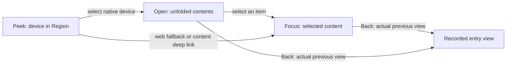
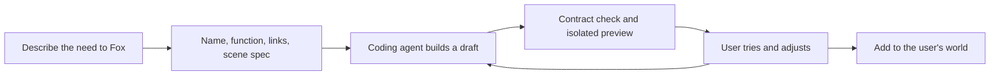

# Worldlet design system

Chapters:
- [HUD and brand](#hud-and-brand)
- [Applet presentation](#applet-presentation)

World and Applet dimensions follow the [UI sizing standard](../DESIGN-STANDARDS.md): 1920 × 1080 reference, 96px overview devices, approximately 240px Region devices, and 120 × 120px shelf containers.

Worldlet is a practical personal context world delivered as a desktop app: one [Electron host](../../platform/electron/README.md) with a PixiJS world, released for Mac (macOS 14+, Apple silicon or compatible Intel Mac); Windows and Linux builds come from the same host. Product UI is English; original source content keeps its language. The public website is a separate marketing surface with a renderer-only preview; it is not the app shell.

This is the current specification. The UI system lives in code; this document explains the rules the code follows.

## Sources of truth

| Concern | Implementation / reference |
| --- | --- |
| UI typography, color roles, spacing, radii, timing | `ui/components/tokens.ts` |
| Shared controls and icons | `ui/components/primitives/components.ts`, `ui/components/primitives/icons.ts`, `ui/components/components.css` |
| Layout, modes and interaction states | `ui/components/layout.css`, `ui/components/states.css`, `ui/components/mode.ts` |
| HUD, Fox actions and brand | [HUD and brand](INTERACTION.md#hud-and-brand), `ui/hud/native-hud.ts`, `resources/styles/builtin/assets/brand/mark.json` |
| Content templates | `ui/components/templates.ts`, `ui/world/travel-experiment.ts` |
| Current 2.5D style and shared lighting | [Style and lighting contract](../../resources/styles/builtin/STYLE.md), [Sprite world](../world/COMPOSITION.md) |
| Regions and Applets | [Applet presentation](INTERACTION.md#applet-presentation), `core/applets/catalog.ts`, `ui/world/world-presets.ts` |
| World data and Fox tools | [World interaction](../../core/items/STORAGE.md#world-interaction) |
| Sky, weather and audio | [Sky and weather](../world/ENVIRONMENT.md#sky-and-weather), [Background music](../world/ENVIRONMENT.md#background-music) |
| Acceptance | `scripts/village-camera-check.ts`, `scripts/world-scene-check.ts` (both in `npm run test:ui`), [runtime resource record](../../resources/styles/builtin/assets/world/README.md) |

`scripts/build-ui.ts` compiles one stylesheet in cascade layers: legacy → foundations → components → layout → states. Historical CSS in `ui/shell` (the `legacy` list in `scripts/build-ui.ts`) is quarantined in the lowest layer and its `!important` rules are stripped during compilation. Do not append new overrides there; keep a fix in the component, layout or state file that owns it. The hidden and reduced-motion invariants are the only intentional priority overrides.

## Three hierarchies

| Dimension | Structure | Purpose |
| --- | --- | --- |
| Data | Raw sources → extracted items → world projection | Sources are read on demand by Hermes; only grounded items persist in `world.sqlite` |
| Spatial ownership | World → Region → Applet or Matter → optional detail panel | Three spatial levels; buildings and rooms are implementation details, not mandatory clicks |
| Presentation | Peek → Open → Focus | Device status, unfolded contents, selected content; web fallback skips Open |

Sources are provenance and connections, not the organizing principle of the world. Places can be gardens, camps, workbenches or open pavilions; roofs are optional. Stable facilities hold ongoing capabilities; content objects show current state. Region IDs and positions never move. Never infer progress or urgency merely to decorate a scene.

## Applets and Matters

An Applet represents an application as an interactive 2.5D Sprite installation.
The [presentation contract](#applet-presentation) below owns its states, routes,
identity and acceptance; the executable catalog owns the current roster.

Matters group context around one thing, such as a trip or move. Extracted items
retain their source identity and do not automatically create central objects.
Sample Mode is explicitly fictional and never enabled implicitly for real users;
its records and isolation belong to the [demo guide](../practice/DEMO.md#sample-persona).

## Fixed screen responsibilities

| Location | Responsibility |
| --- | --- |
| Left | The Attention Center — Coming Up / Worth Doing / Worth Knowing as a game HUD; during Focus the left two thirds hold the reader, website or native panel |
| Top center | Current context as plain text: region, Applet, Matter or original; genuine brand logos may accompany Applet titles, with no generic emoji fallback. Inside an Applet it is centered over the left two-thirds, the Applet's side of Fox's column |
| Top bar | Back (World left of Fox on a website page); inside an Applet on a wide window the [Applet shelf](#applet-shelf) of recent Applets above it, and its own controls (Picture in picture, the Native / Web switch). A website page's Back, Forward, Refresh, Home, address and Focus are its toolbar's, in the panel above the page. The Applet's actions sit beside Fox. All bar controls are in the darker frosted material of Fox's round controls ([top bar](#top-bar)) |
| Top right | What Fox is doing right now (owner decision 2026-10-08): the Tutorial switch, and under it one quiet line while background work runs ("Making your morning brief…", "Drafting a reply: …") and, for a few seconds after, what is ready ("2 replies ready · Journal"), which opens the Journal ([Fox's background work](../companion/CONVERSATION.md#how-fox-talks-and-when-it-speaks-first)). The date, weather and sound head the Attention Center on the left |
| Around Fox | World on the left; on the right at most three actions: the next item action, Connect, Have Fun. Fox keeps a reserved lane of its own in both widths: centred between its two wings, with a gutter, so no action is ever pressed against the avatar. Action titles always stay on one line, including Focus and enlarged text; overflow uses an ellipsis, with the full title available in the tooltip and accessible name |
| Bottom center | Fox bust, input, reply bubble |
| Bottom right | Faint Worldlet mark, version and build |
| Companion panel › Settings | Integrations, Background tasks, Data, Sample world, Sounds, Voice, Privacy, Open at login, Troubleshoot (Restart Fox, Debug), Reset |
| World | Relationships, landmarks and state; fixed overview camera; Regions and opened Applets never zoom or scale it, no orbit |

The left list is grouped Coming Up, Worth Doing, Worth Knowing, in that order — named the way a person would say them, not after the kinds they hold. Each row is one item from one source; rows are not merged per Applet and never become central objects. A row carries a title of at most four words on one line and one short sentence of context on at most two, both in the user's own words and neither naming the Applet, because the panel is glanced at rather than read; every row leads the line under its title with a time (owner decision 2026-10-02, #1281): when it is due or starts, as how far away it is and the clock time it lands on, or when it was found or updated. Opening a row displays a central HUD preview while the world stays in place. The preview's height follows its content (#1217): it grows upward from its place above Fox's column to the window's top margin, its illustration band yields first, and only a finding taller than all of that space scrolls its body; its actions stay visible at the bottom. A reusable category illustration, short saved summary, time and location give the key facts; Fox offers a short next-step suggestion with proactive actions beside it. Open original or an explicit help action enters the source context. Snooze, Dismiss and task completion live in the card's overflow menu; informational updates are acknowledged once previewed. Viewing alone does not complete a task. The panel keeps its place while the soft backing follows its content height: a group with nothing in it is not drawn, and nothing is counted. It never scrolls and never ellipsizes; it is as tall as the left edge allows, its contents stay vertically centred on that edge however few they are, and overflow is resolved by dropping whole rows from the longest group, not by cutting text or hiding it below a fold.

In Focus the foreground object and Fox share the center of the right third; closing returns them to the center. Only visible controls intercept world input. No manual orbit or zoom controls, obligatory walking, or forced traversal through empty levels.

## Typography and surfaces

See [HUD and brand](INTERACTION.md#hud-and-brand) below for the shared text roles, colors, backing and layout. Reading surfaces use warm paper and forest ink; over-world HUD type uses warm light text with a dark halo.

## Fox

Fox is the assistant's face and the primary control surface; Hermes is the agent kernel. The dock shows an image-based half-body Fox portrait (`ui/companion/companion-portrait.ts`), ears above a warm halo that breathes during active states and never spins. Animation coverage and unfinished world walking are tracked in [Fox animation](../companion/ANIMATION.md). Its hit area and the side-action centers stay fixed across states. Reduced motion stops the halo and the portrait's idle motion.

### Input

- Click Fox (or Space over the world) to type; hold Fox or Space to dictate; release sends the final transcript; Escape cancels. `⌘,` (Ask Fox…) opens the compact preferences guide inside the same bubble, not a settings window. Typing a character over the world opens the editor; editable fields, modifier shortcuts and IME composition keep their normal behavior.
- The line beneath Fox is a passive caption with no capsule, border, hover or tab stop. Only the explicitly opened editor accepts typing; losing focus collapses it to the caption without discarding the draft. Send keeps focus so typing can continue while Fox works.
- **Talk with Fox** is the first item of the microphone's right-click menu, not a control of its own: Fox then listens, answers aloud and listens again until the item is chosen again, Escape or leaving the app. The microphone wears a lantern ring while Talk is on and the bar's placeholder says whether Fox listens, thinks or speaks; talking over Fox, or a click on the microphone (or holding Fox or Space), while it speaks interrupts it. With **Listen for “Hey Fox”** on in Settings › Voice, saying “Hey Fox” starts Talk too, and a small lantern light on the microphone shows the wake word is listening. Rules and limits: [Talk with Fox](../companion/CONVERSATION.md#talk-with-fox).
- Live transcription stays in the input line as a draft; only Fox's reply appears in the bubble. Repeated keydown cannot start a second recording; releasing during the microphone permission wait cancels the pending start. Typed drafts survive dictation.
- Follow-ups sent while Fox is processing are folded into the current task through Hermes redirect, not queued as separate questions; the unsent draft is kept. Only submitted text flies toward Fox; the input stays visible during the effect.
- Fox and the message bar always use click-to-type / hold-to-speak: clicking Fox is the same as clicking the bar. Settings on Fox's left opens the Companion panel (owner feedback 2026-10-04), with Journal right above it opening the Journal (owner request 2026-10-08); inside an Applet both step aside; mirroring the Applet's actions on Fox's right; where Fox sits in the corner (typing, compact windows) it follows on Fox's right. Desktop pet mode returns to World first. No input-mode switch or permanent chat transcript is shown. Specific consent and credential steps still use native controls (API keys use the masked field in the Fox model guide).

### Bubble and status

- Progress has one place. While the bubble is open, Thinking, Using tools and Updating with your message replace the body text in the body's own type, color, line height and left alignment; real stage updates type in over at most 450 ms, repeats do not replay, and the first reply character interrupts the status immediately. Reduced motion shows the status at once; screen readers get the full stage text. The name badge only says Fox. There is no "Replying" line.
- When the user has collapsed the bubble, short progress moves to the caption below Fox and the bubble does not reopen for late replies or background updates. Background sync and save states appear only while the bubble is collapsed and never overwrite a reply being read.
- Fox's portrait tracks real stages with restrained CSS motion on the same image (the `.companion-cozy` states in `ui/components/components.css`): a slight tilt while listening, a slow sway while thinking or using tools, a small bob while replying, then an idle breath. No orbiting sparks, spinning rings or repetitive head sway. Waiting adds no placeholder bubble or "Let me think" text; the previous reply stays until the first new text arrives and is then replaced in place.
- Replies and guides never page (owner Order 2026-10-07): one that fits shows whole, and a longer one scrolls inside its card, fading at the bottom over a small down arrow at its right edge until its end is in view (owner Order 2026-10-09). Over an Applet the corner artifact yields to the reply: the front card keeps room for up to about six lines (four when the artifact is medium) and the artifact ends above it; a large artifact covers the Applet instead, showing the fullest version that fits there. The bubble uses a stable width, about 40% of the window and at most 560px (owner Order 2026-10-08: a little wider), with 24px side gutters including its painted edges and expands upward into the available height below the top HUD; moving Fox between the center and Focus never changes the width for the same content. The bottom edge stays anchored above Fox. The painted cloud caps keep fixed height rather than stretching with the text. Only a guide written as explicit pages, a sequence of steps, has the corner arrows. Streaming keeps receiving without jumping to the end; completion keeps the reading position.
- Each context (the World, an Applet, a reader item) shows only its own thread of Fox's one session ([one session, one visible thread per context](../companion/CONVERSATION.md#one-session-one-visible-thread-per-context)). A thread reads bottom-up: the newest card next to Fox, older ones above; a new card grows in from the bottom and pushes the others up. Options and notices take the front card and never wipe the cards above it, and they stay in the context they belong to.
- Beside an Applet or reader, Fox's conversation column is expanded by default: the whole thread above the current card. A quiet paper tab on the card's top edge, muted ink with a chevron (owner request 2026-10-05: not loud), reads **Fold** and collapses it: only the latest message stays whole, and the earlier cards wait behind it as one card edge, two cards in all (owner Order 2026-10-07). The tab then reads **Expand** (its accessible name says how many wait, such as 3 earlier messages); it, or a click on the stack, expands every message again. The one preference applies to whichever context's thread is shown: each thread collapses to its own newest card over its own stack. A new turn while collapsed takes the front card and the previous one joins the stack; the working line, Show more, action links and the input behave the same in both states. The toggle is a button with `aria-expanded` that controls the earlier-cards list; the front card stays the live `Current reply` region, so the latest text is always exposed. Reduced motion drops the rise and settle. The choice is a local UI preference of this profile (`worldlet.companion.chat-folded` in the trusted page's storage, like Fox's position), default expanded. The world keeps its own transient deck with the same **Expand** / **Fold** tab, where Expand stacks the cards taller with no box around them, at the card's one width (owner Order 2026-10-07: the World card never changes width), and does not read this preference. `node scripts/fox-chat-fold-check.ts` (in `test:ui`) covers it.
- Browsing keeps at most 20 replies in session memory, never changes world context, sends no model request and replays no action. Earlier replies are browsed only within the current context; switching context never recalls another location’s reply. Returning to a previously visited context may show its saved reply, without an added label. A new reply returns to the latest answer.
- Clicking outside Fox, its input and its bubble collapses the bubble. Ordinary world clicks count; controls of independent notices (Attention card, Dev build and app update notices, Applet status notices) do not, so dismissing one never dismisses Fox's pending suggestion. Hovering or focusing Fox recalls it temporarily; a new conversation restores it. First-use sequencing belongs to [Onboarding](../onboarding/README.md).
- The first-source guide yields the bubble as soon as the user types or speaks and does not reopen from snapshot refreshes during that session; it can be reopened from Connect. Recording, transcription and streaming replies are never interrupted by non-user-initiated guides. Simple greetings skip world and web context collection.

### Actions and recommendations

- Every executable action, guide option and suggested reply inside the bubble body is body-size green bold underlined text with no button frame; guide choices in the bubble footer share the frameless [Fox dialogue footer](../../core/attention/README.md) with Attention item controls. Keyboard focus, disabled and waiting feedback remain. `Reply:` suggestions (at most two) fill the draft and are only sent by the user. Executable actions call predefined controlled entries (ambience and music, connection, model, voice and world guides); arbitrary commands in reply text never execute.
- The same conversational action appears once: in the bubble while open, on the light HUD beside Fox after collapsing, without an extra model request; it expires when the navigation context changes. Late model responses update content but do not reopen a collapsed bubble.
- Right-side recommendations come from real state: the next item prefers the current Applet or region, then item priority, and reads Review task / View event / Check update with the item in the tooltip; with no items the slot is empty. Connect recommends an unconnected supported Applet for the current service or region and never authorizes by itself; it is not repeated while a guide is open. Have Fun always enters Explore. Navigation buttons execute immediately without a model call; navigation, music and other intents typed as text go to Hermes.
- Escape first dismisses the current input or reply, then the detail panel, then one navigation level; never two returns at once.

### Rich replies

Replies support Markdown emphasis, headings, lists, quotes, code, tables and links in the same Inter family: forest headings and key facts, warm translucent highlights, sage inset quotes and code, lightly tinted note links, restrained table shading. Simple replies stay simple. Supported emphasis is `<mark>text</mark>` or `text` (accent, muted, warning, success); never rely on color alone. Arbitrary inline styling and remote images are not rendered. Internal links use real world IDs and are validated before becoming interactive; links only navigate. External HTTPS links open separately with no opener access. Model Markdown is sanitized before insertion. Reasoning and partial tool arguments are never shown; tool calls run only after complete validated messages; interrupted streams show an honest error.

### Fox owns content changes

Reader surfaces are read-only: no Edit, Delete, New or Restore controls, and checklist states display without direct toggling. Create, edit, delete, restore and undo are requested through Fox and go through validated, revision-aware tools. Successful edits update quietly with no routine toast or floating Undo; errors stay visible and recoverable. Completing an item is only possible through Fox (`update_world_item`). Model-driven changes require connectivity and must report failures accurately.

## Navigation and Applet states

Use [Peek → Open → Focus](#applet-presentation-standard-states-peek--open--focus)
and its actual-entry Back contract below. Website Focus unloads page/media on exit.
The [browser contract](../../platform/browser/INTEGRATION.md) owns web permissions and session isolation.

## Verification

- `npm run test:ui` covers layout, the interface build, native actions, the sample persona, Applet implementation kinds and Fox onboarding.
- `npm run test:electron` (`scripts/electron-checks.ts`) runs the desktop host: the host contract (`--host-contract-check`: every action the UI sends is registered), the module `check.ts` files and an app smoke run (`--smoke-check`) on a disposable library. The onboarding journey is being re-ported as an Electron `--check onboarding-flow`; the retired Mac host's other in-app checks (world interaction, browser, YouTube, Stripe, music, radio, live Hermes) are not yet ported.
- Camera framing: `scripts/village-camera-check.ts`; device placement and representation: `scripts/world-scene-check.ts`. Renderer measurements and limits are recorded in [render performance](../world/ENVIRONMENT.md#render-performance). The V6 validation record is in [assets/world/README.md](../../resources/styles/builtin/assets/world/README.md).
- Automated checks do not prove physical microphone permission, live model reliability or real-account source quality; inspect the installed app for those.

The world overview title shows the standard full-color Worldlet mark and full name; region titles remain plain. The lower-right footer shows the monochrome Worldlet mark with `worldlet.ai` on its first row, with version information on the second. Settings sits at the lower left, with its menu opening above and into the window. Loading also pairs the mark with the complete `Worldlet` wordmark.

Native Applet originals share a warm, quiet Markdown reader: a 740px reading column aligns metadata, title and body, with distinct heading levels, comfortable paragraph spacing, restrained quotes and code blocks. Prefer a complete first view; long originals scroll in one bounded content area while navigation and primary actions stay fixed. Avoid nested vertical scrolling; wide tables may scroll horizontally to preserve source structure. Nothing pages inside a block or card: lists of items and tables show whole and scroll in their own area. Checklist items remain read-only and original links keep their destinations. Task actions stay with Fox; third-party browser Focus retains its website behavior.

Native reader type uses the shared UI scale (no viewport-dependent font sizes): title/H1 28px, section/H2 20px, body/H3–H6 16px, tables/code 14px, metadata 12px. Heading weight is 600, metadata 500, body 400; body line height is 1.8. A tiny muted brass diamond by the metadata and a short brass accent on the header rule are the only added ornaments.

The personal world defaults to actual local day/night across World, Region and Applet views. Explicit visual previews and recording mode may override the scenery lighting; the HUD clock, date, real forecast, solar/lunar coordinates and lunar phase remain accurate. Without a location only the sky positions are decorative; phase still follows the real date. See [sky and weather](../world/ENVIRONMENT.md#sky-and-weather) for the compressed panorama and readability sizing.

## Scrolling

Use the Style Pack's fit-first contract: one bounded scrolling content area for
reading or catalogs, with navigation and primary actions fixed. Do not force all
content into pages or hide overflow: no block or card pages (owner Order 2026-10-07). Fox's artifact
cards and replies, an Applet's Open items (the places run on in rows) and Notion tables show whole when they
fit and scroll in their own area when they do not; Calendar's week arrows move dates and are not pages. Weather shows seven days; Companion catalogs
and region shelves may scroll. Third-party sites retain their own scrolling.
Verify long originals, keyboard/large-text access, reading-position preservation
and nested-scroll behavior; this is not a blanket accessibility certification.

## HUD and brand

Applies to the Mac world HUD, the actions around Fox and the Worldlet mark. Inter is the only UI typeface; text roles, status colors and day/night contrast are fixed here. Applet logos keep each service's own colors and proportions. Interaction rules for Fox, the bubble and the next-action buttons are in [DESIGN.md](INTERACTION.md).

### Basis

A game HUD must stay readable over a changing scene. Beyond one typeface, the role, size, weight, spacing and status meaning of each text is fixed; not everything has to be white.

- [Xbox XAG 101, Text display](https://learn.microsoft.com/en-us/xbox/accessibility/xbox-accessibility-guidelines/101): check text size and layout in the real display environment. This document uses desktop CSS sizes, not console pixel metrics.
- [Xbox XAG 102, Contrast](https://learn.microsoft.com/en-us/xbox/accessibility/xbox-accessibility-guidelines/102): check HUD text and symbols against varied backgrounds; 4.5:1 is the target for important text.
- [Game Accessibility Guidelines, text and UI contrast](https://gameaccessibilityguidelines.com/provide-high-contrast-between-text-ui-and-background/): verify against real frames.

The HUD uses soft washes and glyph shadows that let the world show through; it does not claim a fixed contrast ratio under every camera, weather and background. Color pairs with a group name and a pure shape (diamond, square or circle). Five row-background strengths express urgency or importance, with an accessible level description; shapes never contain punctuation.

### Text roles

| Role | Size / weight | Where |
| --- | --- | --- |
| Current place | 20px / 600 | Top context title |
| Primary content | 16px / 600 | Item action line, region names |
| Actions and status | 14px / 500 | Buttons beside Fox, date, weather, audio toggles |
| Source and explanation | 14px / 400 | Item second line, at most two lines |
| Group and meta | 12px / 600 or 500 | Coming Up / Worth Doing / Worth Knowing headings |
| Passive hint | 12px / 400 | Caption under Fox, version |
| Reading body | 16px / 400 | Fox replies and details, on a stable reading surface |

Line height: titles 1.4, explanations and actions 1.5, long text 1.6. Group names use slight tracking; uppercase only for short group names. Shared size variables support enlargement; secondary information uses its own color rather than a lowered opacity on the whole row. Focus outlines are tuned separately for the HUD and for paper surfaces.

### Colors and semantics

Brand forest green `#315f48` and warm paper `#f4f0e5` come from `resources/styles/builtin/assets/brand/mark.json`. Wood, water and clay are scene material colors in the same natural family; they do not set text colors.

The HUD uses one text treatment at every hour: warm light type on a dark halo. Day and night no longer swap the foreground, because the world is bright under both and dark type on a light halo lost against sunlit ground. Reading panels are the exception and keep paper with dark ink.

| Use | HUD, day and night |
| --- | --- |
| Primary text | Warm ivory `#f6efdb` |
| Secondary text | Light sage `#d9e0d2` |
| Tasks / decisions | Amber `#edc47d` |
| Coming Up / time | River blue `#a5d4dc` |
| Updates / new | Sage `#b1d3ab` |
| Halo | `0 1px 2px #10291e59, 0 0 7px #10291e4d`, on every piece of HUD type and every glyph, as a `text-shadow` or the matching `drop-shadow`. It exists to lift type off the sky, not to be seen: nothing in the HUD defines a halo of its own, and no surface pairs light type with a light halo |

- Group headings and glyphs use the status color; the action line keeps the primary color so whole paragraphs are not colored.
- Attention Center is vertically centered. Its backing follows the visible list height and disappears when the list is empty. Use a uniform, translucent deep-green wash with a broad soft fade outside the text; no dark central spot, visible rectangle, border or backdrop blur. Keep glyph shadows for legibility. The world camera never changes when items arrive. Drop overflow rows whole instead of clipping or scrolling. There is no redundant panel title. Current renderer tuning lives in `ui/shell/pixi-world.css`.
- Peek names are plain text beside their authored devices. In Open/Focus context titles and Applet information, only genuine provider brands show a logo. Generic Mail, Calendar, Notes, Reminders, Weather and Browser show their names without a function-icon or emoji fallback. Content symbols, such as weather conditions, and the painted devices themselves are unchanged. Provider logos keep their own colours.
- Region labels are plain text, without emoji or a separate decorative icon. Hover brightens the label without drawing a ring around the Region.
- The top title names the current context: World, a Region name, or an Applet name. Only branded Applets carry their logo; generic Applets, World and Regions have no preceding icon.
- Glyph shadows are a tight halo rather than a wide glow, so HUD text stays legible over bright scenery without a panel behind it.
- The top place, weather, action buttons and Fox caption share the day/night HUD roles; reading panels keep stable paper with dark ink.
- Hover adds a restrained backing and keyboard focus remains visible. Audio occupies the third right-aligned environment row. Its source label stays visible, so hovering does not move the date or clock. Playing is indicated by brightness; only connecting pulses.
- Functional icons share a 24-unit viewBox and 1.8-unit stroke; 18px in buttons, 26px for attention item markers in the left panel.
- The sound corner is one control wearing the face of what is sounding: `wave`, `drop`, `tree` or `breeze` for ambience, `note` for music, `mic` for a podcast. Reaching for it offers the choices, with the one playing marked. A podcast is the music channel with `kind: podcast`; `PodcastDirectory` finds the show through Apple's public search, which needs no key, and plays the newest episode from the feed the show publishes. A glyph that sits on the scene without a panel wears the halo as `--ui-hud-glyph-shadow`, the filter form of the same shadow the text uses. Provider logos are never given a line-art or low-poly treatment.

Implementation: `ui/components/tokens.ts` defines the day and night variables and the aliases re-evaluated at the theme root. Do not redefine night colors per component.

### HUD layout

Bound in `ui/hud/native-hud.ts`.

| Position | Content |
| --- | --- |
| Top center | Current context title; icon only for an Applet. Inside an Applet, centered over the left two-thirds |
| Top bar | Back at the start when a previous level exists; inside an Applet, the Applet shelf and the Applet's own controls at the end of its side |
| Top right | The Tutorial switch, then what Fox is doing right now and, briefly, what it just made (`ui/hud/fox-work-line.ts`); aligned to the same right edge |
| Left | The Attention Center: Coming Up / Worth Doing / Worth Knowing, drawing only the groups that hold something. No heading over it; it is what it holds |
| Beside Fox, left | World |
| Beside Fox, right | At most three: the next item action (Review task / View event / Check update), Connect, Have Fun |
| Bottom right | Faint site/version information |
| Bottom left | Settings gear and available update action |

Development builds show a clickable Worldlet.dev link, product version, "Development" and the short commit instead of a DEV badge. There is no DEV app icon: development runs launch the unpackaged Electron binary, and packaged builds use the production icon.

### Top bar

Owner decision #951; controls beside the title, owner feedback 2026-10-03; one Back and actions beside Fox, owner feedback 2026-10-04. Inside an Applet (Open or Focus, or whenever a panel holds the left two-thirds) the title is centered over the Applet's side, the area beside Fox's column: the left two-thirds of a wide window. Fox's column never narrows below 464px, so in a smaller window the title centers over what remains. Every control of the bar sits right beside the title, 10px from it on its row, not out at the bar's ends:

- **The Applet shelf.** See [Applet shelf](#applet-shelf): inside an Applet on a wide window it names the Applet in the title's place, and the bar's row keeps **Back** at its start and the Applet's controls at the end of the Applet's side.
- **Left, navigation and view.** **Back**, which returns one level. Inside an Applet there is no second World button beside it. On a website page (a website Applet, a Made Applet, the Browser) the page's own **Back** and **Forward** are in its toolbar, and **World** stands left of Fox in the dock, the way back to the World; empty scenery still leaves the Applet. The File menu's Back and Forward do the same with the platform's keys: ⌘[ and ⌘] on the Mac, Alt+← and Alt+→ on Windows. A page opened over the World keeps its own close.
- **Right, the Applet's own controls.** **Picture in picture** while a website Applet's video plays, or the **Native / Web** switch of a hybrid Applet (never both).
- **A website page's toolbar** (owner request 2026-10-09: 「website based，下面多个框，显示url，前进后退，home之类的按钮」, then 「website 就简单一点吧」). One plain row in the panel above the page, never over it, since the native page covers anything drawn over it: **Back** and **Forward**, which follow the page's own history and rest greyed when there is nowhere to go (Back at the first page works only when the page was opened from something in the Applet, which it returns to); **Refresh**, which loads the page again, also one left blank; **Home**, greyed on the Applet's home page, which takes the page there; the **address**, the page's address without scheme or `www.`, the whole one while typing, where Enter opens what is typed (an address, or a search) and Escape puts it back; and **Focus** at the end, which shows the page's main content while on ([page focus](../../core/browser/page-focus.ts)). Flat icons on a light strip, not frosted circles (`resources/styles/builtin/controls.css`).
- **The Applet's actions stay beside Fox.** What Fox can do for the Applet (Check mail, Summarize, Reply, Refresh…) sits in Fox's dock, right of Fox, not in the bar.
- **Controls, not capsules.** All of them use the darker frosted material of Fox's round controls (`--hud-scene-dark-*`, shared in `resources/styles/builtin/controls.css`), replacing the light scene capsule Back had from #872. They are 44px icon circles at every width (owner decisions 2026-10-02 and 2026-10-03: no text), except the Native / Web capsule, with the label kept as the accessible name and tooltip. Hover darkens them, keyboard focus draws the same 2px ink ring as Fox's controls, and they appear in place with no motion. The Native / Web switch alone stays a capsule of two icon buttons with the chosen view lit (owner decision 2026-10-03).
- **The title gives way.** It keeps one line and, on both sides, room for the wider of the left side plus the bar's start and the right side plus the bar's plain 16px inset, so the left side always clears the Mac's traffic lights (the `leadingWindowControls` host feature, #895), and ends in an ellipsis rather than running under them; the panel's own header carries a long name in full.
- A stacked narrow window (800px and below) puts the title under the bar, centered on the window; the left side then starts the bar (16px from the edge, or 76px after the traffic lights) and the right side follows it. The World and its Regions keep their title centered on the window, with Back right before it.

- **Tabs, in the Browser only** (owner request 2026-10-07: booking flights and hotels needs several pages). A website Applet (YouTube, X…) keeps one page and no Worldlet tab strip. The Browser has a slim strip, 28px with a 4px gap, on its frame's top rim above the page, always shown so it is found: each tab the page's title (or its site) ending in an ellipsis, with a close, the active one in the page's white, and **+** at the end for a new tab on the home page. Restrained and practical (owner: 以实用为主，物化不要太过): flat tabs tinted into the timber, not a copy of a browser's chrome. Up to eight tabs; a tab whose page was released opens again at its last address; closing the last tab leaves one on the home page. The File menu's keys: ⌘T / Ctrl+T, ⌘W / Ctrl+W (the window's close everywhere else), ⌘⇧] ⌘⇧[ / Ctrl+Tab Ctrl+Shift+Tab. The toolbar and Fox act on the tab in view; while Fox works on the page the strip rests. Rules in `core/browser/browser-tabs.ts`, pages in [Several pages at once](../../platform/browser/INTEGRATION.md#several-pages-at-once); `node scripts/browser-tabs-ui-check.ts` covers it.

Measures live in `ui/components/layout.css` (`--applet-bar-*`), the sides' style in `ui/shell/pixi-world.css`, and `ui/hud/native-hud.ts` places them against the title. `node scripts/applet-top-bar-check.ts` (in `npm run test:ui`) covers the placement at 1440, 1100, 900 and 700px, with and without traffic lights, the material, focus, a website page's toolbar, the long title and the World title.

### Applet shelf

Owner request 2026-10-09: 「applet之间要可以丝滑切换，进入applet后，上方显示最近使用的applets，像一个一个tab，开新tab是进入browser，切换的时候，背景也丝滑切换」; 「当前 applet 要在中间」. Inside an Applet on a window wider than 800px, the recently used Applets stand on a shelf above it, a faint line fading at both ends rather than a plank (「下面那个 bar 太明显了」), each its World device with its name below, in place of the title:

- **The open Applet stands in the middle**, largest and lit, its name on a cream label; the others grow smaller and fainter the further they stand from it.
- **One ring.** The Applets keep one order around the open one, so picking one slides the shelf to bring it to the middle and both sides always hold Applets. A new Applet joins the ring; one already on it keeps its place. Rules in `core/applets/shelf.ts`.
- **As many as fit** beside the middle on the Applet's side (three to six); the ones used longest ago wait behind **+N** at the left end, which lists them.
- **Close** on the open Applet takes it off the shelf and opens its neighbour; closing the last returns to the World.
- **+** at the right end opens a new page in the Browser with its address ready to type (a new tab when already there).
- **Switching is smooth.** The panel switches in place, an open website page is kept rather than loaded again, and the background scene crossfades from one Applet's to the next (`ui/theme-packages/village/pixi-focus.ts`).

`ui/hud/applet-shelf.ts` draws it; `node scripts/applet-shelf-check.ts` (in `npm test`) covers the ring and `node scripts/applet-shelf-ui-check.ts` (in `npm run test:ui`) the shelf in the World.

### The W Grove mark

[Two options](../../resources/styles/builtin/references/brand/preview.html). The production mark is **W Grove**: a W-shaped tree crown rooted through its trunk into a small low-poly island (`"selected": "canopy"` in `mark.json`). **W Roofline** (clay roof, green walls, two warm windows on the same island) remains an exploration and is not used in the product. The icon expresses a little world: a grass top, visible soil thickness and a path; small sizes read the W and island outline, larger sizes reveal tree, house and ground detail.

- Geometry source: `resources/styles/builtin/assets/brand/mark.json`. `selected` fixes the production direction; `palette` and `background` define brand colors and font across surfaces.
- SVG assets: `resources/styles/builtin/assets/brand/worldlet-mark.svg`, `worldlet-app-icon.svg`, `worldlet-canopy.svg`, `worldlet-roofline.svg`. `npm run brand:build` regenerates the SVGs, `brand.css` and the 180 / 192 / 512 px PNG exports (`scripts/build-brand.ts`, `scripts/pwa-icons.ts`).
- The Mac icon is rendered by `scripts/package-electron.ts` from `worldlet-app-icon.svg` into a 16–1024 px iconset and `Worldlet.icns`; Windows uses the committed `worldlet.ico` (`scripts/windows-icon.ts`).
- The in-app signature is a monochrome version of the same outline. App icon, SVG and in-app logo are never traced separately.
- The mark is procedural vector work; no generated bitmap assets.
- The production Grove uses muted sage foliage and warm earth with softer facet contrast, matching the painted world's palette. Its recognizable W/island geometry and the shared UI text colors are retained; the icon is a compact vector identity, not a painted scene thumbnail. Roofline is historical exploration only.

### Startup

The startup screen reuses the current painted Fox rig's `fallback.png`, packaged as `assets/fox-startup.png`, with a quiet breathing transform. Fox, the wordmark and the three-stage loading indicator form one centered group on warm paper. The enlarged Grove logo serves as the W, followed by `orldlet`; the accessible name remains Worldlet. There is no slogan or bottom-pinned status. Real loading phases, slow-load recovery and failure retry remain visible in this group. Reduced motion disables breathing; failure pauses it. This lightweight surface does not initialize a second rig or require the main world bundle to paint.

### Use across surfaces

[System preview](../../resources/styles/builtin/references/brand/system.html). The wordmark is **Worldlet** in Inter 600 with tight tracking.

| Surface | Form |
| --- | --- |
| Mac Dock, Finder, installer; Windows taskbar and installer | W tree world on a warm paper rounded tile |
| App startup page | Color mark plus Worldlet; Fox remains the companion character |
| World HUD signature | Monochrome small mark following the day/night foreground color |
| Website header and footer, download page, world preview | Color mark plus the wordmark; Discord, GitHub, X and Reddit monochrome links beside the header download button |
| Website download section, browser favicon | Full app icon (`/icon.svg`) |
| Touch icon | `apple-touch-icon.png` generated from the same source |

- `ui/components/primitives/brand.ts` exports the color and monochrome marks and CSS variables; the site uses `.brand-lockup`, the app reads text parameters from `BRAND`. Mark and wordmark sizes are CSS variables (`--brand-mark-size`, default 36px, `--brand-wordmark-size`).
- App and website builds regenerate SVG and brand CSS from the source file; the website consumes shared UI and registered resources, never host implementations.
- Workflow: edit `mark.json` → `npm run brand:build` → build the app and website → check small sizes, day and night, phone width. Exports are never edited by hand; new surfaces reference the shared assets rather than copying polygons or redefining the green.

### Immersive Mac window

On Mac the world scene extends into the title bar: the World window uses a hidden inset title bar (`titleBarStyle: 'hiddenInset'`, `platform/electron/src/world/window.ts`) and the World view fills the whole content area. The system close, minimize and full-screen buttons stay, at 18 px from the top-left; no custom replacements. The host declares `leadingWindowControls` there, so the [top bar](#top-bar) starts after them. The top 32 px of the World move the window, as the native title bar did; buttons, links and fields inside that strip stay clickable. Windows and Linux keep the standard framed title bar above the World.

Every World window opens with a 1920 × 1080 content area, the shared logical design size, scaled down with the same aspect when the display's usable area is smaller. The size is not remembered between launches.

### Verification

- `node scripts/package-electron.ts --platform darwin` renders the icon into a packaged app; inspect it at small sizes in the Dock and Finder.
- `node scripts/startup-check.ts` checks the built loading surface at desktop and narrow sizes, centered status, no slogan, reduced motion, loading phases, slow load, failure, retry and ready dismissal. `node scripts/source-layout-check.ts` and `node scripts/marketing-check.ts` cover brand assets and website surfaces.
- The retired Mac host's control regressions (the onboarding guide yielding to typing and voice, voice error retention, reopening the source guide from Connect, the lower-left gear menu) are not yet ported to Electron.

Pointer release always flushes a pending context sync. Hover/focus may defer rendering unchanged actions, but cannot retain the previous Applet context after navigation.

## Applet presentation

**Design authority:** [Applet design guide](../applets/DESIGN-GUIDE.md). This document retains implementation and compatibility details; the guide governs design decisions. Authoring guidelines live in `ui/applets/`; no Create Applet skill is used.

This is the main specification for Applet naming, display levels, interaction and the authoring contract. It separates the target design from what the code does today; a section describing a goal does not mean the feature has shipped.

### Concept and name

**Applet = App + let: the functions, content and running state of an existing application, turned into a dimensional 2.5D installation or scene the user can work with inside Worldlet.** Worldlet is the small world; Applets are the small applications inside it. Each has its own identity, model and capabilities. Fox is the main way to operate one.

The product term is **Applet** (plural **Applets**). "App" only refers to the external application or to the Worldlet Mac app itself. The repository directory is `ui/applets/`; `app.ts`, `entity: app` and the persistent `app-*` IDs stay as they are so renaming never breaks stored data.

**One Applet can combine several integration paths.** CLI, API, MCP, plugins, native adapters and websites are not mutually exclusive; presentation, data and actions, and authentication are decided separately. MCP exposes tools without widening service permissions. An MCP server may additionally provide MCP Apps UI resources, but Worldlet must explicitly implement a compatible isolated host to render them. See the [backend-independent contract](../applets/IMPLEMENTATION-GUIDE.md#backend-independent-applet-contract). A site that refuses embedded sign-in can still be a useful Applet through its service interface plus a dedicated view. YouTube is the current example: an original website and a separate official player/queue adapter (see [YouTube Applet](../../core/applets/INTEGRATIONS.md#youtube-applet)).

The model must express the function: a mail cabinet for Mail, a bookshelf for Notion, a tethered balloon for Airbnb, a workbench for Codex. Every Applet shows its complete model in every connection state; there are no boxes, crates or "open the box" steps. A visible model does not mean the account is connected, and idle ambient motion does not mean a task is running.

### Standard states: Peek → Open → Focus

Approved terminology, 2026-09-18. Spell **Peek**, not Peak. These are presentation states, independent of connection, task progress and support status. They are not OS window modes or mandatory visible tabs.

| State | Purpose | Mail example |
| --- | --- | --- |
| **Peek** | The Applet lives in its Region and reveals compact, real status | Mailbox with three new letters |
| **Open** | The device comes forward and unfolds selectable content | Open mailbox with individual envelopes |
| **Focus** | Read, watch or work with selected content in the left two-thirds; selected item and Fox remain in the right third | Read one letter and ask Fox to draft a reply |

World and Region are spatial contexts, not additional Applet states. The world always fills the viewport; HUD overlays it without shrinking the world.

#### Continuous camera and actual-entry Back

Approved 2026-09-18. This is the navigation and motion contract for all Applets, including website Focus.

- **One continuous camera journey:** World → Region → Open/Focus feels like successive steps closer to the same place. Focus uses the same camera motion language and easing as World → Region, not a separate fade to an unrelated screen. An authored Focus scene may blend in during the push-in, keeping its device identity and spatial anchor coherent. Returning reverses the journey with a pull-back. Reduced motion uses a direct transition.
- **Back means the actual previous view, not the Applet’s catalog parent.** Record the entry view, selected Region/Applet, presentation state and framing before navigating. Do not insert a Region or Open state the user never visited.
- Keep the actual route as a bounded navigation stack. Popping it must not add another entry. World explicitly returns to the overview and starts a new route. Data refreshes, layout changes, background sync and repeated selection of the current view must not add history entries.
- The Back button and the Fox Back action use the same return destination. Website-internal navigation remains owned by the website. Exiting Focus still unloads its website page/media.

| Actual entry route | Back from Focus | Following Back |
| --- | --- | --- |
| World → Focus | World | No Back at World |
| World → Region → Focus | That Region, with its previous framing | World |
| World → Region → Open → Focus | That Applet’s Open state | That Region |
| Focus A → Focus B | Focus A | A’s recorded entry view |
| Fresh launch at a Focus deep link, with no recorded route | World | No Back at World |

**Implementation status:** pending. The current renderer has a separate Focus plate fade/push-in, and the current Applet Back handler generally chooses its catalog Region. Neither is acceptance of this contract. Validate the routes above, rapid enter/back, reduced motion, and return after a background refresh when implementing it.

#### Peek

Show useful information through the functional sprite itself (for example a mailbox lid or flag), never through a content/status subtitle beneath its name. Within a Region, show one Attention Center marker above the device for its highest-priority active finding; omit it when nothing needs attention. Unknown counts stay unknown. Hover provides subtle feedback or device animation; it never authorizes an account or opens content. World overview uses less information than the Region view, but both show the Applet in Peek.

#### Open

Enlarge and unfold the same device, retaining its identity and shared data. Mail reveals letters, Calendar reveals a schedule, Notes reveals note leaves and Reminders reveals task cards. Objects are selectable; an enlarged decorative image alone does not satisfy Open. Use independent sprite parts and authored animation sequences, not a separate 3D engine.

#### Focus

A selected record, session, video or website becomes the readable working surface on the left two-thirds. The device stays above Fox on the right third. Native content surfaces support reading, selection and scrolling; contextual task actions such as reply, complete and reschedule belong only to Fox, as dynamically relevant bold underlined text in the conversation area. Do not duplicate those controls on the content sheet. Sending a message is distinct from drafting it and follows the applicable authorization rules.

**Default to Peek → Focus**, including Sample. Open is opt-in only after its useful native device experience is authored and accepted; Mail, Calendar, Notes and Reminders now use authored Open. Focus may contain the whole website; selection inside that website is managed by the site. Open the selected deep link, otherwise the last position or home URL. Worldlet adds only the plain [website toolbar](#top-bar) above the page and no close X; preserve the site's own controls. Website sign-in and connector authorization are separate. If embedded browsing is blocked, Fox offers the system-browser path. Exit stops media and unloads the page while preserving sign-in data.

#### Shared Peek scale and Focus scenery

Device sizes and shelf dimensions follow the [UI sizing standard](../DESIGN-STANDARDS.md); ground anchors and slots follow [World layout](../world/ENVIRONMENT.md). Keep foreground devices and labels separated at every supported viewport.

Focus may replace the world backdrop with an Applet-specific full-screen painted scene, preserving the same device identity, original logo, common lighting and the unchanged Fox HUD. Concentrate detail in the right third; keep the left two-thirds quiet under the content panel and maintain a continuous horizon and ground without a vertical seam. Reserve quiet ground for Fox and its dialogue; do not bake UI, readable records or actionable controls into the plate. The plate is scenery; the left content remains live. YouTube is the first implemented plate (`resources/styles/builtin/assets/applets/youtube/focus-day.png`). Other Applets retain the existing scene until their own plate is authored.

For native Applets, **Open remains interactive sprite content**, not a static photograph. Selecting an envelope/card moves to Focus: original content on the left, the selected envelope, event card, note leaf or task card above its parent device on the right. Returning restores Open and its selection. Web Applets skip Open. A scenery asset never establishes a working native Open implementation.

#### Navigation, title and Fox

Inside an Applet (Open or Focus), clicking the exposed scene acts as Back, one step (owner request 2026-10-05); an open card or dialog over it closes first, and the Applet stays. In a Region it returns to the World. Clicking content or Fox never navigates. Drags do not count as dismissal. Keep keyboard dismissal and the contextual Back path accessible. Native Focus returns to Open, then Peek. Direct web Focus returns to its source Region, or World for an independent Applet; no empty intermediate screen. Direct item links retain their actual return origin.

Show only the current context title, centered: on the window in the World and its Regions, over the left two-thirds inside an Applet, between Back and the Applet's own controls ([top bar](#top-bar)); no repeated Worldlet heading or duplicate Applet title. Region titles have no emoji. Peek Applet labels are plain text without icons or emoji. Open and Focus titles may show an existing Applet icon; a missing icon stays empty, with no emoji fallback. Fox owns connection guidance and recovery; setup state remains separate from conversation state. No World updated, Continue setup or Back to app banners.

#### Compatibility and terminology migration

- **Preview → Peek**.
- **Full View → Open** when it means the unfolded native device; **Full View → Focus** when it means a website or content panel. Do not mechanically rename both to Open.
- **Detail / Contents → Focus / Open**, respectively, in earlier design proposals.
- Scene, web, native and panel remain implementation kinds, not presentation states.
- Existing `fullView.kind`, `fullView.original`, IDs and serialized data remain unchanged in this documentation update. The legacy model variant `open` means an activity look, not the **Open** presentation state.
- The original Home state boards and their generation prompts used historical labels; map them using this standard. The boards themselves were removed from the tree and are recoverable from git history.
- This standard defines the target. Updating terminology does not mean all unfolded sprite views or animations have been implemented.

### Routing: `fullView.kind`

Every visible Applet declares `fullView.kind` in `ui/applets/<key>/app.ts`. The world view mounts by kind and never branches on the Applet name.

| Kind | Behavior |
| --- | --- |
| `web` | Peek → Focus at the declared URL/platform |
| `scene` | Authored Open content → selected Focus |
| `panel` | Mount the declared native panel when provided |

The catalog and each Applet definition own current kinds and placement. A kind is
not a claim of functional acceptance. Optional service panels used by Fox remain
separate from the default click route.

Applets that authorize inside their own view (YouTube, Stripe, DoorDash) also declare `connection.flow: 'in-applet'`; onboarding opens the Applet directly. The connector `capability` (`connect`, `planned`, `browser`, `local`) only governs authorization and Fox tools; it never blocks the web entry. Ordinary clicks enter the view; only an explicit Connect starts authorization.

### Authoring contract

`appletContract(key)` in `core/applets/catalog.ts` returns identity (`id`, `key`, `title`, `description`, `region`, `placement`), the model recipe and version, `fullView`, the logo module path, the connection declaration, the variant list and content slot names. The table below is the complete standard an Applet should document; fields that do not exist in the runtime are marked as such and must not be assumed to be recognized.

| Item | Must state |
| --- | --- |
| Identity | Stable ID, name, one-line purpose, default Region or independent placement |
| Brand and links | Generic Applets have no identity-logo fallback; branded Applets use original logos with source and license (`ui/applets/BRAND-ASSETS.md`), the service home, allowed deep links and the external-browser path |
| Presentation | Content budget for Peek, selectable contents for Open, readable surface for Focus; implementation kind and web fallback |
| Sprite assets | Function-related model or scene, asset version, scale, anchors, click areas, resource release and reduced-motion behavior |
| Content and state | Where summaries and counts come from, their scope and time; which real events drive `idle / open / working / attention` |
| Connection and actions | What browsing, API, MCP, CLI and native adapters each can do; authentication, read/write scope, action parameters and real receipts |
| Fox context | Current Applet, record or session, allowed actions; how stale context is cleared on navigation and how background tasks keep their owner |
| Lifecycle | Enter, exit, resume, cancel, retry, uninstall; how user data and grants are kept or revoked |
| Acceptance | Disconnected, empty, working, failing, exit and re-enter; web compatibility, data correctness, performance |

Keep three dimensions apart:

| Dimension | Examples | Must not be confused with |
| --- | --- | --- |
| Display level | Peek, Open, Focus | Connected, done |
| Capability and runtime state | Website available, unauthorized, working, attention | A complete interactive Open view exists |
| Support level | Planned, Building, Ready | Whether the user's account is online right now |

The model variants `idle / open / working / attention` (`core/applets/presentation.ts`) stay compatible; `open` is the older name of the running look, not a navigation level. Working animation follows real tasks only; a failed, cancelled or abandoned task must not keep spinning.

### Applet Factory (not implemented)

The Factory would itself be an Applet docked in Work, beside the code Applets. Through the same Fox it takes a request like "make me an Applet that does X", delegates to an available coding tool (Codex or Claude Code) and shows real build progress. Its deliverable is always an Applet that satisfies the contract above.

The Factory would show real stages (Designing, Building, Testing, Ready to try, Needs input, Failed) driven by tool events, never invented percentages. Each build has its own ID, output and session routing; switching to another Applet keeps the task owned by the Factory so Fox does not send the next message to an old coding session. Installation and replacement must be explicit and a failed draft must not damage an existing Applet. Distribution, signing, updates and revocation of third-party Applets are open design questions.

Historical developer tooling includes the isolated draft generator `scripts/new-applet-draft.ts`. The generator writes a hidden, Planned draft under `.local/applet-drafts/<key>/` (an `app.ts` copied from a preset-device reference plus an `authoring.json` work plan). It never registers the draft, copies a logo, inherits a provider or touches the running world, and `authoring.json` is not a runtime manifest. Credentials and private content never go into an Applet package.

### Current implementation and open scope

The catalog and runtime manifests own current routes and supported capabilities;
region defaults come from area taxonomy. Device rendering alone is not functional
acceptance. Applet Factory and user-installable packages remain unimplemented;
existing draft tooling writes hidden work plans and never registers an Applet.
The product blueprint owns delivery status instead of a second dated roster here.

### Verification

- `node scripts/applet-focus-check.ts`: waits for catalog modules, enters every Applet, checks the context title, single Back, background updates preserving the panel, web unload on exit, direct authorization for unconnected account Applets and the legacy Fox setup entry. It also asserts current region IDs, catalog-driven routes, code Applets docking in Work, and plain-text Region labels. Runs inside `npm run test:ui`.
- `node scripts/applet-top-bar-check.ts`: the [top bar](#top-bar) inside an Applet: Back, World, the Applet's own controls, a website page's toolbar, their material, focus and narrow windows. Runs inside `npm run test:ui`.
- `node scripts/applet-shelf-ui-check.ts`: the [Applet shelf](#applet-shelf): the open Applet in the middle, switching, closing, +N and +. Runs inside `npm run test:ui`.
- `python3 scripts/quick-check.py` and `npm run build:native-ui` after changing definitions.
- Real-page checks for the browser, YouTube and Stripe views are not yet ported to the Electron host; see [browser verification](../../platform/browser/INTEGRATION.md#verification).

#### Default website destinations (2026-09-18)

Mail, Calendar, Notes and Reminders unfold authored Open and show source originals in Focus; Weather opens weather.com; GitHub opens its CLI repository inventory; Codex and Claude Code open local session inventories. Other destinations come from the catalog. Sample replaces data only, never the default route with a fictional inventory.

Cloud website content does not imply access to local-only Notes/Reminders or CLI sessions. Existing local connector/tool implementations are retained; website loading, sign-in and connector readiness must be accepted separately. The default route change does not mark any Applet Ready.

Destination references: [Apple Reminders](https://support.apple.com/en-nz/guide/icloud/mmc0cd77d9/icloud), [Codex](https://github.com/openai/codex), [Claude Code cloud](https://code.claude.com/docs/en/claude-code-on-the-web).

### Core content contract

Mail, Calendar, Notes and Reminders now use authored Open installations. See [Core Applet content](../../core/applets/INTEGRATIONS.md#core-applet-content) for Fox-generated display fields, source identity, pagination, Focus surfaces and current animation limits. Native Focus retains the selected Open item above its parent Peek device, with Fox below; Previous/Next browse the same Applet.

When native source Focus is visible, a click on exposed scenery—including background Region or device hit targets—acts as Back. It must not navigate directly to the background target. An Open → Focus journey returns to Open.

The [Work Applet contract](../../core/applets/INTEGRATIONS.md#work-applets) covers brand-derived functional devices, CLI read scopes, observed versus saved session state, and the different continuation capabilities of Codex and Claude Code.

### Acceptance contract

1. **Connection:** explicit authorization; cancel, denial, expiry and revocation never show success. Unsupported adapters do not offer a usable Connect button.
2. **Presentation:** complete Peek device; declared Open/Focus route; brandless function Applets remain brandless. Visibility does not imply authorization.
3. **Content:** real loaded records, source and time; honest empty states and counts, no invented account totals.
4. **Originals:** original content stays distinct from summaries; correct service links; closing returns to the prior view.
5. **Sync:** real progress/errors, idempotent rereads, documented handling of edits, deletions and lost permissions. A bounded read is not full sync.
6. **Recovery:** restart, offline, rate limits and expired grants; stale cache is not presented as fresh.
7. **Fox:** shared World tools, discoverable capabilities, source evidence, separate private-content consent and confirmation for external writes.
8. **Usability:** zoom, navigation, keyboard and return flows; Fox clearance; correct day/night appearance and no runtime errors.

Website Applets need browsing, sign-in, Back and failure-message acceptance. A signed-in embedded website is not a background OAuth connector. Media additionally needs playback, queue and saved-progress checks where implemented. Developer sessions must not pretend to control sessions owned by other clients.

Record tested build, action, fixture/account scope and remaining gaps in the
owning issue/PR. Do not infer readiness from a device render or a successful read.
Use `applet-focus-check.ts`, `applet-stage-check.ts` and the scoped Electron module checks (`npm run test:electron`).

### Selection and placement

The catalog owns the roster; [area taxonomy](../world/ENVIRONMENT.md#area-taxonomy) owns region defaults
and migration. Installation, placement and account authorization are independent.
Removing a device must not delete originals, sessions or saved records. Use
registered sprites, ground anchors and empty slots. Always show the complete
device; no crates, fabricated counts or generic connection dots. Provider logos
remain original, and brandless function Applets remain brandless. Personal data
and Applet logos must not be baked into environment paintings.

Focus arrows exist only when an adjacent record exists and retain their side;
unavailable controls are absent from keyboard navigation. Fox replies scroll
independently. Support level (Ready/Building/Planned/Unavailable) and actual
connection/runtime state are separate projections in `core/applets/status.ts`.
