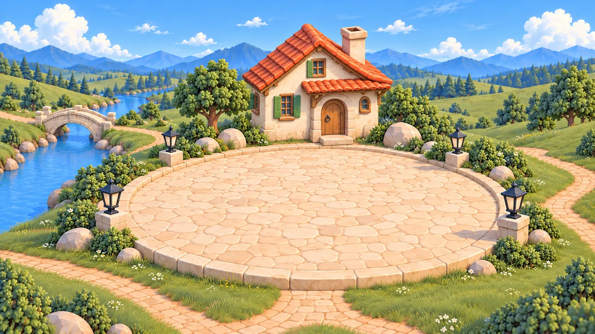

# Village Area close views

Twelve painted close views of the six Village places, a day and a night plate for each. They are kept with the theme for a future Area view; **nothing uses them yet**. They sit outside `assets/`, so they are not published into the app, and the Theme contract (v3) does not declare them. Today an Area opens by zooming into the World plate.

| Area | Day | Night |
| --- | --- | --- |
| Home | [home-day.webp](home-day.webp) | [home-night.webp](home-night.webp) |
| Work | [work-day.webp](work-day.webp) | [work-night.webp](work-night.webp) |
| Library | [library-day.webp](library-day.webp) | [library-night.webp](library-night.webp) |
| Money | [money-day.webp](money-day.webp) | [money-night.webp](money-night.webp) |
| Health | [health-day.webp](health-day.webp) | [health-night.webp](health-night.webp) |
| Travel | [travel-day.webp](travel-day.webp) | [travel-night.webp](travel-night.webp) |

## How they were made

Generated with an image model on 2026-10-09 and encoded here as 1672 × 941 WebP (quality 90). The World overview, landmarks and map geometry were not changed.

- **Direction:** immersive close views of the original village places. Rounded crafted 3D greenery, pale sandstone paving, a blue river and distant mountains, the original black lanterns. Rich foliage, masonry, tools and water around a clear foreground. No baked interface, people or text.
- **Composition:** elevated three-quarter view with the landmark toward the back and a large clear foreground where live Applets could stand (roughly x 18–82%, y 46–89%). Each keeps its landmark's identity and the village materials.
- **References:** the day World plate and each Area's landmark (`../assets/landmarks/<area>.webp`).
- **Night:** the exact day composition and landmark geometry under blue ambient light, with warm light from the existing lanterns, windows or hearth.
