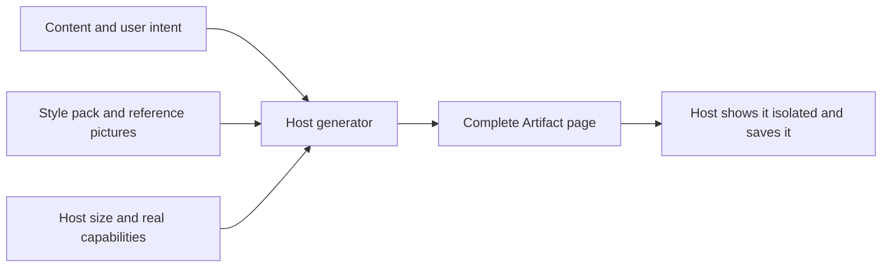

# Village Artifact style pack

The look a generated Artifact should have in the Village, kept with the theme so a future host generator can read it. **The first complete Artifact concepts are the visual standard**; the host would design each card's layout around its content instead of filling fixed slots.

| File | Use |
| --- | --- |
| [STYLE.md](STYLE.md) | Visual rules, flexible layout, interaction requirements and acceptance checks |
| [HOST-PROMPT.md](HOST-PROMPT.md) | The prompt a host generator receives together with the real content |
| [manifest.json](manifest.json) | Machine-readable index of the reference pictures, materials and colours |
| [references/recipe.webp](references/recipe.webp) | A second complete composition in the same style |

## Status

This folder is static reference material only. It sits outside `assets/`, so it is not published into the app, and nothing in the host reads it: the Theme contract (v3) does not declare it. Today Fox gives structured Artifact content and does not write HTML or CSS (see [the card system](../../../artifacts/CARD-SYSTEM.md) and [core/artifacts](../../../../core/artifacts/README.md)). Using this pack would need a host channel that generates a complete page, shows it in isolation and wires its actions, state, sizing and Journal saving. That channel does not exist yet.

The reference pictures are static concepts with sample content, not captures of working HTML. The materials in `materials/` (paper, a glasshouse and a soup bowl, the last two with transparent edges) may be reused by a generator; they are optional objects, not a fixed header slot.

When a generator uses this pack, pass the reference pictures themselves as visual input; a file name is not a substitute for seeing the picture.
