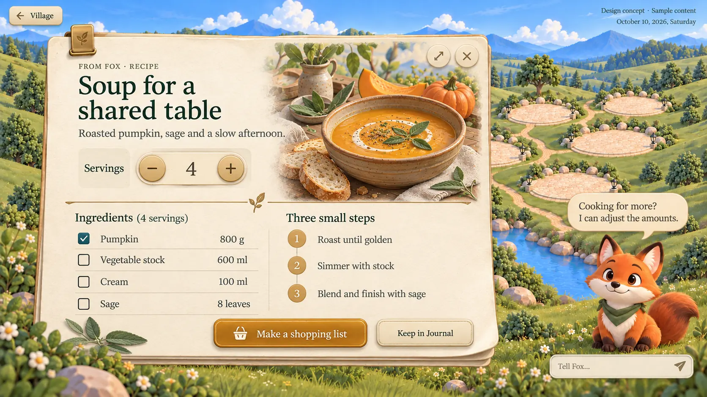

# Village Artifact: generation design rules

**The first complete Artifact concepts are the visual standard.** These rules guide a host that generates a complete, usable card directly. They are not a template waiting for text, and they do not require any fixed renderer layout.

## 1. Visual standard

Priority: the first complete concepts, then these rules, then the supporting materials and colour values. Later simplified HTML experiments are interaction references only and are not the visual target. The reference pictures are static designs: never lay a whole picture down as a background and cover it with transparent hot spots.

A card looks like a fine paper object placed in the village: thick cotton paper, natural stacked sheets, a little brass, deep green ink, a large content illustration, a clear title and buttons. Richness comes from material, illustration, depth and the content itself, not from adding more ornament.

## 2. What stays fixed and what the host decides

| Kept consistent | Generated per content |
| --- | --- |
| Paper, ink, lighting and shadow language | The card's internal layout, number and order of sections |
| Title and body font families and hierarchy | Title length, body density, where the emphasis sits |
| The feel of paper pieces, brass and dyed buttons | Lists, timelines, comparisons, tables, charts or other forms |
| The meaning of theme colours and control states | The subject, size and number of illustrations |
| The usable rectangle and companion clearance the host gives | Reflowing, summarising or expanding for the available size |
| Real HTML text and real actions | The whole card's HTML and CSS structure |

Do not turn everything into "one title bar plus three sections". An outing can be led by a large destination illustration and a timeline, a recipe by the dish and a servings control, a budget by its key figures and a receipt-style breakdown.

## 3. Space and hierarchy

In a 1500 × 844 World view, as a guide: the card starts near x=90, y=75, is about 950 wide and at most 685 high; roughly the right 30% is left for the companion. **The usable rectangle the host provides always wins; never hard-code World coordinates.** The World map, Fox, the conversation and navigation belong to the host; a generated Artifact only occupies its own surface.

- Inner padding about 32–52 px; ornament may sit near the paper edge, text never crowds it.
- The header takes about 35–45% of the card height. A large illustration usually sits top right, about 35–45% of the card width, fading softly towards the title and body.
- Title on the left, usually within two lines, 36–48 px; body 17–21 px with line height 1.4–1.6; notes 13–15 px. These sizes are a baseline, not a reason to shrink everything to fit.
- A clear primary action at the bottom, with at most one visually primary button. Secondary actions carry less colour weight but the same material quality.
- When there is too much content, edit and summarise first, or use an expand ability the host provides. Never cut a necessary action or shrink body text to micro size. Without an expand ability, do not draw a fake More.

## 4. Material recipe

| Element | Should look like | Avoid |
| --- | --- | --- |
| Main paper | Warm ivory cotton paper, fine fibres, slight light variation; 2–3 layers of edge thickness, a corner may curl slightly | A flat beige rectangle, dirty old parchment, texture that fights the text |
| Clip or binding | One small brass clip may hold the sheets, with a real connection and shadow | A clip on every section, ornament covering text |
| Ink | Deep forest green; secondary text lowers the contrast of the same ink | Embossed, shadowed or highlighted text |
| Content sections | A timeline can be a row of slightly lifted paper slips; a list can be printed straight on the paper | Every piece of information in the same boxed card |
| Rules | A thin warm-gold line or a low-contrast crease; an occasional small leaf as a finish | Ornament on every line, dense borders |
| Primary button | Dyed or enamel surface, thin brass edge, inner highlight, thickness at the bottom | A flat solid button, glossy plastic gradients |
| Secondary button | Paper or pale brass, with edge thickness and press feedback | Large buttons that all look the same |
| Checkbox | A square well set into the paper; checked shows a clear fill and tick | A whole checklist drawn as a picture |
| Quantity control | A small brass knob or a control group blended with the paper; the number is clear | A decorative knob that never updates the number |

Light always comes from the top left. Local shadows are short and soft; only the main card casts a deeper drop shadow. Materials may combine pictures, CSS and SVG, but realism never costs legibility.

## 5. Illustration

The illustration is content, not a small logo in a corner. The destination, dish or tool should say directly what the card is about.

- Continue the Village artwork's soft, rounded, refined storybook 3D style; never realistic photography.
- Outing: a glasshouse, courtyard or the destination. Recipe: the finished dish, ingredients and tableware. Budget: coins, a ledger or the items involved. Exercise: the matching gear and place.
- Blend with transparent edges, a fade into the paper and consistent lighting, never a hard rectangular photo frame.
- Prefer relevant materials the host provides. When there are none, generate a separate illustration following [HOST-PROMPT.md](HOST-PROMPT.md); a generated illustration carries no title, date, figures or buttons.
- The glasshouse and soup bowl in `materials/` are reusable objects that can join a fuller header composition. They do not limit every card to one small ornament.
- Without a relevant illustration, finish the card with fine typography, charts and material; do not fill space with bridges, mountains or a repeated scene.

## 6. Type and theme colours

Titles and body prefer a Georgia or Times style serif; Chinese uses the Song-style face the host provides; small labels may use a clear sans serif. Fonts ship with the theme or fall back to system fonts, never a remote download.

| Colour role | Base value | Use |
| --- | --- | --- |
| Paper | `#f7efdc` | Paper base, under a low-contrast texture |
| Ink | `#243e32` | Body and titles |
| Brass | `#aa7b35` | Metal details, never a large background |
| Moss | `#315f48` | General answers |
| Teal | `#28718a` | Time, travel, events |
| Honey | `#946e2b` | Actions, choices, recipes |
| Sage | `#557955` | Learning, nature, news |
| Clay | `#a04e33` | Costs, risk |
| Plum | `#6c4a78` | People, plans |

Each card picks one primary accent. Metal highlights, paper shadows and illustration colours do not count as extra functional colours.

## 7. What a generator delivers

The host's generator produces the complete content and the complete composition in one pass: HTML, local styles, references to the materials it needs, the initial state and the declared interactions. The content is already written; it never returns placeholders such as "title here", and it does not need to express the layout as today's block template.

These rules define design only and do not invent a runtime protocol. **The output format, capability names, event bridge and state saving are the host's to define.** A generator uses the interfaces the host actually provides and never assumes something like `window.host` exists. If the host has no complete-page protocol yet, it may deliver an `artifact.html` with its local resources as a local preview, marking which actions are not wired.

Interactive content must work: a checklist can be ticked, changing servings updates the amounts, switching an option shows its content. Actions start from a person's click and go through a host capability; without one, the card says it is a draft or preview and never pretends a send, payment or save succeeded.

The host isolates the generated page and owns its resource and capability boundary; generated script is never injected into the World's main document. A card does not reach accounts, credentials, the network or the host's DOM on its own. This describes the boundary a generated page must sit behind; it does not mean the host implements it today.

## 8. Acceptance

| Check | Passes when |
| --- | --- |
| First look | Close to the richness of the first complete concepts, not a later simplified form |
| Illustration | Relevant to the content, with enough visual weight, blended into the paper |
| Material | Paper thickness, control thickness and lighting agree; ink text stays flat and crisp |
| Content | No sample data posing as a real source, no placeholders, no baked dynamic text |
| Layout | The composition follows the information; no forced title bar and section slots |
| Actions | Every visible control works; keyboard use and focus are clear; the primary action is easy to find |
| Boundary | Stays within the host rectangle, never covers the companion, never changes the World background |
| Comparison | A capture of the real HTML at the host's target size, side by side with the first concept |

The Journal later keeps this card's content and visual identity; thumbnails, reopening and state restoration are the host's decision, and these rules do not change the Journal's data rules.
