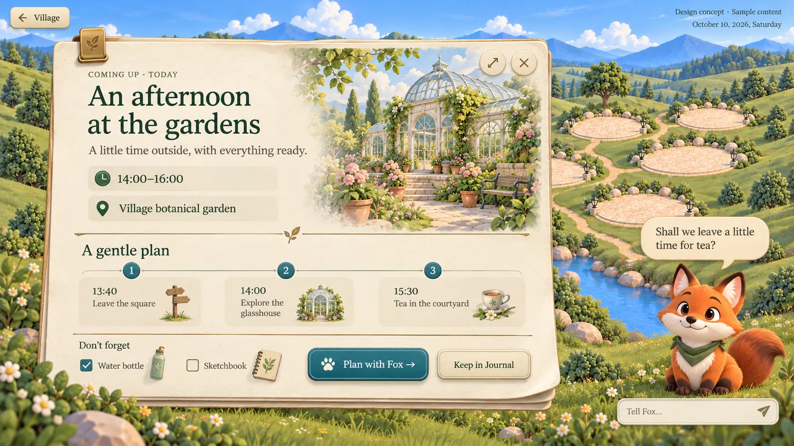
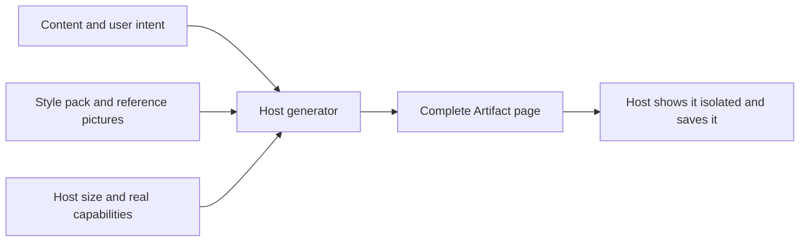

# Village Artifact style pack

The look a generated Artifact should have in the Village, kept with the theme so the host's generator can read it. **The first complete Artifact concepts are the visual standard**; the host designs each card's layout around its content instead of filling fixed slots.

| File | Use |
| --- | --- |
| [STYLE.md](STYLE.md) | Visual rules, flexible layout, interaction requirements and acceptance checks |
| [HOST-PROMPT.md](HOST-PROMPT.md) | The prompt a host generator receives together with the real content |
| [references/recipe.webp](references/recipe.webp) | A second complete composition in the same style |
| [materials/](materials) | Paper, a glasshouse and a soup bowl a generated card may place |

The theme declares this folder in the `artifact` section of its [presentation.json](../../presentation.json) ([Theme contract](../../../../../resources/themes/CONTRACT.md#artifacts)): the rules, the prompt, the reference pictures with their roles, the materials by id and the colour roles.

## Status

Everything here is static: Markdown, pictures and the JSON section that names them. It is published with the theme's other assets, and the host reads it through `themeArtifact()` (`ui/themes/build-theme.ts`). How the host uses it, filling its own card or generating a whole page, is in [core/artifacts](../../../../../core/artifacts/README.md).

The reference pictures are static concepts with sample content, not captures of working HTML. The materials in `materials/` (paper, a glasshouse and a soup bowl, the last two with transparent edges) may be reused by a generator; they are optional objects, not a fixed header slot.

When a generator uses this pack, pass the reference pictures themselves as visual input; a file name is not a substitute for seeing the picture.
